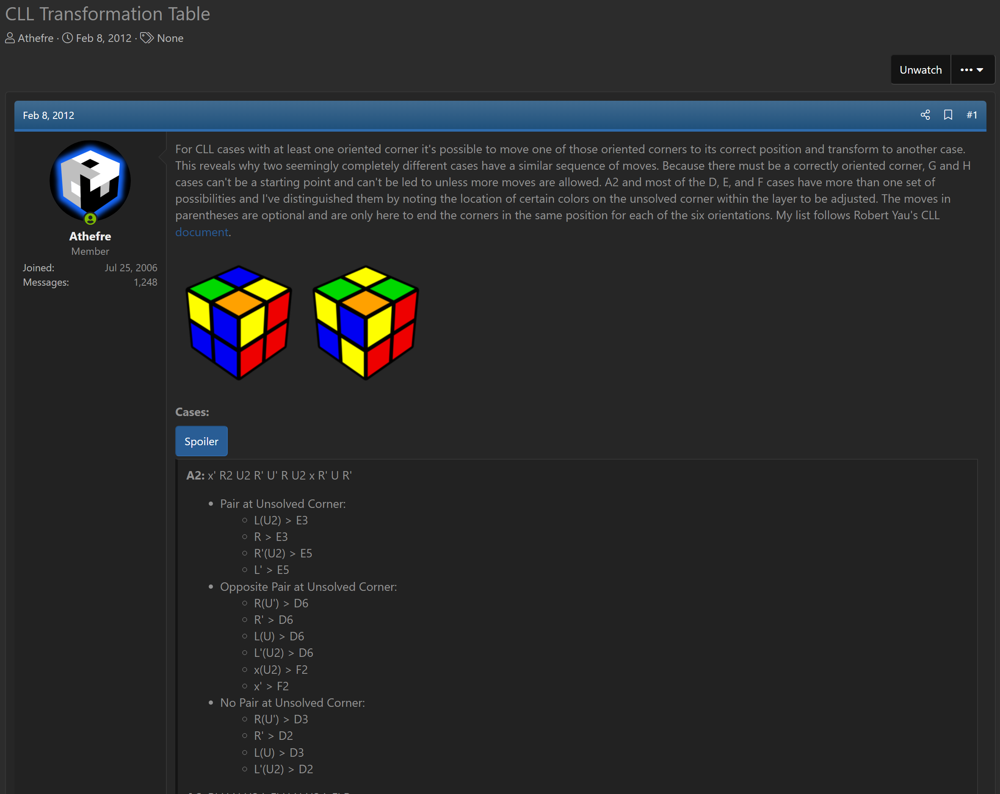

import AnimCube2x2 from "@site/src/components/AnimCube2";

# CCLL

<AnimCube2x2 params="config=../../InteractConfig.txt&move={CCLL: F R U R' U' F'}F R U R' U' F'.{Undo Pseudo: R' U'}R' U'" width="600px" height="400px" />

## Description

**Proposer:** [Michael James Straughan](CubingContributors/MethodDevelopers.md#straughan-michael-james-athefre), [Joseph Briggs](CubingContributors/MethodDevelopers.md#briggs-joseph-shadowslice)

**Proposed:** 2012

**Steps:**

1. Solve the four bottom layer corners with one corner offset and a U layer corner attached.
2. Solve the four upper layer corners relative to the U layer corner on the bottom layer then undo the pseudo state.

[Click here for more step details on the SpeedSolving wiki](https://www.speedsolving.com/wiki/index.php?title=Conjugated_CxLL)

## Origin and Development

Conjugated CLL (CLL) is the placement of a U layer corner on the bottom layer with a D layer corner. The upper layer corners are now in a pseudo state and are solved relative to the U layer corner that was placed on the bottom layer.

This concept was first developed by Michael James Straughan in 2012 [1].

In 2018, Joseph Briggs independently proposed the same concept as an application of the 42 method to the 2x2x2.

<iframe width="640" height="360" src="https://www.youtube.com/embed/AJjT5bYknls" frameborder="0" allow="accelerometer; autoplay; encrypted-media; gyroscope; picture-in-picture" allowfullscreen></iframe>

## References

[1] 	M. J. Straughan, "CLL Transformation Table," SpeedSolving.com, 8 February 2012. [Online]. Available: https://www.speedsolving.com/threads/cll-transformation-table.35293/.