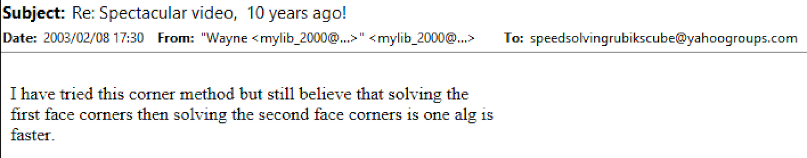
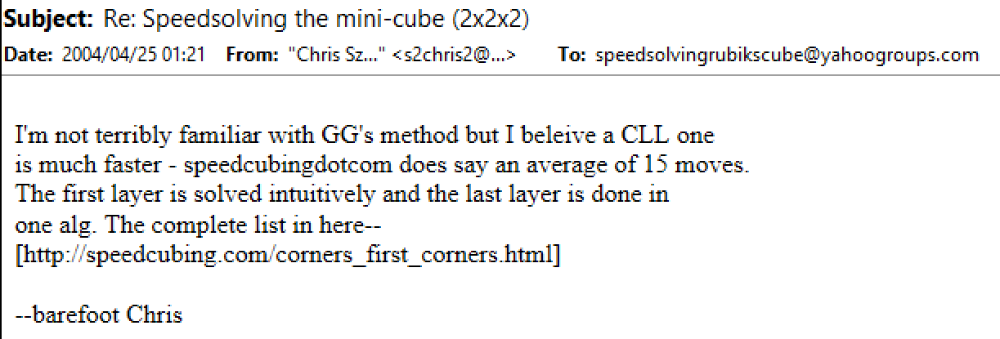
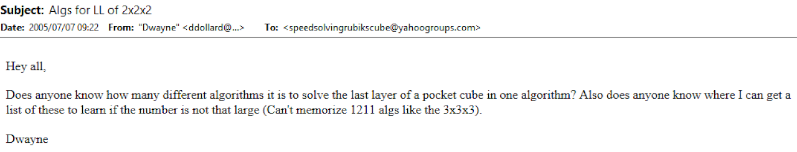
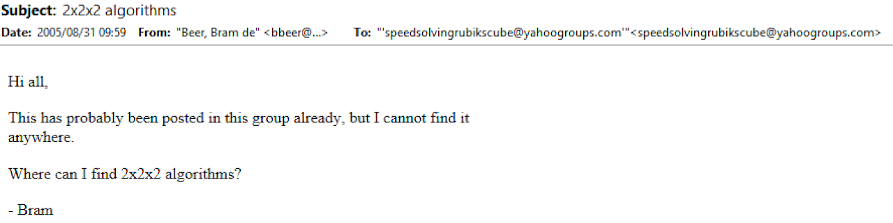
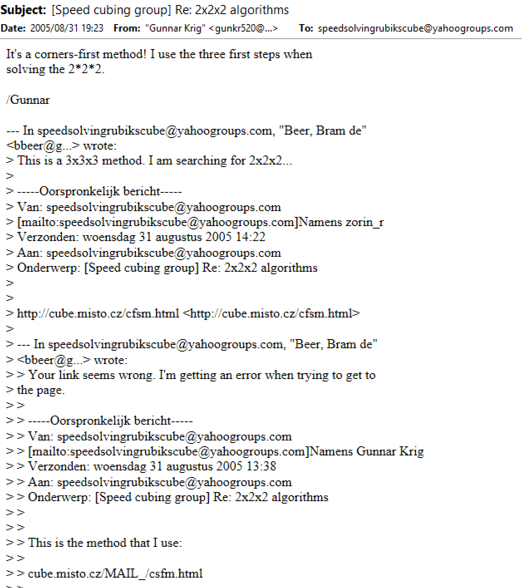
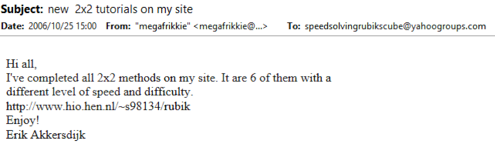
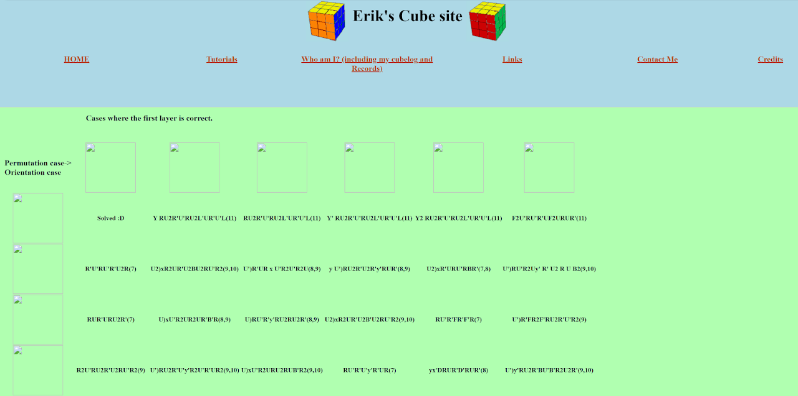
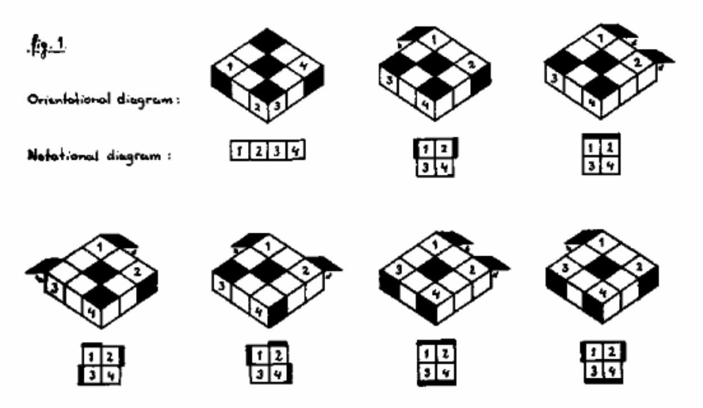
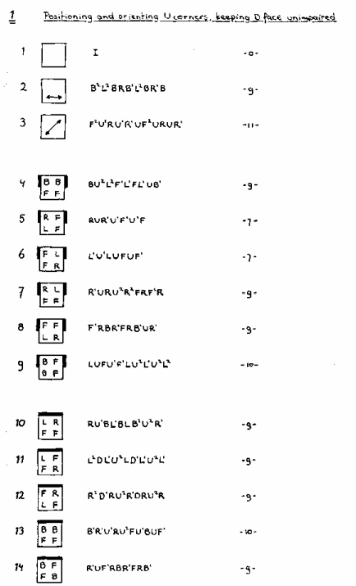

import ReconViewer from "@site/src/components/ReconViewer";
import YouTube from "@site/src/components/YouTube";

# CLL

<ReconViewer
puzzle="2x2x2"
scramble="R U2 R' U' R U' R'"
solution={`R U R' U R U2 R' // CLL`}
/>

## Description

**Creator:** Various

**Created:** Numerous

**Steps:**

1. Solve the four bottom layer corners.
2. Solve the four upper layer corners.

[Click here for more step details on the SpeedSolving wiki](https://www.speedsolving.com/wiki/index.php?title=CLL)

## Origin

The idea of the CLL method has likely been around since the 2x2x2 puzzle was first released to the public. Many people who could solve the 3x3x3 puzzle were using a method that included a solved layer of corners at some point in the solve, such as corners first or layer by layer. It is currently unknown whether any books were published including the complete list of algorithms for 2x2x2 CLL.

Two major examples of the use of last layer corner algorithms are the [Waterman](3x3/Methods/Waterman.md) and [CFCE](3x3/Methods/CFCE.md) methods. The Waterman method solves all corners early in the solve, starting with a single layer of corners. Eventually, the final four corners are solved in a single step. In the CFCE method, two layers are built then the corners of the final layer are solved in a single step. These two methods can be seen as precursors, or at least directly related, to the CLL method for the 2x2 puzzle.

In the early years of the online community, CLL was being discussed and used [^1]. At first, however, many were using or recommending CLL algorithms that had been generated for the last layer of the 3x3 puzzle or CLL algorithms meant for 3x3 corners first methods [^2] [^3] [^4] [^5] [^6] [^7]. Dedicated 2x2x2 CLL algorithms hadn't yet been developed.

## Development

The first known website with algorithms generated specifically for the 2x2x2 puzzle is from Erik Akkersdijk [^8] [^9]. The algorithms were published in October, 2006 along with algorithms for other methods such as EG.

## Recognition

Solvers typically recogize the last layer corner case by finding the orientation of the last layer corners then checking a pattern within the other stickers. This system was developed by Marc Waterman and Daan Kramer for the Waterman method [^10].

[^1]: mylib*2000, "Re: Spectacular video, 10 years ago!," Yahoo! Groups - Speed Solving Rubik's Cube, 8 February 2003. [Online].

[^2]: C. Szlatenyi, "Re: Speedsolving the mini-cube (2x2x2)," Yahoo! Groups - Speed Solving Rubik's Cube, 25 April 2004. [Online].

[^3]: D. Dollard, "Algs for LL for 2x2x2," Yahoo! Groups - Speed Solving Rubik's Cube, 7 July 2005. [Online].

[^4]: M. Bennett, "Re: [Speed cubing group] Algs for LL for 2x2x2," Yahoo! Groups - Speed Solving Rubik's Cube, 7 July 2005. [Online].

[^5]: G. v. d. Peereboom, "Re: Algs for LL for 2x2x2," Yahoo! Groups - Speed Solving Rubik's Cube, 7 July 2005. [Online].

[^6]: B. d. Beer, "2x2x2 algorithms," Yahoo! Groups - Speed Solving Rubik's Cube, 31 August 2005. [Online].

[^7]: G. Krig, "[Speed cubing group] Re: 2x2x2 algorithms," Yahoo! Groups - Speed Solving Rubik's Cube, 31 August 2005. [Online].

[^8]: E. Akkersdijk, "new 2x2 tutorials on my site," Yahoo! Groups - Speed Solving Rubik's Cube, 25 October 2006. [Online].

[^9]: E. Akkersdijk, "Layer by layer method 2," Akkersdijk's Website, 25 October 2006. [Online]. Available: https://web.archive.org/web/20070710211224fw*/http://www.hio.hen.nl/~s98134/rubik/2x2_lbl-2.html.

[^10]: M. Waterman and A. Treep, "Waterman Method," Cubsim For Fun, 1987. [Online]. Available: https://web.archive.org/web/20071029152943/http://rubikscube.info/waterman/booklet.php.