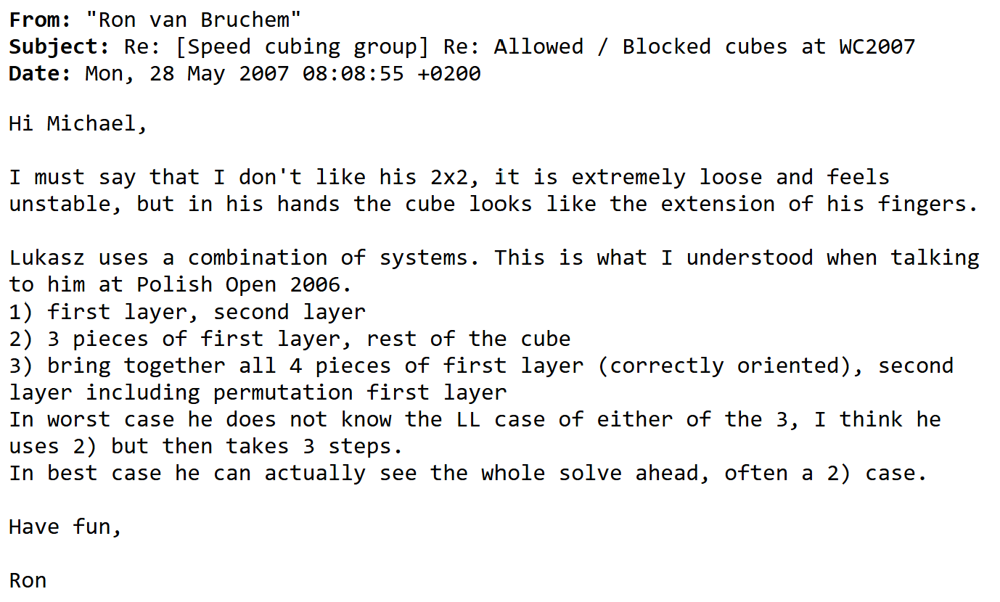
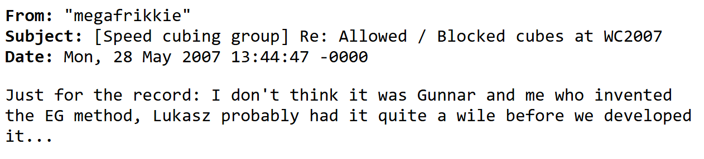
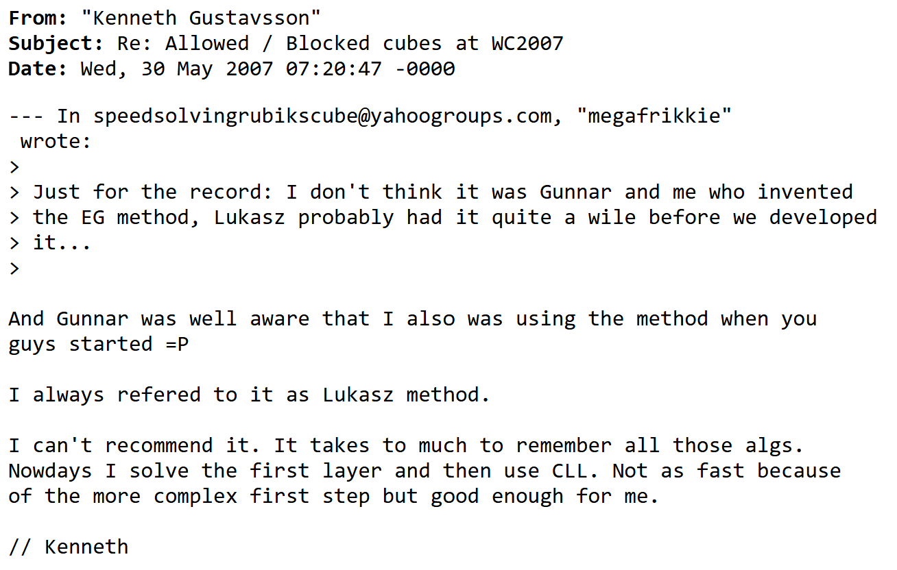
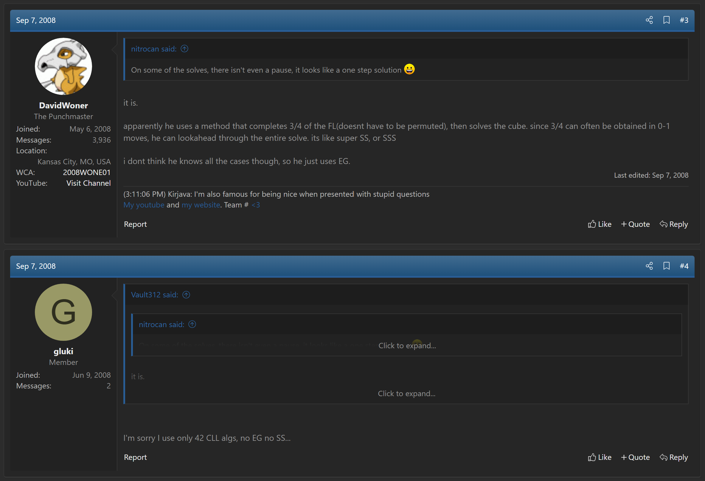

import ReconViewer from "@site/src/components/ReconViewer";
import YouTube from "@site/src/components/YouTube";
import ImageCollage from '@site/src/components/ImageCollage';

# EG

<ReconViewer
puzzle="2x2x2"
scramble="R' F R2 U R' F' U' R U' R'"
solution={`R U R' U F R U' R2 F' R // EG`}
/>

## Description

**Creator:** [Łukasz Ciałoń](CubingContributors/MethodDevelopers.md#ciałoń-łukasz), [Gunnar Krig](CubingContributors/MethodDevelopers.md#krig-gunnar), [Erik Akkersdijk](CubingContributors/MethodDevelopers.md#akkersdijk-erik), [David Woner](CubingContributors/MethodDevelopers.md#woner-david)

**Created:** 2006

**Steps:**

1. Build a face on the bottom layer of the correct corners. The four bottom layer corners are free to be in any possible permutation.
2. Solve the four upper layer corners while correctly permuting the bottom layer.

[Click here for more step details on the SpeedSolving wiki](https://www.speedsolving.com/wiki/index.php?title=EG_Method)

## Origin and Development

### EG1

The idea of the method and intent to develop was first expressed by Gunnar Krig in April, 2006. At the German Open 2006 competition, Tobias Daneels noticed that Krig was using a method for the 2x2x2 that was different from other competitors. Daneels didn't have the details for steps, so a question was posed to the Speed Solving Rubik's Cube Yahoo group [^daneels-2006]. Krig responded by describing a basic form of the method done in three steps. Krig noted the desire to combine the final two steps, forming the steps of what is now known as EG [^krig-2006-1]. Later that year, Krig developed algorithms for the method and discussed with the community that he was using the method [^krig-2006-2] [^krig-2006-3].

Within the same discussion thread where Krig provided a link to his website with algorithms, Erik Akkersdijk stated that he was already aware of the method, but hadn’t yet learned it [^akkersdijk-2006-1]. Kenneth Gustavsson also replied, stating that he had generated all of the algorithms himself earlier in the year [^gustavsson-2006].

Less than two weeks after the discussion thread, Akkersdijk posted a new thread with a link to a website containing the algorithms for the method [^akkersdijk-2006-2] [^akkersdijk-2006-3]. Only EG1, the bottom layer adjacent swap set, was developed. The algorithms for EG2, the bottom layer diagonal swap, weren’t developed. Akkersdijk later moved the content to a new domain [^akkersdijk-2007-1].

### EG2

In July 2008, David Woner generated all of the algorithms for EG2 and posted a thread on speedsolving.com [^woner-2008-1].

## Prior Proposals and EG Name

In 2005, Ron van Bruchem wrote about his experience at the 2005 Polish Open [^bruchem-2005]. During the competition Bruchem talked to Łukasz Ciałoń, the top performer at the competition in the 2x2x2 event, and asked about Ciałoń's strategies. The strategy according to Bruchem is the same as the steps of the method currently called EG:

> He first solves one face without permuting the pieces, then he solves the rest of the cube in one step. That requires 3 (all corners correct, connecting corners swapped, opposite corners swapped) times 42 CLL algorithms!

This means that Ciałoń had been using the method prior to it being published under the name EG. After the method was published by Akkersdijk and Krig, Ciałoń's use of the method was discussed on the Speed Solving Rubik's Cube Yahoo! group. In one message, Bruchem again described Ciałoń's strategies [^bruchem-2007]. This time more detail was provided, along with the inclusion of a third method that is L5C, or 1LLS as commonly called by 2x2x2 solvers.

Akkersdijk responded to the thread, stating that he doesn't believe that either him or Krig invented the method [^akkersdijk-2007-2]. Kenneth Gustavsson responded to Akkersdijk's message, stating that Krig was also aware that others had been using the method before – including both Gustavsson and Ciałoń [^gustavsson-2007].

In September 2008, Ciałoń posted a thread to SpeedSolving.com containing a YouTube video of a 2.98 second 2x2x2 solve average [^cialon-2008-1]. A comment in the thread by Woner mentioned Ciałoń's use of advanced 2x2x2 methods beyond CLL [^woner-2008-2]. Ciałoń responded to this comment, stating that he uses only CLL [^cialon-2008-2]. It is possible that Ciałoń decided against using other methods in speedsolves, instead focusing on mastering CLL. It is also unknown whether Ciałoń ever published the algorithms for the methods that he was using beyond CLL.

As for EG2 specifically, when Woner developed the EG2 algorithms, he suggested that he could be credited in the method name for having developed the final piece of the method [^woner-2008-1]. Woner stated that all of the algorithms were in a spreadsheet and that he had contacted Akkersdijk, requesting that the algorithms be added to Akkersdijk’s site to fill in the gap and have the full EG method available [^woner-2008-3]. Akkersdijk responded to the thread, stating that Henrik Buus-Aagaard had generated the algorithms around a year before Woner and that EG0, EG1, and EG2 are all about the idea and not who developed them [^akkersdijk-2008].

Gustavsson also responded to the thread, reiterating that he had generated the algorithms for the entire EG method before Krig and Akkersdijk [^gustavsson-2008]. Gustavsson also stated that even before himself, Łukasz Ciałoń was the first he was aware of to have learned the method.

If the method is about the idea, as Akkersdijk suggested, this would credit Ciałoń since Ciałoń is the first known to have been actively using the method and Krig learned of it through Gustavsson who possibly learned of it through Ciałoń. A previous discussion occurred in September 2006 between Stefan Pochmann and Akkersdijk. Pochmann pointed out Ciałoń's prior proposal [^pochmann-2006], with Akkersdijk again acknowledging that the idea is the same [^akkersdijk-2006-4]. If the method is about the development, which is more in line with the [CubingHistory.com standards](index.md#cubing-history-standards), Ciałoń would be credited with the idea, Akkersdijk and Krig would be credited with the EG1 development, and Woner would be credited with the EG2 development. Or, if a method is solely defined by its popularizers, Akkersdijk and Krig would be the only ones credited.

## Credit

Thanks to Tadeáš Miler for providing Bruchem's 2005 Polish Open page and the SpeedSolving.com thread about Łukasz Ciałoń's 2.98 second average. This prompted further research as to Ciałoń's role in the method's development, use, and popularization.

[^daneels-2006]: T. Daneels, "2x2 cube method," Yahoo! Groups - Speed Solving Rubik's Cube, 23 April 2006. [Online].
[^krig-2006-1]: G. Krig, "Re: 2x2 cube method," Yahoo! Groups - Speed Solving Rubik's Cube, 25 April 2006. [Online].
[^krig-2006-2]: G. Krig, "[Speed cubing group] Re: 2x2x2 Uber-Method," Yahoo! Groups - Speed Solving Rubik's Cube, 27 July 2006. [Online].
[^krig-2006-3]: G. Krig, "[Speed cubing group] Re: Advanced 2x2 methods (really advanced)," Yahoo! Groups - Speed Solving Rubik's Cube, 12 October 2006. [Online].
[^akkersdijk-2006-1]: E. Akkersdijk, "[Speed cubing group] Re: Advanced 2x2 methods (really advanced)," Yahoo! Groups - Speed Solving Rubik's Cube, 12 October 2006. [Online].
[^gustavsson-2006]: K. Gustavsson, "[Speed cubing group] Re: Advanced 2x2 methods (really advanced)," Yahoo! Groups - Speed Solving Rubik's Cube, 12 October 2006. [Online].
[^akkersdijk-2006-2]: E. Akkersdijk, "new 2x2 tutorials on my site," Yahoo! Groups - Speed Solving Rubik's Cube, 25 October 2006. [Online].
[^akkersdijk-2006-3]: E. Akkersdijk, "EG Method," Akkersdijk's website, 2006. [Online]. Available: https://web.archive.org/web/20070710211656fw_/http://www.hio.hen.nl/~s98134/rubik/EGIndex.html.
[^akkersdijk-2007-1]: E. Akkersdijk, "EG Method," Akkersdijk's website, 2007. [Online]. Available: https://web.archive.org/web/20071013114724/http://erikku.er.funpic.org/rubik/EGIndex.html.
[^woner-2008-1]: D. Woner, "EG(D?) 2x2 method- 12.35 move avg.," SpeedSolving.com, 15 July 2008. [Online]. Available: https://www.speedsolving.com/threads/eg-d-2x2-method-12-35-move-avg.5184/.
[^bruchem-2005]: R. v. Bruchem, "Report on Polish Open 2005," September 2005. [Online]. Available: https://www.speedcubing.com/events/po2005/polishopen2005.html.
[^bruchem-2007]: R. v. Bruchem, "Re: [Speed cubing group] Re: Allowed / Blocked cubes at WC2007," Speed Solving Rubik's Cube Yahoo! Group, 28 May 2007. [Online].
[^akkersdijk-2007-2]: E. Akkersdijk, "[Speed cubing group] Re: Allowed / Blocked cubes at WC2007," Speed Solving Rubik's Cube Yahoo! Group, 28 May 2007. [Online].
[^gustavsson-2007]: K. Gustavsson, "[Speed cubing group] Re: Allowed / Blocked cubes at WC2007," Speed Solving Rubik's Cube Yahoo! Group, 30 May 2007. [Online].
[^cialon-2008-1]: Ł. Ciałoń, "Lukasz Cialon 2.98 avg on 2x2," SpeedSolving.com, 7 September 2008. [Online]. Available: https://www.speedsolving.com/threads/lukasz-cialon-2-98-avg-on-2x2.6251/.
[^woner-2008-2]: D. Woner, "Lukasz Cialon 2.98 avg on 2x2," SpeedSolving.com, 7 September 2008. [Online]. Available: https://www.speedsolving.com/threads/lukasz-cialon-2-98-avg-on-2x2.6251/post-84011.
[^cialon-2008-2]: Ł. Ciałoń, "Lukasz Cialon 2.98 avg on 2x2," SpeedSolving.com, 7 September 2008. [Online]. Available: https://www.speedsolving.com/threads/lukasz-cialon-2-98-avg-on-2x2.6251/post-84012.
[^woner-2008-3]: D. Woner, "EG(D?) 2x2 method- 12.35 move avg.," SpeedSolving.com, 16 July 2008. [Online]. Available: https://www.speedsolving.com/threads/eg-d-2x2-method-12-35-move-avg.5184/post-66935.
[^akkersdijk-2008]: E. Akkersdijk, "EG(D?) 2x2 method- 12.35 move avg.," SpeedSolving.com, 16 July 2008. [Online]. Available: https://www.speedsolving.com/threads/eg-d-2x2-method-12-35-move-avg.5184/post-67026.
[^gustavsson-2008]: K. Gustavsson, "EG(D?) 2x2 method- 12.35 move avg.," SpeedSolving.com, 16 July 2008. [Online]. Available: https://www.speedsolving.com/threads/eg-d-2x2-method-12-35-move-avg.5184/post-67056.
[^pochmann-2006]: S. Pochmann, "new 2x2 tutorials on my site," SpeedSolving.com, 19 September 2006. [Online]. Available: https://www.speedsolving.com/threads/new-2x2-tutorials-on-my-site.441/post-3395.
[^akkersdijk-2006-4]: E. Akkersdijk, "new 2x2 tutorials on my site," SpeedSolving.com, 20 September 2006. [Online]. Available: https://www.speedsolving.com/threads/new-2x2-tutorials-on-my-site.441/post-3415.