import AnimCube2x2 from "@site/src/components/AnimCube2";

# EG

<AnimCube2x2 params="position=lluuu&scale=6&hint=10&hintborder=1&move=U2RUR'UFRU'R2F'R&initrevmove=#&facelets=yyyywwwwbbbbggggoooorrrr" width="400px" height="400px" />

## Description

**Proposer:** [Gunnar Krig](CubingContributors/MethodDevelopers.md#krig-gunnar), [Erik Akkersdijk](CubingContributors/MethodDevelopers.md#akkersdijk-erik)

**Proposed:** 2006

**Steps:**

1. Build a face on the bottom layer of the correct corners. The four bottom layer corners are free to be in any possible permutation.
2. Solve the four upper layer corners while correctly permuting the bottom layer.

[Click here for more step details on the SpeedSolving wiki](https://www.speedsolving.com/wiki/index.php?title=EG_Method)

## Origin and Development

### Gunnar Krig

The idea of the method and intent to develop was first expressed by Gunnar Krig in April, 2006. At the German Open 2006 competition, Tobias Daneels noticed that Krig was using a method for the 2x2x2 that was different from other competitors. Daneels didn't have the details for steps, so a question was posed to the Speed Solving Rubik's Cube Yahoo group [1]. Krig responded by describing a basic form of the method done in three steps. Krig noted the desire to combine the final two steps, forming the steps of what is now known as EG [2]. Later that year, Krig developed algorithms for the method and discussed with the community that he was using the method [3, 4].

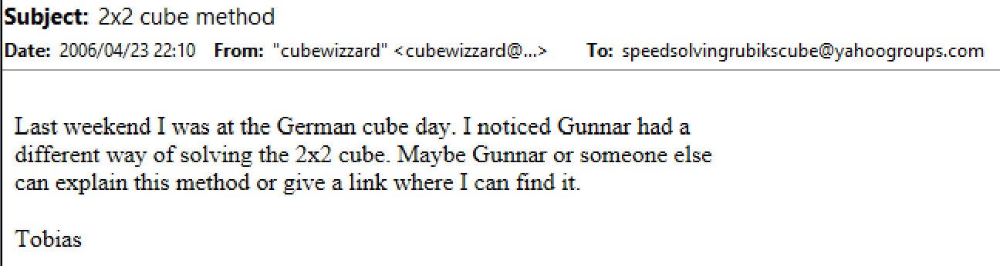

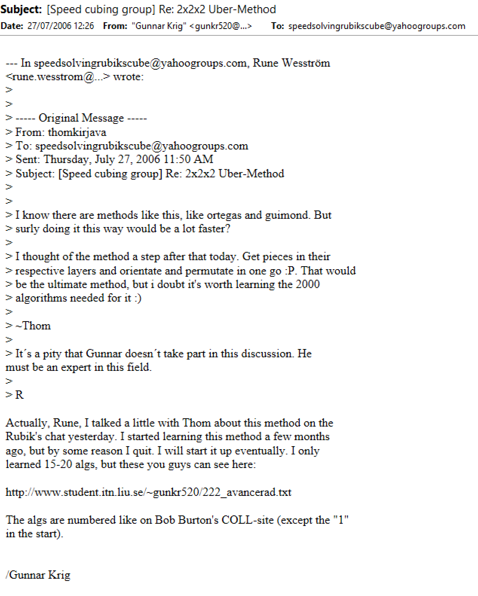
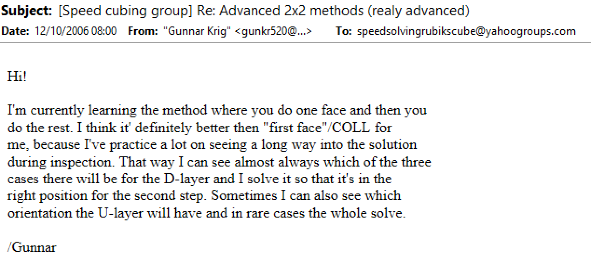

### Erik Akkersdijk

Within the same discussion thread where Krig provided a link to his website with algorithms, Erik Akkersdijk stated that he was already aware of the method, but hadn’t yet learned it [5]. Kenneth Gustavsson also replied, stating that he had generated all of the algorithms himself earlier in the year [6].

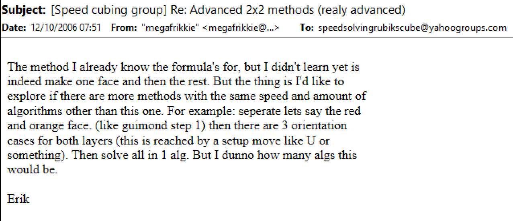
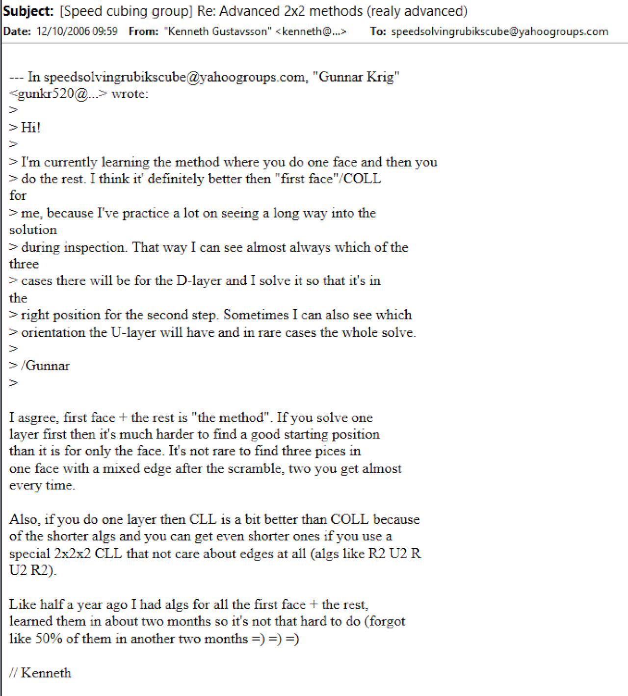

Less than two weeks after the discussion thread, Akkersdijk posted a new thread with a link to a website containing the algorithms for the method [7, 8]. Only EG1, the bottom layer adjacent swap set, was developed. The algorithms for EG2, the bottom layer diagonal swap, wasn’t developed. Akkersdijk later moved the content to a new domain [9].

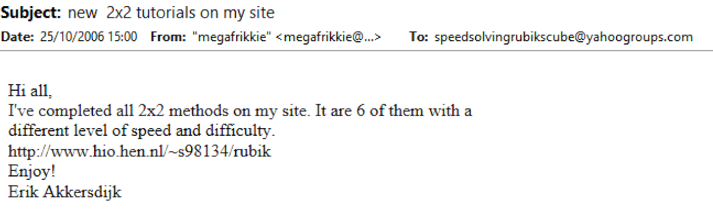
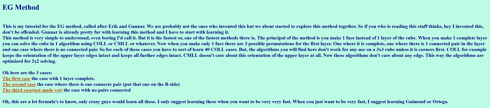
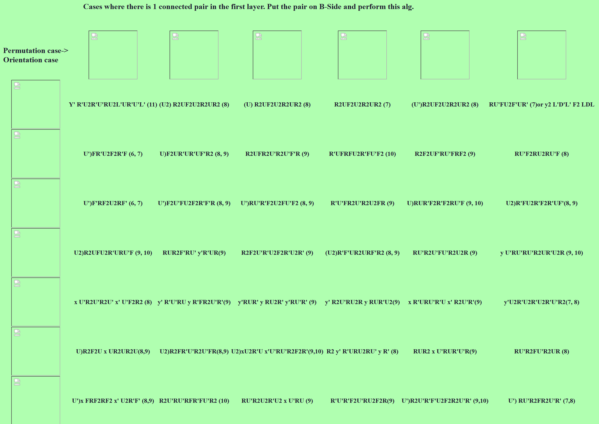

### EG2

The credit for who first developed EG2 is complicated. In July, 2008, David Woner generated all of the algorithms and posted a thread on speedsolving.com suggesting that he could be credited in the method name for having developed the final piece of the method [10]. Woner stated that all of the algorithms were in a spreadsheet and that he had contacted Akkersdijk, requesting that the algorithms be added to Akkersdijk’s site to fill in the gap and have the full EG method available [11]. Akkersdijk responded to the thread, stating that Henrik Buus-Aagaard had generated the algorithms around a year before Woner and that EG0, EG1, and EG2 are all about the idea and not who developed them [12].

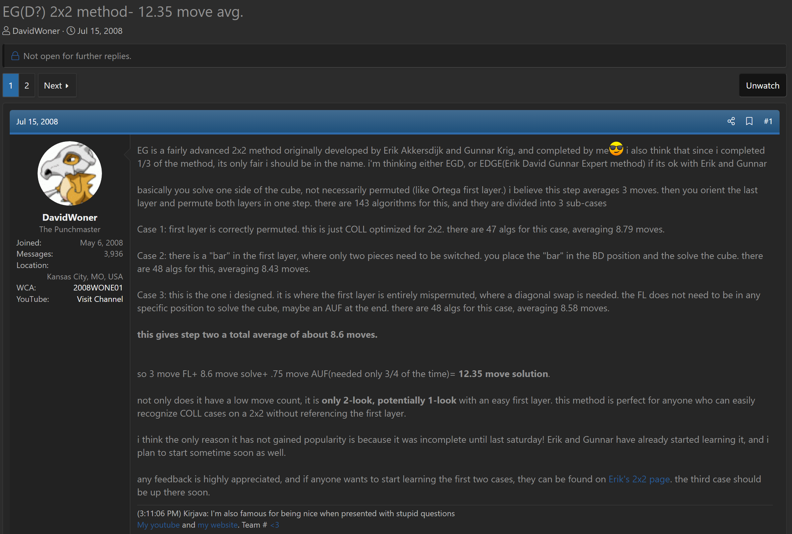
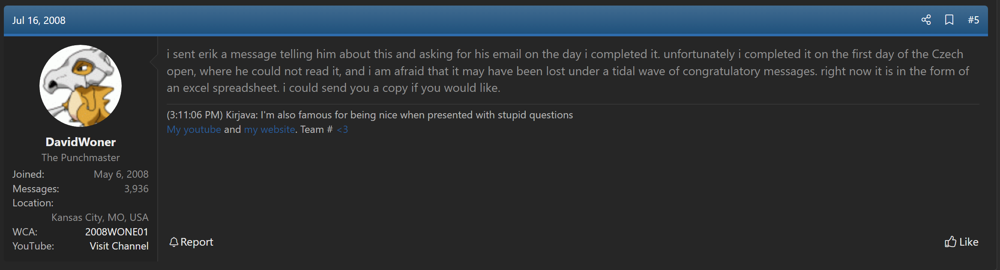
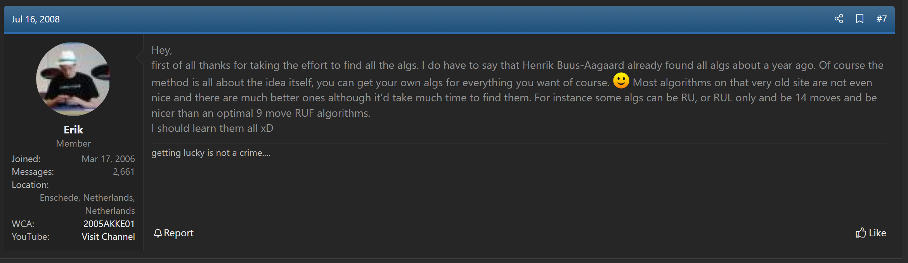

Gustavsson also responded, reiterating that he had generated the algorithms for the entire EG method before Krig and Akkersdijk [13]. Gustavsson also stated that even before himself, Lucasz Cialon was the first he was aware of to have learned the method.

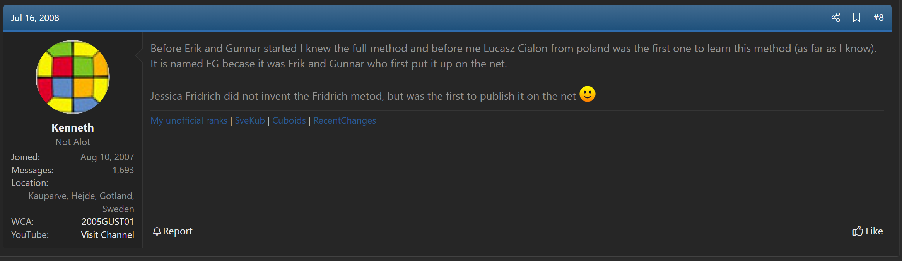

## References

[1] 	T. Daneels, "2x2 cube method," Yahoo! Groups - Speed Solving Rubik's Cube, 23 April 2006. [Online]. 

[2] 	G. Krig, "Re: 2x2 cube method," Yahoo! Groups - Speed Solving Rubik's Cube, 25 April 2006. [Online]. 

[3] 	G. Krig, "[Speed cubing group] Re: 2x2x2 Uber-Method," Yahoo! Groups - Speed Solving Rubik's Cube, 27 July 2006. [Online]. 

[4] 	G. Krig, "[Speed cubing group] Re: Advanced 2x2 methods (really advanced)," Yahoo! Groups - Speed Solving Rubik's Cube, 12 October 2006. [Online]. 

[5] 	E. Akkersdijk, "[Speed cubing group] Re: Advanced 2x2 methods (really advanced)," Yahoo! Groups - Speed Solving Rubik's Cube, 12 October 2006. [Online]. 

[6] 	K. Gustavsson, "[Speed cubing group] Re: Advanced 2x2 methods (really advanced)," Yahoo! Groups - Speed Solving Rubik's Cube, 12 October 2006. [Online]. 

[7] 	E. Akkersdijk, "new 2x2 tutorials on my site," Yahoo! Groups - Speed Solving Rubik's Cube, 25 October 2006. [Online]. 

[8] 	E. Akkersdijk, "EG Method," Akkersdijk's website, 2006. [Online]. Available: https://web.archive.org/web/20070710211656fw_/http://www.hio.hen.nl/~s98134/rubik/EGIndex.html.

[9] 	E. Akkersdijk, "EG Method," Akkersdijk's website, 2007. [Online]. Available: https://web.archive.org/web/20071013114724/http://erikku.er.funpic.org/rubik/EGIndex.html.

[10] 	D. Woner, "EG(D?) 2x2 method- 12.35 move avg.," SpeedSolving.com, 15 July 2008. [Online]. Available: https://www.speedsolving.com/threads/eg-d-2x2-method-12-35-move-avg.5184/.

[11] 	D. Woner, "EG(D?) 2x2 method- 12.35 move avg.," SpeedSolving.com, 16 July 2008. [Online]. Available: https://www.speedsolving.com/threads/eg-d-2x2-method-12-35-move-avg.5184/post-66935.

[12] 	E. Akkersdijk, "EG(D?) 2x2 method- 12.35 move avg.," SpeedSolving.com, 16 July 2008. [Online]. Available: https://www.speedsolving.com/threads/eg-d-2x2-method-12-35-move-avg.5184/post-67026.

[13] 	K. Gustavsson, "EG(D?) 2x2 method- 12.35 move avg.," SpeedSolving.com, 16 July 2008. [Online]. Available: https://www.speedsolving.com/threads/eg-d-2x2-method-12-35-move-avg.5184/post-67056.