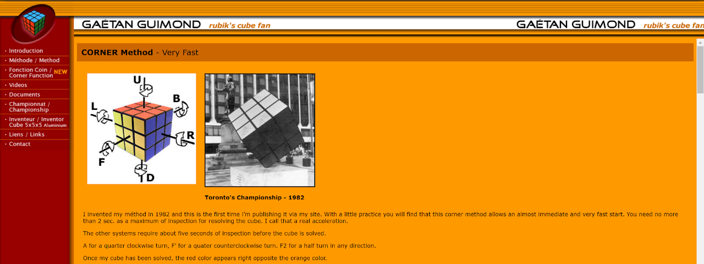
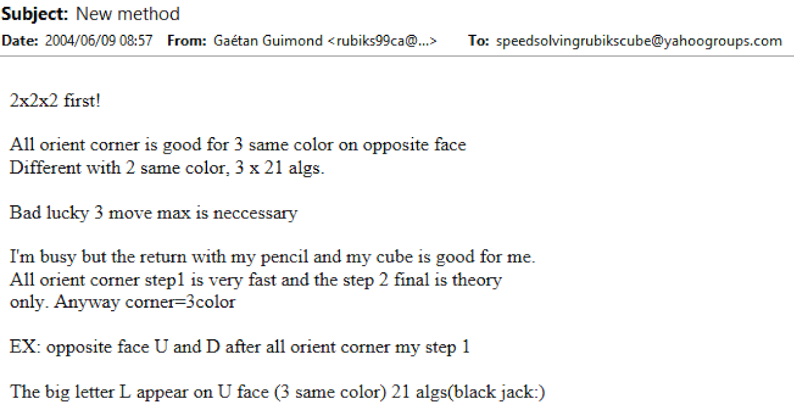
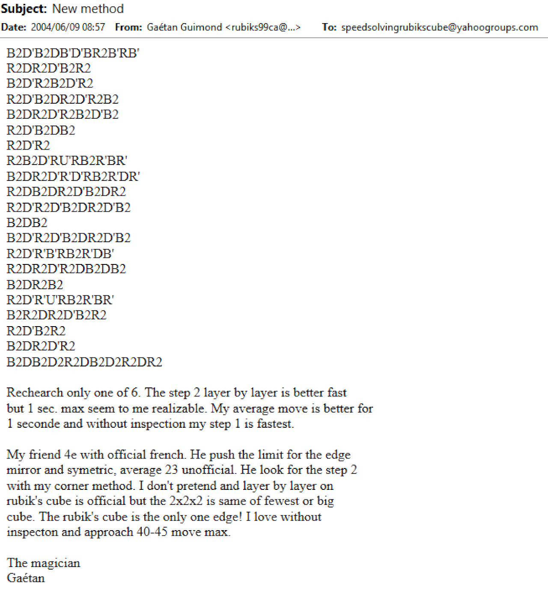
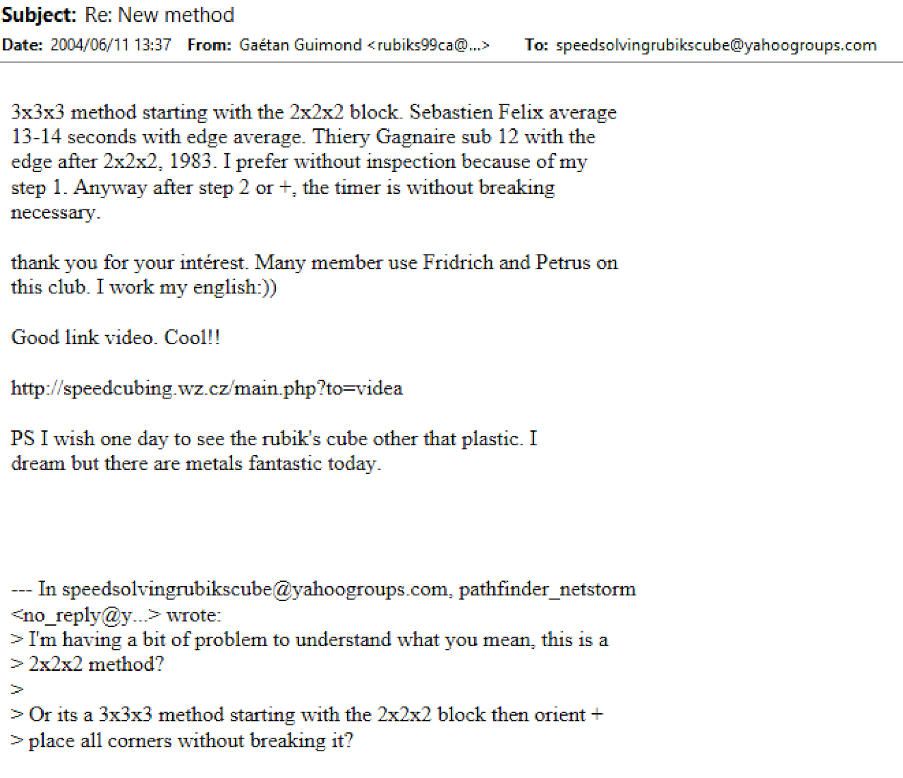

import AnimCube2x2 from "@site/src/components/AnimCube2";

# Guimond

<AnimCube2x2 params="config=../../InteractConfig.txt&move={Orient both layers: R U' R'}R U' R'.{Separate both layers: U R2 U' R2}U R2 U' R2.{Permute both layers: R' F R' F2 R U' R}R' F R' F2 R U' R" width="600px" height="400px" />

## Description

**Proposer:** [Gaétan Guimond](CubingContributors/MethodDevelopers.md#guimond-gaétan)

**Proposed:** 1982

**Steps:**

1. Find or solve three oriented corners on the bottom layer. The corners can be from the same or opposite layers.
2. Orient the remaining corners.
3. Separate the corners into their correct layers.
4. Permute all corners.

[Click here for more step details on the SpeedSolving wiki](https://www.speedsolving.com/wiki/index.php?title=Guimond_Method)

## Origin and Development

On Gaétan Guimond’s website, he states that the method was created in 1982 [1].

## 3x3x3 Method

In June, 2004, Guimond proposed a 3x3x3 method that uses algorithms from later steps of the Guimond method [2, 3]. The complete list of steps weren’t provided, but it appears to have been a method that starts with a 2x2x2 block and eventually gets to an oriented state where there are at least three U layer corners residing on the U layer. From there the corners are separated then permuted.

## References

[1] 	G. Guimond, "CORNER Method," Guimond's website, 2003. [Online]. Available: https://web.archive.org/web/20040607101459/http://www.rubikscuberecord.com/.

[2] 	G. Guimond, "New method," Yahoo! Groups - Speed Solving Rubik's Cube, 9 June 2004. [Online]. 

[3] 	G. Guimond, "Re: New method," Yahoo! Groups - Speed Solving Rubik's Cube, 11 June 2004. [Online].