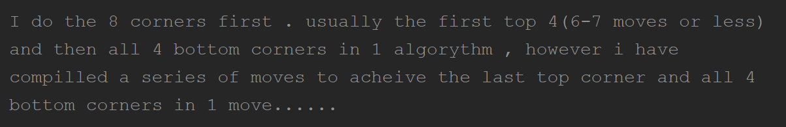
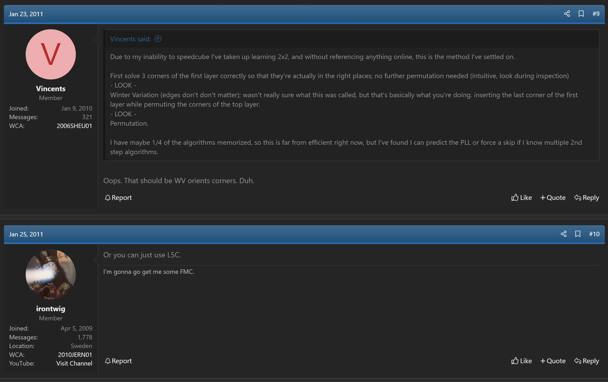
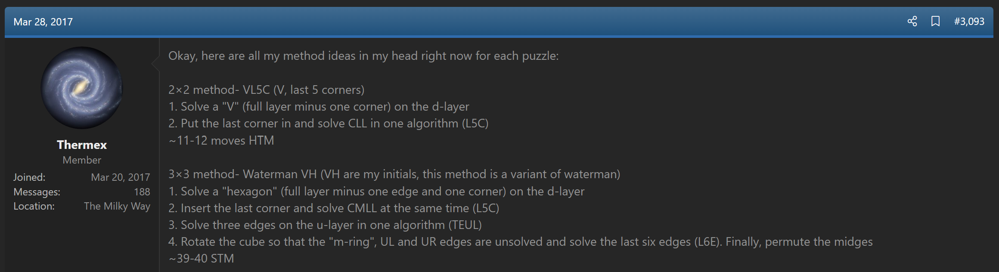
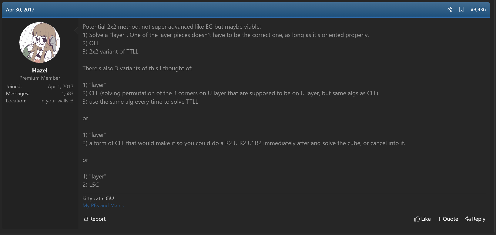
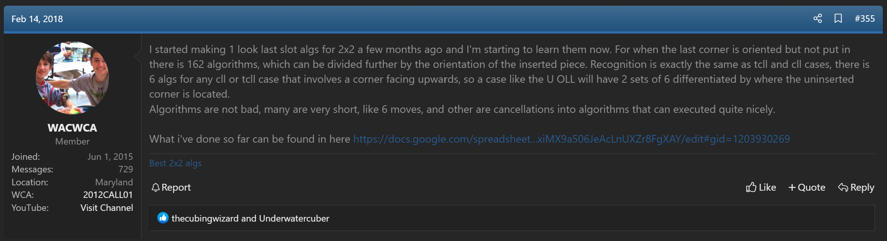

import AnimCube2x2 from "@site/src/components/AnimCube2";

# L5C

<AnimCube2x2 params="config=../../InteractConfig.txt&move={Last five corners: R U' R2 F R F' U2 R U' R'}R U' R2 F R F' U2 R U' R'" width="600px" height="400px" />

## Description

**Proposer:** Various

**Proposed:** Numerous

**Developer:** Will Callan, Jacob McGruddy

**Steps:**

1. Solve three bottom layer corners.
2. Solve the remaining five corners.

[Click here for more step details on the SpeedSolving wiki](https://www.speedsolving.com/wiki/index.php?title=1LLS)

## Origin

The idea for solving five remaining corners has been suggested by various members of the online community since the early 2000s [1, 2, 3, 4, 5].

## Development

In February, 2018 Will Callan began development of the L5C algorithm set [6]. Development was completed in April, 2023 by Callan, with some algorithms developed by Jacob McGruddy [7].

## References

[1] 	J. Enget, "Re: Back to cubing! What is everyone doing after WC 2003?," Yahoo! Groups - Speed Solving Rubik's Cube, 24 October 2003. [Online]. 

[2] 	D. Gosbee and R. Smith, "QuadLeaks & The Gosbee "notice i said the way i do it and not my method" Method," SpeedSolving.com, 30 December 2010. [Online]. Available: https://www.speedsolving.com/threads/quadleaks-the-gosbee-notice-i-said-the-way-i-do-it-and-not-my-method-method.26423/.

[3] 	V. Sheu and E. Jernqvist, "Does anyone else do this for 2x2? Solve 3 corners, Winter Variation, Permute," SpeedSolving.com, 23 January 2011. [Online]. Available: https://www.speedsolving.com/threads/does-anyone-else-do-this-for-2x2-solve-3-corners-winter-variation-permute.26983/post-521650.

[4] 	Thermex, "The New Method / Substep / Concept Idea Thread," SpeedSolving.com, 28 March 2017. [Online]. Available: https://www.speedsolving.com/threads/the-new-method-substep-concept-idea-thread.40975/post-1226463.

[5] 	M. Manning, "The New Method / Substep / Concept Idea Thread," SpeedSolving.com, 30 April 2017. [Online]. Available: https://www.speedsolving.com/threads/the-new-method-substep-concept-idea-thread.40975/post-1232297.

[6] 	W. Callan, "2x2 Discussion and Help," SpeedSolving.com, 14 February 2018. [Online]. Available: https://www.speedsolving.com/threads/2x2-discussion-and-help.47534/post-1277347.

[7] 	Various, "Best 2x2 Algs," Google Sheets, 2018. [Online]. Available: https://docs.google.com/spreadsheets/d/1OFXakCV85Mp2zsQBXMxiMX9a506JeAcLnUXZr8FgXAY/edit#gid=1686689488.