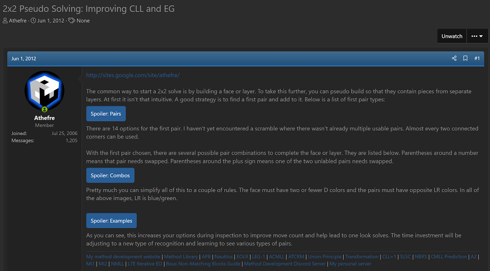
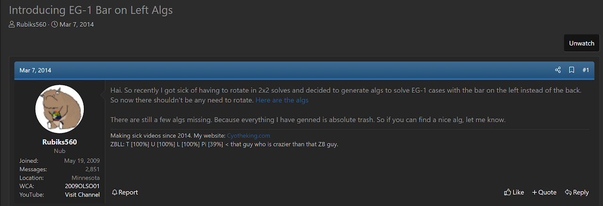

import AnimCube2x2 from "@site/src/components/AnimCube2";

# LEG-1

<AnimCube2x2 params="position=lluuu&scale=6&hint=10&hintborder=1&move=U'RUR'U'RU2RU'R2&initrevmove=#&facelets=yyyywwwwbbbbggggoooorrrr" width="400px" height="400px" />

## Description

**Creator:** [Michael James Straughan](CubingContributors/MethodDevelopers.md#straughan-michael-james-athefre), [Christopher Olson](CubingContributors/MethodDevelopers.md#olson-christopher)

**Created:** 2012

**Steps:**

1. Build a face on the bottom layer all of the same sticker type. The two corners on the right side are placed swapped.
2. Solve the four upper layer corners while correctly permuting the bottom layer.

[Click here for more step details on the SpeedSolving wiki](https://www.speedsolving.com/wiki/index.php?title=EG_Method#LEG-1)

## Origin and Development

In June, 2012, Michael James Straughan developed the LEG-1 method [1]. Instead of having the correctly permuted bar in the back as in EG-1, Straughan chose to have the bar on the left. All algorithms were developed and placed on Straughan's website [2]. This development coincided with the development of NMCLL and NMEG.

In March, 2014, Christopher Olson developed the same idea [3], not knowing that the method already existed and had been developed by Straughan. Olson named the method LEG-1.

## References

[1] 	M. J. Straughan, "2x2 Pseudo Solving: Improving CLL and EG," SpeedSolving.com, 1 June 2012. [Online]. Available: https://www.speedsolving.com/threads/2x2-pseudo-solving-improving-cll-and-eg.37073/.

[2] 	M. J. Straughan, "A2," Straughan's website, 2012. [Online]. Available: https://sites.google.com/site/athefre/other/nmcll.

[3] 	C. Olson, "Introducing EG-1 Bar on Left Algs," SpeedSolving.com, 7 March 2014. [Online]. Available: https://www.speedsolving.com/threads/introducing-eg-1-bar-on-left-algs.46636/.