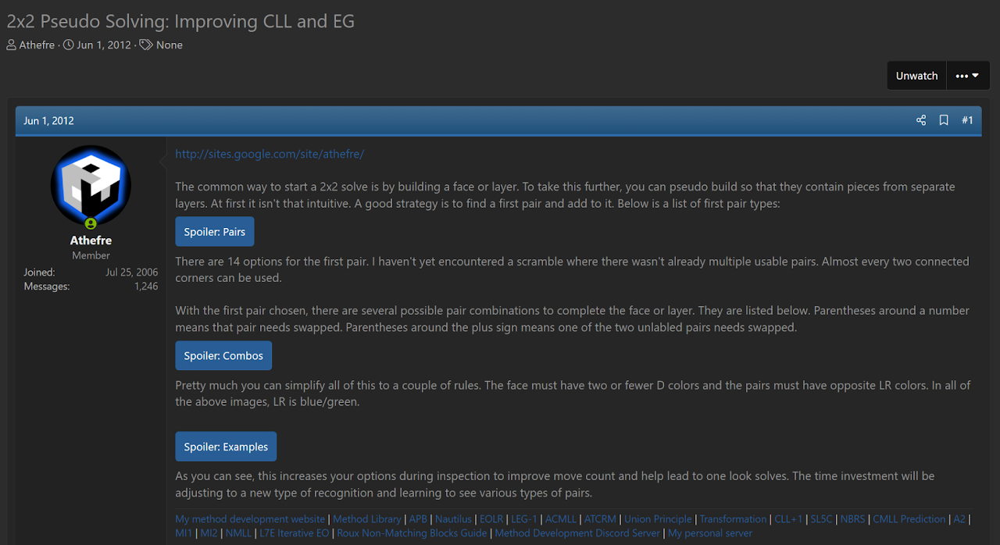
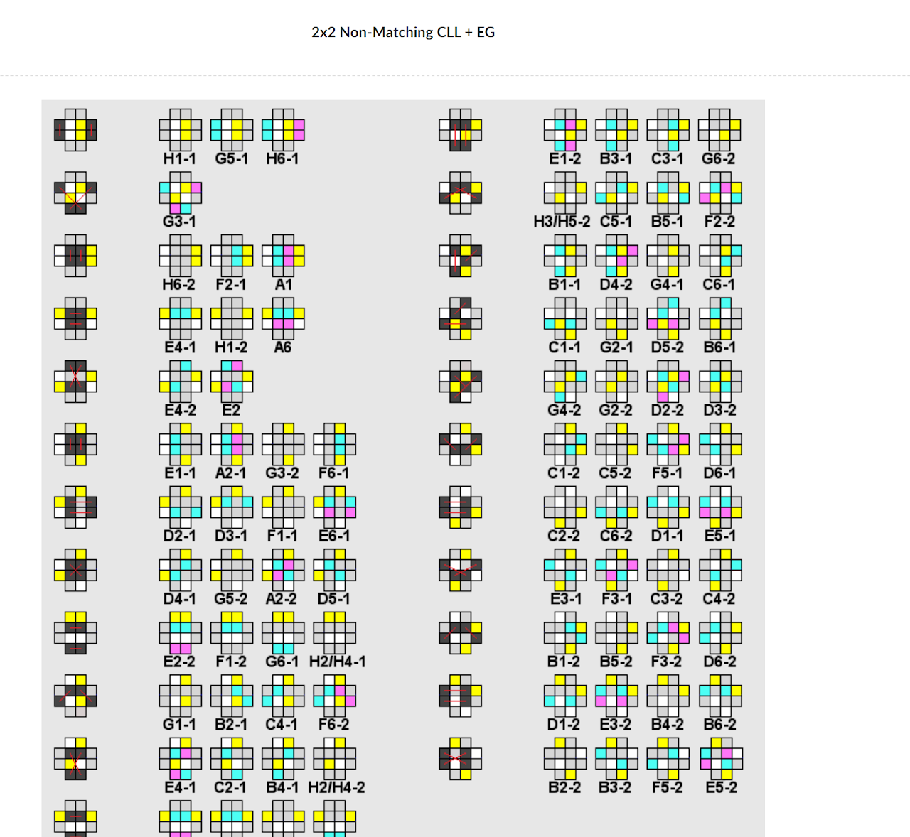

import ReconViewer from "@site/src/components/ReconViewer";
import YouTube from "@site/src/components/YouTube";
import ImageCollage from '@site/src/components/ImageCollage';

# NMEG

<ReconViewer
puzzle="2x2x2"
scramble="R' U R' U2 R' U R U' R' U"
solution={`U' R U R' U' R U2 R U' . // NMEG
R // Undo pseudo`}
/>

## Description

**Creator:** [Michael James Straughan](CubingContributors/MethodDevelopers.md#straughan-michael-james-athefre)

**Created:** 2012

**Steps:**

1. Build a face on the bottom layer. The two corners on the right side are placed swapped. The corners of the bottom layer on one side are also free to be from another layer.
2. Solve the four upper layer corners while correctly permuting the bottom layer. Undo the pseudo state at the end.

[Click here for more step details on the SpeedSolving wiki](https://www.speedsolving.com/wiki/index.php?title=EG_Method#NMEG_.28Non-Matching_EG.29)

## Origin and Development

Non-Matching EG (NMEG) was developed by Michael James Straughan in June, 2012 [^1] [^2]. NMEG was released as part of the development of NMEG, NMCLL, and LEG-1.

[^1]: M. J. Straughan, "2x2 Pseudo Solving: Improving CLL and EG," SpeedSolving.com, 1 June 2012. [Online]. Available: https://www.speedsolving.com/threads/2x2-pseudo-solving-improving-cll-and-eg.37073/.
[^2]: M. J. Straughan, "A2," Straughan's website, 2012. [Online]. Available: https://sites.google.com/site/athefre/other/nmcll?authuser=0.