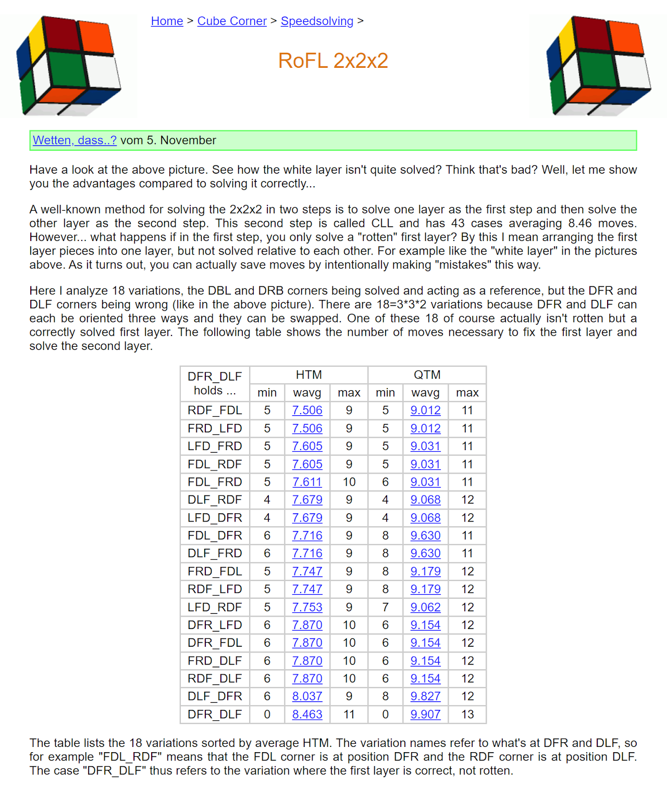
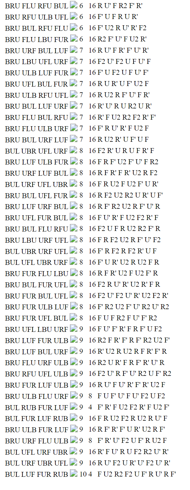
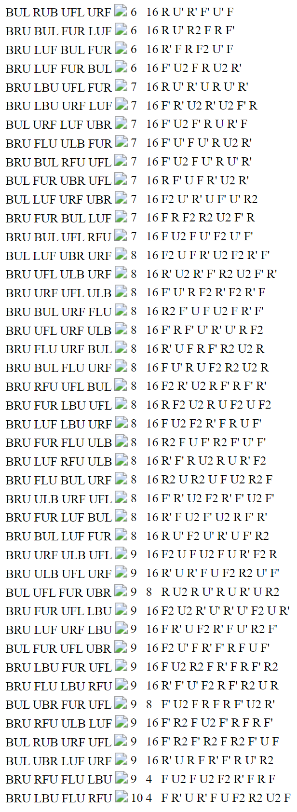
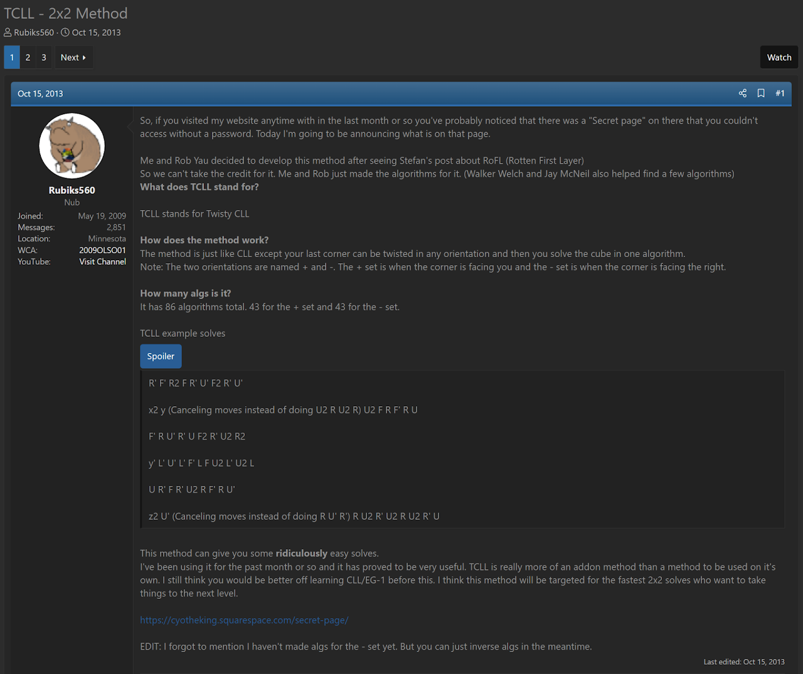
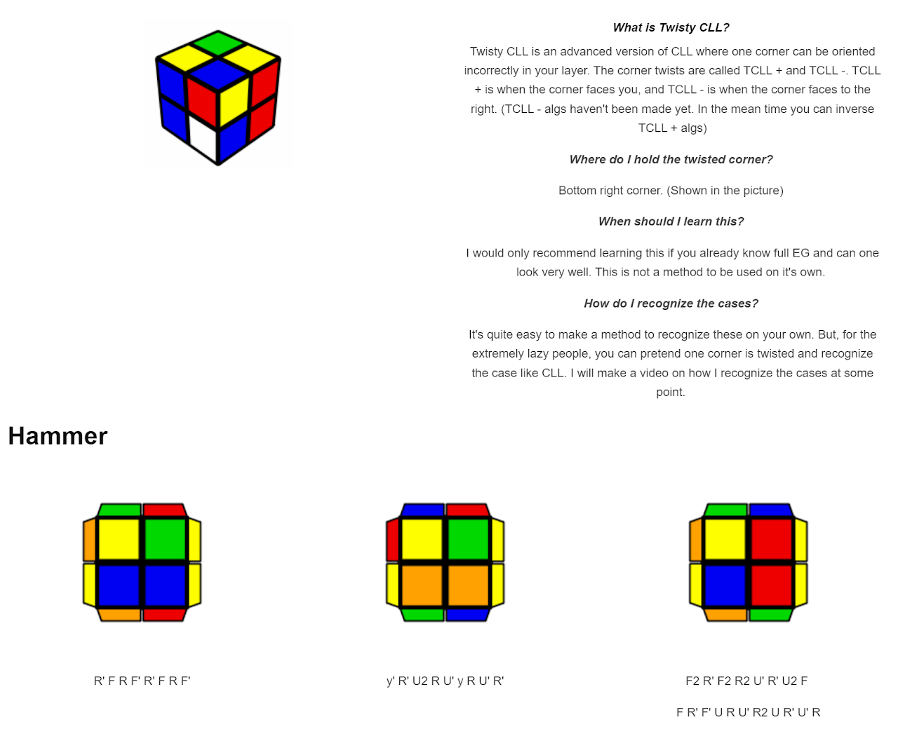

import AnimCube2x2 from "@site/src/components/AnimCube2";

# TCLL

<AnimCube2x2 params="config=../../InteractConfig.txt&move={Twisty CLL: R U R' U' R U R'}R U R' U' R U R'" width="600px" height="400px" />

## Description

**Proposer:** [Stefan Pochmann](CubingContributors/MethodDevelopers.md#pochmann-stefan)

**Proposed:** 2009

**Steps:**

1. Solve the four bottom layer corners with one corner free to be misoriented.
2. Solve the four upper layer corners and correctly orient the misoriented corner.

[Click here for more step details on the SpeedSolving wiki](https://www.speedsolving.com/wiki/index.php?title=Twisty_Corners_of_Last_Layer)

## Origin and Development

Twisty CLL (TCLL) is similar to the CLL method, but with a single bottom layer corner misoriented. The TCLL algorithm solves the upper layer corners and orients the misoriented bottom layer corner.

TCLL was proposed and developed by Stefan Pochmann as part of the RoFL method in 2009-2010 [1]. All of the algorithms were generated and placed on Pochmann's website.

In 2013, Robert Yau and Christopher Olson created a webpage with new algorithms for TCLL and posted a thread on SpeedSolving.com [2, 3]. This thread is where the name TCLL was first used.

## References

[1] 	S. Pochmann, "RoFL 2x2x2," Pochmann's Website, 2009. [Online]. Available: https://www.stefan-pochmann.info//spocc/speedsolving/RoFL/.

[2] 	C. Olson and R. Yau, "TCLL - 2x2 Method," SpeedSolving.com, 16 October 2013. [Online]. Available: https://www.speedsolving.com/threads/tcll-2x2-method.44438/.

[3] 	C. Olson and R. Yau, "Twisty CLL," Olson's website, 2013. [Online]. Available: https://cyotheking.squarespace.com/tcll.