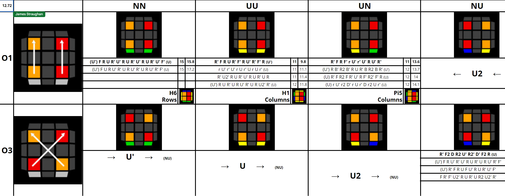

# 42

## Description

**Proposer:** Joseph Briggs

**Proposed:** 2017

**Steps:**

1. CPLine: Solve the 1x1x3 line at DL while permuting all corners of the cube along the z axis. Afterward, the corners are solvable using turns of just the U and R layers.
2. Extend the 1x1x3 line into a 2x2x3 block at dl while orienting all edges along the z axis.
3. Complete the first two layers by solving the 1x2x3 block at dR.
4. Solve the last layer.

[Click here for more step details on the SpeedSolving wiki](https://www.speedsolving.com/wiki/index.php/42)

## Proposal

In August, 2017 Joseph Briggs proposed 42.

- https://www.speedsolving.com/threads/42-method-proposal.66052/

## CCMLL

Jason Wong proposed several CCMLL recognition methods.

- https://drive.google.com/file/d/16vyV2Ph2gnIYrkO3sARIHk7kMmfuta1e/view?usp=sharing

- https://docs.google.com/spreadsheets/d/1OSLPkBhnxfozuSPbEL8_oP9FFBrFAv0v9kjN73Z0Ycs/edit?usp=sharing

- https://drive.google.com/file/d/1PiiS8KDuJaRp8PD7t46Yc2-CwkI4vJfB/view?usp=sharing

James Straughan and Tim Mosher developed a CCMLL recognition method in 2021.

