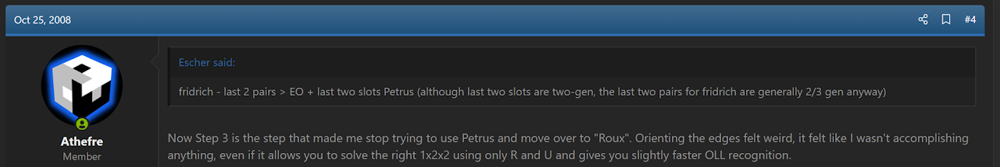
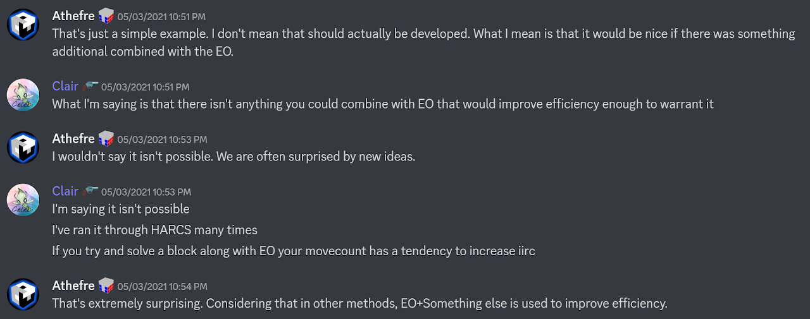
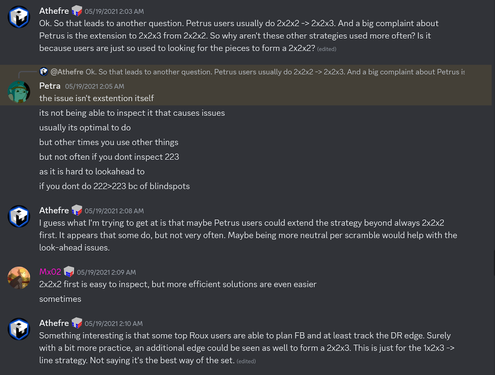
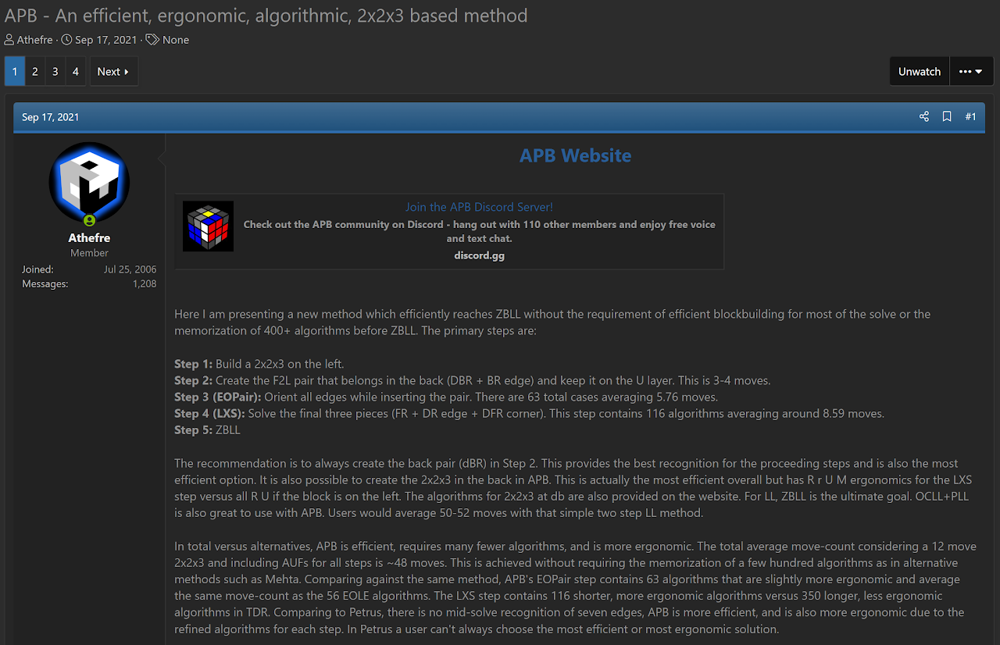
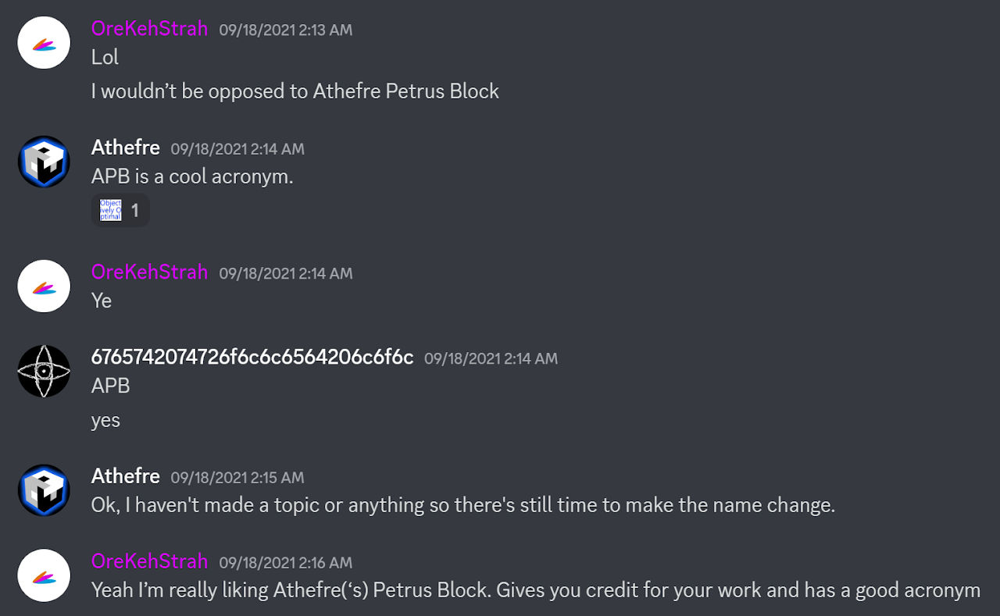
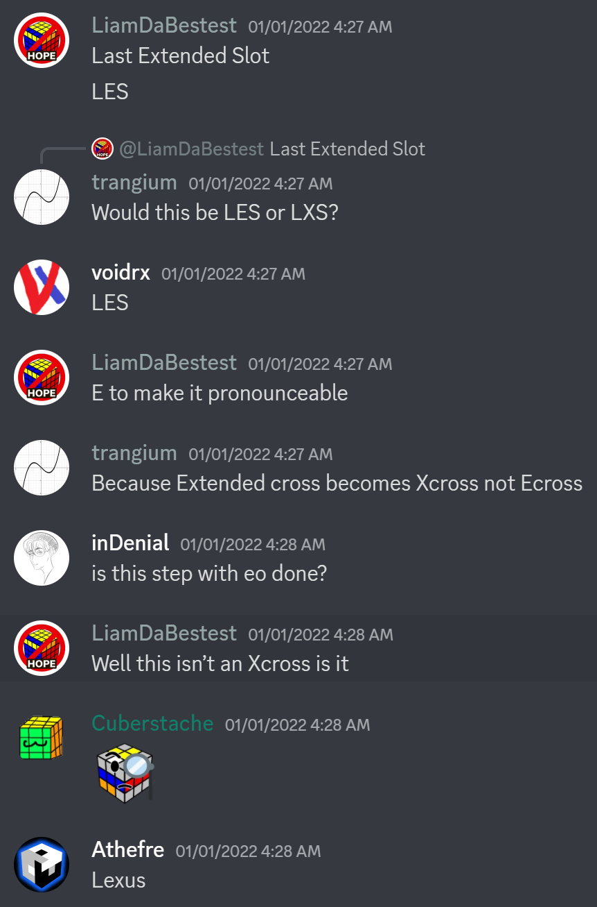
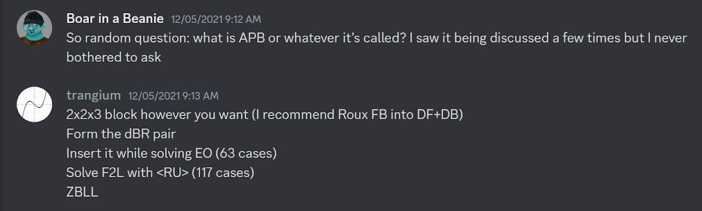
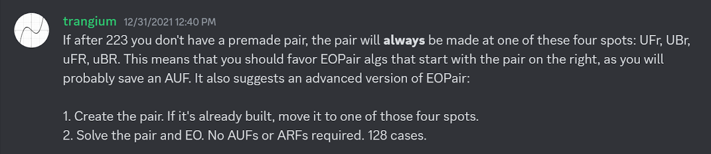

# APB

## Description

**Proposer:** James Straughan

**Proposed:** 2021

**Steps:**

1. First Block (FB): Solve a 1x2x3 block on the left side.
2. F2L Minus Square: Solve the remainder of the F2L minus the dfR square.
3. Edge Orientation (EO): Orient all remaining edges.
4. Last Extended Slot (LXS): Solve the final square of the first two layers using a single algorithm.
5. Last Layer (LL): Solve the last layer.

[APB Website](https://sites.google.com/view/apb-system)

[Click here for more step details on the SpeedSolving wiki](https://www.speedsolving.com/wiki/index.php/APB)

Originally, the steps of APB involved solving a 2x2x3 block, setting up a pair but not yet solving it, solving the pair while orienting all remaining edges, then LXS and LL. However, in 2024 it was decided to simplify the steps to what they are now.

## Origin

APB started from the thought that the EO step of Petrus should be simultaneously accomplishing something other than only edge orientation.

https://www.speedsolving.com/threads/the-disadvantage-of-block-building.7071/post-97217

I wasn't a Petrus user, contrary to what the wording may convey. I had been experimenting with the methods available at the time in 2005 - 2006. Petrus was one method that I had tried out a lot. So in January - February 2006 I came to the conclusion that the edge orientation step almost felt like a waste, and I ultimately chose Roux.

In 2021, I started a discussion in the Petrus channel of the r/cubers Discord server. The discussion was about adding something to the edge orientation step of the Petrus method.

https://discord.com/channels/95625180205813760/373480359280640001/838755756505169940

A couple of weeks later I started another discussion on determining how common it was for Petrus users to use a 2x2x3 strategy other than 2x2x2 > 2x2x3. I suggested that other strategies, such as a 1x2x3 start, may solve the ergonomics complaints.

https://discord.com/channels/95625180205813760/373480359280640001/844259035300626432

## Proposal

APB was initially proposed in May, 2021 then fully developed and presented to the community in September, 2021.

https://discord.com/channels/95625180205813760/373480359280640001/838827839050088451

https://www.speedsolving.com/threads/apb-an-efficient-ergonomic-algorithmic-2x2x3-based-method.85409/

## Name Origins

The original method acronym was created by Ryan Hudgens (OreKehStrah). APB stood for Athefre's Petrus Block.

https://discord.com/channels/455707295205294081/538836158344331306/888472853375221840

Later, Melkor refined the acronym to not include the name of another method. APB now stands for Athefre's Pair and Block.

https://discord.com/channels/885722463521103892/885783926541529109/906955240631337011

LXS was named by Liam Highducheck. It was decided that Lexus would be the pronunciation of the acronym.

https://discord.com/channels/769483322278805504/769491580762456104/926557167060910090

## Other Contributions

Vincent Trang pushed for the 1x2x3 start to be the standard for the method. Trang also suggested the idea of the two additional pair types in the original steps of APB.

https://discord.com/channels/769483322278805504/783035653947523073/916844822621458452

https://discord.com/channels/926220744193622049/926224908369948672/926318861454835743