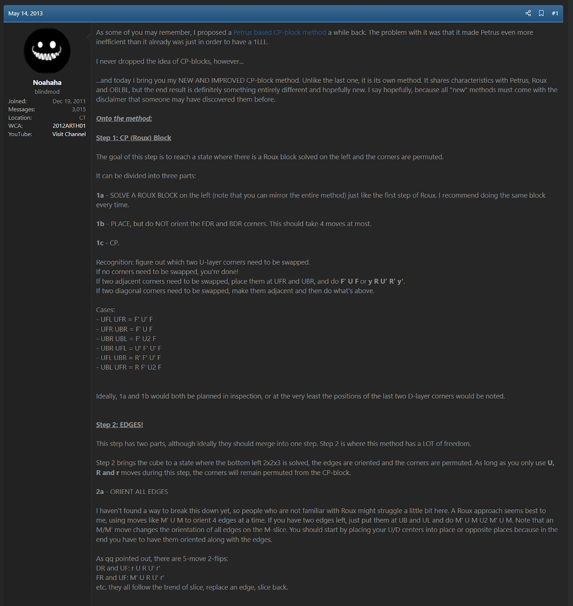
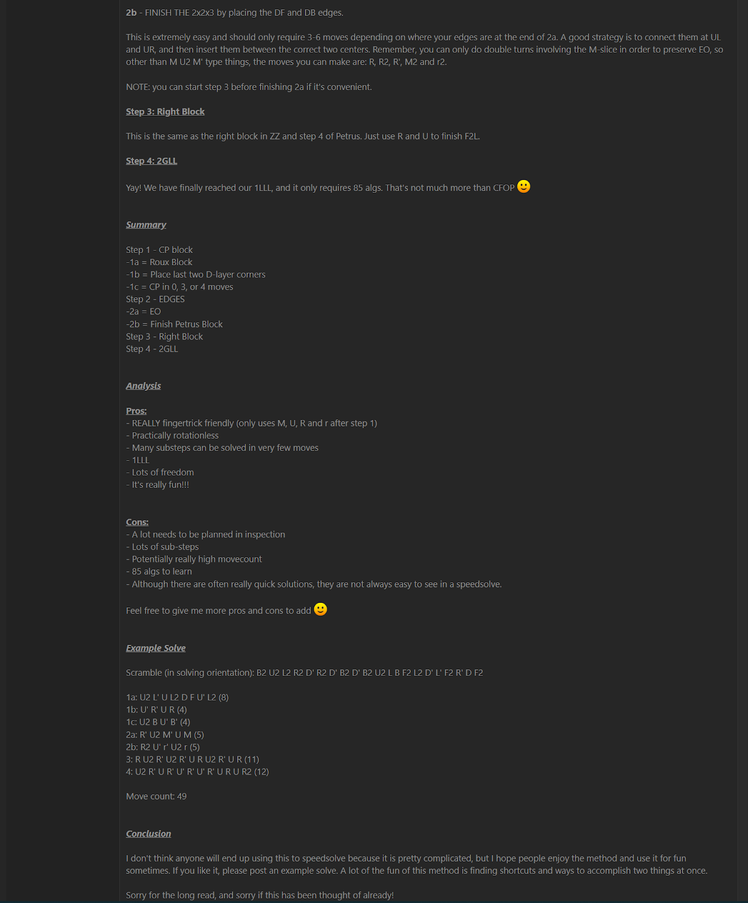
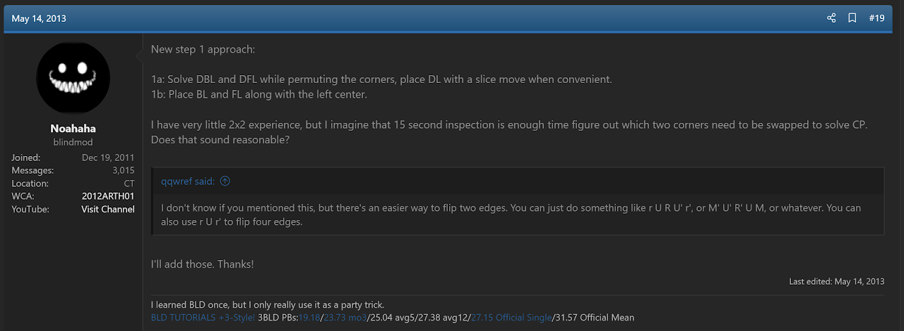
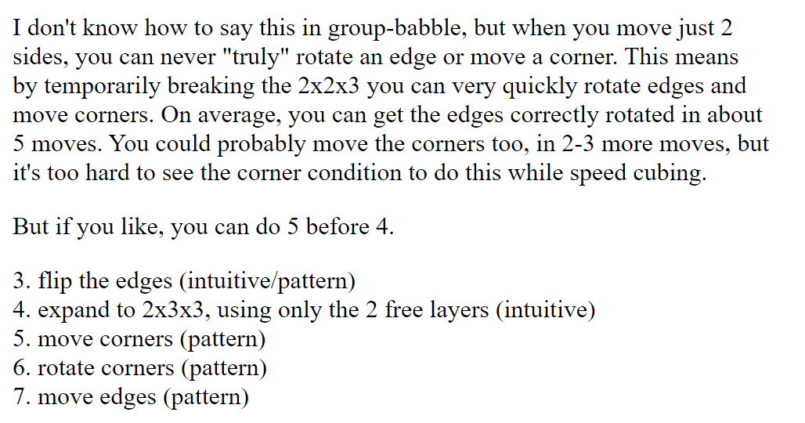
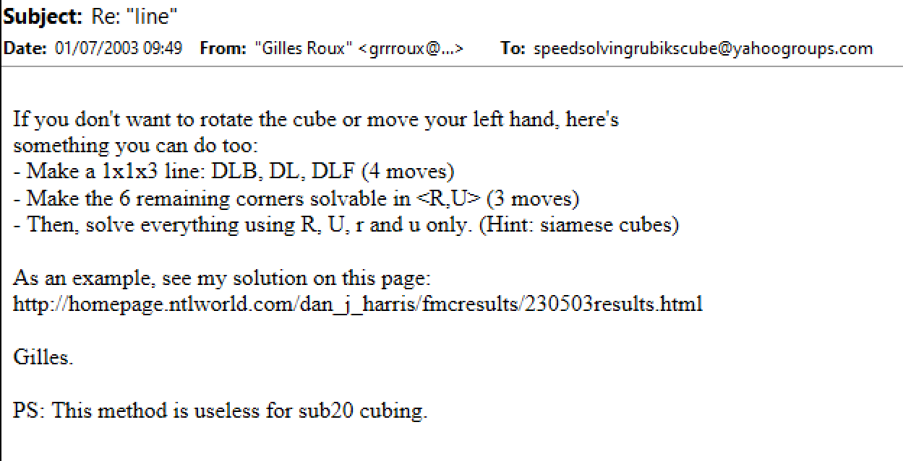
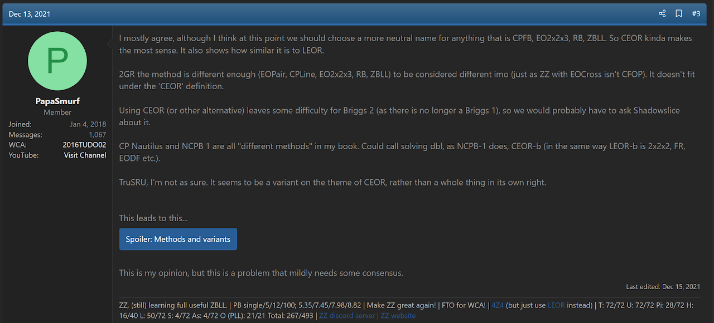

# CEOR

## Description

**Proposer:** Noah Arthurs, others

**Proposed:** 2013

**Steps:**

1. CPLine: Solve the 1x1x3 line at DL while permuting all corners of the cube along the z axis. Afterward, the corners are solvable using turns of just the U and R layers.
2. Extend the 1x1x3 line into a 2x2x3 block at dl while orienting all edges along the z axis.
3. Complete the first two layers by solving the 1x2x3 block at dR.
4. Solve the last layer.

[Click here for more step details on the SpeedSolving wiki](https://www.speedsolving.com/wiki/index.php/CEOR)

## Origin and Proposal

In April, 2012, Noah Arthurs proposed a method called Noah's CP Block. This was a method that permuted all corners after solving a 2x2x2 block.

https://www.speedsolving.com/threads/noahs-cp-block-method.36538/

Noah Arthurs proposed Noah's CP Block 2.0 in May, 2013. This method was also focused on permuting all corners early in the solve. The difference is that it starts with a 1x2x3 block. This method is close to the modern version of CEOR, but permutes all remaining corners after solving a block on the left instead of during.

https://www.speedsolving.com/threads/noahs-cp-block-method-2-0.41986/

In the Noah's CP Block 2.0 speedsolving.com thread, and on the same day of the thread's creation, Arthurs proposed an upgrade to the method. This upgrade permutes the corners while solving a 1x1x3 block at DL. Then the 2x2x3 block is solved at dl while orienting all edges. This became the modern form of CEOR, though the name CEOR didn't yet exist and the method remained named Noah's CP Block 2.0.

https://www.speedsolving.com/threads/noahs-cp-block-method-2-0.41986/post-853203

## Other Relevant Proposals

### Lars Petrus

The first knwon mention of early corner permutation was written by Lars Petrus in June, 1996.

http://www.math.rwth-aachen.de/~Martin.Schoenert/Cube-Lovers/Lars_Petrus__Re__Speed_cubing.html

### Gilles Roux

The first known proposal of the steps of CEOR come from Gilles Roux in 2003. Roux used the method in Dan Harris' online Fewest Moves Competition. Roux mentioned its use on the Speed Solving Rubik's Cube Yahoo group in a reply to Ryan Heise's (re)proposal of EOLine. Although this is the first known proposal, Roux expressed a lack of confidence in the idea and didn't proceed any further with development. Following the attribution standards of Cubing History, the method CEOR is attributed first to Noah Arthurs. Arthurs expressed confidence in the idea and other early corner permutation ideas and proposed the method as one with potential.

https://web.archive.org/web/20040211055843/http://homepage.ntlworld.com/dan_j_harris/fmcresults/230503results.html

### Mariano Aquino

In June, 2011, Mariano Aquino proposed an early corner permutation method that is similar to CEOR. The major difference is that the edges aren't oriented while solving the first two layers.

https://www.speedsolving.com/threads/cpls-and-2gll-discussion.24125/post-594576
https://sites.google.com/site/recursoscuberos/f2g
https://www.youtube.com/watch?v=xLu7yQLS24Q

### Joseph Briggs

In September, 2015 Joseph Briggs proposed the steps of CEOR, matching those of Arthurs from 2013.

https://www.speedsolving.com/threads/briggs-3x3x3-method.55156/

The inspiration for Briggs' idea appears to have been a post from Kole Hedrick.

https://www.speedsolving.com/threads/the-new-method-substep-concept-idea-thread.40975/post-1116703
https://www.speedsolving.com/threads/the-new-method-substep-concept-idea-thread.40975/post-1116737

### Zbigniew Zborowski

In August, 2017 Zbigniew Zborowski proposed a method named C2GR. This method contains the same steps as Arthurs and Briggs had previously proposed.

https://www.speedsolving.com/threads/complex-2-move-generator-reduction-method-c2gr.66089/

https://onedrive.live.com/view.aspx?resid=A768425208665B6D!428&ithint=file%2cdocx&authkey=!AMvcyyr1lbYsxzk

### Yash Mehta

In April, 2020 Yash Mehta proposed a method named YruRU that contained the same steps that Arthurs, Briggs, and Zborowski had previously proposed. A new corner permutation recognition system was included.

https://www.speedsolving.com/threads/roux-breaker-the-yruru-method.77201/

## Method Combination and Name

In December, 2021, James Straughan proposed combining all of the similar methods into one with a single name. Joseph Briggs suggested the name CEOR.

https://www.speedsolving.com/threads/cp-method-history-noah%E2%80%99s-cp-block-briggs-yruru-zz-and-all-others-described.85927/

https://www.speedsolving.com/threads/cp-method-history-noah%E2%80%99s-cp-block-briggs-yruru-zz-and-all-others-described.85927/post-1464625