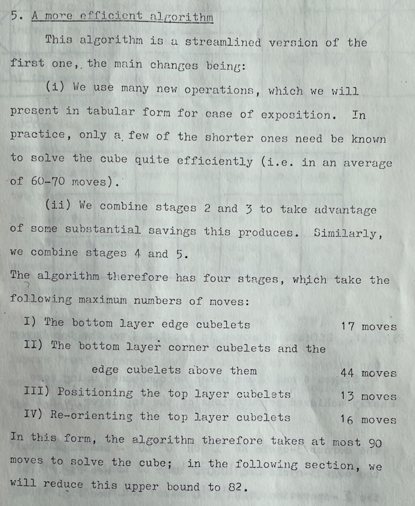
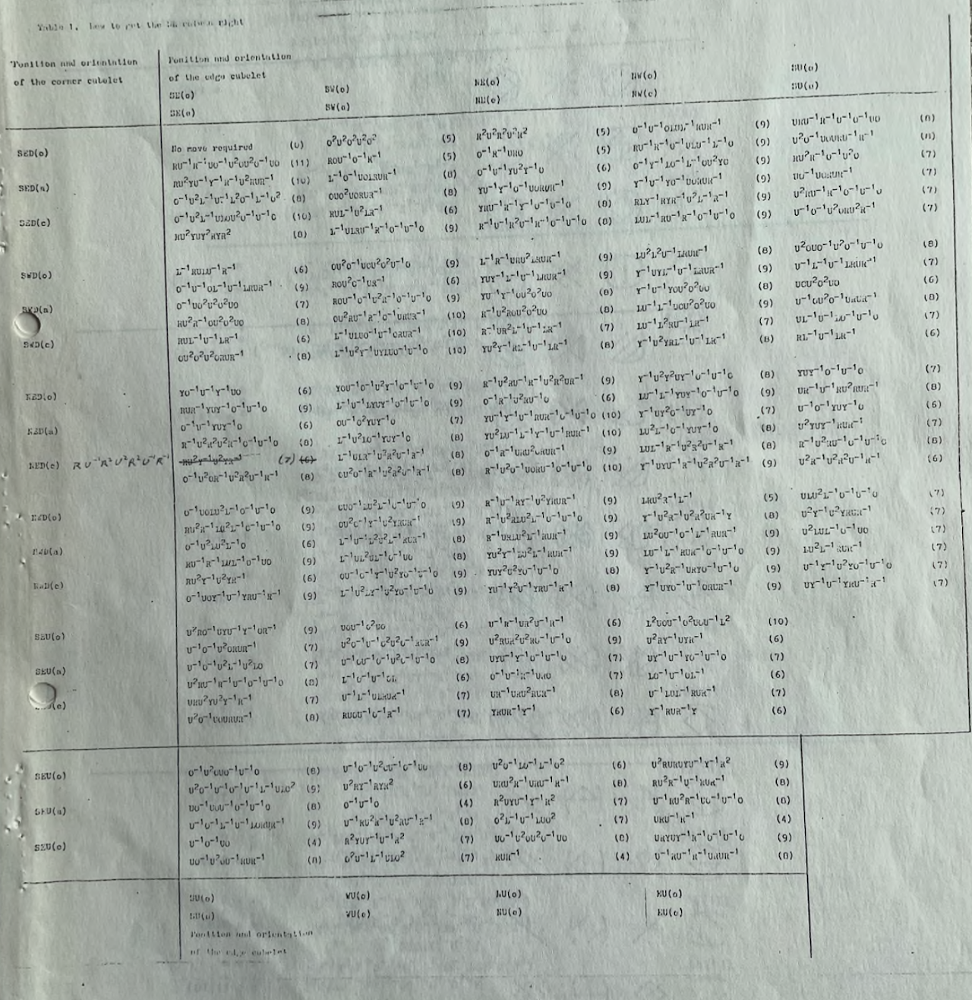
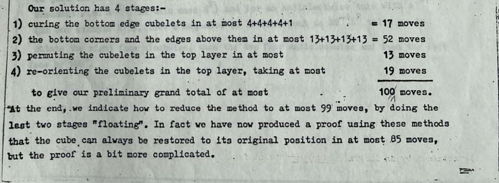
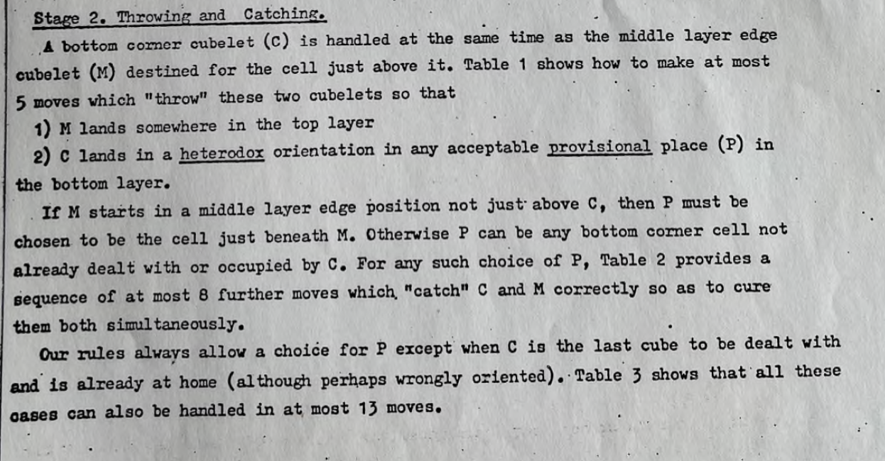

# CFOP

## Description

**Proposer:** Various

**Proposed:** 1979 - 1981

**Steps:**

1. Cross: Solve the four bottom layer edges.
2. First Two Layers (F2L): Solve the four corner and edge pairs around the bottom two layers.
3. Orient the Last Layer (OLL): Orient all pieces of the upper layer.
4. Permute the Last Layer (PLL): Permute all pieces of the upper layer.

[Click here for more step details on the SpeedSolving wiki](https://www.speedsolving.com/wiki/index.php/CFOP_method)

## Cross

The first known publication of the cross step is Donald Taylor's *The Group of a Coloured Cube* in 1978.

## First Two Layers

### First Known Publication

The first known publication of the corner and edge pairing technique appeared in 1979. John Conway, David Seal, and David Benson developed algorithms for all possible cases and published in two different publications.

**Solving the Hungarian Cube**

**Solving the Hungarian Cube in Less Than 100 Moves**

The notation used was slightly different from modern notation. Below is the notation as described in the publications.

The year of publication being 1979 can be deduced from a major point: In David Singmaster's Notes on Rubik's 'Magic Cube', it is stated "John Conway and Dave Benson have prepared an article for the Journal of Recreational Mathematics showing how to always restore the cube in at most 100 moves. They do bottom layer edges, then bottom corners and middle edges together and then use their tables to first position and then orient the top layer, in at most 13 and 19 moves respectively." This is on page 32 and is dated 30 November 1979 on page 34.
> I discovered those couple of sentences from the image above in Notes on Rubik's 'Magic Cube' then Georges Helm kindly helped me verify the Conway/Benson/Seal publications. I then noticed in their publications that they even had the complete F2L, PLL, and OLL tables as shown above. I guess it was a very easy thing to overlook because it is such a quick mention in Notes on Rubik's 'Magic Cube'.

Other points that indicate the year of publication:

- The bibliography of Notes on Rubik's 'Magic Cube' says that the publication date for Solving the Hungarian Cube is "1980?". So with the above quote saying that Conway, Benson, and Seal "prepared" the article, Singmaster's question of the date 1980 likely means that he was trying to convey something like "will be published in 1980?".
- Solving the Hungarian Cube in Less Than 100 Moves states on the second page "In fact we have now produced a proof using these methods that the cube can always be restored to its original position in at most 85 moves". In 1982's Winning Ways for Your Mathematical Plays Volume 4 in the Rubik's Hungarian Cube — Bűvös Kocka subchapter, it states "In the Extras you'll find lists of the shortest known words (improvements welcome!) to achieve any rearrangement, or any reorientation of the top layer. These are quoted from an algorithm due to Benson, Conway and Seal which guarantees to cure the cube in at most 85 moves". This is likely a reference to Solving the Hungarian Cube in Less Than 100 Moves. The bibliography of Notes on Rubik's 'Magic Cube' states for Winning Ways "This [is] said to be at the publishers and may appear in 1980...First draft, 16pp, 1979; Second draft, 15pp, 1980."
- With Solving the Hungarian Cube having likely been published in 1979 and Solving the Hungarian Cube in Less Than 100 Moves having an actual published first draft of 1979, that makes two publications in 1979 by Benson, Conway, and Seal that described the F2L pair technique along with cross and PLL then OLL.

### Later Publications

## OLL and PLL

## Techniques