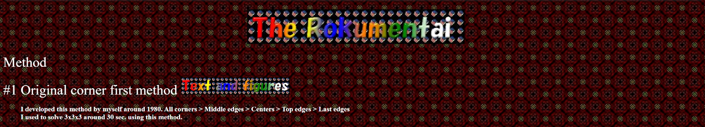
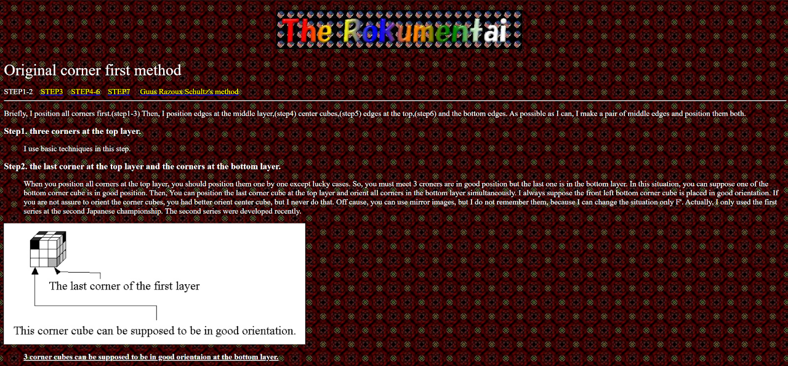
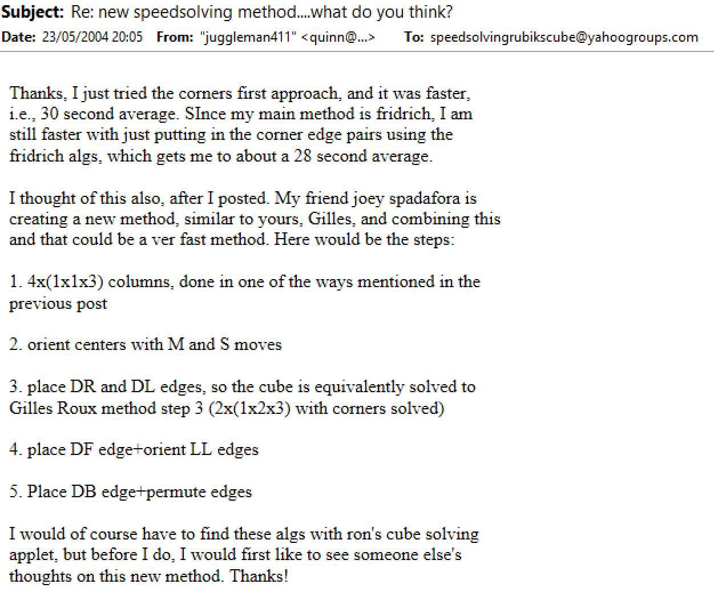

# Columns First

## Description

**Proposer:** Masayuki Akimoto, others

**Proposed:** ~1980

**Steps:**

1. Four Pairs: Solve the four corner and edge pairs of the first two layers.
2. Corners of the Last Layer (CLL): Solve the four corners of the last layer.
3. Edges: Solve the remaining edges.

[Click here for more step details on the SpeedSolving wiki](https://www.speedsolving.com/wiki/index.php/Columns_First_Methods)

## Origin

### Masayuki Akimoto

The earliest known use of the method is by Masayuki Akimoto in 1980.

https://web.archive.org/web/20040409235900/http://rokumentai.akimoto3.com/methode.htm

https://web.archive.org/web/20040705200720/http://rokumentai.akimoto3.com/step1-2.htm

### Others

### PCMS

