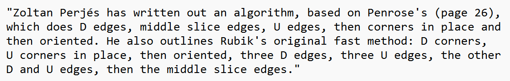
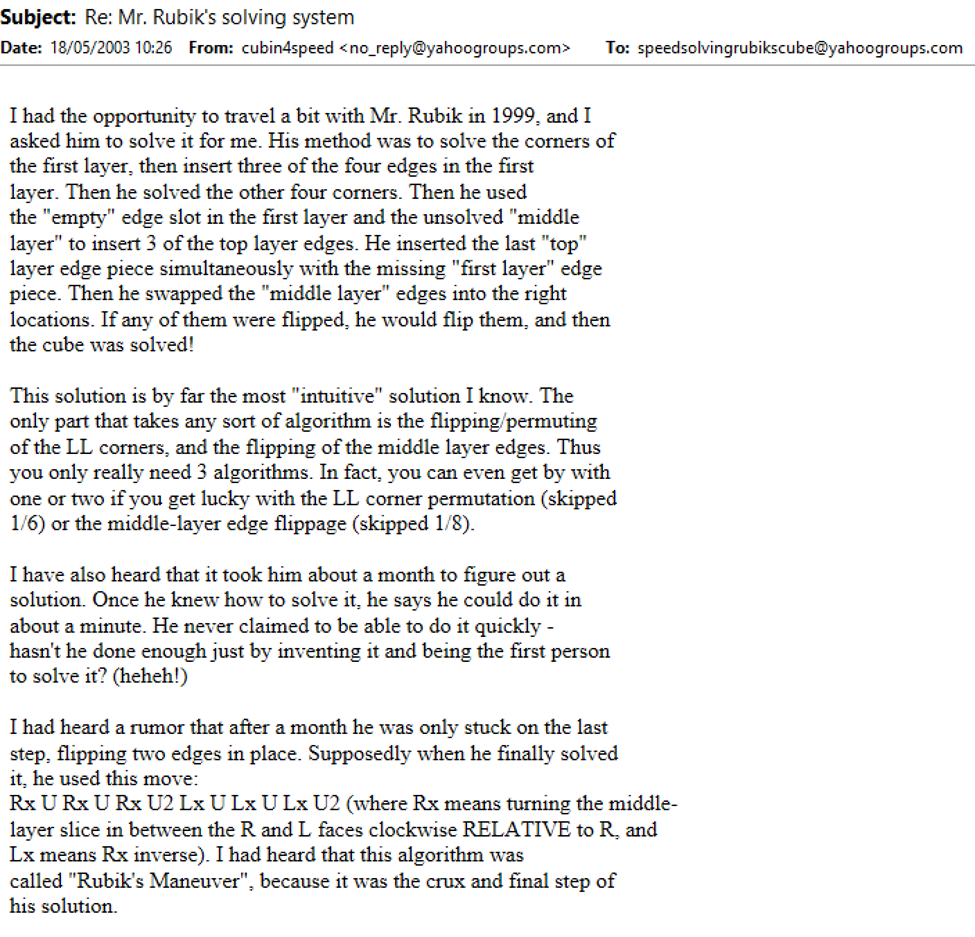

# Corners First

## Description

**Proposer:** Ernő Rubik, others

**Proposed:** ~1974

**Steps:**

1. Corners: Solve all corners.
2. Edges: Solve all edges.

[Click here for more step details on the SpeedSolving wiki](https://www.speedsolving.com/wiki/index.php/Corners_First)

## Origin

### Ernő Rubik

On page 40 of David Singmaster's *Notes on Rubik's 'Magic Cube'*, the steps of Rubik's method are written as described by Zoltán Perjés. This makes Ernő Rubik the first to have created the corners first method and also corners first as the first method created to solve the cube.

Zoltán Perjés was a relative of Rubik.

http://www.epa.oszk.hu/00300/00342/00200/pdf/FizSzem_EPA00342_2007_01.pdf

In May, 2003, Dan Knights stated that in 1999 he saw Rubik solve the cube. He outlined the steps that he saw.

### First Published

The first known published Corners First method came in 1978 by Hanke Bremer in *Ein Paar Würfeldrehungen*.

>I contacted Georges Helm to ask the method steps in all of the books he owns from 1980 and earlier. This is a handwritten list of steps. "K" is for edges and "E" is for corners. The numbers on the left indicate the bottom, middle, and upper layer. "P" is for "position" and "O" is for "orient". Hanke Bremer's publication is the earliest of the books he owns that describes corners first.