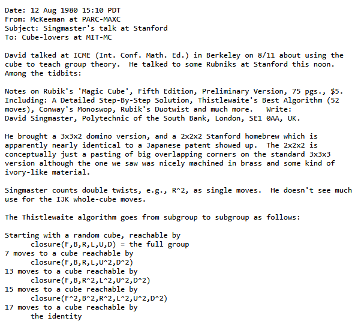
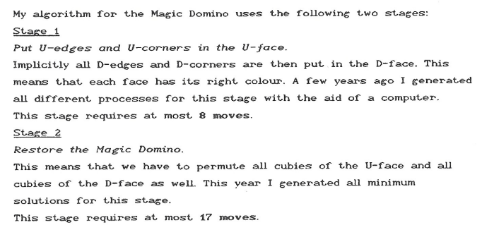
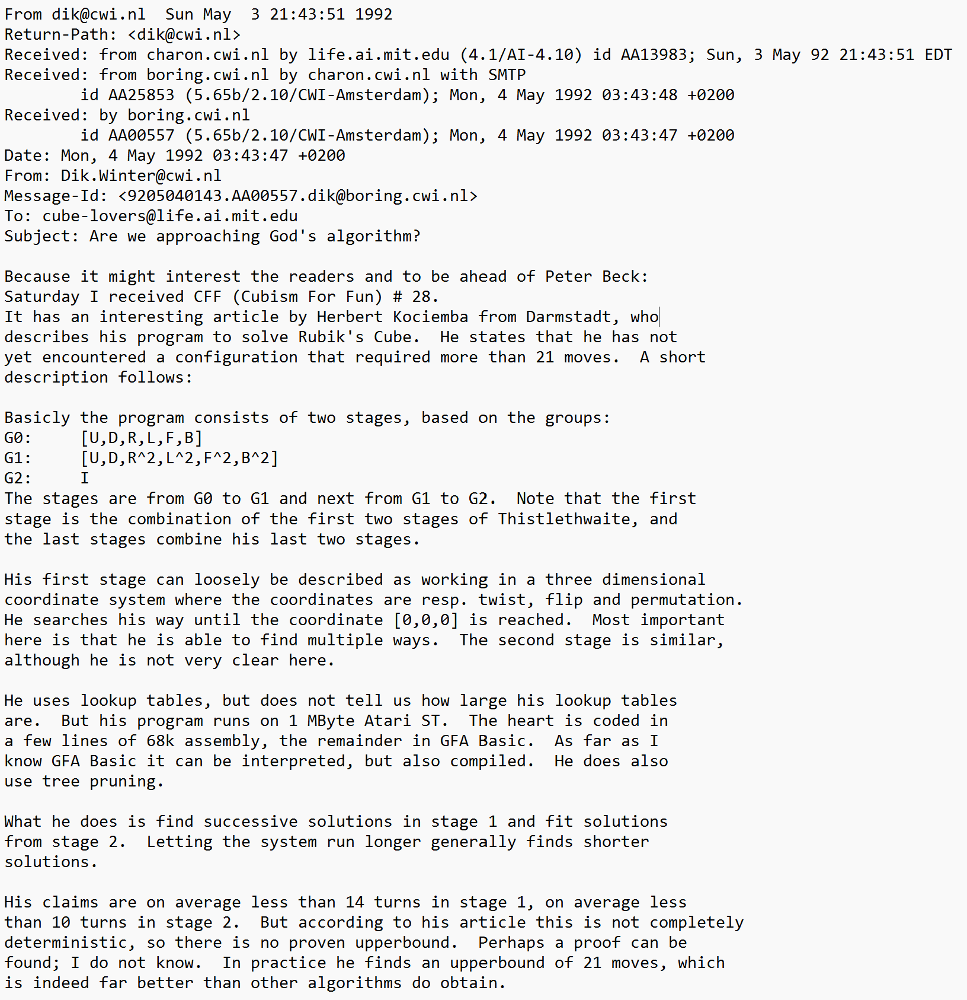
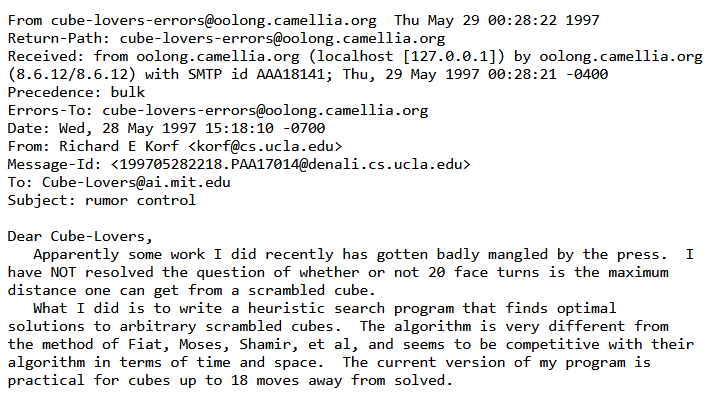
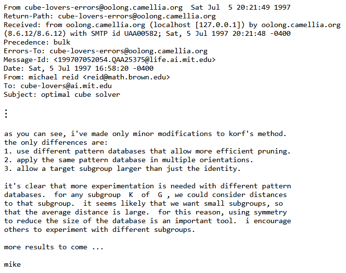
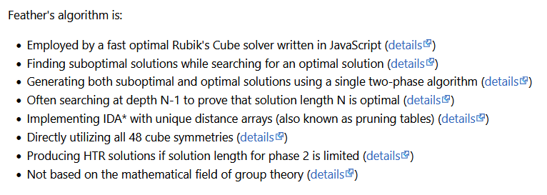

import TwistyPlayer from "@site/src/components/TwistyPlayer";
import YouTube from "@site/src/components/YouTube";
import ImageCollage from '@site/src/components/ImageCollage';

# Computer Algorithms

The number of 3x3x3 Rubik's Cube states is 43,252,003,274,489,856,000. Even at a million turns per second it would take a computer about 650,000 years on average to solve the cube with a simple brute-force search. 

An alternative method is to use a complete lookup table storing every state. While this would be very fast once the table was built, storing the solutions for all 43 quintillion possible states in memory is practically impossible. 

Hence, another technique must be used. Since we lack the time to compute everything on the fly and the capacity to store a full index of states with corresponding solutions, we must seek a middle ground.

<TwistyPlayer
  alg="x2 D2 U2 L2 B2 L2"
 controlPanel="none"
/>

## Morwen Bernard Thistlethwaite (1980)

Early human-based methods for solving the Rubik's Cube typically required around 100 moves. A significant breakthrough occurred in 1980 when Morwen Thistlethwaite developed a novel four-phase algorithm that reduced the maximum move count to 52. Each of its 4 steps progressively restricts the allowed types of turns until the cube reaches a solved state.

In phase 1, all 18 cube turns (U, U', U2, D, D', D2, R, R', R2, L, L', L2, F, F', F2, B, B', B2) are allowed. In phase 2, U and D are restricted to half-turns only (that means no U and D quarter-turns anymore). Phase 3 additionally disallows F and B quarter-turns, and finally phase 4 restricts all six faces to half-turns only [^pochmann-2008-1].

To navigate between the stages, big lookup tables are required: for phase 1 a set of 2048 move sequences is necessary to make the cube solvable in the later steps. Those need 1082565, 29400 and 663552 move sequences, respectively.

The version originally presented by Thistlethwaite guaranteed a solution within 52 moves based on worst-case scenarios in all four stages (7+13+15+17). Subsequent research has optimized those figures. We now know that the algorithm as described above can solve any cube configuration in at most 45 moves (7+10+13+15), with a typical solution averaging 31 turns [^scherphuis-nd]. Furthermore, phase 4 is optimally solvable in just 13 moves if quarter-turns are allowed as well.

It is worth mentioning that already in 1980, Michael Feather and George Christos independently developed the [3-Color method](Methods/3Color.md). Much like Thistlethwaite's approach, this method simplifies the cube by treating opposite colors as identical. However, while Thistlethwaite's algorithm was computionally driven, the 3-Color method was designed specifically for human use. In 2002, Ryan Heise devised the [Human Thistlethwaite method](Methods/HumanThistlethwaite.md) which has the same four distinct steps as its computer counterpart. Today, Thistlethwaite's legacy persists, as his 4-phase algorithm serves as a base for a high-level FMC. (// link to the FMC page once it is published on Cubing History).

## Adi Shamir, et al. (1987, 1989)

The core idea behind the Shamir's algorithm, also known as the 4-list algorithm, is using the meet-in-the-middle approach. The algorithm generates the product of the list of states for the first 5 moves from the solved state multiplied by itself cleverly (which is equivalent to generating the first 10 moves) and finding the intersection with the same process done to the scrambled state [^bawden-1987].

Even though advertised as "the first practical algorithm for finding the shortest solution for any given state of Rubik's cube", this claim remained unfulfilled by the authors. Presumably due to hardware limitations they have only reported that the algorithm was successfully implemented for the list of all states within 4 (and not needed 5) face turns [^shamir-fiat-moses-shimshoni-tardos-1989].

A simple counting argument known from the early 1980s dictates that there are states requiring at least 18 face turns [^singmaster-1981]. Unfortunately, such states seemed to be beyond the reach of the 4-list algorithm executed on the hardware of the late 1980s. Today, however, running the same algorithm on a modern PC guarantees a solution within 20 moves, including the optimal one [^smith-nd].

## Hans Kloosterman (1989)

Driven by a fascination with the 2x3x3 Rubik's Domino, Hans Kloosterman's 1989 contribution focused on refining computer-generated solution for that puzzle. This work served as a foundantion for his later development of a full 3x3x3 cube algorithm.

The shortest solution for the Rubik's Domino known to him involved applying Thistlethwaite's third and fourth phases (these are optimally solvable in at most 13+15 moves on Rubik's Cube) [^kloosterman-1989]. He optimized them into a two-step process with a maximum of 25 moves.

In step 1, he placed all top-face cubies to the upper layer; essentially orienting both layers. This can be done in 8 moves. In step 2, he restored the rest of the puzzle; essentially permuting both layers. This can be done in 17 moves. Kloosterman noted that stages 3 and 4 of the Thistlethwaite's algorithm share the same class of moves as his Domino solution, which allowed him to successfully adapt those principles to the Rubik's Cube.

By substituting Thistlethwaite's third and fourth stages with his two-phase Domino algorithm, Kloosterman found out that the new 3x3x3 phase 3 remained solvable within 8 moves using the <U, D, R2, L2, F2, B2> move set, and the new 3x3x3 phase 4 could be completed in a maximum of 19 moves within the same move set.

In 1990, following an exhaustive computer-aided search, Kloosterman lowered the phase 4 move count by one, achieving the optimal value of 18. He subsequently demonstrated that the overall move count could be further reduced by canceling out moves at the transition between phase 3 and 4.

## Herbert Kociemba (1992)

In 1992, Herbert Kociemba created an algorithm that was both evolutionary and revolutionary at the same time [^kociemba-1992].

He basically combined Thistlethwaite's first two and last two steps into one step each, resulting in a two-phase algorithm capable of finding instant and near-optimal solutions with minimal memory usage. The algorithm does not stop after finding its first solution but continues searching with an increasing phase 1 length and decreasing phase 2 length, which leads to a shorter overall solution [^pochmann-2008-2]. However, it is not designed to find optimal solutions.

Phase 1 contains roughly 2 billion states and can be solved in 12 moves. Phase 2 contains almost 20 billion states and it needs at most 18 moves. Kociemba's contribution was not only developing a two-phase algorithm, but also introducing new and efficient ways to represent cube permutations and orientations that made large-scale searches possible [^kociemba-nd]. 

Kociemba's 2-phase algorithm has become very popular in the cubing community since its public release. It is often — though not always — powering cube-solving robots or generating scrambling & solving sequences in cubing apps. It was also utilized in the search for God's number (// link to Maksymilian´s page once it is ready) to name a few applications where a quick and not necessarily optimal solution (but still 20 moves or less) for a randomly scrambled cube is needed.

## Richard Earl Korf (1997)

A new era of optimal solving has begun with the introduction of Korf's solver in 1997 [^korf-1997]. Richard Korf was the first to demonstrate that the IDA* search algorithm could be employed to find optimal solutions for randomly scrambled Rubik's Cubes, and all well-performing optimal solvers use this technique since then [^kociemba-2024].

IDA* (Iterative Deepening A*) is an algorithm that searches for the shortest move sequence by gradually increasing the allowed solution length. Given that God's Number for the Rubik's Cube is 20, Korf's algorithm will always find a solution within that limit. It is using pruning tables stored in memory to quickly estimate the remaining moves needed.

A pruning table is a precomputed table containing the minimum number of moves required to solve specific parts of the cube (like just the corners), used to "guess" how far away the full solution is and to prune the tree accordingly. Korf used three pruning tables which were corners as one component and edges evenly split into two sub-components.

Of the 10 randomly scrambled cubes used in his demonstration, six were optimally solvable in 18 moves, three in 17 moves, and one in 16 moves. In this regard he was quite lucky not to have generated a scramble requiring 19 moves, as the probability of doing so is higher than that of generating a scramble requiring 16 moves. To optimally solve a single depth-19 cube would most likely have taken more than a month on the hardware used (in fact, somewhere between 27 and 360 days of uninterrupted search).

## Michael Reid (1997)

Expending on the work of Korf and Kociemba, Michael Reid developed his own optimal solver just months after Korf.

Reid used only one pruning table which was the combination of edge orientation + corner twist + edge position of 4 cubies (cubers know this state as Domino Reduction which is literally the first goal state of Kociemba's algorithm). He then used the pruning table three times by rotating the cube to get a different set of 4 edge cubies each time. Additionally he used symmetry reduction to reduce the size of the pruning table by a factor of 16 (the 16 symmetries are all of the cube states that are reached by rotating on the same axis or flipping the axis 180 degrees or taking the mirror image of those positions).

The principles established by both Reid and Kociemba were widely adopted in later software developments. In 2000, Josef Jelínek released ACube, a versatile program capable of finding both optimal and suboptimal move sequences for fully or partially solved state. Similarly, Herbert Kociemba integrated Reid's concepts into his Cube Explorer program to implement an optimal solving feature [^kociemba-1997]. 

A chain of influence is therefore as follows [^heise-2007]: 

<ol>
<li>Thistlethwaite (4-phase)
<li>Kociemba (2-phase)
<li>Reid (optimal)
<li value=3>Jelínek (partial)
<li value=4>Kociemba (old: 2-phase, new: optimal and partial)
</ol>

Among other things, Reid is also credited with proving that the Superflip requires exactly 20 optimal moves to solve [^reid-1995]. The Superflip is a cube state where all corners are solved and all edges are correctly positioned but flipped. This discovery effectively raised the lower bound of God's number from 18 to 20.

## Michael Feather (2015)

For nearly two decades following 1997, the research into alternative pruning tables was minimal. This trend persisted until 2015, marked by the release of Michael Feather's two-phase solver.

It uses IDA* to find optimal and suboptimal solutions in phase 1 to get the cube into an intermediate 3-color state characterized by having a maximum of two colors per face, and then again uses IDA* to reach the final solution in phase 2. To make this work, Feather had to build a fundamentally new set of pruning tables for both phases from scratch.

Depending on the specific solver variant, the length of phase 2 can be limited to 8 moves or left unlimited [^speedsolving.com-wiki-nd]. In the unlimited version, phase 2 contains 3981312 states that can be solved within 16 moves, while phase 1 constains nearly 11 trillion states with a maximum of 15 moves.

Instead of terminating at the first solution, the algorithm continues to search by incrementally increasing the phase 1 length while decreasing the phase 2 length until it finds an optimal solution or reach the desired solution length. Furthermore, the solver is capable of finding quick and short suboptimal solutions (20 moves or less) using the same logic.

A notable feature is that the Feather's algorithm finds suboptimal solutions while searching for an optimal one. Consequently, the phase 2 length does not necessarily have to be 0 in order to prove that the solution found is optimal.

## Stats

Number of states in multi-phase algorithms:

<table>
<tr><td></td><td align=center>phase 1</td><td align=center>phase 2</td><td align=center>phase 3</td><td align=center>phase 4</td></tr>
<tr><td></td><td colspan=2 align=center>phase 1</td><td colspan=2 align=center>phase 2</td></tr>
<tr><td>Thistlethwaite</td><td align=center>2048</td><td align=center>1082565</td><td align=center>29400</td><td align=center>663552</td></tr>
<tr><td>Kloosterman</td><td align=center>2048</td><td align=center>1082565</td><td align=center>4900</td><td align=center>3981312</td></tr>
<tr><td>Kociemba</td><td colspan=2 align=center>2048 · 1082565 a</td><td colspan=2 align=center>29400 · 663552 b</td></tr>
<tr><td>Feather</td><td colspan=2 align=center>10863756288000 c</td><td colspan=2 align=center>3981312 c</td></tr>
</table>

a = 2217093120 
b = 19508428800 
c = unlimited phase 2 variant

Naturally, there is an inherent mathematical relation between Kloosterman's phase 3 and Thistlethwaite's phase 3: 4900 = 29400/6, as well as Kloosterman's phase 4 and Thistlethwaite's phase 4: 663552 = 3981312/6. Interestingly, and despite very different solving approaches, the number of move sequences in Kloosterman's phase 4 matches the number of states in the unlimited phase 2 variant of Feather's algorithm: both are 3981312 = (4!^5)/2.

Optimal move count per phase: 

<table>
<tr><td></td><td align=center>phase 1</td><td align=center>phase 2</td><td align=center>phase 3</td><td align=center>phase 4</td></tr>
<tr><td></td><td colspan=2 align=center>phase 1</td><td colspan=2 align=center>phase 2</td></tr>
<tr><td>Thistlethwaite</td><td align=center>7 a</td><td align=center>10 b</td><td align=center>13 c</td><td align=center>15 d</td></tr>
<tr><td>Kloosterman</td><td align=center>7 a</td><td align=center>10 b</td><td align=center>8 c</td><td align=center>18 c</td></tr>
<tr><td>Kociemba</td><td colspan=2 align=center>12 a</td><td colspan=2 align=center>18 c</td></tr>
<tr><td>Feather (unlimited variant)</td><td colspan=2 align=center>15 a</td><td colspan=2 align=center>16 a</td></tr>
<tr><td>Feather (limited variant)</td><td colspan=2 align=center>16 e</td><td colspan=2 align=center>8 a</td></tr>
</table>

a = <U, D, R, L, F, B> move set 
b = <U2, D2, R, L, F, B> move set (or equivalent <U, D, R, L, F2, B2> or <U, D, R2, L2, F, B> move set) 
c = <U2, D2, R, L, F2, B2> move set (or equivalent <U, D, R2, L2, F2, B2> or <U2, D2, R2, L2, F, B> move set) 
d = <U2, D2, R2, L2, F2, B2> move set 
e = lower bound [^miler-2024] and <U, D, R, L, F, B> move set

See also:
- [example solves](https://animcubejs.cubing.net/sources/codes/enhancement/parameters/cube3.html?butbgcolor=99aacc&initrevmove=%23&move={4-list%20one-phase%20algorithm,%20optimal%20solution.}R%27%20L2%20B%27%20U2%20B%27%20U%20F%20U%20L%27%20F2%20B2%20L%27%20U2%20R%27%20U2%20F%20U%20B%27;{Korf%27s%20one-phase%20algorithm,%20optimal%20solution.}R%20B%20U2%20L2%20U%20F2%20R2%20F2%20U%20F%27%20U2%20R2%20F%27%20U%27%20F2%20L%20B%20L%27;{Reid%27s%20one-phase%20algorithm,%20optimal%20solution.}U%20R%27%20U2%20L2%20B%27%20R2%20D%20F2%20R%20L2%20B%20R2%20U%20R2%20D%27%20R%20U%27%20D2;{Feather%27s%20two-phase%20algorithm,%20optimal%20solution%20[15+3].}U%27%20D%27%20F2%20D%20F%27%20R2%20F%20B2%20D%20F%27%20B%27%20L2%20D2%20L%27%20F%27%20L2%20R2%20F2;{Thistlethwaite%27s%20four-phase%20algorithm,%20suboptimal%20solution%20[3+8+10+8].}D2%20L%27%20F%27%20U%27%20D%20R%20B2%20D%27%20R%20U%20L%27%20U%27%20R2%20U%20F2%20U%27%20F2%20U%20L2%20F2%20U%20R2%20U2%20L2%20U2%20F2%20L2%20B2%20R2;{Klooserman%27s%20four-phase%20algorithm,%20suboptimal%20solution%20[3+8+6+12].}D2%20L%27%20F%27%20U%27%20D%20R%20B2%20D%27%20R%20U%20L%27%20U%20B2%20U%20F2%20U%27%20F2%20D%20F2%20U%20L2%20U%27%20L2%20D%20R2%20D%27%20F2%20L2%20D%27;{4-list%20one-phase%20algorithm,%20suboptimal%20solution.}B%20U2%20B%20U2%20D%27%20B2%20U2%20F2%20R%20F%27%20B%20U2%20B%20D%27%20B2%20D%20L%27%20D2%20F%20R%27;{Kociemba%27s%20two-phase%20algorithm,%20suboptimal%20solution%20[10+10].}L%20F%27%20R2%20B2%20D2%20B%27%20L%27%20B%20R%20B%20U%27%20B2%20D%27%20L2%20F2%20L2%20D2%20R2%20D%20F2;{Feather%27s%20two-phase%20algorithm,%20suboptimal%20solution%20[12+8].}D%20L%20D2%20L%20B%20R2%20B%27%20L%20F%20R%27%20U%20L%27%20B2%20R2%20U2%20F2%20U2%20B2%20R2%20D2&colorscheme=wygbor&edit=1&snap=1&movetext=1&buttonheight=20&textsize=18&scale=2)
- [similarities and differences among algorithms](https://en.wikipedia.org/wiki/Optimal_solutions_for_the_Rubik%27s_Cube#Similarities_and_differences_among_algorithms)

[^pochmann-2008-1]: S. Pochmann, "Analyzing Human Solving Methods for Rubik’s Cube and similar Puzzles", 2008, pp. 14-15. [Online]. Available: https://www.stefan-pochmann.info/hume/hume_diploma_thesis.pdf
[^scherphuis-nd]: J. Scherphuis, "Computer Puzzling". [Online]. Available: https://www.jaapsch.net/puzzles/compcube.htm#thisal
[^bawden-1987]: A. Bawden, "Shamir's talk really was about how to solve the cube!", Cube Lovers, 27 May 1987. [Online]. Available: https://www.cube20.org/cubelovers/CL06/024.txt
[^shamir-fiat-moses-shimshoni-tardos-1989]: A. Shamir, A. Fiat, S. Moses, I. Shimshoni, G. Tardos, "Planning and learning in permutation groups", January 1989, pp. 274-276. [Online]. Available: https://www.researchgate.net/publication/3501931_Planning_and_learning_in_permutation_groups
[^singmaster-1981]: D. Singmaster, "Notes on Rubik's Magic Cube", Hillside, NJ, Enslow Publishers, 1981, p. 34.
[^smith-nd]: R. Smith, "Can a Rubik's Cube be brute-forced?". [Online]. Available: https://www.stylewarning.com/posts/brute-force-rubiks-cube/#the-4-list-algorithm-and-solving-the-rubiks-cube
[^kloosterman-1989]: H. Kloosterman, "Rubik's Cube in 44 moves", Cubism For Fun #22, December 1989, p. 9.
[^kociemba-1992]: H. Kociemba, "Close to God's algorithm" Cubism For Fun #28, April 1992, pp. 10-13.
[^pochmann-2008-2]: S. Pochmann, "Analyzing Human Solving Methods for Rubik’s Cube and similar Puzzles", 2008, pp. 15-16. [Online]. Available: https://www.stefan-pochmann.info/hume/hume_diploma_thesis.pdf
[^kociemba-nd]: H. Kociemba, "Two-Phase Algorithm Details". [Online]. Available: https://kociemba.org/math/imptwophase.htm
[^korf-1997]: R. E. Korf: "Finding Optimal Solutions to Rubik's Cube Using Pattern Databases", July 1997. [Online]. Available: https://www.semanticscholar.org/paper/Finding-Optimal-Solutions-to-Rubik%27s-Cube-Using-Korf/e6ab7d5d5d38a659fd2ffa53d72ab67e6abc61af
[^kociemba-2024]: H. Kociemba, forum post, December 2024. [Online]. Available: https://www.speedsolving.com/threads/computer-solving-a-new-two-phase-algorithm.93083/page-3#post-1634814
[^kociemba-1997]: H. Kociemba, "The Optimal Solvers". [Online]. Available: https://kociemba.org/math/optimal.htm
[^heise-2007]: R. Heise, "Re: FW: [fewestmoveschallenge] FMC 148", Yahoo! Groups, Fewest Moves Challenge subgroup, 14 April 2007. [Online]. Available: https://www.cubinghistory.com/archive/YahooGroups/YahooGroups.html 
[^reid-1995]: M. Reid, "superflip requires 20 face turns", 18 January 1995. [Online]. Available: https://www.cube20.org/cubelovers/CL15/002.txt
[^miler-2024]: T. Miler, forum post, August 2024. [Online]. Available: https://www.speedsolving.com/threads/computer-solving-a-new-two-phase-algorithm.93083/#post-1617184
[^speedsolving.com-wiki-nd]: speedsolving.com wiki, "Feather's algorithm". [Online]. Available: https://www.speedsolving.com/wiki/index.php?title=Feather%27s_algorithm#Variants
