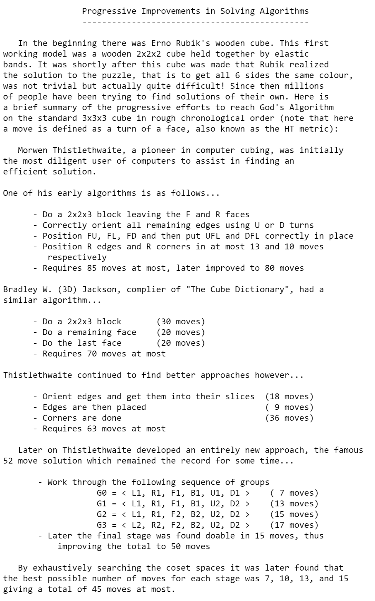

import AnimCube from "@site/src/components/AnimCube";

# Computer Algorithms
A history of algorithms and their role in proving God's number.

<AnimCube params="buttonbar=0&position=lluuu&scale=6&hint=10&hintborder=1&facelets=ywyyywwywwwywwyyywogbrbgrbbgbgogrrgrgbboorobbgroorgoor" width="400px" height="400px" />

## Morwen Thistlethwaite (1980)

In 1979, Morwen Thistlethwait devised a method for solving the cube that starts by building a 2x2x3 block [1].

1. Build a 2x2x3 block at bl.
2. Orient all remaining edges.
3. Solve the FU, FL, and FD edges.
4. Solve the UFL and DFL corners.
5. Solve the right side layer edges.
6. Solve the right side layer corners.

In 1980, Thistlethwaite created a new strategy for solving the cube [2, 3, 4]. This is the algorithm that influenced many later methods for solving the cube in as few moves as possible. This algorithm was stated to take a maximum of 52 moves and was later reduced to below 50 moves.

1. Orient all edges. (Group 1: \<L, R, F, B, U2, D2\>). Moves: 7.
2. Move L/R edges to L/R and orient all corners to L/R. (Group 2: \<L, R, F2, B2, U2, D2\>). Moves: 13.
3. Move all edges into their correct inner slices and position all corner stickers to their matching or opposite layers. (Group 2: \<L2, R2, F2, B2, U2, D2\>). Moves: 15.
4. Solve using the move group from step 3. Moves: 17.

## Hans Kloosterman (1990)

In 1990, Hans Kloosterman improved upon Thistlethwaite's algorithm [5, 3, 6, 4]. A similar structure is followed, but later steps are combined and the pieces of the 90 degree turns in Group 2 are within their correct layers. This algorithm reduced the maximum number of moves to 42.

1. Orient all edges. (Group 1: \<L, R, U, D, F2, B2\>)
2. Move all U/D pieces to U/D and orient all corners to U/D. (Group 2: \<U, D, L2, R2, F2, B2\>)
3. Move U and D pieces to their correct layers.
4. Finish.

## Herbert Kociemba (1992)

In 1992, another improvement upon Thistlethwaite's algorithm was published in Cubism For Fun [7, 8]. Herbert Kociemba combined steps of Thistlethwaite's algorithm to reduce it to a two stage process. It was stated that all tested positions were solved in a maximum of 21 moves. However, a complete proof wasn’t included with the publication.

1. Orient edges, move all U/D pieces to U/D, and orient all corners to U/D. (Group 1: \<U, D, L2, R2, F2, B2\>)
2. Solve using the move group from step 1.

## Mike Reid (1992, 1994)

On May 22, 1992, Mike Reid submitted an alternative algorithm to the Cube Lovers mailing list [9, 3, 4]. Using this algorithm, Reid reduced the upper bound to 39 moves.

1. Solve a 2x2x2 block at dbl. (Group 1: \<U, R, F\>). Moves: 8.
2. Orient all edges and corners and move all U/D pieces to U/D. (Group 2: \<U, R2, F2\>). Moves: 13.
3. Solve using the move group from step 2. Moves: 19.

In 1995, Reid ran a calculation on the \<U, D, F2, R2, B2, L2\> group, reducing the maximum to 29 moves [10, 4].

## Dik Winter (1992)

On May 24, 1992, Dik Winter ran an extensive calculation of the first phase of Kociemba's algorithm. This provided a maximum distance of 12 moves. Winter combined this with the results of the final two phases of Kloosterman's algorithm, which was 25. The final result was a maximum distance of 37 [11, 4], which was the record at the time.

## Silviu Radu (2005-2006)

In December, 2005, using the same method as Mike Reid, Silviu Radu reduced the maximum to 28 moves [12, 4]. This was accomplished by implementing methods to avoid the cube positions that had previously been calculated to require 29 moves.

In 2005, Radu further decreased the number to 27 moves [13, 14, 4].

## Daniel Kunkle and Gene Cooperman (2007)

The upper bound was further lowered to 26 in 2007, thanks to the work of Daniel Kunkle and Gene Cooperman [15, 16, 4].

## Tomas Rokicki, Herbert Kociemba, Morley Davidson, John Dethridge (2007-2010)

In 2006, a team consisting of Tomas Rokicki, Herbert Kociemba, Morley Davidson, John Dethridge set out to further reduce the number [17].

Over a five month period in 2008, the team gradually reduced the maximum from 25 [18], to 23 [19], and then to 22 [20].

Finally, in July, 2010, the team proved that the maximum is 20 moves [21, 22, 4].

## References
[1] 	D. Singmaster, in Notes on Rubik’s 'Magic Cube', Hillside, NJ, Enslow Publishers, 1981, p. 32.

[2] 	D. Singmaster, in Notes on Rubik’s 'Magic Cube', Hillside, NJ, Enslow Publishers, 1981, pp. 36, 39.

[3] 	M. Longridge, "Progress in Solving Algorithms," CubeMan, [Online]. Available: http://cubeman.org/dotcs.txt.

[4] 	T. Rokicki, H. Kociemba, M. Davidson and J. Dethridge, "God's Number is 20," cube20.org, 2010. [Online]. Available: https://www.cube20.org/.

[5] 	H. Kloosterman, "Rubik’s cube in 42 moves," in Cubism For Fun #25, 1990, pp. 19-22.

[6] 	M. Reid, "an upper bound on god's number," Cube Lovers, 29 April 1992. [Online]. Available: http://cubeman.org/cube-archives/cube-lovers/.

[7] 	H. Kociemba, "Close to God's algorithm," in Cubism For Fun, 1992, pp. 10-13.

[8] 	D. Winter, "Are we approaching God's algorithm?," Cubism For Fun, 4 May 1992. [Online]. Available: http://cubeman.org/cube-archives/cube-lovers/.

[9] 	M. Reid, "new upper bound," Cube Lovers, 22 May 1992. [Online]. Available: http://cubeman.org/cube-archives/cube-lovers/.

[10] 	M. Reid, "new upper bounds," Cube Lovers, 7 January 1995. [Online]. Available: http://cubeman.org/cube-archives/cube-lovers/.

[11] 	D. Winter, "New upper bound on God's algorithm for Rubik's cube," Cube Lovers, 24 May 1992. [Online]. Available: http://cubeman.org/cube-archives/cube-lovers/.

[12] 	S. Radu, "Solving Rubik's cube in 28 face turns," CubeMan, 22 December 2005. [Online]. Available: http://cubezzz.dyndns.org/drupal/?q=node/view/37.

[13] 	S. Radu, "New Upper Bounds on Rubik’s cube," Research Institute for Symbolic Computation (RISC-Linz), 2005. [Online]. 

[14] 	S. Radu, "Rubik can be solved in 27f," CubeMan, 1 April 2006. [Online]. Available: http://forum.cubeman.org/?q=node/view/53.

[15] 	D. Kunkle and G. Cooperman, "Twenty-six moves suffice for Rubik’s cube," Proceedings of the International Symposium on Symbolic and Algebraic Computation (ISSAC ’07), 2007. [Online]. Available: https://kociemba.org/math/papers/rubik26.pdf.

[16] 	D. Kunkle and G. Cooperman, "Harnessing parallel disks to solve Rubik’s cube," Journal of Symbolic Computation, 2007. [Online]. Available: https://www.sciencedirect.com/science/article/pii/S0747717108001272.

[17] 	T. Rokicki, "In search of: 21f*s and 20f*s; a four month odyssey.," cubeman.org, 7 May 2006. [Online]. Available: http://cubezzz.dyndns.org/drupal/?q=node/view/56.

[18] 	T. Rokicki, "Twenty-five moves suffice for Rubik’s Cube," arXiv.org, 2008. [Online]. Available: arxiv.org/abs/0803.3435.

[19] 	T. Rokicki, "Twenty-Three Moves Suffice," cubeman.org, 29 April 2008. [Online]. Available: http://cubezzz.dyndns.org/drupal/?q=node/view/117.

[20] 	T. Rokicki, "Twenty-Two Moves Suffice for Rubik’s Cube," Mathematical Intelligencer, vol. 32, pp. 33-40, 2010, https://link.springer.com/article/10.1007/s00283-009-9105-3. 

[21] 	T. Rokicki, H. Kociemba, M. Davidson and J. Dethridge, "The Diameter of the Rubik's Cube Group Is Twenty," Society for Industrial and Applied Mathematics, vol. 27, no. 2, pp. 1082-1105, 2014. 

[22] 	T. Rokicki, "THE DIAMETER OF THE RUBIK’S CUBE GROUP IS TWENTY," rokicki.com, 2013. [Online]. Available: https://tomas.rokicki.com/rubik20.pdf.