import TwistyPlayer from "@site/src/components/TwistyPlayer";
import YouTube from "@site/src/components/YouTube";
import ImageCollage from '@site/src/components/ImageCollage';

# Computer Algorithms

The number of 3x3x3 Rubik's Cube states is 43,252,003,274,489,856,000. Even at a million turns per second it would take a computer about 650,000 years on average to solve the cube with a simple brute-force search. 

An alternative method is to use a complete lookup table storing every state. While this would be very fast once the table was built, storing the solutions for all 43 quintillion possible states in memory is practically impossible. 

Hence, another technique must be used. Since we lack the time to compute everything on the fly and the capacity to store a full index of states with corresponding solutions, we must seek a middle ground.

<TwistyPlayer
  alg="x2 D2 U2 L2 B2 L2"
 controlPanel="none"
/>

## Morwen Bernard Thistlethwaite (1980)

Early human-based methods for solving the Rubik's Cube typically required around 100 moves. A significant breakthrough occurred in 1980 when Morwen Thistlethwaite developed a novel four-phase algorithm that reduced the maximum move count to 52. Each of its 4 steps progressively restricts the allowed types of turns until the cube reaches a solved state.

In phase 1, all 18 cube turns (U, U', U2, D, D', D2, R, R', R2, L, L', L2, F, F', F2, B, B', B2) are allowed. In phase 2, U and D are restricted to half-turns only (that means no U and D quarter-turns anymore). Phase 3 additionally disallows F and B quarter-turns, and finally phase 4 restricts all six faces to half-turns only [^pochmann-2008-1].

To navigate between the stages, big lookup tables are required: for phase 1 a set of 2048 move sequences is necessary to make the cube solvable in the later steps. Those need 1082565, 29400 and 663552 move sequences, respectively.

The version originally presented by Thistlethwaite guaranteed a solution within 52 moves based on worst-case scenarios in all four stages (7+13+15+17). Subsequent research has optimized those figures. We now know that the algorithm as described above can solve any cube configuration in at most 45 moves (7+10+13+15), with a typical solution averaging 31 turns [^scherphuis-nd]. Furthermore, phase 4 is optimally solvable in just 13 moves if quarter-turns are allowed as well.

It is worth mentioning that already in 1980, Michael Feather and George Christos independently developed the [3-Color method](Methods/3Color.md). Similarly to Thistlethwaite's approach, this method simplifies the cube by treating opposite colors as being the same. However, while Thistlethwaite's algorithm was computionally driven, the 3-Color method was designed specifically for human solvers. In 2002, Ryan Heise devised the [Human Thistlethwaite method](Methods/HumanThistlethwaite.md). Today, Thistlethwaite's legacy persists, as his 4-phase algorithm serves as a base for a high-level FMC. (// link to the FMC page once it is published on Cubing History).

## Adi Shamir, et al. (1987, 1989)

The core idea behind the Shamir's algorithm, also known as the 4-list algorithm, is using the meet-in-the-middle approach. The algorithm generates the product of the list of states for the first 5 moves from the solved state multiplied by itself cleverly (which is equivalent to generating the first 10 moves) and finding the intersection with the same process done to the scrambled state [^bawden-1987].

Even though advertised as "the first practical algorithm for finding the shortest solution for any given state of Rubik's cube", this claim remained unfulfilled by the authors. Presumably due to hardware limitations they have only reported that the algorithm was successfully implemented for the list of all states within 4 (and not needed 5) face turns [^shamir-fiat-moses-shimshoni-tardos-1989].

A simple counting argument known from the early 1980s dictates that there are states requiring at least 18 face turns [^singmaster-1981]. Unfortunately, such states seemed to be beyond the reach of the 4-list algorithm executed on the hardware of the late 1980s. Today, however, running the same algorithm on a modern PC guarantees a solution within 20 moves, including the optimal one [^smith-nd].

## Hans Kloosterman (1990)

In 1990, Hans Kloosterman improved upon Thistlethwaite's algorithm [^kloosterman-1990] [^longridge-nd] [^reid-1992-1] [^rokicki-kociemba-davidson-dethridge-2010-1]. A similar structure is followed, but later steps are combined and the pieces of the 90 degree turns in Group 2 are within their correct layers. This algorithm reduced the maximum number of moves to 42.

1. Orient all edges. (Group 1: \<L, R, U, D, F2, B2\>)
2. Move all U/D pieces to U/D and orient all corners to U/D. (Group 2: \<U, D, L2, R2, F2, B2\>)
3. Move U and D pieces to their correct layers.
4. Finish.

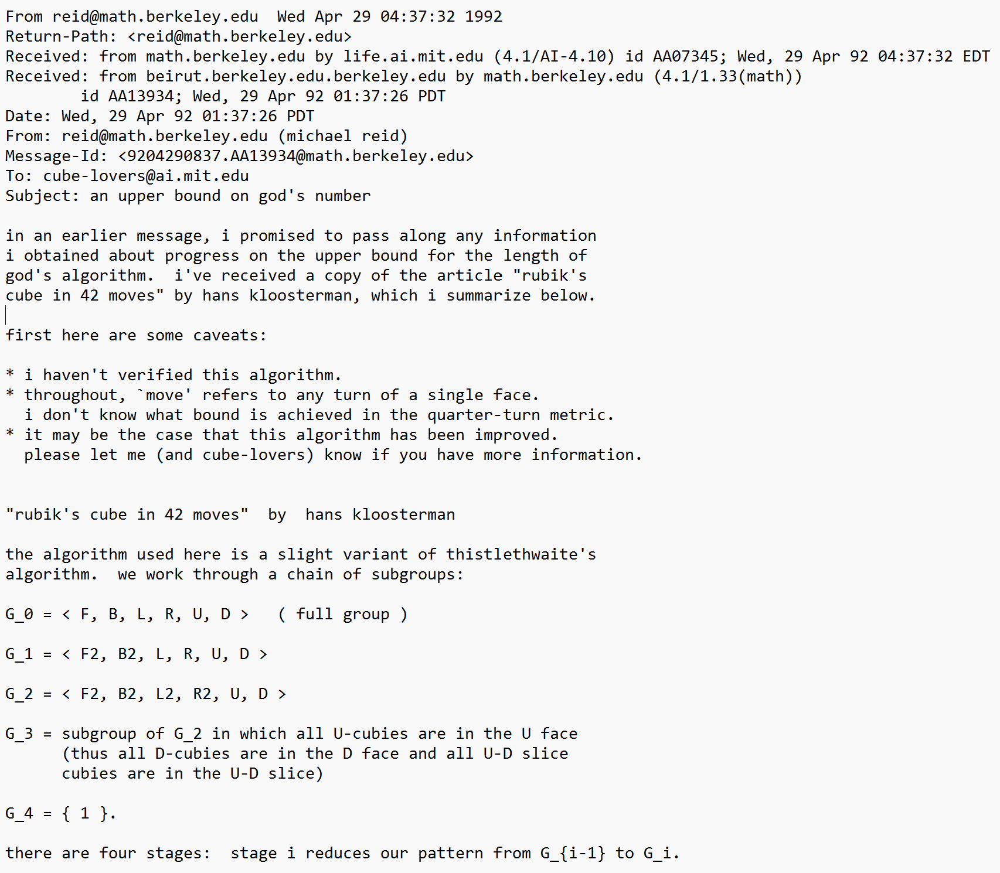

## Herbert Kociemba (1992)

In 1992, another improvement upon Thistlethwaite's algorithm was published in Cubism For Fun [^kociemba-1992] [^winter-1992-1]. Herbert Kociemba combined steps of Thistlethwaite's algorithm to reduce it to a two stage process. It was stated that all tested positions were solved in a maximum of 21 moves. However, a complete proof wasn’t included with the publication.

1. Orient edges, move all U/D pieces to U/D, and orient all corners to U/D. (Group 1: \<U, D, L2, R2, F2, B2\>)
2. Solve using the move group from step 1.

## Mike Reid (1992, 1994)

On May 22, 1992, Mike Reid submitted an alternative algorithm to the Cube Lovers mailing list [^reid-1992-2] [^longridge-nd] [^rokicki-kociemba-davidson-dethridge-2010-1]. Using this algorithm, Reid reduced the upper bound to 39 moves.

1. Solve a 2x2x2 block at dbl. (Group 1: \<U, R, F\>). Moves: 8.
2. Orient all edges and corners and move all U/D pieces to U/D. (Group 2: \<U, R2, F2\>). Moves: 13.
3. Solve using the move group from step 2. Moves: 19.

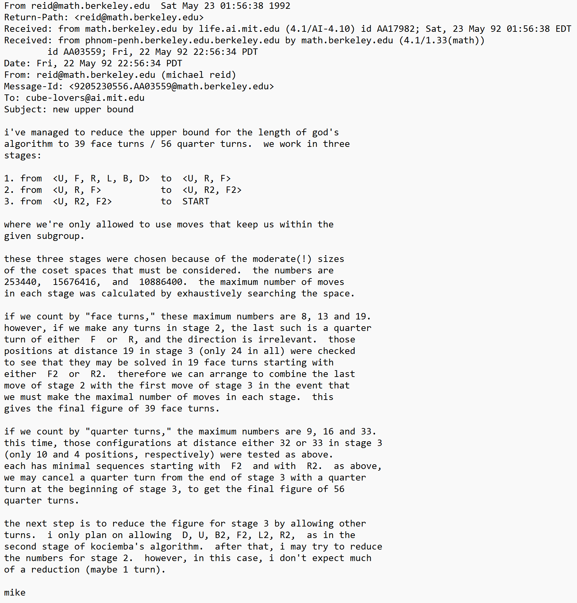

In 1995, Reid ran a calculation on the \<U, D, F2, R2, B2, L2\> group, reducing the maximum to 29 moves [^reid-1995] [^rokicki-kociemba-davidson-dethridge-2010-1].

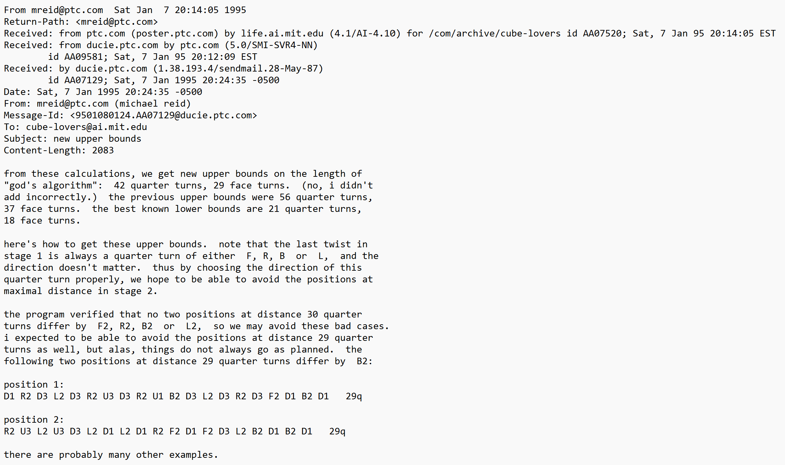

new upper bounds, Cube Lovers, January 7, 1995

## Dik Winter (1992)

On May 24, 1992, Dik Winter ran an extensive calculation of the first phase of Kociemba's algorithm. This provided a maximum distance of 12 moves. Winter combined this with the results of the final two phases of Kloosterman's algorithm, which was 25. The final result was a maximum distance of 37 [^winter-1992-2] [^rokicki-kociemba-davidson-dethridge-2010-1], which was the record at the time.

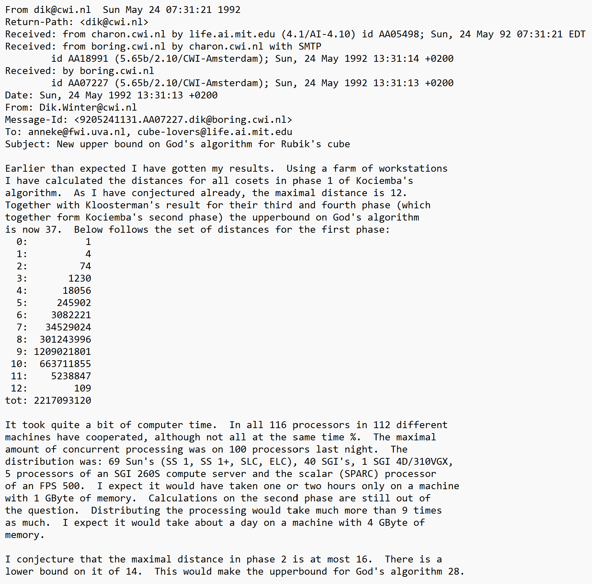

## Silviu Radu (2005, 2006)

In December, 2005, using the same method as Mike Reid, Silviu Radu reduced the maximum to 28 moves [^radu-2005-1] [^rokicki-kociemba-davidson-dethridge-2010-1]. This was accomplished by implementing methods to avoid the cube positions that had previously been calculated to require 29 moves.

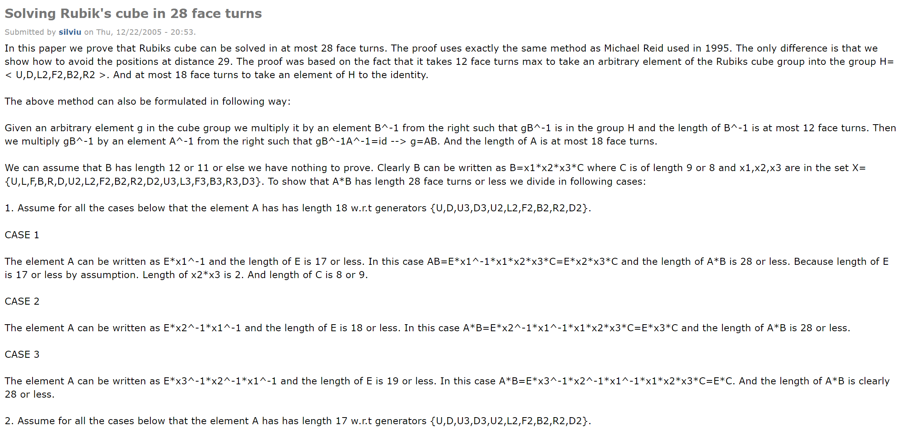

In 2005, Radu further decreased the number to 27 moves [^radu-2005-2] [^radu-2006] [^rokicki-kociemba-davidson-dethridge-2010-1].

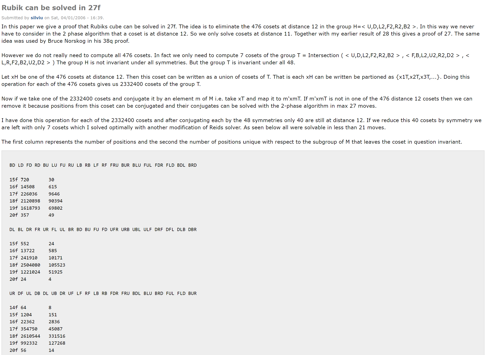

## Daniel Kunkle and Gene Cooperman (2007)

The upper bound was further lowered to 26 in 2007, thanks to the work of Daniel Kunkle and Gene Cooperman [^kunkle-cooperman-2007-1] [^kunkle-cooperman-2007-2] [^rokicki-kociemba-davidson-dethridge-2010-1].

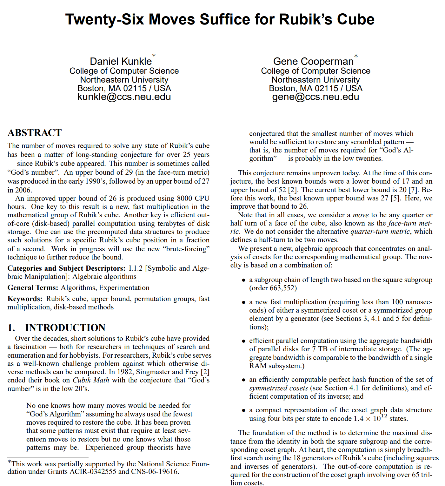

## Tomas Rokicki, Herbert Kociemba, Morley Davidson, John Dethridge (2007)

In 2006, a team consisting of Tomas Rokicki, Herbert Kociemba, Morley Davidson, John Dethridge set out to further reduce the number [^rokicki-2006].

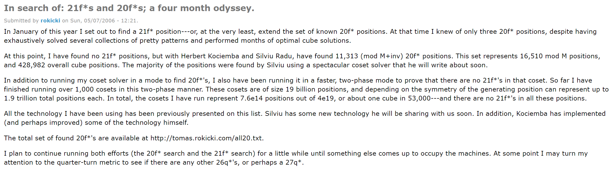

Over a five month period in 2008, the team gradually reduced the maximum from 25 [^rokicki-2008-1], to 23 [^rokicki-2008-2], and then to 22 [^rokicki-kociemba-davidson-dethridge-2010-2].

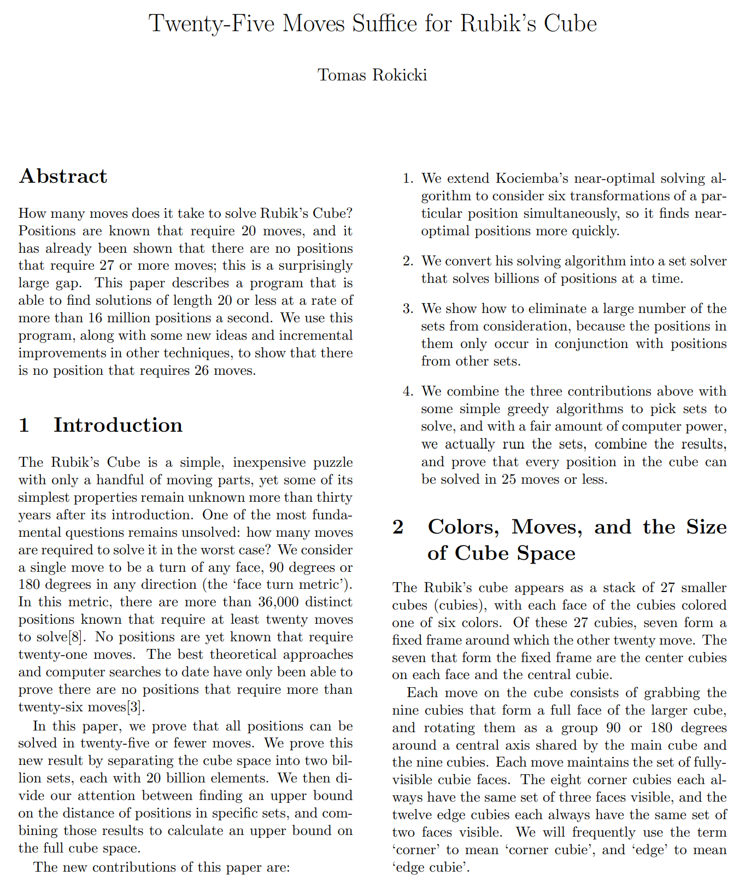
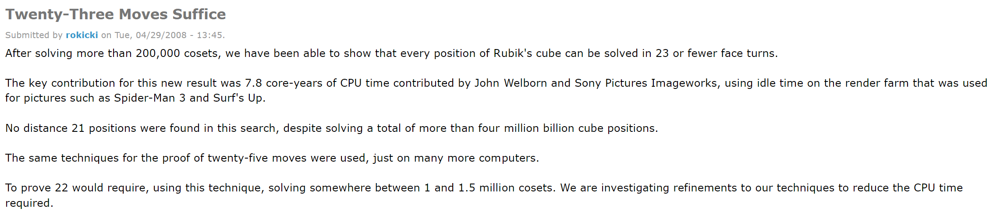
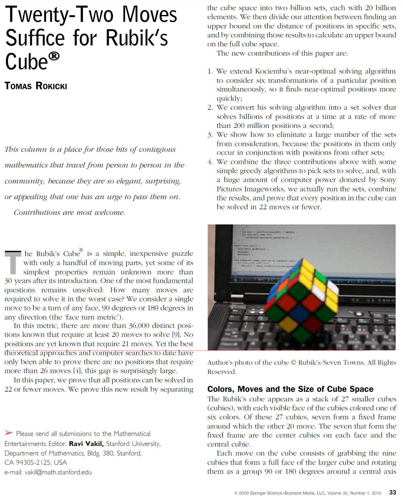

Finally, in July, 2010, the team proved that the maximum is 20 moves [^rokicki-kociemba-davidson-dethridge-2014] [^rokicki-2013] [^rokicki-kociemba-davidson-dethridge-2010-1].

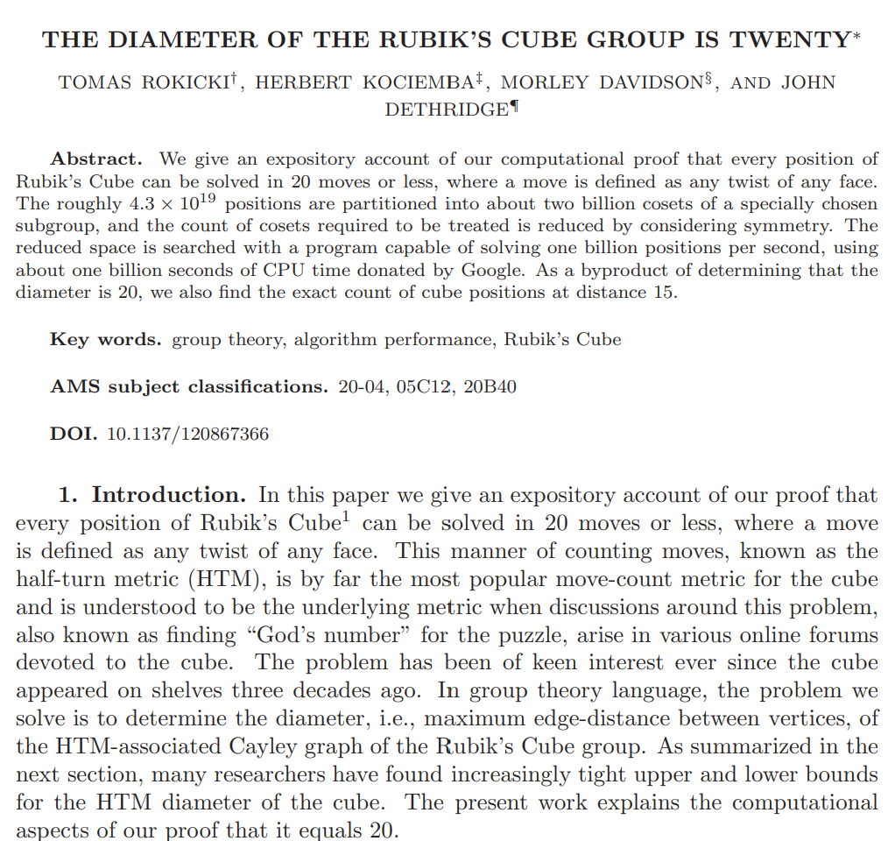

[^pochmann-2008-1]: S. Pochmann, "Analyzing Human Solving Methods for Rubik’s Cube and similar Puzzles," 2008, pp. 14-15. [Online]. Available: https://www.stefan-pochmann.info/hume/hume_diploma_thesis.pdf
[^scherphuis-nd]: J. Scherphuis, "Computer Puzzling," [Online]. Available: https://www.jaapsch.net/puzzles/compcube.htm#thisal
[^bawden-1987]: A Bawden, "Shamir's talk really was about how to solve the cube!," Cube Lovers, 27 May 1987. [Online]. Available: https://www.cube20.org/cubelovers/CL06/024.txt
[^shamir-fiat-moses-shimshoni-tardos-1989]: Adi Shamir, Amos Fiat, Shahar Moses, Ilan Shimshoni, Gábor Tardos, "Planning and learning in permutation groups", January 1989, pp. 274-276. [Online]. Available: https://www.researchgate.net/publication/3501931_Planning_and_learning_in_permutation_groups
[^singmaster-1981]: D. Singmaster, in Notes on Rubik’s 'Magic Cube', Hillside, NJ, Enslow Publishers, 1981, p. 34.
[^smith-nd]: R. Smith, "Can a Rubik's Cube be brute-forced?", [Online]. Available: https://www.stylewarning.com/posts/brute-force-rubiks-cube/#the-4-list-algorithm-and-solving-the-rubiks-cube
[^singmaster-1981-1]: D. Singmaster, in Notes on Rubik’s 'Magic Cube', Hillside, NJ, Enslow Publishers, 1981, p. 32.
[^singmaster-1981-2]: D. Singmaster, in Notes on Rubik’s 'Magic Cube', Hillside, NJ, Enslow Publishers, 1981, pp. 36, 39.
[^longridge-nd]: M. Longridge, "Progress in Solving Algorithms," CubeMan, [Online]. Available: http://cubeman.org/dotcs.txt.
[^rokicki-kociemba-davidson-dethridge-2010-1]: T. Rokicki, H. Kociemba, M. Davidson and J. Dethridge, "God's Number is 20," cube20.org, 2010. [Online]. Available: https://www.cube20.org/.
[^kloosterman-1990]: H. Kloosterman, "Rubik’s cube in 42 moves," in Cubism For Fun #25, 1990, pp. 19-22.
[^reid-1992-1]: M. Reid, "an upper bound on god's number," Cube Lovers, 29 April 1992. [Online]. Available: http://cubeman.org/cube-archives/cube-lovers/.
[^kociemba-1992]: H. Kociemba, "Close to God's algorithm," in Cubism For Fun, 1992, pp. 10-13.
[^winter-1992-1]: D. Winter, "Are we approaching God's algorithm?," Cubism For Fun, 4 May 1992. [Online]. Available: http://cubeman.org/cube-archives/cube-lovers/.
[^reid-1992-2]: M. Reid, "new upper bound," Cube Lovers, 22 May 1992. [Online]. Available: http://cubeman.org/cube-archives/cube-lovers/.
[^reid-1995]: M. Reid, "new upper bounds," Cube Lovers, 7 January 1995. [Online]. Available: http://cubeman.org/cube-archives/cube-lovers/.
[^winter-1992-2]: D. Winter, "New upper bound on God's algorithm for Rubik's cube," Cube Lovers, 24 May 1992. [Online]. Available: http://cubeman.org/cube-archives/cube-lovers/.
[^radu-2005-1]: S. Radu, "Solving Rubik's cube in 28 face turns," CubeMan, 22 December 2005. [Online]. Available: http://cubezzz.dyndns.org/drupal/?q=node/view/37.
[^radu-2005-2]: S. Radu, "New Upper Bounds on Rubik’s cube," Research Institute for Symbolic Computation (RISC-Linz), 2005. [Online].
[^radu-2006]: S. Radu, "Rubik can be solved in 27f," CubeMan, 1 April 2006. [Online]. Available: http://forum.cubeman.org/?q=node/view/53.
[^kunkle-cooperman-2007-1]: D. Kunkle and G. Cooperman, "Twenty-six moves suffice for Rubik’s cube," Proceedings of the International Symposium on Symbolic and Algebraic Computation (ISSAC ’07), 2007. [Online]. Available: https://kociemba.org/math/papers/rubik26.pdf.
[^kunkle-cooperman-2007-2]: D. Kunkle and G. Cooperman, "Harnessing parallel disks to solve Rubik’s cube," Journal of Symbolic Computation, 2007. [Online]. Available: https://www.sciencedirect.com/science/article/pii/S0747717108001272.
[^rokicki-2006]: T. Rokicki, "In search of: 21f*s and 20f*s; a four month odyssey.," cubeman.org, 7 May 2006. [Online]. Available: http://cubezzz.dyndns.org/drupal/?q=node/view/56.
[^rokicki-2008-1]: T. Rokicki, "Twenty-five moves suffice for Rubik’s Cube," arXiv.org, 2008. [Online]. Available: arxiv.org/abs/0803.3435.
[^rokicki-2008-2]: T. Rokicki, "Twenty-Three Moves Suffice," cubeman.org, 29 April 2008. [Online]. Available: http://cubezzz.dyndns.org/drupal/?q=node/view/117.
[^rokicki-kociemba-davidson-dethridge-2010-2]: T. Rokicki, "Twenty-Two Moves Suffice for Rubik’s Cube," Mathematical Intelligencer, vol. 32, pp. 33-40, 2010, https://link.springer.com/article/10.1007/s00283-009-9105-3.
[^rokicki-kociemba-davidson-dethridge-2014]: T. Rokicki, H. Kociemba, M. Davidson and J. Dethridge, "The Diameter of the Rubik's Cube Group Is Twenty," Society for Industrial and Applied Mathematics, vol. 27, no. 2, pp. 1082-1105, 2014.
[^rokicki-2013]: T. Rokicki, "THE DIAMETER OF THE RUBIK’S CUBE GROUP IS TWENTY," rokicki.com, 2013. [Online]. Available: https://tomas.rokicki.com/rubik20.pdf.
