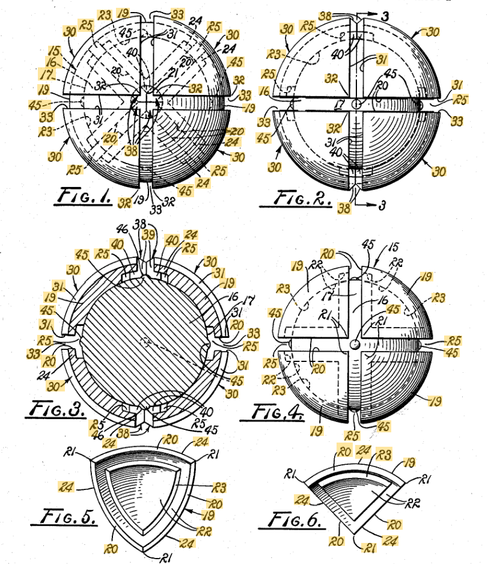
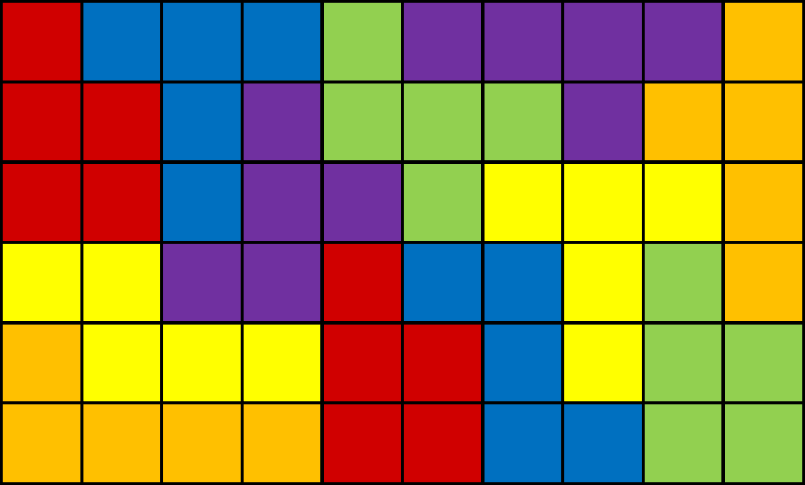
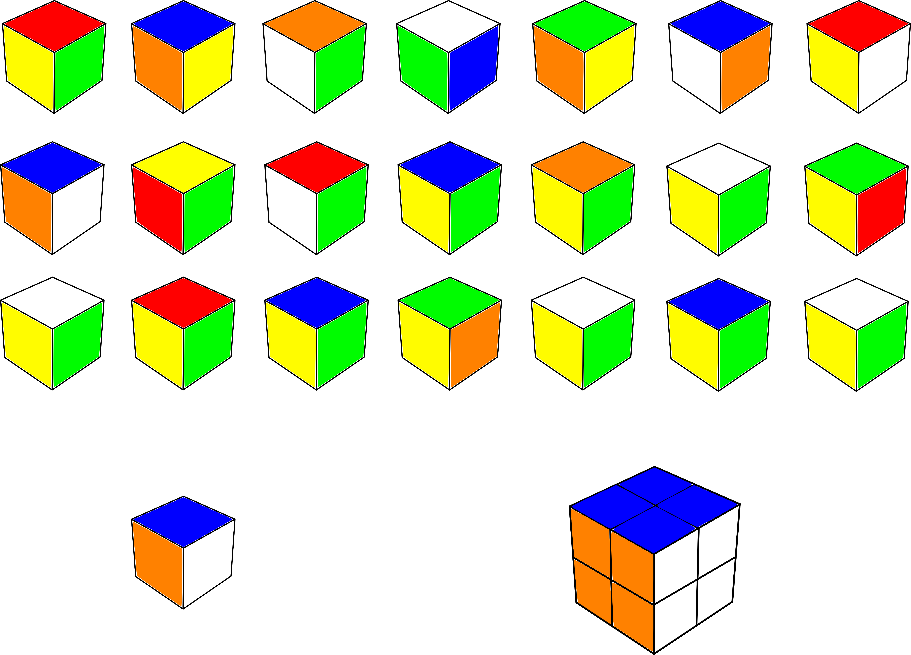
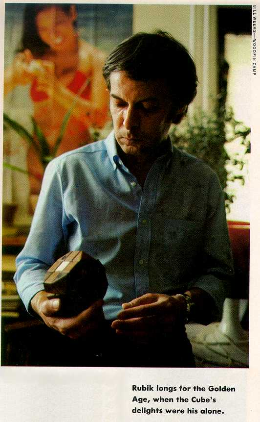

import AnimCube from "@site/src/components/AnimCube";
import ReactPlayer from 'react-player'
import ImageCollage from '@site/src/components/ImageCollage';
import YouTube from "@site/src/components/YouTube";

# Rubik's Cube History

Rubik’s Cube has made an incredible impact upon the world, spawning not only a new craze, but an entirely new category of puzzles called Twisty Puzzles. Before the 3x3x3 puzzle was patented by Ernő Rubik, there were other shape or sliding based puzzles that maintained a high level of popularity. Rubik himself states that many of these are related or were direct influences upon his design. There were also designs patented or demonstrated that resembled Rubik's Cube before the patent by Rubik.

## Pre Rubik’s Cube

### 15 Puzzle

The 15 puzzle is often regarded as the predecessor to Rubik's Cube. Rubik's Cube allows for movement of its individual pieces because of a layer's freedom to rotate around the surface of the two layers below it. The 15 puzzle is instead two dimensional and the pieces move around within the single plane.

The origin of the 15 puzzle is unknown. Much research has been performed by Jerry Slocum and Dic Sonneveld. Together in 2006 they published _The 15 Puzzle Book: How it Drove the World Crazy_. This book covers the introduction and spread of the puzzle across the United States and eventually to the rest of the world [^1].

A few standout potential sources were uncovered by Slocum and Sonneveld. One of the possible sources comes in late 1879 to early 1880. Matthias J. Rice, a man with woodworking skills, and who became ill and bedridden, commissioned a window worker to look for some kind of small wooden item that Rice could easily reproduce and sell. The window worker returned with an item that had been constructed and sold by deaf students. This item was of the form of the 15 puzzle.

Another account is that a puzzle designer from the late 1800s, Sam Loyd, is the creator. Loyd states in his book _Sam Loyd's Cyclopedia of 5000 Puzzles, Tricks, and Conundrums With Answers_ that he designed the puzzle and caused the world to become infatuated [^2].

> The older inhabitants of Puzzleland will remember how in the early seventies I drove the entire world crazy over a little box of movable blocks which became known as the "14-15 Puzzle."

However, Slocum and Sonneveld noted many other claims to the invention of the puzzle. Reports were published in various newspapers and other publications. The last of these provided in the book comes from Lee Yee Dian in a 1996 edition of Cubism For Fun. It is stated that a sliding block puzzle "in which the object was arranging nine digits by sliding them around" and that it originates in the Sung Dynasty in the 10th to 12th centuries. The puzzle goes by the name Chong Pai Jiu Gong (重排九宫). With the magic square, and the puzzle of arranging the numbers within the square, thought to have originated in China, this does open up a new possibility.

### Gustafson's Manipulable Toy

The earliest known patent for a three-dimensional twisty puzzle comes from William Gustafson. In February, 1960, Gustafson filed a patent for a "manipulable toy" [^3]. It is a puzzle that resembles a spherical form of what is now commonly called the 2x2x2. Not only is this clear from the patent images, but also from the patent description:

> Accordingly, it is an object of the present invention to provide a manipulatable toy having a plurality of varicolored parts movable relative to each other to form various patterns.
>
> Other objects are to provide a puzzle or toy which is economical to manufacture, challenging to use, and which is adapted for use by persons of all ages.

### Nichols' Pattern Forming Puzzle

In March, 1970, Larry Nichols applied for a patent for a "pattern forming puzzle and method with pieces rotatable in groups" [^4]. This is another version of a 2x2x2 puzzle. The primary differences in comparison to Gustafson's patent are that Nichols' design is cubic in shape and the parts are held together using magnetic force. Nichols' patent also included ideas for additional sizes, spherical 2x2x2 variants, and mechanical piece attachment instead of magnetic.

> For example, referring to FIG. 3 additional sets of cubes are added to the basic embodiment to provide additional planes within which various sets of pieces may rotate or twist with respect to other sets. In any of these three-dimensional embodiments it is also possible to achieve engagement by mechanical rather than magnetic means, as for example by using a pop-in snap linkage, or a tongue-in-groove arrangement allowing rotation without disengagement.

### Fox's Amusement Device

In April, 1970, Frank Fox applied for a patent for an "amusement device" [^5]. The device is a spherical shape segmented into a 3x3x3 group of pieces. The initially described function is for use as a more complex, three-dimensional version of noughts and crosses (or tic tac toe).

Later in the patent description, Fox details that one possible production of the puzzle is to have individual pieces connected together using interlocking tongues and grooves, similar to the later patented Rubik's Cube. Fox's patent also describes a configuration where the individual pieces may be given different colors. Manipulation, or turning, will then result in a large variety of patterns. This makes Fox's patent the first known introduction and patent of the 3x3x3 puzzle.

> In a more complex form the sphere may be formed of twenty-six interlocking parts each constituting on its outer surface one of the play positions of the complete sphere. In such a form the sphere is hollow and has a wall thickness sufficient to accommodate interengaging formations on confronting inwardly extending faces of the various parts. All of the parts except those forming the eight "corner" positions common to three different fields have four such inwardly extending faces, the eight exceptions having only three such faces. The interengaging formations serve to lock the parts together and in a preferred embodiment of this variant of the device the formations are keys and keyways formed by tongues and grooves of "keyhole" configuration.
>
> Thus with the assembled sphere positions with one such pare of dividing planes horizontal the top and bottom sections of the sphere may be rotated relative to the horizontal centre section, the left and right sections may be rotated relative to the vertical center section and the back and front sections may be rotated relative to the vertical centre section between them.
>
> With this variant the possible number of different "moves" is considerably increased...For example with the twenty-six individual pieces in different colours the device can be manipulated to make up a wide variety of coloured patterns

### Pyraminx

In 1970, Uwe Meffert designed the Pyraminx puzzle [^6]. In the early 1970s, Meffert was studying the effects that various shapes have on the energy field of the human body. He had been trying to prove that the pyramid shape had no difference in energy properties when compared to the other shapes. It was during this line of work that the idea for the Pyraminx occurred to Meffert.

However, it wasn't until 1981 when Meffert applied for a patent [^7]. Meffert credits Rubik's Cube for providing him the motivation to patent his own puzzle [^6].

## Leading Up to Rubik's Cube

In _Rubik's Cubic Compendium (Recreations in Mathematics)_, Rubik describes the origin of the idea of the puzzle [^8]. In the late 60s to early 70s, Rubik studied Interior Architecture and Design at the Hungarian Academy of Applied Arts. One of the involved subjects was geometry and Rubik found it to be a fascinating subject. Another important subject that Rubik studied was one of forms and materials.

After graduation, Rubik became a lecturer and was asked to teach the subject. In this class, students were given exercises that involved the manipulation of paper and other materials to form shapes and solve problems. Rubik states that "colour had an important part to play in these exercises" and that "Colour must not contradict the form but interpret and enhance it." Rubik also taught a "preparatory course in descriptive geometry" and believes that this also played a part in the idea of Rubik's Cube because within the subject of descriptive geometry "One must know the possibilities and limitations of the construction and assembly of spatial objects."

Rubik also notes several earlier puzzles that may have had an influence. The first of these is the tangram. A tangram consists of several sharply angled shapes, such as triangles, rectangles, or trapezoids, that are positioned and connected to form a larger shape. A similar puzzle is the pentomino. In this puzzle, the piece arrangement and connection goals are the same but the individual pieces are formed of several connected squares. Taking the pentomino into the third dimension, there is also the Soma cube. Instead of the pentomino shapes always forming a two-dimensional line and arranged on a flat surface, the pieces of the Soma cube are connected in three dimensions to build a cube shape.

**Tangram**

**Pentominos**

Rubik points out another cube shaped puzzle called MacMahon's Cubes. In this puzzle, there are 30 different cubes, each with various color combinations on the six sides. The object of the game is to start by picking a single cube. Then, using that cube as a reference, pick out eight other cubes and try to stack them to form a 2x2x2 (or 3x3x3) with the same outer, and matching inner, colors as the reference cube.

A final puzzle mentioned by Rubik is the 15 puzzle. Known worldwide, the 15 puzzle can be compared to a two-dimensional version of Rubik's Cube. Pieces are rotated and positioned along a two-dimensional plane. In order to distinguish each piece, like the colors of Rubik's Cube, numbers from 1-15 are applied.

## Prototypes

Rubik continues by describing the formation of the idea of Rubik's Cube. Rubik had been experimenting with the construction of three-dimensional geometric shapes. Rubik thought it was interesting that, after assembling eight cubes to form a 2x2x2 cube, each side of this new cube could be turned along three different axes.

Rubik then set out to find a way to construct the 2x2x2 cube in a way that both allowed for the pieces to stay together by themselves and allowed for the observed turning possibilities. Rubik drilled holes diagonally through each of the eight cubes then threaded strips of rubber from one diagonal cube to the other. Rubik was also interested in knowing the effects upon individual cubes as the layers of the 2x2x2 were turned. So, he applied colored pieces of paper to each of the individual cubes.

<ImageCollage
images={[
{ src: require("@site/docs/3x3/img/History/2x2Prototype.png").default},
{ src: require("@site/docs/3x3/img/History/2x2Prototype2.jpg").default}
]}
/>

Images from [Liberty Science Center](https://lsc.org/news-and-social/news/beyond-rubiks-cube-day-30-prototype-rubiks-cube) and [Polityka](https://www.polityka.pl/tygodnikpolityka/nauka/1791468,1,kariera-kostki-rubika.read)

After applying several turns to the 2x2x2, Rubik was surprised to discover just how difficult it was to return the pieces to the original state. In trying to find a solution, the rubber strips holding the pieces together tangled and broke, collapsing the 2x2x2. Rubik then set about finding a better way to hold the pieces together.

The use of magnets, possibly similar to Nichols' 1970 patent application, was considered by Rubik. However, because the strength of the magnetic force greatly decreased at the peak of a turn, the pieces would fall apart. Rubik felt that it was important that the pieces remain together not only for ease of use, but also to avoid any additional rules. Rubik wanted to avoid needing to specify that turning the layers of the puzzle is ok, but pulling the pieces apart isn't.

Rubik decided to focus on the inner edges of each of the eight cubes. He realized that because each turn moves in a circular direction, "tracks" could be implemented on the inner side of each layer. The inner edges of the corner pieces could be modified to move along the tracks. This eventually led to the dovetail connections in the final cube. For the 3x3x3 version, Rubik's Cube, Rubik added a core and fitted spring-loaded screws into the six center pieces to keep all pieces at an even tension and avoid difficult turning or loose, rattling movement.

<ImageCollage
images={[
{ src: require("@site/docs/3x3/img/History/3x3Prototype.png").default},
{ src: require("@site/docs/3x3/img/History/3x3PrototypeCore.jpg").default},
{ src: require("@site/docs/3x3/img/History/3x3Prototype2.png").default},
{ src: require("@site/docs/3x3/img/History/3x3Prototype3.png").default}
]}
/>

Images from [Liberty Science Center](https://lsc.org/news-and-social/news/beyond-rubiks-cube-day-24-production-prototype-cube) and [San Antonio Express-News](https://www.expressnews.com/entertainment/arts-culture/article/Beyond-Rubik-s-Cube-exhibit-brightens-up-the-6879799.php)

Image from [Ton Dennenbroek](https://www.speedcubing.com/ton/rubik's.htm)

## Introduction of Rubik's Cube

In the Spring of 1974, Rubik realized that the cube is an object that could be produced and marketed. Before this, Rubik had been using it only as a geometric and spatial demonstration tool. On January 30, 1975, Rubik applied for a patent [^9]. In 1977, Rubik partnered with Politechnika Cooperative to get the cube to market under the name "Magic Cube" [^8].

<ImageCollage
images={[
{ src: require("@site/docs/3x3/img/History/Rubik1.png").default},
{ src: require("@site/docs/3x3/img/History/Rubik2.png").default}
]}
/>

However, Rubik only applied for the patent in Hungary and not an international patent. Once Rubik's Cube started reaching the rest of the world, litigations occurred. Moleculon Research Corporation obtained ownership of Nichols' 2x2x2 puzzle patent and sued Ideal Toy Corporation in a $60 million dollar patent infringement case [^10]. Moleculon's president stated that Moleculon had approached Ideal Toy Corporation in 1969 to start a potential deal to create and market the puzzle described in Nichols' patent. The final decision of the courts was that the Rubik's Pocket Cube, the 2x2x2 cube, infringed upon Nichols' patent. The Rubik's Cube, 3x3x3 cube, was deemed as not infringing upon Nichols' patent [^11].

Throughout the years after the production of Rubik's Cube, some came forward to claim that the puzzle design had existed before Rubik’s' patent and development, and even before the prior similar patents. Most notably, in _Rubik's Cubic Compendium_ and also issues 5 and 6 of Cubic Circular, David Singmaster recounts that in the French book on Rubik's Cube, _Le Cube Hongrois_, authors André Deledicq and Jean-Baptiste Touchard reported a story by Inspector General Semah [^8] [^12]. Semah stated that in 1920 he had played with a similar wooden cube in Istanbul. Then again in 1935 in Marseilles, Semah encountered another similar cube with five white faces and one green face.

Another interesting note is a series of patents filed by Terutoshi Ishige (石毛照敏). In November, 1975, Ishige filed a patent for a 2x2x2 puzzle with a ball shaped core and interconnected pieces [^13]. In October, 1976, Ishige filed a patent for a 3x3x3 version [^14]. In 1977, Ishige filed patents for modified versions of each puzzle that look closer to the Rubik’s Cube internal design [^15] [^16].

<ImageCollage
images={[
{ src: require("@site/docs/3x3/img/History/Ishige2-1.png").default},
{ src: require("@site/docs/3x3/img/History/Ishige2-2.png").default},
{ src: require("@site/docs/3x3/img/History/Ishige3-1.png").default},
{ src: require("@site/docs/3x3/img/History/Ishige3-2.png").default}
]}
/>

## Western Distribution and Popularity Rise

Stewart Sims, marketing manager of the toy division at Ideal Toy Company, described the history of how Rubik's Cube became a worldwide phenomenon in an interview with Allan Miller [^17]. Upon its initial release, Rubik's Cube already maintained a level of popularity in Hungary thanks to distribution being handled by Polytechnika. However, there was a desire to sell the puzzle in other countries. Sims states that this interest was expressed to Konsumex, the Hungarian government trading company that was focused on consumer products. The second person in charge of Konsumex contacted a high school friend named Tibor Laczi to request help in finding a distributor for the West. Laczi took the cube to a booth at the largest gaming company in Germany. There he met a man named Tom Kremer, who became interested in helping find a distributor. After various discussions and meetings, Kremer found a distributor in Ideal Toy Company. When Ideal was approached, Sims took an interest in the cube, becoming the primary facilitator for the deal. As part of Ideal's obtaining of the Western distribution rights, Ideal was to devise a new name for the cube. It is revealed in the interview that Sims, while on a morning run, thought to simply name it "Rubik's Cube".

The above is just a brief summary of events. Watch the entire interview below to hear the full story. It should be noted that a different version of the story was told in the March 1986 issue of Discover magazine [^18]. In direct quotes to Discover magazine from Rubik and others, it was stated that Tibor Laczi first encountered the cube at a café. After playing with a cube owned by a waiter, Laczi was so intrigued that he directly approached Konsumex and asked for permission to distribute the cube in the West. This request was denied and so he obtained permission to visit Rubik, learned from Rubik interesting ways to demonstrate the cube, and proceeded to demonstrate it at the Nuremberg toy fair, where he met Kremer. The magazine article also states that the name "Rubik's Cube" was created as a way to compensate for Rubik having not patented the product in other countries before the typical one-year limit was reached.

<YouTube embedId="mHwT5GDKMe0" />

## Sources and Credit

A few sources have been of great help in putting together some of the major historical points and finding the starting points for additional research.

http://cubeman.org/cchrono.txt

https://www.calormen.com/twistypuzzles/twisty.htm#Patents

https://jipel.law.nyu.edu/the-legal-puzzle-of-the-rubiks-cube/

[^1]: J. Slocum and D. Sonneveld, The 15 Puzzle Book: How it Drove the World Crazy, Beverly Hills, CA: The Slocum Puzzle Foundation, 2006.

[^2]: S. Loyd, Sam Loyd's Cyclopedia of 5000 Puzzles, Tricks, and Conundrums With Answers, New York: The Lamb Publishing Company, 1914.

[^3]: W. Gustafson, "Manipulatable toy," 2 February 1960. [Online]. Available: https://patents.google.com/patent/US3081089A/en?oq=3%2c081%2c089.

[^4]: L. Nichols, "Pattern forming puzzle and method with pieces rotatable in groups," 4 March 1970. [Online]. Available: https://patents.google.com/patent/US3655201.

[^5]: F. Fox, "AMUSEMENT DEVICE," 9 April 1970. [Online]. Available: https://www.jaapsch.net/puzzles/patents/gb1344259.pdf.

[^6]: J. O'Connor and U. Meffert, "Uwe Meffert’s Amazing Mind at Rubik's Cube Worlds 2013," YouTube, 19 December 2013. [Online]. Available: https://www.youtube.com/watch?v=X8CRld9CCnQ.

[^7]: U. Meffert, "Puzzle toy," 6 October 1981. [Online]. Available: https://patentimages.storage.googleapis.com/45/5a/0d/07c7c8b964a460/EP0042695A3.pdf.

[^8]: E. Rubik, T. Varga, G. Keri, G. Marx and T. Vekerdy, Rubik's Cubic Compendium (Recreations in Mathematics), New York: Oxford University Press, 1987.

[^9]: E. Rubik, "térbeli logikai játék," 30 January 1975. [Online]. Available: https://www.sztnh.gov.hu/sites/default/files/anim/pics/HU-170062.pdf.

[^10]: C. George, "Cambridge firm seeks $60m in Rubik's Cube suit," The Boston Globe, 27 May 1982.

[^11]: C. Chen, "The Legal Puzzle of the Rubik’s Cube," NYU Journal of Intellectual Property & Entertainment Law, 2 October 2015. [Online]. Available: https://jipel.law.nyu.edu/the-legal-puzzle-of-the-rubiks-cube/.

[^12]: D. Singmaster, "PREHISTORY OF THE CUBE," Cubic Circular, 1982. [Online]. Available: https://www.jaapsch.net/puzzles/cubic5.htm.

[^13]: T. Ishige, "サイコロガタカイテンシキクミアワセガング," 25 November 1975. [Online]. Available: https://www.j-platpat.inpit.go.jp/c1801/PU/JP-S52-066038/11/ja.

[^14]: T. Ishige, "サイコロ型回転式組合せ玩具," 12 October 1976. [Online]. Available: https://www.j-platpat.inpit.go.jp/c1801/PU/JP-S53-046833/11/ja.

[^15]: T. Ishige, "回転式組合わせ玩具," 12 March 1977. [Online]. Available: https://www.j-platpat.inpit.go.jp/c1801/PU/JP-S53-113642/11/ja.

[^16]: T. Ishige, "回転式立体組合わせ玩具," 29 March 1977. [Online]. Available: https://www.j-platpat.inpit.go.jp/c1801/PU/JP-S53-120946/11/ja.

[^17]: S. S. Allan Miller, "Stewart Sims and the Rubik's Cube," YouTube.com, 5 August 2025. [Online]. Available: https://www.youtube.com/watch?v=mHwT5GDKMe0.

[^18]: J. Tierney, "The Perplexing Life of Erno Rubik," Discover, p. 81, March 1986.