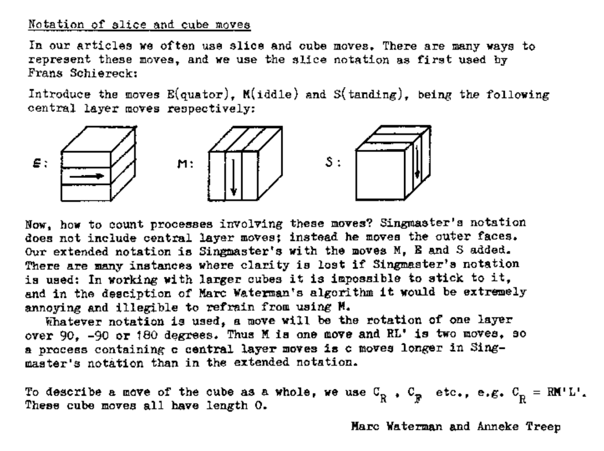

# Notation

## Outer Turns

The community standard outer turn notation was created by David Singmaster in 1979. In *Notes on Rubik's 'Magic Cube'*, Singmaster uses U, D, L, R, F, and B for outer turns.1 In an interview on TwistyPuzzles.com, Singmaster stated that he created the notation by combining his own ideas with the notation that was being used by John Conway, David Benson, and David Seal.[2][2] Conway, Benson, and Seal used U, B, L, R, O, Y, which corresponds with U, D, L, R, F, B. As mentioned by Singmaster in the interview, Conway had also been using a separate color based notation prior to this one.

**Singmaster Interview:**

**Conway, Benson, and Seal Notation**:

The outer turn notation also notated quarter turns and double turns. Initially, "-1" was used to denote a quarter turn. Based on feedback received from some readers, it was changed to an apostrophe.1 Double turns used a "2" as is still used.

## Slice Turns

M, E, and S slice notation was created by Frans Schiereck.[3][3] The notation appeared in 1981 in *De Hongaarse Kubus Voor Doordraaiers*.4

## Rotations

In 2001, Peter Jansen created a webpage containing algorithms for the CFOP method.[5][5] [6][6] On the page, Jansen stated "I adjusted many algorithms and added cube rotations to the standard notation". The notation of x, y, and z are the same as what is used today.

## Wide Turns

The earliest known publication of lowercase letters for wide turns is from Dave Orser in October 2002.[7][7]

The use of appending a "w" to the end of an outer layer turn for wide turns originated in the Japanese community. This is according to Shotaro Makisumi who stated that it had been in use in the early 2000s.8 [9][9]

### Groups

In December, 2010, Michael James Straughan proposed combining outer, inner, and wide turn notation to describe groups of pieces or stickers.[10][10] In March, 2021, Straughan fully developed the notation and added it to a webpage.[11][11] [12][12]

## References

1. David Singmaster, Notes on Rubik’s “Magic Cube” (Hillside, NJ: Enslow Publishers, 1981).
2. https://www.twistypuzzles.com/articles/spotlight-singmaster/
3. https://web.archive.org/web/20071029152943/http://rubikscube.info/waterman/booklet.php
4. Frans Schiereck, De Hongaarse Kubus Voor Doordraaiers! (Mondria, 1981).
5. https://web.archive.org/web/20020112153806/http://home01.wxs.nl/~janse625/PetersCubePage.html
6. https://www.speedcubing.com/peter
7. https://web.archive.org/web/20021208035826fw_/http://www.speedcubing.com/f2l_advanced.html
8. Speed Solving Rubik's Cube Yahoo group. February 1, 2007.
9. https://web.archive.org/web/20070915082213/http://www.cubefreak.net/notation.html
10. https://www.speedsolving.com/threads/random-cubing-discussion.22862/post-494718
11. https://www.speedsolving.com/threads/notation-based-reference-system-nbrs-a-standard-for-defining-methods-and-states.79862/
12. https://sites.google.com/site/athefre/nbrs?authuser=0

[2]: https://www.twistypuzzles.com/articles/spotlight-singmaster/
[3]: https://web.archive.org/web/20071029152943/http://rubikscube.info/waterman/booklet.php
[5]: https://web.archive.org/web/20020112153806/http://home01.wxs.nl/~janse625/PetersCubePage.html
[6]: https://www.speedcubing.com/peter
[7]: https://web.archive.org/web/20021208035826fw_/http://www.speedcubing.com/f2l_advanced.html
[9]: https://web.archive.org/web/20070915082213/http://www.cubefreak.net/notation.html
[10]: https://www.speedsolving.com/threads/random-cubing-discussion.22862/post-494718
[11]: https://www.speedsolving.com/threads/notation-based-reference-system-nbrs-a-standard-for-defining-methods-and-states.79862/
[12]: https://sites.google.com/site/athefre/nbrs?authuser=0