# Notation

## Outer Turns

The community standard outer turn notation was created by David Singmaster in 1979. In _Notes on Rubik's 'Magic Cube'_, Singmaster uses U, D, L, R, F, and B for outer turns [1]. In an interview on TwistyPuzzles.com [2], Singmaster stated that he created the notation by combining his own ideas with the notation that was being used by John Conway, David Benson, and David Seal. Conway, Benson, and Seal used U, B, L, R, O, Y [3], which corresponds with U, D, L, R, F, B. As mentioned by Singmaster in the interview, Conway had also been using a separate color-based notation prior to this one.

**Singmaster Interview:**
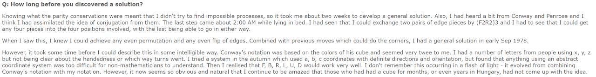
**Conway, Benson, and Seal Notation**:
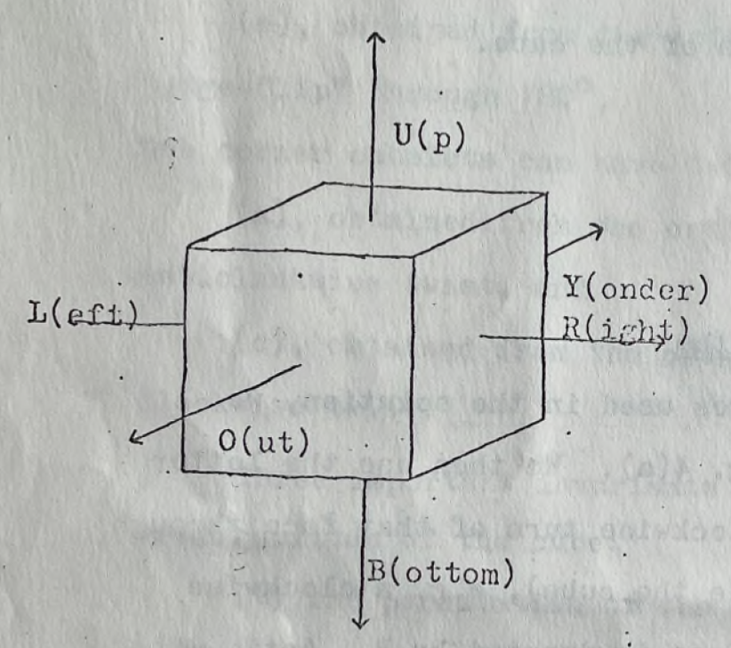
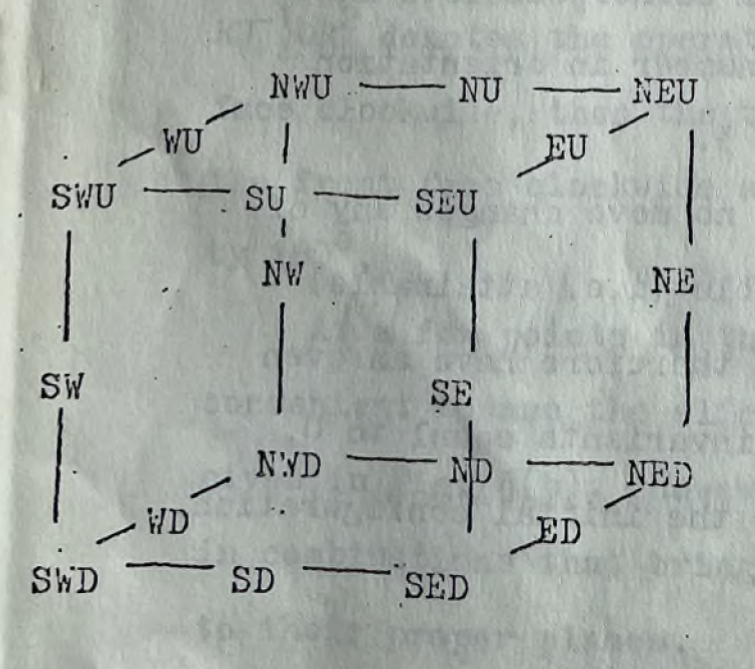

Singmaster’s outer turn notation also notated quarter turns and double turns. Initially, "-1" was used to denote a quarter turn [1]. Based on feedback received from some readers, it was changed to an apostrophe. Double turns used a "2" as is still used.

## Slice Turns

The earliest known use of M, E, and S for slice notation can be found in the book _De Hongaarse Kubus!_ published by Frans Schiereck in July 1981 [4, 5]. In the book, Schiereck introduces the letters M, E, and S, which stand for “Midden” (Middle), “Equator” (Equator), and “Staande” (Standing). Anneke Treep and Marc Waterman also attributed the three letters to Schiereck. In the original Waterman booklet, Treep and Waterman wrote that they will “use the slice notation as first used by Frans Schiereck” [6].

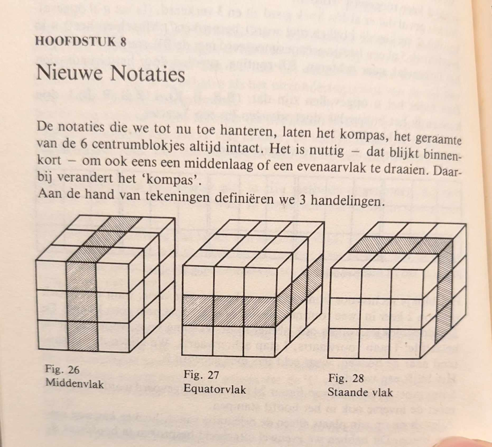
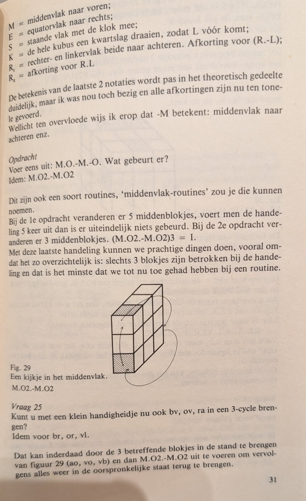
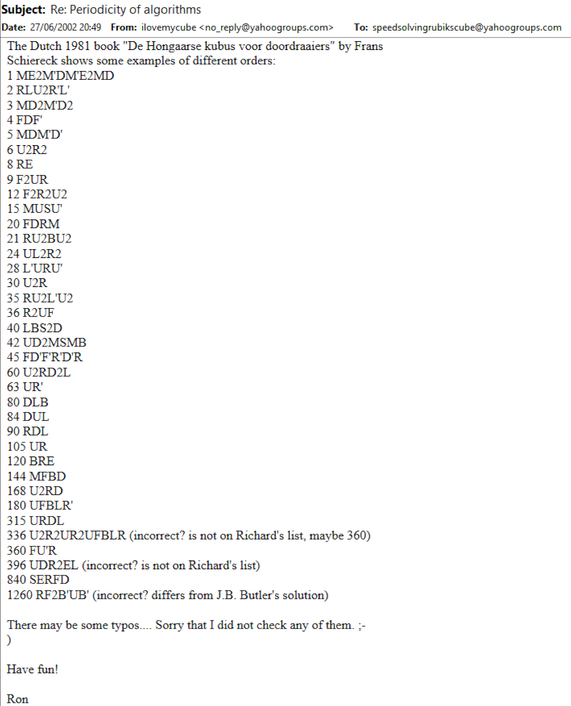

Singmaster’s _Notes on Rubik’s ‘Magic Cube’_ also introduced a notation for slice turns [7]. Singmaster’s idea was to append a lowercase “s” to an outer layer turn. For example, Rs is equal to R L’ and Rs’ is R’ L. The obvious difference with this notation is that it is outer turn based and the centers don’t move. For it to be equivalent to the use of the letter “M”, a cube rotation would need to be involved or assumed. Singmaster’s slice notation proposal is also mentioned in Schiereck’s book. This can be seen in the images above.

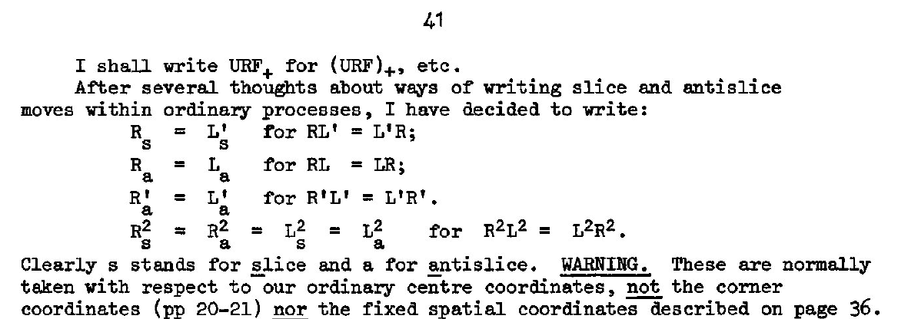

Throughout the years, many have questioned the direction that the M, E, and S notation follows. M moves the same direction as L, E with D, and S with F. It has been argued that slice turns should instead follow the U, R, and F layers. This confusion has led to theories as to the reasoning behind the decision. One common idea is that M, E, and S follow L, D, and F because the associated letters are closer in the alphabet [8, 9, 10]. M is closer to L than it is to R, E is closer to D, and S is closer to F. Another theory is that the directions were chosen based on the easiest turns to perform on the older hardware [11, 12]. A turn of the M layer is the easiest, and M is possibly easier than M’, leading to M prevailing as the default letter not having the appended apostrophe. Then a clockwise rotation of the cube along the z axis leads to E becoming M and following the same directions as M. A clockwise rotation of the cube along the y axis turns S into M, again with S following the same directions as M.

However, these theories may only be coincidences and the truth may be much simpler. It is possible that Schiereck thought of words that could represent the three inner layers of the cube, used the first letter of each word for the notation, then assigned a direction based on natural ways of thinking or what felt obvious. M rotates downward, similar to writing a book or gravity pulling objects down. E moves from left to right, similar to writing. S turns clockwise like a clock. It could be imagined that the rotations portion of one of the previous theories may have come into play. However, it becomes complicated when considering that _De Hongaarse Kubus!_ didn’t include x, y, and z for rotations and only included K. K is a counter clockwise, not clockwise, rotation along the y axis to move the L layer to the front [4].

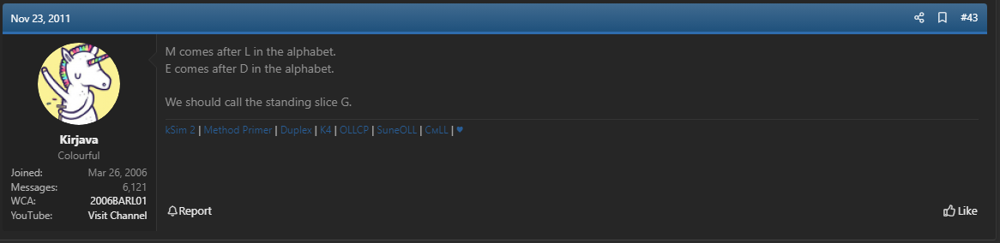
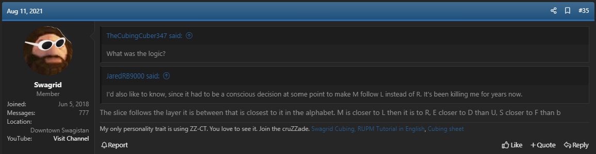
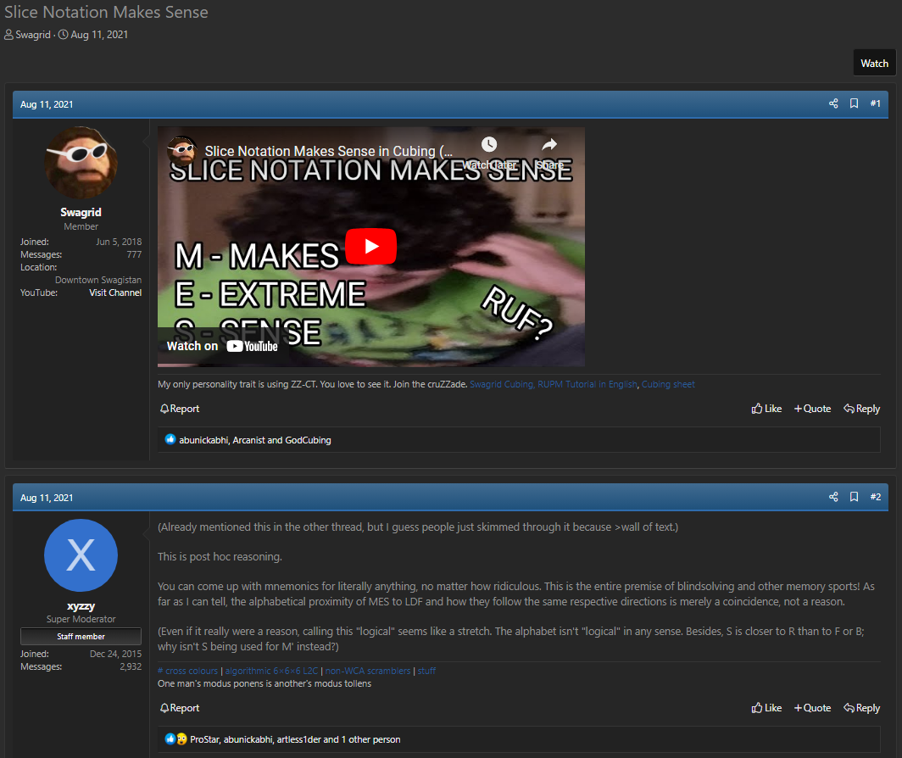
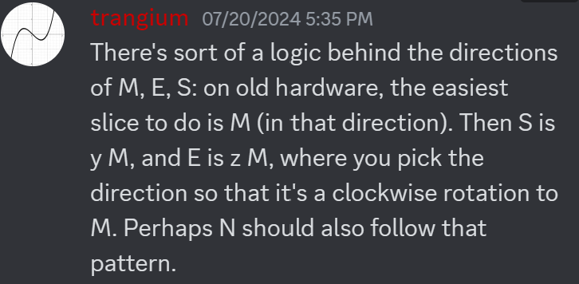
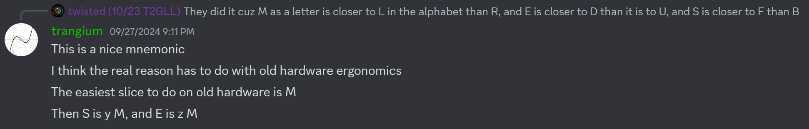

## Rotations

In 2001, Peter Jansen created a webpage containing algorithms for the CFOP method [13, 14]. On the page, Jansen stated "I adjusted many algorithms and added cube rotations to the standard notation". The notation of x, y, and z are the same as what is used today. In March or April of 2002, speedcubing.com updated its notation page to include x, y, and z notation [15, 16].

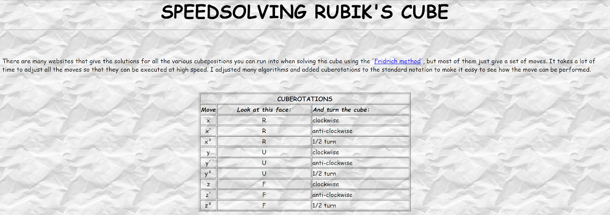

## Wide Turns

The earliest known publication of lowercase letters for wide turns is from Dave Orser in October 2002 [17].

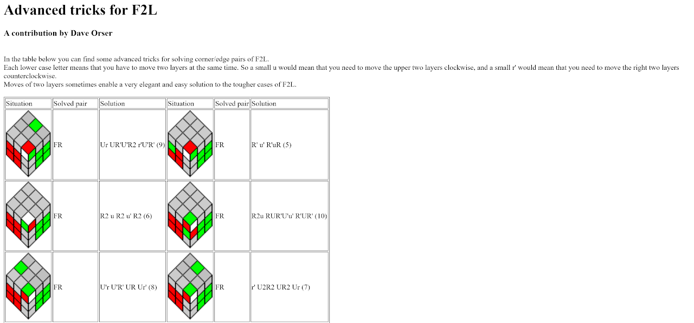

The use of appending a "w" to the end of an outer layer turn for wide turns originated in the Japanese community. This is according to Shotaro Makisumi who stated that it had been in use in the early 2000s [18, 19].

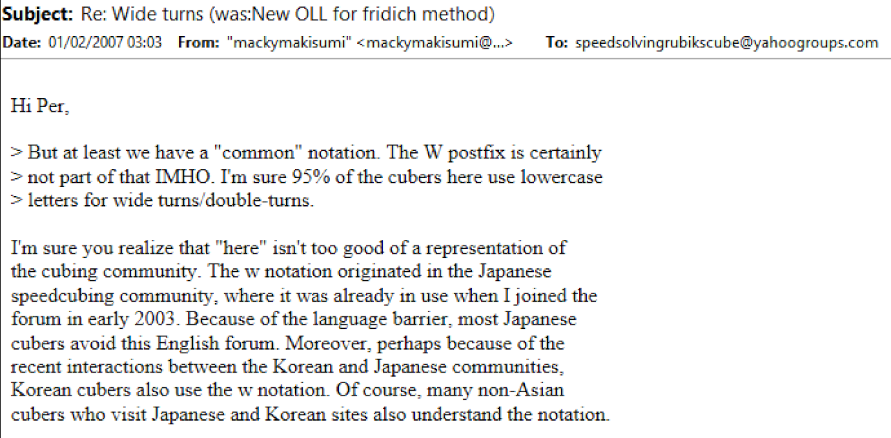
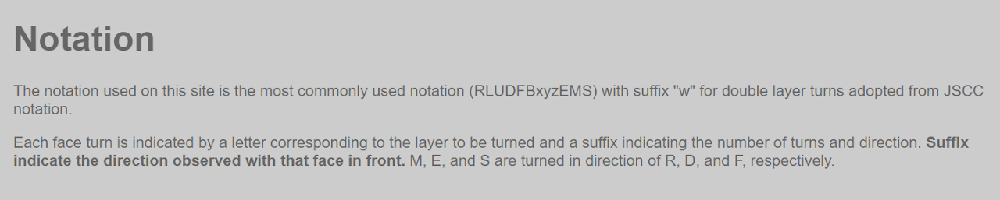

## Groups

In December, 2010, Michael James Straughan proposed combining outer, inner, and wide turn notation to describe groups of pieces or stickers [20]. In March, 2021, Straughan fully developed the notation and added it to a webpage [21, 22].

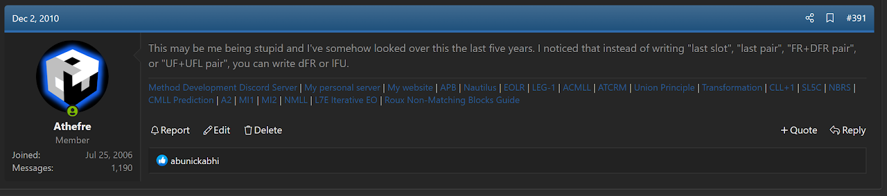
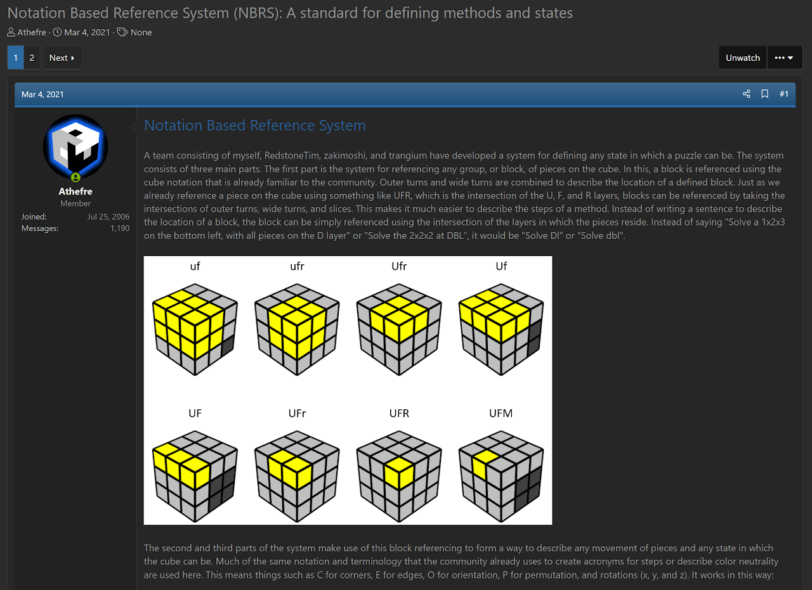

## Credit

Thanks to Ron van Bruchem for searching through the Frans Schiereck books that he owns. He was kind enough to confirm that the M, E, and S notation did appear in _De Hongaarse Kubus!_.

## References

[1] D. Singmaster, "Notation," in Notes on Rubik's 'Magic Cube', Hillside, NJ, Enslow Publishers, 1981, p. 3.

[2] W. Johnson, "INTERVIEW WITH DAVID SINGMASTER," TwistyPuzzles, 6 January 2002. [Online]. Available: https://twistypuzzles.com/articles/spotlight-singmaster/.

[3] J. H. Conway, D. Benson and D. Seal, in Solving the Hungarian Cube, Cambridge, UK, 1979, pp. 3, 6.

[4] F. Schiereck, De Hongaarse Kubus!, Mondria, 1981.

[5] R. v. Bruchem, "Re: Periodicity of algorithms," Yahoo! Groups - Speed Solving Rubik's Cube, 27 June 2002. [Online].

[6] M. Waterman and A. Treep, "Waterman Method," Cubsim For Fun, 1987. [Online]. Available: https://web.archive.org/web/20071029152943/http://rubikscube.info/waterman/booklet.php.

[7] D. Singmaster, in Notes on Rubik’s 'Magic Cube', Hillside, NJ, Enslow Publishers, 1981, p. 41.

[8] T. Barlow, "How does an M-slice work?," SpeedSolving.com, 23 November 2011. [Online]. Available: https://www.speedsolving.com/threads/how-does-an-m-slice-work.33647/post-673462.

[9] J. Williams, "Idea to fix the cubing notation," SpeedSolving.com, 11 August 2021. [Online]. Available: https://www.speedsolving.com/threads/idea-to-fix-the-cubing-notation.85135/post-1450411.

[10] J. Williams and "xyzzy", "Slice Notation Makes Sense," SpeedSolving.com, 11 August 2021. [Online]. Available: https://www.speedsolving.com/threads/slice-notation-makes-sense.85144.

[11] V. Trang, Discord, 20 July 2024. [Online]. Available: https://discord.com/channels/885722463521103892/1259323911892504662/1264334899465420913.

[12] V. Trang, Discord, 27 September 2024. [Online]. Available: https://discord.com/channels/455707295205294081/472719097218465802/1289394045411528704.

[13] P. Jansen, "SPEEDSOLVING RUBIK'S CUBE," Peter Jansen's Website, 2002. [Online]. Available: https://web.archive.org/web/20020112153806/http://home01.wxs.nl/~janse625/PetersCubePage.html.

[14] P. Jansen, "SPEEDSOLVING RUBIK'S CUBE," SpeedCubing.com, 2002. [Online]. Available: https://www.speedcubing.com/peter.

[15] "Overview of all moves on the cube, and their results," SpeedCubing.com, February 2002. [Online]. Available: https://web.archive.org/web/20020202155737/https://www.speedcubing.com/moves.html.

[16] "Overview of all moves on the cube, and their results," SpeedCubing.com, April 2002. [Online]. Available: https://web.archive.org/web/20020405074048/https://www.speedcubing.com/moves.html.

[17] D. Orser, "Advanced tricks for F2L," SpeedCubing.com, 2002. [Online]. Available: https://web.archive.org/web/20021208035826fw_/http://www.speedcubing.com/f2l_advanced.html.

[18] S. Makisumi, "Re: Wide turns (was:New OLL for fridrich method)," Yahoo! Groups - Speed Solving Rubik's Cube, 1 February 2007. [Online].

[19] S. Makisumi, "Notation," Makisumi's Website, [Online]. Available: https://web.archive.org/web/20070915082213/http://www.cubefreak.net/notation.html.

[20] M. J. Straughan, "Random Cubing Discussion," SpeedSolving.com, 1 December 2010. [Online]. Available: https://www.speedsolving.com/threads/random-cubing-discussion.22862/post-494718.

[21] M. J. Straughan, "Notation Based Reference System (NBRS): A standard for defining methods and states," SpeedSolving.com, 4 March 2021. [Online]. Available: https://www.speedsolving.com/threads/notation-based-reference-system-nbrs-a-standard-for-defining-methods-and-states.79862/.

[22] M. J. Straughan, "Notation Based Reference System," Google Sites, 2021. [Online]. Available: https://sites.google.com/site/athefre/concepts/nbrs?authuser=0.
