import AnimCube from "@site/src/components/AnimCube";
import ReactPlayer from 'react-player'
import ImageCollage from '@site/src/components/ImageCollage';

# Hardware Evolution

Rubik’s Cube has undergone a large amount of evolution. Starting from Ernő Rubik’s wooden prototype, to the final patent, to Rubik production design updates, and to the various innovations by Chinese manufacturers, numerous milestones have been achieved in producing high performing cubes.

## Prototypes and Patent

The original Rubik’s Cube prototype of 1974 used rubber bands and paper clips to hold the pieces together, with a magnet-based prototype also having been tested [1]. Both of these designs proved undesirable due to the tendency for pieces to fall apart. Rubik wanted a product that didn’t have a built-in rule that the player must only turn the layers of the puzzle and to never separate the pieces. Eventually the idea of interlocking pieces dawned on Rubik, solving the problem. The new design can be seen in a wooden prototype, holding the common features that are seen in most modern 3x3x3 puzzles. These features include a core, attached and rotating centers, and individual corner and edge pieces with interlocking shapes that hold the puzzle together while allowing for layer turning.

<ImageCollage
images={[
{ src: require("@site/docs/3x3/img/HardwareEvolution/Prototype1.webp").default},
{ src: require("@site/docs/3x3/img/HardwareEvolution/Prototype2.webp").default},
{ src: require("@site/docs/3x3/img/HardwareEvolution/Prototype3.webp").default},
{ src: require("@site/docs/3x3/img/HardwareEvolution/Prototype4.webp").default}
]}
/>

Images from [Liberty Science Center](https://lsc.org/news-and-social/news/beyond-rubiks-cube-day-30-prototype-rubiks-cube) and [Polityka](https://www.polityka.pl/tygodnikpolityka/nauka/1791468,1,kariera-kostki-rubika.read)

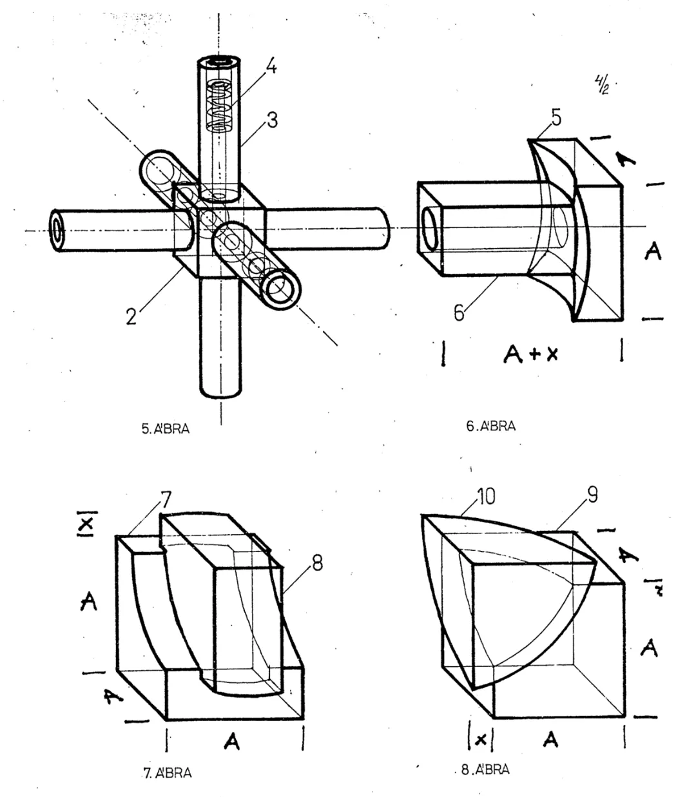

## First Production

The mass produced Rubik’s Cube made its debut in 1977 [2]. Produced by Politechnika (renamed to Politoys in 1980), the hardware closely follows the design laid out by Rubik’s patent. This first batch of the cube was both larger and heavier than subsequent releases, at around 143 grams. This batch also contained a design flaw with the mold causing the edge stickers to be raised higher than the corner stickers. The cubes of this first batch also contained pieces that were solid [3].

<ImageCollage
images={[
{ src: require("@site/docs/3x3/img/HardwareEvolution/MassProduced1.webp").default},
{ src: require("@site/docs/3x3/img/HardwareEvolution/MassProduced2.webp").default}
]}
/>

Both images from TwistyPuzzles.com

## Hollow Pieces

Later in 1977 Politechnika produced a second batch that corrected the sticker height issue as well as reduced the piece size and weight to around 117 grams [4]. From this batch also came the introduction of hollow pieces.

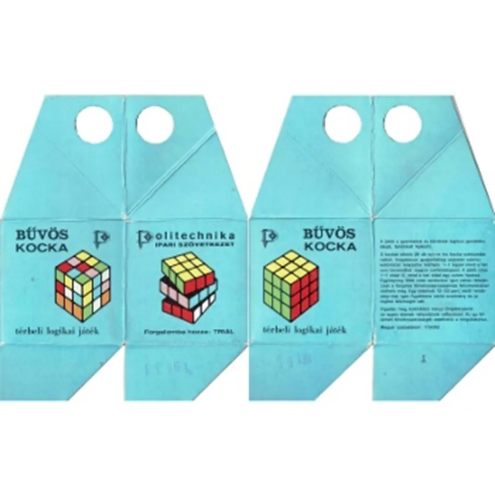

Image from TwistyPuzzles.com

## Printed Colors

In 1979, Politechnika produced a small experimental batch of cubes with the colors printed on the faces, rather than using stickers [5]. A reaction between the paint of the orange side and the underlying black plastic caused the orange side to change to purple.

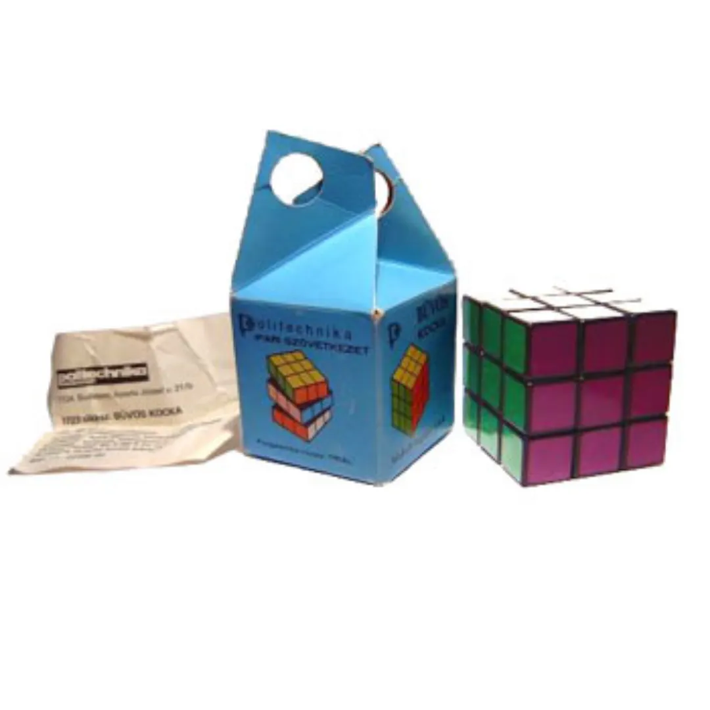

Image from TwistyPuzzles.com

## Arched Centers

In 1980, Ideal Toy Corporation released the Rubik’s Cube Deluxe Edition. This version of Rubik’s Cube altered the shape of the bottoms of the center pieces to be arched, allowing for smoother turning. This cube also had variants that used tiles instead of stickers [6]. This version of the cube wasn’t produced in large numbers and the normal edition of Rubik’s Cube continued to use flat centers.

<ImageCollage
images={[
{ src: require("@site/docs/3x3/img/HardwareEvolution/Tiles1.webp").default},
{ src: require("@site/docs/3x3/img/HardwareEvolution/Tiles2.webp").default}
]}
/>

Both images from TwistyPuzzles.com

In the early 2000s arched centers were brought to the primary version of Rubik’s Cube that was sold in stores. In March 2004, Paul Kobayashi posted comparison photographs showing the difference between two modern cubes [7]. Both cubes came in the same packaging, but one was more recent and had arched center pieces.

<ImageCollage
images={[
{ src: require("@site/docs/3x3/img/HardwareEvolution/ArchedCenters1.webp").default},
{ src: require("@site/docs/3x3/img/HardwareEvolution/ArchedCenters2.webp").default},
{ src: require("@site/docs/3x3/img/HardwareEvolution/ArchedCenters3.webp").default}
]}
/>

## DIY Kit

### Zauber Puzzle (1981)

In 1981, Politoys produced the first official 3x3x3 DIY kit, called the “Working Puzzler” [8]. It included the use of arched centers and screws. However, this DIY kit was produced only in a limited run.

<ImageCollage
images={[
{ src: require("@site/docs/3x3/img/HardwareEvolution/Zauber1.webp").default},
{ src: require("@site/docs/3x3/img/HardwareEvolution/Zauber2.webp").default}
]}
/>

Both images from TwistyPuzzles.com

### Hessport DIY (2001)

2001 saw the return of the DIY concept. In that year Hessport.com started selling an official Rubik’s brand DIY kit [9, 10]. The kit came with a blank cube, two sets of stickers, and lube.

<ImageCollage
images={[
{ src: require("@site/docs/3x3/img/HardwareEvolution/Hessport1.webp").default},
{ src: require("@site/docs/3x3/img/HardwareEvolution/Hessport2.webp").default}
]}
/>

### Studio Cube (2003)

Starting in 2003, a speedsolving oriented 3x3x3 DIY kit was produced, this time by Rubik’s Studio Hungary [11, 12]. The kit was called the Rubik’s Studio and was only available for purchase by the online puzzle community, specifically from Ton Dennenbroek’s website [13].

<ImageCollage
images={[
{ src: require("@site/docs/3x3/img/HardwareEvolution/StudioCube1.webp").default},
{ src: require("@site/docs/3x3/img/HardwareEvolution/StudioCube2.webp").default},
{ src: require("@site/docs/3x3/img/HardwareEvolution/StudioCube3.webp").default}
]}
/>

### Assembly Cube (2004)

In the middle of 2004, the production controller at Seven Towns released a statement announcing the intent to offer a DIY cube for purchase on the Rubik’s website. This statement was shared with the community by David Hedley Jones, senior vice president of the Rubik’s Brand at Seven Towns, as well as with Wayne Johnson [14, 15].

> We will also soon be introducing to rubiks.com a cube builder kit. Which is essentially and complete set of cube parts un-assembled. This way speedcubers can assemble the spring pressure to their own liking.

<ImageCollage
images={[
{ src: require("@site/docs/3x3/img/HardwareEvolution/AssemblyCube1.webp").default},
{ src: require("@site/docs/3x3/img/HardwareEvolution/AssemblyCube2.webp").default}
]}
/>
 
In August and September 2004 Jones announced that the Rubik’s DIY cube, called the “Rubik’s 3x3 Assembly Cube”, was available on rubiks.com [16, 17]. The DIY kits were purchasable in various configurations [18, 19]. The design of the cube contained a choice of rivets or screws, arched centers, as well as had caps on the inner corners similar to the 1982 Zauber Puzzle DIY.

<ImageCollage
images={[
{ src: require("@site/docs/3x3/img/HardwareEvolution/AssemblyCube3.webp").default},
{ src: require("@site/docs/3x3/img/HardwareEvolution/AssemblyCube4.webp").default},
{ src: require("@site/docs/3x3/img/HardwareEvolution/AssemblyCube5.webp").default},
{ src: require("@site/docs/3x3/img/HardwareEvolution/AssemblyCube6.webp").default},
{ src: require("@site/docs/3x3/img/HardwareEvolution/AssemblyCube7.webp").default},
{ src: require("@site/docs/3x3/img/HardwareEvolution/AssemblyCube8.webp").default},
{ src: require("@site/docs/3x3/img/HardwareEvolution/AssemblyCube9.webp").default},
{ src: require("@site/docs/3x3/img/HardwareEvolution/AssemblyCube10.webp").default},
{ src: require("@site/docs/3x3/img/HardwareEvolution/AssemblyCube11.webp").default},
{ src: require("@site/docs/3x3/img/HardwareEvolution/AssemblyCube12.webp").default},
{ src: require("@site/docs/3x3/img/HardwareEvolution/AssemblyCube13.webp").default},
{ src: require("@site/docs/3x3/img/HardwareEvolution/AssemblyCube14.webp").default},
{ src: require("@site/docs/3x3/img/HardwareEvolution/AssemblyCube15.webp").default}
]}
/>

Image from rubiks.com, [Jon “nascarjon2001” Morris](https://web.archive.org/web/20050213025824/http://www.geocities.com/nascarjon2001/dyi.htm), [Gary Fixler](https://www.flickr.com/photos/garyfixler/117173834/in/photostream/), and Conrad Rider

## Tracks

### Guojia

In May 2006, Guojia released the Type A DIY 3x3x3 [20]. This cube helped make affordable and quality cubes available to the worldwide market. Thanks to the success of the Type A, Guojia was able to invest into design improvements. In May 2008, the Type A II was released. The major feature of this cube was the addition of tracks on the inner sides of the corners and edges. The primary purpose of the tracks was friction reduction.

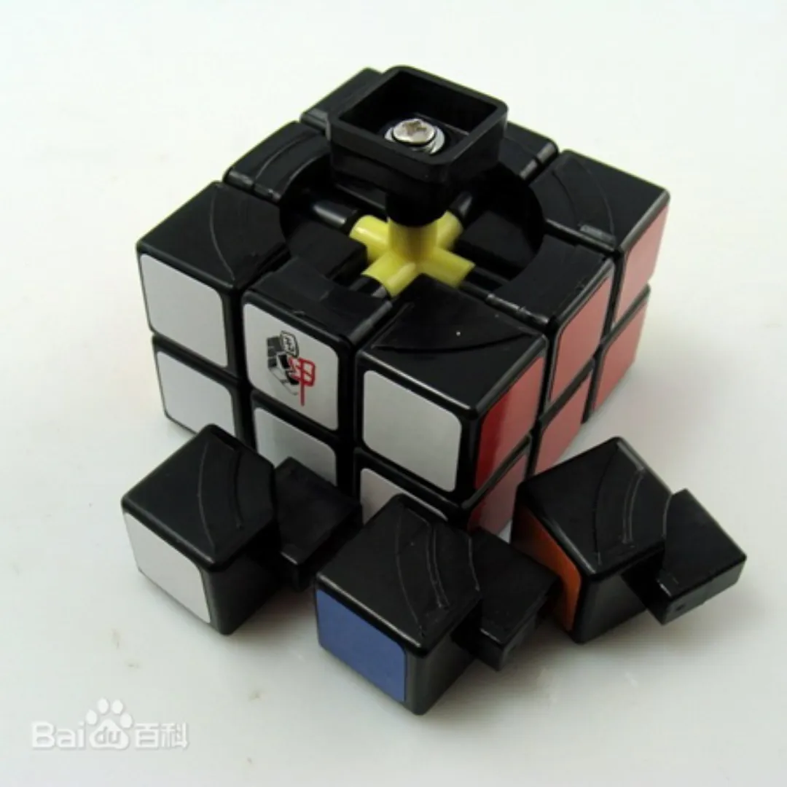

Image from [Baidu](https://baike.baidu.com/item/%E5%9B%BD%E7%94%B2%E9%AD%94%E6%96%B9/8552780)

### GAN

In 2018, puzzle manufacturer GAN optimized the tracks idea into a honeycomb design [21]. This feature was first introduced in the GAN Air SM, and was advertised as assisting with friction reduction and even lube distribution.

<ImageCollage
images={[
{ src: require("@site/docs/3x3/img/HardwareEvolution/Honeycomb1.webp").default},
{ src: require("@site/docs/3x3/img/HardwareEvolution/Honeycomb2.webp").default}
]}
/>

## Tabs

In September 2008, Guojia released the third model of the Type A 3x3x3 series [20]. The primary difference compared to Type A II is that the edges of the Type A III have tabs attached to the edges to prevent pops.

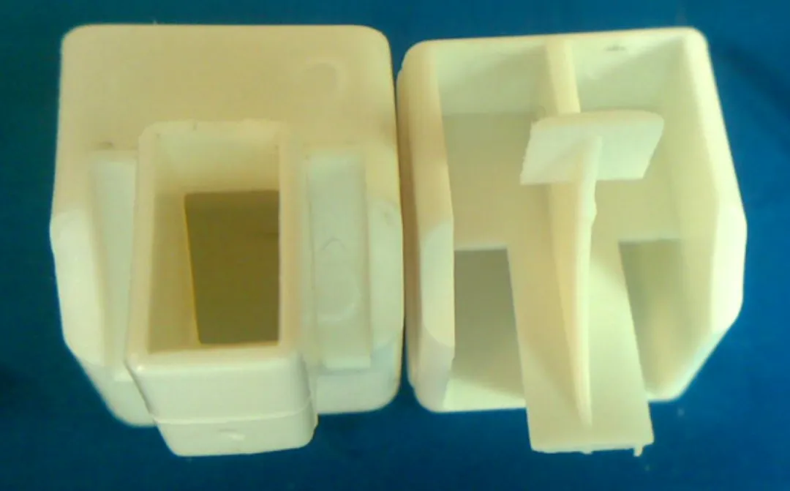

Image from lt-219 on [bbs.mf8-china.com](http://bbs.mf8-china.com/forum.php?mod=viewthread&tid=14644)

## Stickerless Pieces

The 1979 batch of experimental official Rubik’s Cubes with printed colors was previously described in the Printed Colors section. This process can also be found in some later 3x3x3 models, such as the Diansheng Type E 333 from 2009 [22]. However, within the modern meaning of “stickerless”, the plastic itself is a solid color and the pieces have the capability of splitting into sections. This innovation first came from DaYan with the release of the GuHong V1 [23].

<ImageCollage
images={[
{ src: require("@site/docs/3x3/img/HardwareEvolution/GuHong1.webp").default},
{ src: require("@site/docs/3x3/img/HardwareEvolution/GuHong2.webp").default},
{ src: require("@site/docs/3x3/img/HardwareEvolution/GuHong3.webp").default},
{ src: require("@site/docs/3x3/img/HardwareEvolution/GuHong4.webp").default},
{ src: require("@site/docs/3x3/img/HardwareEvolution/GuHong5.webp").default},
]}
/>

Pictures from [Witeden](https://web.archive.org/web/20130614072021/http://www.witeden.com/goods.php?id=140).

## Torpedoes

In March 2011 DaYan released their fourth cube series, the LunHui [24]. The ends of each edge contained a horizontal extension called a torpedo by the English-speaking community. The purpose of the torpedoes was to reduce pops.

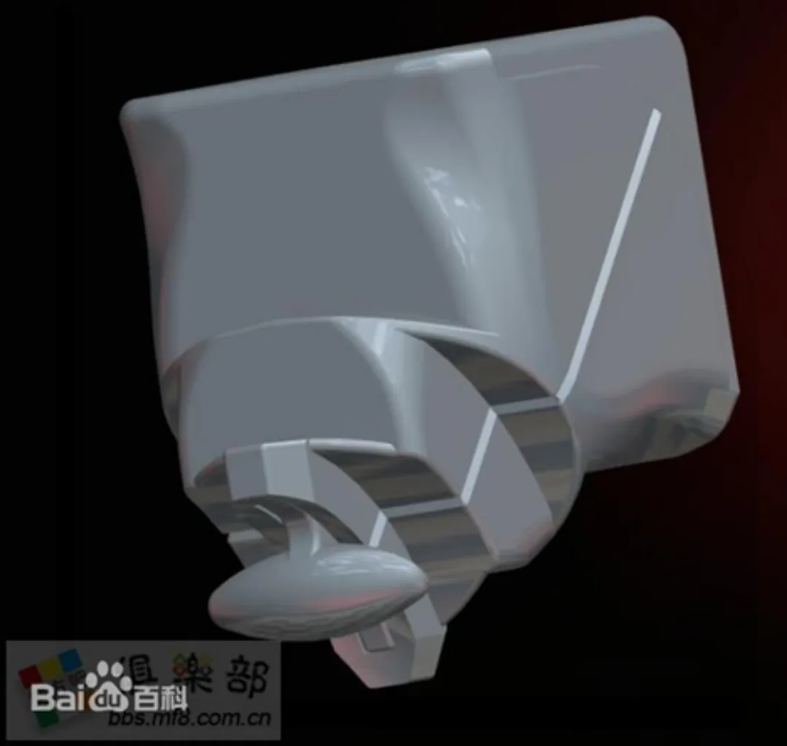

Image from [Baidu](https://baike.baidu.com/item/%E5%A4%A7%E9%9B%81%E9%AD%94%E6%96%B9/7236070)

## Magnets

### Original Use

#### Larry Nichols

The idea of magnets in a twisty puzzle can be traced back to even before Rubik’s Cube was produced. In March 1970, Larry Nichols submitted a patent for his “Pattern forming puzzle and method with pieces rotatable in groups” [25]. The primary design within this patent was what is now known as a 2x2x2 twisty puzzle. Nichols’ method for holding the individual pieces together into a cube shape was the use of embedded bar magnets.

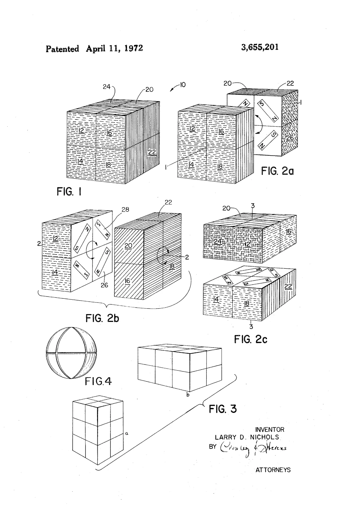

#### Ernő Rubik

Although not part of the final design, Ernő Rubik considered magnets as the mechanism of Rubik’s Cube. In _Rubik’s Cubic Compendium_, the design process was described, with magnets stated as one of the original ideas [1].

> The basic question was: what would keep the small cubes together? I had to find a means of keeping them together which would allow them to leave one section of the cube and join another, rotating in a different direction, during the performance of the different turns. Many alternative solutions presented themselves. The use of magnets seemed to be the most obvious one. I made the inside face of each piece concave, in such a way that they would fit round a steel ball in the centre. Then I fitted magnets into the concave face of each piece. They clung to the steel ball, and could be moved about with the desired effect, but this was not the real solution. Magnetic force decreases as the distance of the surfaces clinging to one another is increased; the closer the two surfaces are, the larger the force, but even a small increase in distance results in a relatively great decrease in the magnetic attraction, and the cube will then fall apart. Further, this method of construction would produce a toy that would come apart and this was not the sort of real solution that I was looking for.

#### Magneto Cube

In 1981 a German manufacturer released magnetic versions of the 2x2x2 and 3x3x3 [26, 27]. It is unknown if the internal magnetic arrangement was similar to Nichols’ patent or if a single pole is featured on each side of each inner piece.

<ImageCollage
images={[
{ src: require("@site/docs/3x3/img/HardwareEvolution/Magneto2x2.webp").default},
{ src: require("@site/docs/3x3/img/HardwareEvolution/Magneto3x3.webp").default}
]}
/>

Images from [Jaap Scherphuis](https://www.jaapsch.net/puzzles/images/collection/big/2x2x2%20magnet%20cube.jpg) and [Ton Dennenbroek](https://www.speedcubing.com/ton/collection/Other%20Puzzles/pages/Magneto.htm)

#### WorldWide Tech Solutions Asia

In 2003, WorldWide Tech Solutions Asia produced a 3x3x3 puzzle held together by internal magnets [28]. This product is similar to the Magneto puzzles, except that the magnet arrangement is visible. It can be seen that the arrangement was different from Nichols’ 2x2x2 patent in that a single magnetic pole faces outward on each inner side.

<ImageCollage
images={[
{ src: require("@site/docs/3x3/img/HardwareEvolution/wwtsasia1.webp").default},
{ src: require("@site/docs/3x3/img/HardwareEvolution/wwtsasia2.webp").default}
]}
/>

#### Gary Fixler

In April 2006, Gary Fixler independently arrived at the same idea [29, 30]. Fixler attached magnets to clear acrylic cubes to create a working 3x3x3 puzzle. He later discovered the previous creations by Nichols and WorldWide Tech Solutions Asia [30]. A guide for creating your own version is provided by Fixler on instructables.com [31], or download <a href="/archive/Documents/MagneticAcrylicRubik'sCube.pdf">here</a>.

Some interesting statements by Fixler about the design process are provided. Interestingly, Fixler once referred to it as the “magnetocube”, likely not knowing of the existence of the previously described “Magneto Cube” [32].

> The end result is a little tricky to get the hang of, and you could never speed cube with it, but it remains fun, and everyone to whom I showed it at work really loved it. Also, every single person gave it back to me with pieces oriented wrong. The labels will help with that. The cry came back from all that it needs LEDs, and that speaks of another idea I've got in the works. Hopefully much more on that project in the days to come, but that one is all kinds of way harder than this one was.
>
> The final tally:
>
> - 27 acrylic cubes from 3 sets of 10 from Tap Plastics
> - 108 D32 magnets 1/ea sets of 100 and 25 from K&J Magnetics
> - Duco Cement from the hardware store
> - 3 hours of drilling and gluing - an hour each over 3 days with shipment times, about 2.5 weeks from conception to final model
>
> Of course, two days before I finished, my friend found this. $5 from China, and you can have a perfect, machine-made version. My prototype here, with all the parts and shipping, probably ran about $80. Alas, it was just one of many cube ideas I've had lately, and I had fun designing and building it, so the project is a success in my view. I searched for magnetic rubik's cube and got nothing. He searched for magnetic rubix cube. If only I had misspelled it, too, I would have known it existed. Actually, magnetic rubik cube finds it, too, but that didn't occur to me as a search term. I'm glad I didn't find it, because it felt good to just make something again. I'm bringing it along to the Maker Faire next weekend.
>
> The magnet pair magnetic axle between this front face and the cube's central piece is strong enough to support the weight of this face, but only just. Next time - bigger axle mags.
>
> To add the final bit of insult to injury, though my Google searches turned up nothing, a friend managed to find my exact idea for sale in China for a mere $5 US :) I must've spent about $80 on the parts and supplies for this, but it was fun, and I like the crystalline nature of what I made.
>
> Check it out, you can mix them up the same way. My magnetocube prototype has passed its final test. Time to go release it into the wild and hope for the best.

<ImageCollage
images={[
{ src: require("@site/docs/3x3/img/HardwareEvolution/Fixler1.webp").default},
{ src: require("@site/docs/3x3/img/HardwareEvolution/Fixler2.webp").default},
{ src: require("@site/docs/3x3/img/HardwareEvolution/Fixler3.webp").default},
{ src: require("@site/docs/3x3/img/HardwareEvolution/Fixler4.webp").default},
{ src: require("@site/docs/3x3/img/HardwareEvolution/Fixler5.webp").default},
{ src: require("@site/docs/3x3/img/HardwareEvolution/Fixler6.webp").default},
{ src: require("@site/docs/3x3/img/HardwareEvolution/Fixler7.webp").default}
]}
/>
Images from [Gary Fixler](https://www.flickr.com/photos/garyfixler/albums/72057594105668430/)

### Magnetic Assistance

#### Idea

Nichols is the first known to have made use of magnets within a twisty puzzle. However, the purpose was different from how magnets are now implemented. The use of magnets as an addition to the interlocking piece structure to provide alignment assist is an idea that came much later. One early suggestion can be seen in 2003 from user “anti_stickers” in the Speed Solving Rubik’s Cube Yahoo! group [33]. In the message, the user suggests the idea of placing magnetic materials inside the pieces. It is even suggested that the major benefit would be automatic layer alignment.

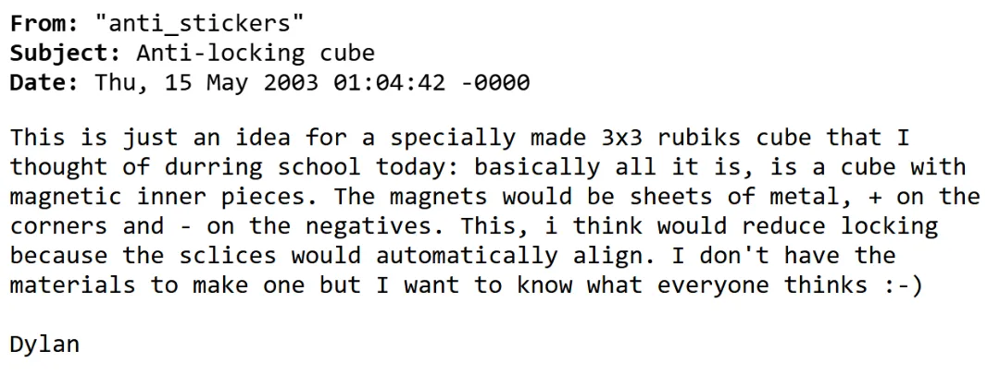

In 2009, Martin Smith responded to a thread where a user was selling a replica of Fixler’s magnetic cube [34]. Smith stated that he was considering adding magnets to a 2x2x2 or 4x4x4 to create automatic layer alignment.

#### Implementation

In 2013 Michael Fuentes-Vasques-Wilson posted a thread to SpeedSolving.com stating the intent to modify a Zhanchi 3x3x3 by adding internal magnets [35]. The idea was to add 48 neodymium magnets inside of each piece with the hope that it would lead to more accurate turning.

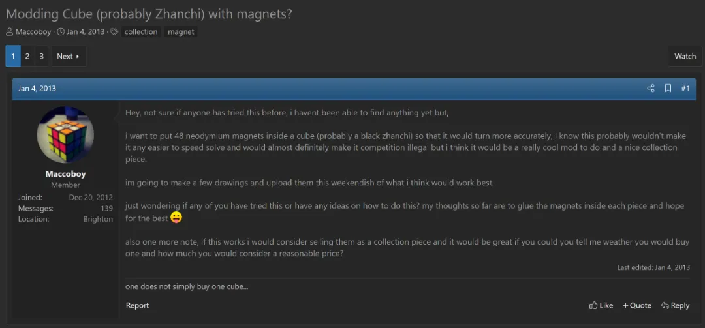

Before adding the magnets, Wilson shared additional ideas and thoughts within the thread. Notably, Wilson found Fixler’s magnet-based acrylic 3x3x3 and stated the intent to use the magnet polarity configuration from that puzzle as a guide when modifying the Zhanchi [36]. On January 30 2013, Wilson announced the completion of the modification and provided additional details regarding the magnet placement [37]:

> in case anyone is wondering about the polarity's what i did was all the center pieces have a magnet with N pointing outwards and all of the edge pieces have a magnet with S pointing inwards, this way the pieces will always attract to each other, even if turned around.
> This also means that inside each edge piece the magnets repel each other, not strong enough to push the edge piece apart but enough to stop them pulling to each other and possible breaking the glue over time.

On February 1 2013, Wilson uploaded a video that shows the magnet configuration and the automatic alignment when turning the layers of the 3x3x3 [38, 39]. This is the first known physical implementation of turning assist magnets within a 3x3x3.

<ReactPlayer
          className='react-player'
          playing controls url='/videos/Wilson.mp4'
          playing={false}
          width='100%'
          height='100%'
        />

<ImageCollage
images={[
{ src: require("@site/docs/3x3/img/HardwareEvolution/Wilson2.webp").default},
{ src: require("@site/docs/3x3/img/HardwareEvolution/Wilson3.webp").default}
]}
/>

Screen captures from the video, showing the magnet placement.

In one reply to the thread, user “speedpicker” submitted the idea of not only arranging the magnets to attract, but also to repel [40]. The desired effect is to create a frictionless cube.

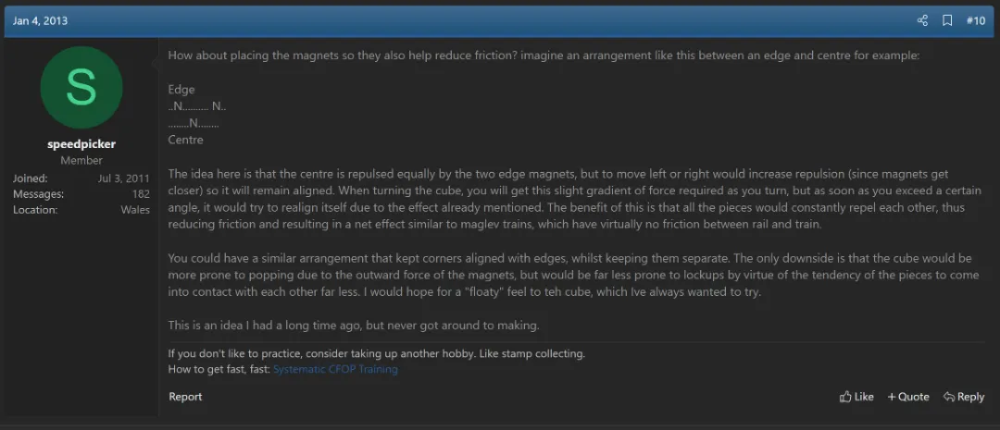

In February 2016, Julien Adam posted the idea of a repel only 3x3x3 on SpeedSolving.com [41]. This post received replies from various users, with the reception being primarily negative. Users questioned the turning ability of the layers, the possibility of the magnets attracting at certain points, and the cost increase [42, 43].

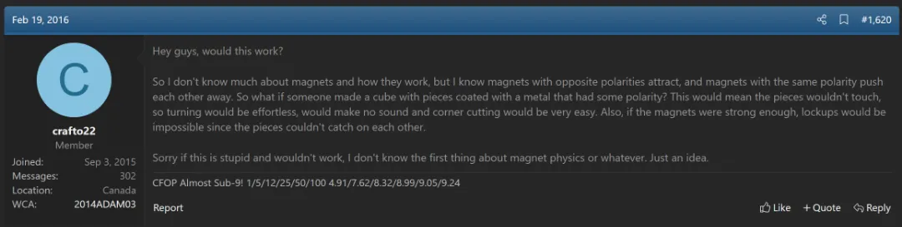

On August 19 2016, Chris Tran posted a video to YouTube showing that he had modified a ShengShou FangYuan 3x3x3 to add internal magnets [44]. The arrangement was the same as Wilson’s Zhanchi modification, with four magnets inside of each center cap and two magnets inside of each edge.

  <iframe loading="lazy" width="100%" height="100%"
    src="https://www.youtube.com/embed/bBEkEapVLIU"
    frameborder="0" allowfullscreen
    style={{position: 'absolute', top: 0, left: 0}}>
  </iframe>

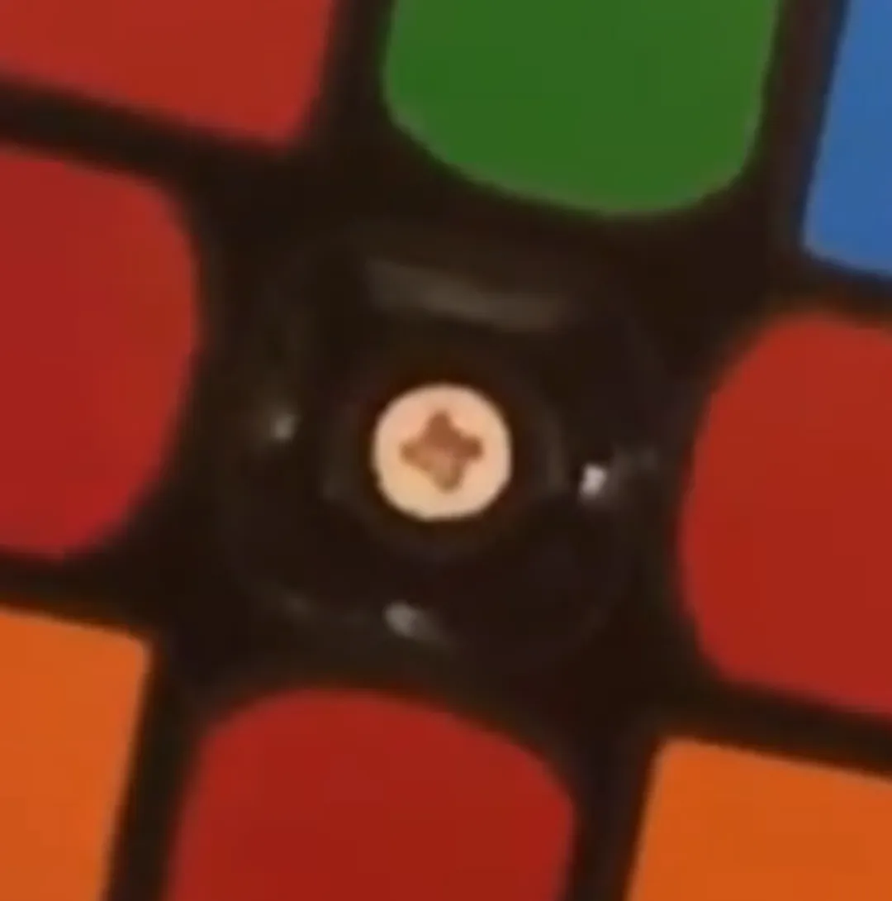

Screen capture showing the four center cap internal magnets.

#### Production

The first mass produced magnetic puzzle was the MoYu Magnetic Pyraminx, released in August 2016 [45]. A pre-release version was used by Drew Brads in July 2016 to break the Pyraminx average world record with a time of 2.14 seconds [46].

<ImageCollage
images={[
{ src: require("@site/docs/3x3/img/HardwareEvolution/Pyraminx1.webp").default},
{ src: require("@site/docs/3x3/img/HardwareEvolution/Pyraminx2.webp").default},
{ src: require("@site/docs/3x3/img/HardwareEvolution/Pyraminx3.webp").default}
]}
/>
 
On September 22 2016, Tran posted a video to YouTube demonstrating magnets applied to a GAN 3x3x3 as part of Cubicle Labs [47]. The same day, Tran posted a thread to SpeedSolving.com announcing the first commercially available magnetic 3x3x3 – the Weilong GTS M [48].

  <iframe loading="lazy" width="100%" height="100%"
    src="https://www.youtube.com/embed/o7aTjVGa1d0"
    frameborder="0" allowfullscreen
    style={{position: 'absolute', top: 0, left: 0}}>
  </iframe>

### Adjustable Magnets

In September 2018, GAN released a teaser video for the first production 3x3x3 with an adjustable magnet strength [49]. The magnets within each edge are directly across from each other on opposite sides and connected through a rod. The packaging comes with sets of additional magnet rods of varying strength that the user can push through and replace the currently inserted rods. The cube was released under the name “356X” in October 2018 [50].

  <iframe loading="lazy" width="100%" height="100%"
    src="https://www.youtube.com/embed/9QomqgRQR9o"
    frameborder="0" allowfullscreen
    style={{position: 'absolute', top: 0, left: 0}}>
  </iframe>

## Smart Cubes

### Idea

It has been a commonly proposed idea to embed electronics within a 3x3x3. The big idea is to allow the cube to recognize its own state, for the purpose of self timing or self solving. Several example mentions can be found in the Cube Lovers mailing list starting in 1980 and in the Speed Solving Rubik’s Cube Yahoo! group.

<ImageCollage
images={[
{ src: require("@site/docs/3x3/img/HardwareEvolution/SmartCubeIdea1.webp").default},
{ src: require("@site/docs/3x3/img/HardwareEvolution/SmartCubeIdea2.webp").default},
{ src: require("@site/docs/3x3/img/HardwareEvolution/SmartCubeIdea3.webp").default},
{ src: require("@site/docs/3x3/img/HardwareEvolution/SmartCubeIdea4.webp").default},
{ src: require("@site/docs/3x3/img/HardwareEvolution/SmartCubeIdea5.webp").default},
{ src: require("@site/docs/3x3/img/HardwareEvolution/SmartCubeIdea6.webp").default},
{ src: require("@site/docs/3x3/img/HardwareEvolution/SmartCubeIdea7.webp").default}
]}
/>

### Production

In early 2015 Chinese company Giiker started investing into research on a smart cube, with a prototype first completed in late 2015 [51]. After spending two years refining the technology behind the smart cube, Giiker settled on a final product in late 2017. In March 2018, Giiker launched a campaign on Xiaomi crowdfunding to assist with bringing the product to market. After exceeding the crowdfunding goals, thanks to over 15,000 backers and over $200,000 contributed, the Giiker Cube was launched on June 4 2018 [52]. This makes the Giiker Cube the first production smart cube.

<ImageCollage
images={[
{ src: require("@site/docs/3x3/img/HardwareEvolution/Giiker1.webp").default},
{ src: require("@site/docs/3x3/img/HardwareEvolution/Giiker2.webp").default},
{ src: require("@site/docs/3x3/img/HardwareEvolution/Giiker3.webp").default}
]}
/>
 

  <iframe loading="lazy" width="100%" height="100%"
    src="https://player.bilibili.com/player.html?aid=BV1PW411u7d5&bvid=BV1PW411u7d5&cid=BV1PW411u7d5&p=1&high_quality=1&autoplay=false"
    frameborder="0" allowfullscreen
    style={{position: 'absolute', top: 0, left: 0}}>
  </iframe>

## Credit

Thanks to Draco Tong for providing the idea behind this page. Within a thread in the Cyoubx’s Friends Facebook group in September 2024, Tong suggested that there should be a page that describes the history of hardware innovations [53].

## References

[1] E. Rubik, T. Varga, G. Keri, G. Marx and T. Vekerdy, Rubik's Cubic Compendium (Recreations in Mathematics), New York: Oxford University Press, 1987.

[2] TwistyPuzzles, "Rubik's Cube (first batch by Politechnika)," [Online]. Available: https://twistypuzzles.com/app/museum/museum_showitem.php?pkey=2968.

[3] G. Helm, "Re: 1977 cubes...," TwistyPuzzles.com, 14 December 2009. [Online]. Available: https://twistypuzzles.com/forum/viewtopic.php?p=190604#p190604.

[4] TwistyPuzzles, "Rubik's Cube (second batch by Politechnika)," TwistyPuzzles.com, [Online]. Available: https://twistypuzzles.com/app/museum/museum_showitem.php?pkey=506.

[5] TwistyPuzzles, "Rubik's Cube (printed colours)," TwistyPuzzles.com, [Online]. Available: https://twistypuzzles.com/app/museum/museum_showitem.php?pkey=590.

[6] TwistyPuzzles, "ITC Rubik's Cube Deluxe Edition (tiles)," TwistyPuzzles.com, [Online]. Available: https://twistypuzzles.com/app/museum/museum_showitem.php?pkey=1247.

[7] P. Kobayashi, "New Rubik's 3x3x3 molds (pics)," TwistyPuzzles.com, 15 March 2004. [Online]. Available: https://twistypuzzles.com/forum/viewtopic.php?p=15706.

[8] TwistyPuzzles, "Zauberpuzzle," TwistyPuzzles.com, [Online]. Available: https://twistypuzzles.com/app/museum/museum_showitem.php?pkey=4892.

[9] TM-Jason, "First Rubik's DIY data released!," TwistyPuzzles.com, 9 October 2001. [Online]. Available: https://twistypuzzles.com/forum/viewtopic.php?p=859#p859.

[10] Hessport, "DIY Kits!," Hessport, 8 January 2002. [Online]. Available: https://web.archive.org/web/20020108212830/http://www.hessport.com/Rubik/cgi-local/shop_new.cgi/SID=1009067177.25464.r/page=diy_kits.html.

[11] T. Dennenbroek, "Rubik's Studio Speedcube," TwistyPuzzles.com, 17 October 2003. [Online]. Available: https://twistypuzzles.com/forum/viewtopic.php?p=11325#p11325.

[12] T. Dennenbroek, "Rubik's Studio Speedcube 2003," Speed Solving Rubik's Cube Yahoo! group, 17 October 2003. [Online].

[13] T. Dennenbroek, "Buy New Puzzles," 17 October 2003. [Online]. Available: https://web.archive.org/web/20031222070625/https://www.speedcubing.com/ton/buy1.htm.

[14] D. H. Jones, "RE: [Speed cubing group] Re: tiles / deluxe," Speed Solving Rubik's Cube Yahoo! group;, 21 July 2004. [Online].

[15] W. Johnson, "New Rubik's 3x3x3 molds (pics)," TwistyPuzzles.com, 16 June 2004. [Online]. Available: https://twistypuzzles.com/forum/viewtopic.php?p=15466#p15466.

[16] D. H. Jones, "RE: [Speed cubing group] Re: Got a kick-booty good cube from wal-mart!," Speed Solving Rubik's Cube Yahoo! group, 18 August 2004. [Online].

[17] D. H. Jones, "DIY 3x3 on www.rubiks.com," Speed Solving Rubik's Cube Yahoo! group, 1 September 2004. [Online].

[18] Rubik's, "DIY KITS," Rubik's, 2 November 2006. [Online]. Available: https://web.archive.org/web/20061102101438/https://secure.rubiks.com/lvl3/index_lvl3.cfm?lan=eng&lvl1=produc&lvl2=rubbrn&lvl3=diykit.

[19] Rubik's, "Rubik's 3x3 Assembly Cube® w/Lube," Rubik's, 2 November 2006. [Online]. Available: https://web.archive.org/web/20061102113223/https://secure.rubiks.com/lvl3/index_lvl3.cfm?lan=eng&lvl1=produc&lvl2=rubbrn&lvl3=rbkshp&lvl4=cubasy.

[20] Baidu, "国甲魔方," Baidu, [Online]. Available: https://baike.baidu.com/item/%E5%9B%BD%E7%94%B2%E9%AD%94%E6%96%B9/8552780.

[21] Baidu, "Gan," Baidu, [Online]. Available: https://baike.baidu.com/item/Gan/20103612.

[22] pentrixter, "Review of Main 3x3x3 Cube Models and Clarification on the Naming System of Type A," SpeedSolving.com, 9 June 2009. [Online]. Available: https://www.speedsolving.com/threads/review-of-main-3x3x3-cube-models-and-clarification-on-the-naming-system-of-type-a.12659/.

[23] Baidu, "大雁魔方," Baidu, [Online]. Available: https://baike.baidu.com/item/%E5%A4%A7%E9%9B%81%E9%AD%94%E6%96%B9/7236070.

[24] Baidu, "大雁魔方," Baidu, [Online]. Available: https://baike.baidu.com/item/%E5%A4%A7%E9%9B%81%E9%AD%94%E6%96%B9/7236070.

[25] L. Nichols, "Pattern forming puzzle and method with pieces rotatable in groups," 4 March 1970. [Online]. Available: https://patents.google.com/patent/US3655201.

[26] J. Scherphuis, "2x2x2 magnet cube," jaapsch.net, [Online]. Available: https://www.jaapsch.net/puzzles/images/collection/big/2x2x2%20magnet%20cube.jpg.

[27] T. Dennenbroek, "Magneto," [Online]. Available: https://www.speedcubing.com/ton/collection/Other%20Puzzles/pages/Magneto.htm.

[28] W. T. S. Asia, "Magnetic Puzzle Cube," WorldWide Tech Solutions Asia, 2003. [Online]. Available: https://www.wwtsasia.com/cube.htm.

[29] G. Fixler, "Magnetic Acrylic Rubik's Cube Project," Flickr, April 2006. [Online]. Available: https://www.flickr.com/photos/garyfixler/albums/72057594101653870/.

[30] G. Fixler, "Rubik's Magnetic Cube Project," Flickr, April 2006. [Online]. Available: https://www.flickr.com/photos/garyfixler/albums/72057594105668430/.

[31] G. Fixler, "Magnetic Acrylic Rubik's Cube," Instructables, April 2006. [Online]. Available: https://www.instructables.com/Magnetic-Acrylic-Rubik-s-Cube/.

[32] G. Fixler, "Rubik's Magnetic Cube prototype: labels!," Flickr, 13 April 2006. [Online]. Available: https://www.flickr.com/photos/garyfixler/127985197/in/album-72057594105668430/.

[33] Dylan, "Anti-locking cube," Speed Solving Rubik's Cube Yahoo! group, 15 May 2003. [Online].

[34] M. Smith, "FS: Custom Made Magnetic 3x3x3," SpeedSolving.com, 30 September 2009. [Online]. Available: https://www.speedsolving.com/threads/fs-custom-made-magnetic-3x3x3.15864/#post-243833.

[35] M. Fuentes-Vasques-Wilson, "Modding Cube (probably Zhanchi) with magnets?," SpeedSolving.com, 4 January 2013. [Online]. Available: https://www.speedsolving.com/threads/modding-cube-probably-zhanchi-with-magnets.39918/.

[36] M. Fuentes-Vasques-Wilson, "Modding Cube (probably Zhanchi) with magnets?," SpeedSolving.com, 4 January 2013. [Online]. Available: https://www.speedsolving.com/threads/modding-cube-probably-zhanchi-with-magnets.39918/post-812987.

[37] M. Fuentes-Vasques-Wilson, "Modding Cube (probably Zhanchi) with magnets?," SpeedSolving.com, 30 January 2013. [Online]. Available: https://www.speedsolving.com/threads/modding-cube-probably-zhanchi-with-magnets.39918/post-820770.

[38] M. Fuentes-Vasques-Wilson, "Modding Cube (probably Zhanchi) with magnets?," SpeedSolving.com, 1 February 2013. [Online]. Available: https://www.speedsolving.com/threads/modding-cube-probably-zhanchi-with-magnets.39918/post-821328.

[39] M. Fuentes-Vasques-Wilson, "Dayan zhanchi with magnets :D," YouTube.com, 1 February 2013. [Online]. Available: https://www.youtube.com/watch?v=oa3p9CeUmdg.

[40] speedpicker, "Modding Cube (probably Zhanchi) with magnets?," SpeedSolving.com, 4 January 2013. [Online]. Available: https://www.speedsolving.com/threads/modding-cube-probably-zhanchi-with-magnets.39918/post-813013.

[41] J. Adam, "The New Method / Substep / Concept Idea Thread," SpeedSolving.com, 19 February 2016. [Online]. Available: https://www.speedsolving.com/threads/the-new-method-substep-concept-idea-thread.40975/post-1153152.

[42] K. Mansour, "The New Method / Substep / Concept Idea Thread," SpeedSolving.com, 19 February 2016. [Online]. Available: https://www.speedsolving.com/threads/the-new-method-substep-concept-idea-thread.40975/post-1153156.

[43] J. Li, "The New Method / Substep / Concept Idea Thread," SpeedSolving.com, 20 February 2016. [Online]. Available: https://www.speedsolving.com/threads/the-new-method-substep-concept-idea-thread.40975/post-1153160.

[44] C. Tran, "Magnetic Shengshou Fengyuan Mod and Review," YouTube.com, 19 August 2016. [Online]. Available: Magnetic Shengshou Fengyuan Mod and Review.

[45] F. Cubes, "MoYu Magnetic Pyraminx," Fabitasia Cubes, 2016. [Online]. Available: https://fabitasia.ch/myou-pyraminx-v2/en.

[46] D. Brads, "2.14 Official Pyraminx World Record Average - Drew Brads," YouTube.com, 1 August 2016. [Online]. Available: https://www.youtube.com/watch?v=g6T0lFNAb1k.

[47] C. Tran, "Impromptu demonstration of Cubicle Labs magnetic cubes!," YouTube.com, 22 September 2016. [Online]. Available: https://www.youtube.com/watch?v=o7aTjVGa1d0.

[48] C. Tran, "Cubicle Labs Premium Cubes," SpeedSolving.com, 22 September 2016. [Online]. Available: https://www.speedsolving.com/threads/cubicle-labs-premium-cubes.62448/.

[49] GAN, "The first replacable cube design: GMS(GAN Magnets System)," YouTube.com, 11 September 2018. [Online]. Available: https://www.youtube.com/watch?v=9QomqgRQR9o.

[50] GAN, "GAN356X & GAN 356R Launching Details and Free give-away.," Facebook, 1 October 2018. [Online]. Available: https://www.facebook.com/100063755462435/posts/1935284509853271/.

[51] sosoinvent, "99 元开抢|计客超级魔方已经上线小米众筹啦," bbs.mf8-china.com, 23 March 2018. [Online]. Available: http://bbs.mf8-china.com/forum.php?mod=viewthread&tid=109327&page=1&from=space.

[52] eefocus, "小米推出超级魔方，竟然还需要充电？," migelab.com, 4 June 2018. [Online]. Available: https://wx.migelab.com/api.php?s=/Art/index/aid/4980.

[53] D. Tong, "Cubing History," Cyoubx's Friends Facebook Group, 20 September 2024. [Online]. Available: https://www.facebook.com/groups/cyoubxfriends/posts/9282314491794921/?comment_id=9283273761698994&__cft__[0]=AZXVXHBTllL-oC_HjevRoMS_WQ-Oh4qR2zP3-lkafSfqxw2AJWz88NjXRnKGNrODl6sV0Ls0ZTgLbFnESoAHIaiggJfU_ibbiyOdxlJbXeXuPoET4ldYVh38hHv2Okk64079ldcCztqB2KgDnH.
