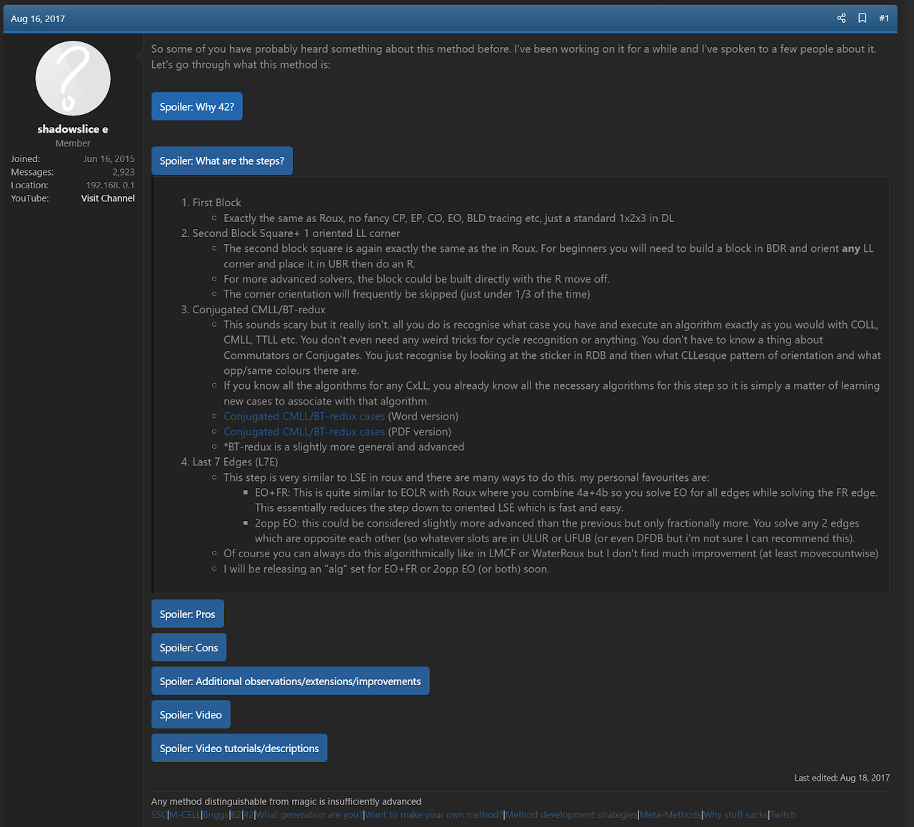

import AnimCube from "@site/src/components/AnimCube";

# 42

<AnimCube params="buttonbar=0&position=lluuu&scale=6&hint=10&hintborder=1&borderwidth=10&facelets=ldldydldlwwwdwdlwwlbbdbdldllggdgdlggldlooooooldldrrlrr" width="400px" height="400px" />

## Description

**Proposer:** [Joseph Briggs](CubingContributors/MethodDevelopers.md#briggs-joseph-shadowslice)

**Proposed:** 2017

**Steps:**

1. First Block (FB): Solve a 1x2x3 block on the left side.
2. Secnod Square (SS): Solve a 1x2x2 block on the right side. Optionally, include a U layer corner with the 1x2x2 block offset.
3. Last Five Corners (L5C): Solve the last five corners using either CCMLL or direct L5C.
4. Last Seven Edges (L7E): Solve the last seven edges.

[Click here for more step details on the SpeedSolving wiki](https://www.speedsolving.com/wiki/index.php/42)

## Proposal

In August, 2017 Joseph Briggs proposed 42 [1].

## CCMLL

Jason Wong proposed several CCMLL recognition methods [2, 3, 4].

James Straughan and Tim Mosher developed a CCMLL recognition method in 2021 [5, 6].

## L7E

Several methods for L7E have been developed.

- [James Straughan's L7E method](https://sites.google.com/site/athefre/steps/l7e?authuser=0)
- [EO + FR edge then L6EP](https://docs.google.com/spreadsheets/d/1d0-2ttUQBjNjgSZJrEQMEGHCCRxw14vJ1F6olCUVIkc/edit#gid=833116945)
- [An alternate L6EP reduction method](https://docs.google.com/spreadsheets/d/1cFVvfpsqt-pQ27sO2vBpKn22Nw_mzZN8yqGFQd7kpv8/edit#gid=0)
- [FR + Arrow](https://docs.google.com/spreadsheets/d/1RnZ5RtPG1s2gWCaEqYMBAWUkU3eNg9NAKSj28rl3qGQ/edit#gid=265375165)
- [Another L6EP reduction method](https://docs.google.com/spreadsheets/d/1H3BP9ltsxkkgJ_uZReW0ojY3jdWuYPMv5XHwJu7cFHc/edit#gid=0)
- [WaterRoux L7E](https://drive.google.com/file/d/0B2QnZ3uD6I8kbnRRM0sxSDhHbkk/view?resourcekey=0-qdSGIer86IJXhHwPtxKB3w)

## References

[1] J. Briggs, "42 - Method Proposal," SpeedSolving.com, 16 August 2017. [Online]. Available: https://www.speedsolving.com/threads/42-method-proposal.66052/.

[2] J. Wong, "BT-Redux Recognition," [Online]. Available: https://drive.google.com/file/d/16vyV2Ph2gnIYrkO3sARIHk7kMmfuta1e/view?usp=sharing.

[3] J. Wong, "BT-Redux Recognition 2.1," [Online]. Available: https://docs.google.com/spreadsheets/d/1OSLPkBhnxfozuSPbEL8_oP9FFBrFAv0v9kjN73Z0Ycs/edit?usp=sharing.

[4] J. Wong, "BT-Redux Recognition 3," [Online]. Available: https://drive.google.com/file/d/1PiiS8KDuJaRp8PD7t46Yc2-CwkI4vJfB/view?usp=sharing.

[5] JMark, Discord, 19 December 2021. [Online]. Available: https://discord.com/channels/913104731814105088/913129515541233734/922200195092066355.

[6] T. Mosher, "ACRM," [Online]. Available: https://docs.google.com/spreadsheets/d/16dttN-rParjxvbR7RNK_LTmtI4ZP18Gy_d-eeTUJAaI/edit?usp=sharing.