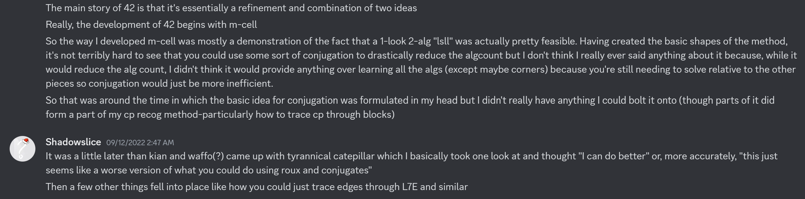
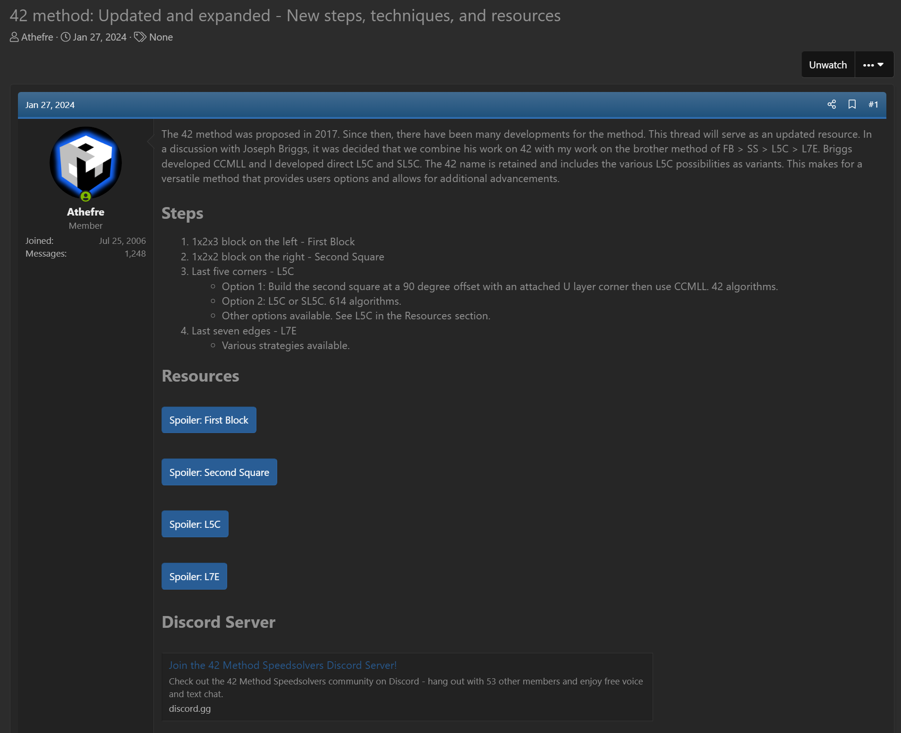

import Exhibit from "@site/src/components/Exhibit";
import YouTube from "@site/src/components/YouTube";
import ImageCollage from '@site/src/components/ImageCollage';

# 42

<Exhibit
stickering={{
    solved: "L R FL DFL DL DBL BL BR DBR DR DFR UFR UFL UBL UBR"}}
/>

## Description

**Proposer:** [Joseph Briggs](CubingContributors/MethodDevelopers.md#briggs-joseph-shadowslice)

**Proposed:** 2017

**Steps:**

1. First Block (FB): Solve a 1x2x3 block on the left side.
2. Second Square (SS): Solve a 1x2x2 block on the right side. Optionally, include a U layer corner with the 1x2x2 block in an offset position.
3. Last Five Corners (L5C): Solve the last five corners using either CCMLL or direct L5C.
4. Last Seven Edges (L7E): Solve the last seven edges.

[Click here for more step details on the SpeedSolving wiki](https://www.speedsolving.com/wiki/index.php/42)

## Origin and Proposal

In August, 2017 Joseph Briggs proposed 42 [^briggs-2017]. Although first published in 2017, primary components of the method were considered for application to methods previously developed by Briggs. M-CELL, another method by Briggs, was developed in 2015 [^briggs-straughan-2022]. Because the method ends in two steps that contain a large number of algorithms, Briggs considered applying the transformation, or conjugation, case reduction technique. However, Briggs felt that the technique wouldn’t benefit the method for speed solving because eventually users of the method would likely learn all of the algorithms.

In 2017, Jules Manalang proposed a Roux advancement named Tyrannical Caterpillar [^manalang-mansour-2017]. This advancement places the final corner in any orientation. Then the CMLL algorithm solves the final edge and correctly orients the final corner of the second block. Inspired by the idea, Briggs realized that the Roux method could be modified to use the case reduction technique that was attempted with M-CELL [^briggs-straughan-2022]. Once at the stage of the solve where the final corner and edge pair is to be solved, the user instead solves the final five corners. The corners can be transformed or conjugated into a four corners unsolved state by moving a U layer corner to the bottom layer with a single turn. This reduces the 614 L5C cases to just 42.

## Expansion

In January, 2024, Briggs and Michael James Straughan decided to add direct L5C as an option [^straughan-briggs-2024]. This gives users the flexibility of either reducing the number of cases or learning all possible L5C algorithms.

## CCMLL

Jason Wong proposed several CCMLL recognition methods [^wong-nd-1] [^wong-nd-2] [^wong-nd-3].

Straughan and Tim Mosher developed a CCMLL recognition method in 2021 [^jmark-2021] [^mosher-nd].

## L7E

Several methods for L7E have been developed.

- [Straughan's L7E method](https://sites.google.com/site/athefre/steps-concepts/l7e)
- [EO + FR edge then L6EP](https://docs.google.com/spreadsheets/d/1d0-2ttUQBjNjgSZJrEQMEGHCCRxw14vJ1F6olCUVIkc/edit#gid=833116945)
- [An alternate L6EP reduction method](https://docs.google.com/spreadsheets/d/1cFVvfpsqt-pQ27sO2vBpKn22Nw_mzZN8yqGFQd7kpv8/edit#gid=0)
- [FR + Arrow](https://docs.google.com/spreadsheets/d/1RnZ5RtPG1s2gWCaEqYMBAWUkU3eNg9NAKSj28rl3qGQ/edit#gid=265375165)
- [Another L6EP reduction method](https://docs.google.com/spreadsheets/d/1H3BP9ltsxkkgJ_uZReW0ojY3jdWuYPMv5XHwJu7cFHc/edit#gid=0)
- [WaterRoux L7E](https://drive.google.com/file/d/0B2QnZ3uD6I8kbnRRM0sxSDhHbkk/view?resourcekey=0-qdSGIer86IJXhHwPtxKB3w)

[^briggs-2017]: J. Briggs, "42 - Method Proposal," SpeedSolving.com, 16 August 2017. [Online]. Available: https://www.speedsolving.com/threads/42-method-proposal.66052/.

[^briggs-straughan-2022]: J. Briggs and M. J. Straughan, Personal communication, 12 September 2022. [Online].

[^manalang-mansour-2017]: J. Manalang and K. Mansour, "Roux Method: Tyrannical Caterpillar (TCMLL Variant)," YouTube, 28 June 2017. [Online]. Available: https://www.youtube.com/watch?v=nJhj1uhtRvw.

[^straughan-briggs-2024]: M. J. Straughan and J. Briggs, "42 method: Updated and expanded - New steps, techniques, and resources," SpeedSolving.com, 27 January 2024. [Online]. Available: https://www.speedsolving.com/threads/42-method-updated-and-expanded-new-steps-techniques-and-resources.91770/.

[^wong-nd-1]: J. Wong, "BT-Redux Recognition," [Online]. Available: https://drive.google.com/file/d/16vyV2Ph2gnIYrkO3sARIHk7kMmfuta1e/view?usp=sharing.

[^wong-nd-2]: J. Wong, "BT-Redux Recognition 2.1," [Online]. Available: https://docs.google.com/spreadsheets/d/1OSLPkBhnxfozuSPbEL8_oP9FFBrFAv0v9kjN73Z0Ycs/edit?usp=sharing.

[^wong-nd-3]: J. Wong, "BT-Redux Recognition 3," [Online]. Available: https://drive.google.com/file/d/1PiiS8KDuJaRp8PD7t46Yc2-CwkI4vJfB/view?usp=sharing.

[^jmark-2021]: JMark, Discord, 19 December 2021. [Online]. Available: https://discord.com/channels/913104731814105088/913129515541233734/922200195092066355.

[^mosher-nd]: T. Mosher, "ACRM," [Online]. Available: https://docs.google.com/spreadsheets/d/16dttN-rParjxvbR7RNK_LTmtI4ZP18Gy_d-eeTUJAaI/edit?usp=sharing.