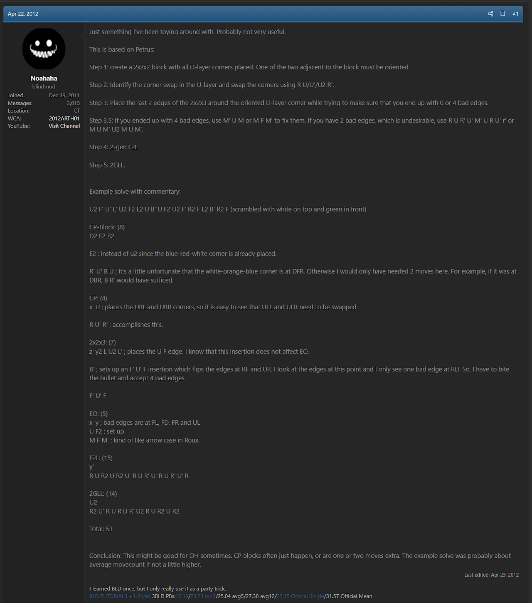
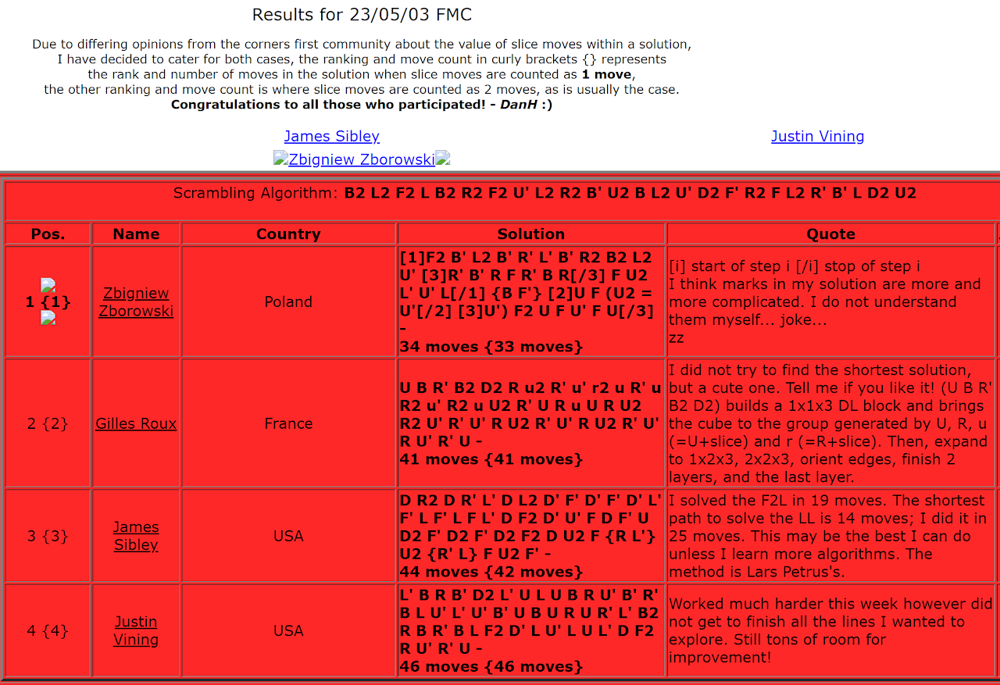
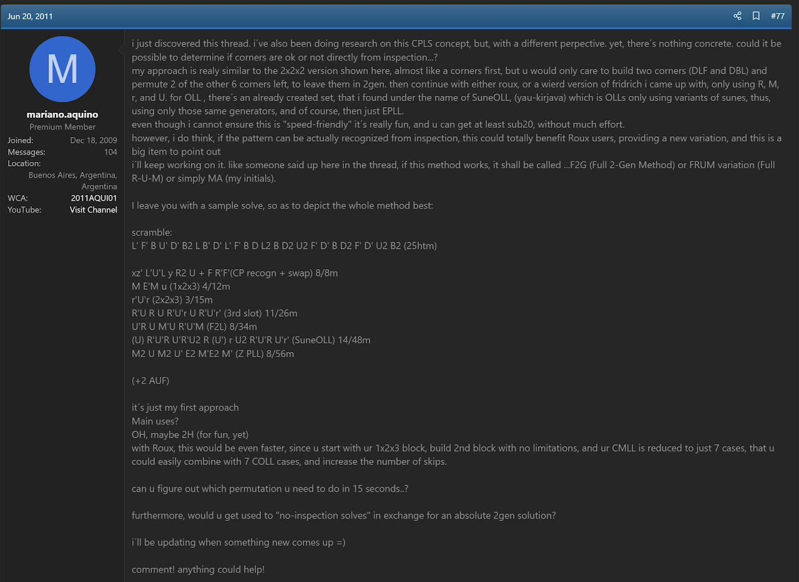
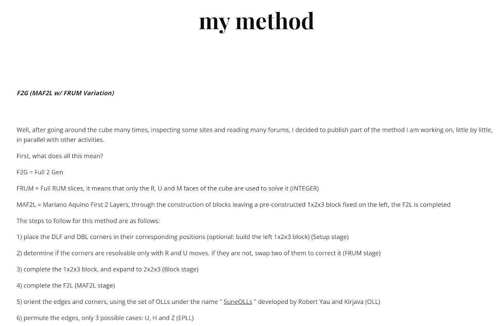
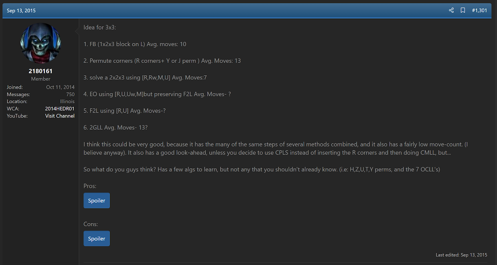
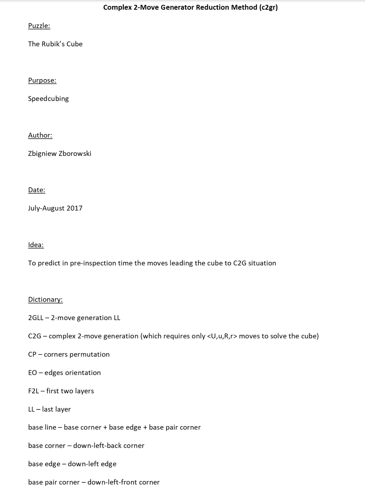
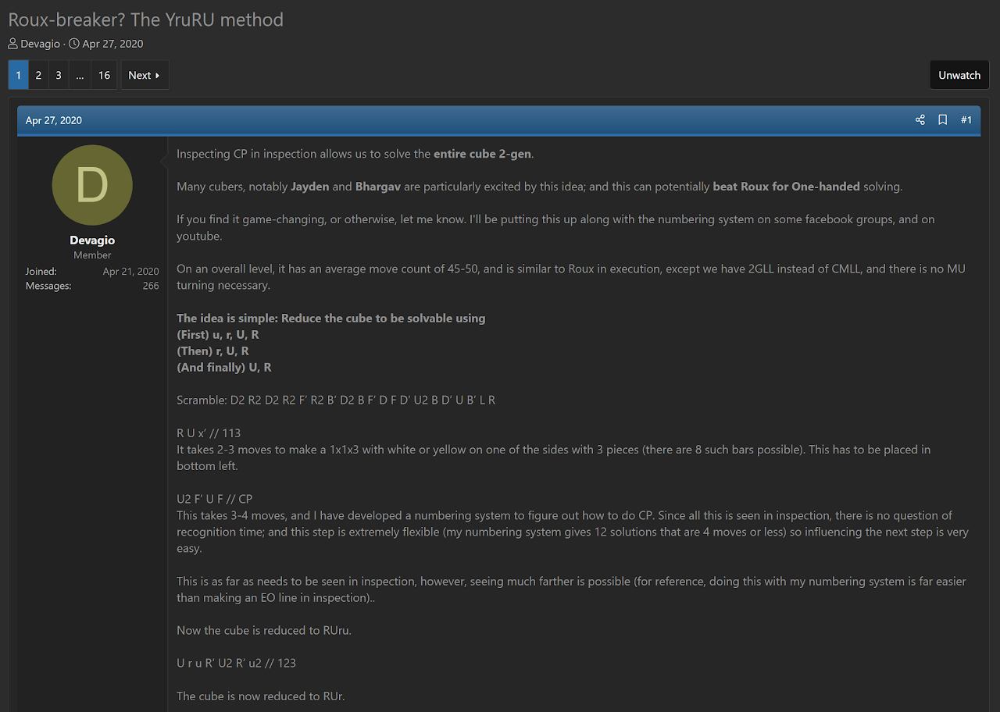
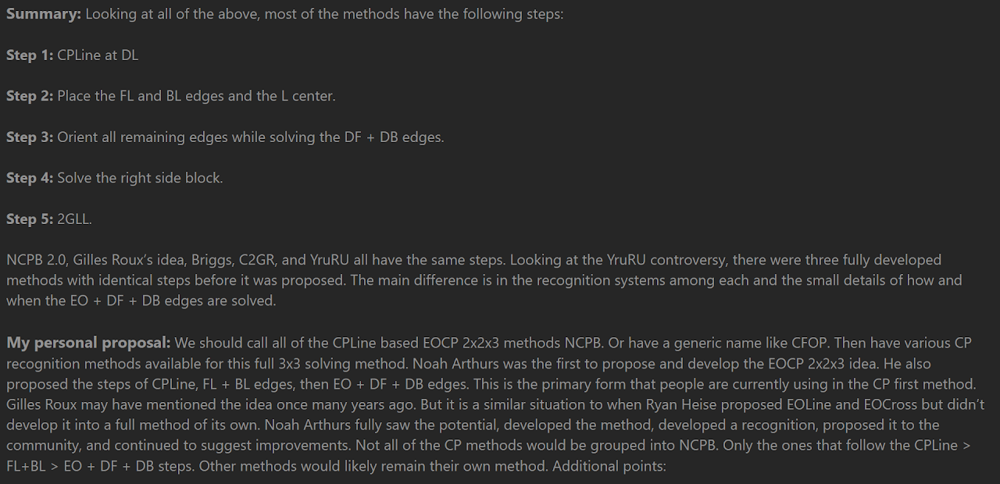

import Exhibit from "@site/src/components/Exhibit";
import YouTube from "@site/src/components/YouTube";
import ImageCollage from '@site/src/components/ImageCollage';

# CEOR

<Exhibit
stickering={{
    solved: "L R FL DFL DL DBL BL",
    orientedWithoutPermutation: "UL UF UR UB DF DB FR DR BR"
  }}
/>

## Description

**Proposer:** [Noa Arthurs](CubingContributors/MethodDevelopers.md#arthurs-noa), [Zbigniew Zborowski](CubingContributors/MethodDevelopers.md#zborowski-zbigniew), [Joseph Briggs](CubingContributors/MethodDevelopers.md#briggs-joseph-shadowslice), [Yash Mehta](CubingContributors/MethodDevelopers.md#mehta-yash), others

**Proposed:** 2013

**Steps:**

1. CPLine: Solve the 1x1x3 line at DL while permuting all corners of the cube along the z axis. Afterward, the corners are solvable using turns of just the U and R layers.
2. Extend the 1x1x3 line into a 2x2x3 block at dl while orienting all edges along the z axis.
3. Complete the first two layers by solving the 1x2x3 block at dR.
4. Solve the last layer.

[Click here for more step details on the SpeedSolving wiki](https://www.speedsolving.com/wiki/index.php/CEOR)

## Origin and Proposal

In April, 2012, Noa Arthurs proposed a method called Noah's CP Block [^1]. This was a method that permuted all corners after solving a 2x2x2 block.

Noa Arthurs proposed Noah's CP Block 2.0 in May, 2013 [^2]. This method was also focused on permuting all corners early in the solve. The difference is that it starts with a 1x2x3 block. This method is close to the modern version of CEOR, but permutes all remaining corners after solving a block on the left instead of during.

In the Noah's CP Block 2.0 speedsolving.com thread, and on the same day of the thread's creation, Arthurs proposed an upgrade to the method [^3]. This upgrade permutes the corners while solving a 1x1x3 block at DL. Then the 2x2x3 block is solved at dl while orienting all edges. This became the modern form of CEOR, though the name CEOR didn't yet exist and the method remained named Noah's CP Block 2.0.

## Other Relevant Proposals

### Lars Petrus

The first known mention of early corner permutation was written by Lars Petrus in June, 1996 on the Cube Lovers mailing list [^4]. As described on the [Petrus](3x3/Methods/Petrus.md) method page, the original steps of the Petrus method involved permuting the remaining six corners after solving the 2x2x3 block and orienting the edges. This doesn’t place the corner permutation within the inspection phase of the solve, but is the first known example of a method that reaches the state of a solved 2x2x3 block with all remaining edges orientated and all remaining corners permuted into the `R U` solvable orbit.

### Gilles Roux

The first known proposal of the steps of CEOR come from Gilles Roux in 2003 [^5]. Roux used the method in Dan Harris' online Fewest Moves Competition. Roux mentioned its use on the Speed Solving Rubik's Cube Yahoo group in a reply to Ryan Heise's (re)proposal of EOLine. Although this is the first known proposal, Roux expressed a lack of confidence in the idea and didn't proceed any further with development. Following the attribution standards of Cubing History, the method CEOR is attributed first to Noa Arthurs. Arthurs expressed confidence in the idea and other early corner permutation ideas and proposed the method as one with potential.

### Mariano Aquino

In June, 2011, Mariano Aquino proposed an early corner permutation method similar to the modern steps of CEOR [^6] [^7] [^8]. The major difference is that the edges aren't oriented while solving the first two layers.

### Joseph Briggs

In September, 2015 Joseph Briggs proposed the steps of CEOR, matching those of Arthurs from 2013 [^9].

The inspiration for Briggs' idea appears to have been a post from Clair Hedrick [^10] [^11].

### Zbigniew Zborowski

In August, 2017 Zbigniew Zborowski proposed a method named C2GR [^12] [^13]. This method contains the same steps as Arthurs and Briggs had previously proposed. During an email exchange between Zborowski and Michael James Straughan, Zborowski stated that he had been considering the idea since 2006, and that he has switched to this method and no longer uses the ZZ method [14]:

> Maybe you know or not, but I am not using this system any more. During my "carier" I was looking for the system, that will be most ergonomic to achive best times in speedcubing. Since about 8 years I try my new system, which I called c2gr (complex two move generator reduction method). I was thinking about such a possibility (of permuting all corners in preinspection time) since 2006 (or even earlier). Below are the steps of my new system:
>
> 1 step. (in preinspection) I permute all corners and make line at bottom-left (1x1x3) - after this step I use only extended 2-move-generation moves, I mean U,u,R,r.
>
> 2 step. I orient all edges and complete bottom-left block (2x2x3) - after this step I need classic 2-move-generation moves, I mean U,R.
>
> 3 step. I finish F2L (2x3x3) - all edges are oriented and all corners are permuted - the number of LL situations is pretty much limited.
>
> 4 step. I solve the LL with one alg, of course.
>
> I think now (after these 8 years) that this is not a good choice for speedcubing, but it does not matter to me - now this is only a hobby for me ;)
>
> Additionally last year I prepared sollutions (with my own program) for LL situations using only (anti)sunes algs.

### Yash Mehta

In April, 2020 Yash Mehta proposed a method named YruRU that contained the same steps that Arthurs, Briggs, and Zborowski had previously proposed [^15]. A new corner permutation recognition system was included. This was the major turning point for the method. When promoted by Noa Arthurs in 2013 and by Joseph Briggs in 2015, the idea gained some interest from the community and the proposals were likely influential upon future related methods. However, the method didn't catch on and didn't gain users.

When Mehta proposed the method as YruRU in 2020, the idea finally took off thanks to three key factors. The first contributing factor is that, in contrast with some of the prior proposals, a complete recognition method for the early corner permutation step was included in the original post and a guide website was developed. Without an easy way to recognize the corner permutation state, some of the earlier proposals left potential solvers without a good way to use the method. Zborowski included a complete and detailed corner permutation recognition system and solving guide with his proposal in 2017, but the method unfortunately didn't catch on. The 2GR method also included a recognition method and a guide website in 2017. Although the early corner permutation recognition method used in 2GR was also applicable to CEOR, it was being promoted for a different method, 2GR. This method also wasn't able to gain traction within the community. The reason for C2GR and 2GR not catching on versus YruRU managing to spark some interest may come down to promotion.

Promotion becomes the second major factor in CEOR gaining popularity following the re-proposal in 2020. Mehta titled the speedsolving.com thread _Roux-breaker? The YruRU method_ and included a couple of comparisons with the Roux method within the thread content. The suggestion was that CEOR has potential to perform better in one handed solving than Roux, which is currently perceived as the best performing method for one handed solving. This inevitably led to arguments within the thread about which method has the most potential and even whether CEOR should be compared with Roux.

The arguments within the thread weren't limited to the potential of the method. The third factor that contributed to the thread gaining attention was that many in the community were aware of the previous proposals of the same set of steps by Arthurs, Briggs, Zborowski, and others. This created an argument about who should be credited with the method idea. Mehta and others argued that because the early corner permutation recognition system was new and because more effort was placed into development and confidence into the promotion, the idea should go to Mehta. The other side argued that the steps are the same, that a new recognition method for a step doesn't change the name of a method, and that Briggs and others had put effort into promotion. The two sides in the arguments didn't come to an agreement at the time and promotion continued under the YruRu name.

Despite the arguments, or because of them, the method continued on to finally gain users. Mehta's promotion of the complete, usable method allowed for interest to turn into users and for those unaware of the previous proposals to learn of the existence and potential of the idea.

## Method Combination and Name

In December 2021, James Straughan proposed ending the method credit argument by combining all of the similar methods into one with a single name [^16]. Mehta agreed that the method shouldn't be named after a person [^17] [^18] and Joseph Briggs suggested the acronym based name CEOR [^19]. CEOR stands for **C**orner Permutation, **E**dge **O**rientation and stripe, **R**ight block. The CEOR name is a sort of adjacent name to the non-early corner permutation method LEOR, with the L standing for **L**eft block.

[^1]: N. Arthurs, "Noah's CP-Block Method," SpeedSolving.com, 22 April 2012. [Online]. Available: https://www.speedsolving.com/threads/noahs-cp-block-method.36538/.

[^2]: N. Arthurs, "Noah's CP Block Method 2.0," SpeedSolving.com, 14 May 2013. [Online]. Available: https://www.speedsolving.com/threads/noahs-cp-block-method-2-0.41986/.

[^3]: N. Arthurs, "Noah's CP Block Method 2.0," SpeedSolving, 14 May 2013. [Online]. Available: https://www.speedsolving.com/threads/noahs-cp-block-method-2-0.41986/post-853203.

[^4]: L. Petrus, "Re: Speed cubing," Cube Lovers, 10 June 1996. [Online]. Available: http://www.math.rwth-aachen.de/~Martin.Schoenert/Cube-Lovers/Lars_Petrus__Re__Speed_cubing.html.

[^5]: G. Roux, "Results for 23/05/03 FMC," Fewest Moves Competition, 23 May 2003. [Online]. Available: https://web.archive.org/web/20040211055843/http://homepage.ntlworld.com/dan_j_harris/fmcresults/230503results.html.

[^6]: M. Aquino, "CPLS and 2GLL discussion," SpeedSolving.com, 20 June 2011. [Online]. Available: https://www.speedsolving.com/threads/cpls-and-2gll-discussion.24125/page-4#post-594576.

[^7]: M. Aquino, "F2G (MAF2L c/ FRUM Variation)," Google Sites, 20 June 2011. [Online]. Available: https://sites.google.com/site/recursoscuberos/f2g.

[^8]: M. Aquino, "Solve with F2G method - By DrMaquino," YouTube, 20 June 2011. [Online]. Available: https://www.youtube.com/watch?v=xLu7yQLS24Q.

[^9]: J. Briggs, "Briggs (3x3x3 method)," SpeedSolving.com, 19 September 2015. [Online]. Available: https://www.speedsolving.com/threads/briggs-3x3x3-method.55156/.

[^10]: C. Hedrick, "The New Method / Substep / Concept Idea Thread," SpeedSolving.com, 2013 September 2015. [Online]. Available: https://www.speedsolving.com/threads/the-new-method-substep-concept-idea-thread.40975/post-1116703.

[^11]: J. Briggs, "The New Method / Substep / Concept Idea Thread," SpeedSolving.com, 13 September 2015. [Online]. Available: https://www.speedsolving.com/threads/the-new-method-substep-concept-idea-thread.40975/post-1116737.

[^12]: Z. Zborowski, "Complex 2-Move Generator Reduction Method (c2gr)," SpeedSolving.com, 20 August 2017. [Online]. Available: https://www.speedsolving.com/threads/complex-2-move-generator-reduction-method-c2gr.66089/.

[^13]: Z. Zborowski, "Complex 2-Move Generator Reduction Method (c2gr)," OneDrive, 20 August 2017. [Online]. Available: https://onedrive.live.com/view.aspx?resid=A768425208665B6D!428&ithint=file%2cdocx&authkey=!AMvcyyr1lbYsxzk.

[^14]: Z. Zborowski and M. J. Straughan, "ZZ Method," Personal Communication, 17 April 2025. [Online].

[^15]: Y. Mehta, "Roux-breaker? The YruRU method," SpeedSolving.com, 27 April 2020. [Online]. Available: https://www.speedsolving.com/threads/roux-breaker-the-yruru-method.77201/.

[^16]: M. J. Straughan, "CP Method History - Noah’s CP Block, Briggs, YruRU, ZZ, and all others described," SpeedSolving.com, 13 December 2021. [Online]. Available: https://www.speedsolving.com/threads/cp-method-history-noah%E2%80%99s-cp-block-briggs-yruru-zz-and-all-others-described.85927/.

[^17]: Y. Mehta, "Roux-breaker? The YruRU method," 10 June 2020. [Online]. Available: https://www.speedsolving.com/threads/roux-breaker-the-yruru-method.77201/page-12#post-1377651.

[^18]: Y. Mehta, "Roux-breaker? The YruRU method," SpeedSolving.com, 16 December 2021. [Online]. Available: https://www.speedsolving.com/threads/roux-breaker-the-yruru-method.77201/page-15#post-1464897.

[^19]: J. Tudor, "CP Method History - Noah’s CP Block, Briggs, YruRU, ZZ, and all others described," SpeedSolving.com, 13 December 2021. [Online]. Available: https://www.speedsolving.com/threads/cp-method-history-noah%E2%80%99s-cp-block-briggs-yruru-zz-and-all-others-described.85927/post-1464625.