import AnimCube from "@site/src/components/AnimCube";

# CFOP

<AnimCube params="buttonbar=0&position=lluuu&scale=6&hint=10&hintborder=1&borderwidth=10&facelets=yyyyyyyyywwwwwwwwwdbbdbbdbbdggdggdggdddoooooodrrdrrdrr" width="400px" height="400px" />

## Description

**Proposer:** Various

**Proposed:** 1979 - 1981

**Steps:**

1. Cross: Solve the four bottom layer edges.
2. First Two Layers (F2L): Solve the four corner and edge pairs around the bottom two layers.
3. Orient the Last Layer (OLL): Orient all pieces of the upper layer.
4. Permute the Last Layer (PLL): Permute all pieces of the upper layer.

[Click here for more step details on the SpeedSolving wiki](https://www.speedsolving.com/wiki/index.php/CFOP_method)

## Cross

The first known publication of the cross step is Donald Taylor's *The Group of a Coloured Cube* in 1978 [1].

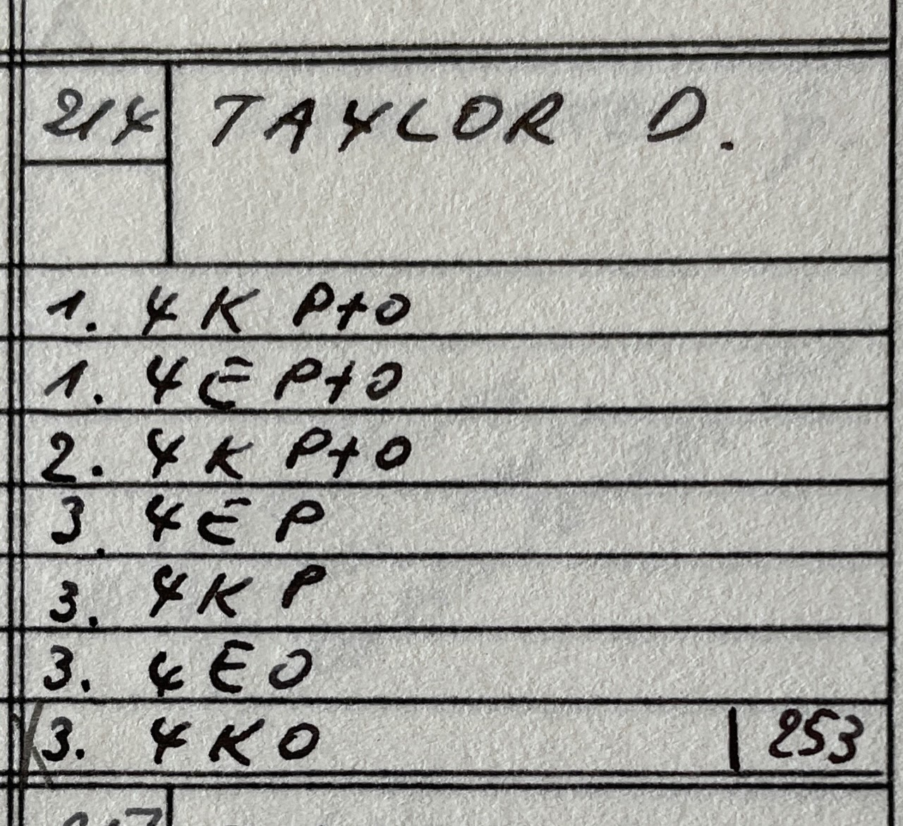

>I contacted Georges Helm to ask the method steps in all of the books he owns from 1980 and earlier. This is a handwritten list of steps. "K" is for edges and "E" is for corners. The numbers on the left indicate the bottom, middle, and upper layer. "P" is for "position" and "O" is for "orient". Donald Taylor's publication is the earliest of the books he owns that describes a method starting with cross. However, it is likely that cross had been used even earlier.

## First Two Layers

### First Known Publication

The first known publication of the corner and edge pairing technique appeared in 1979 [2, 3]. John Conway, David Seal, and David Benson developed algorithms for all possible cases and published in two different publications. 

**Solving the Hungarian Cube**

**Solving the Hungarian Cube in Less Than 100 Moves**

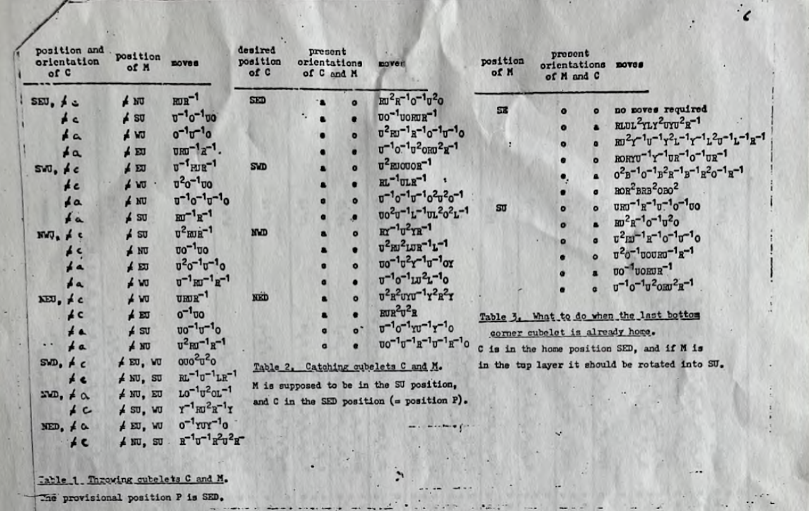

The notation used was slightly different from modern notation. Below is the notation as described in the publications.

The year of publication being 1979 can be deduced from a major point: In David Singmaster's Notes on Rubik's 'Magic Cube', it is stated "John Conway and Dave Benson have prepared an article for the Journal of Recreational Mathematics showing how to always restore the cube in at most 100 moves. They do bottom layer edges, then bottom corners and middle edges together and then use their tables to first position and then orient the top layer, in at most 13 and 19 moves respectively." [4] This is on page 32 and is dated 30 November 1979 on page 34.

> I discovered those couple of sentences in Notes on Rubik's 'Magic Cube' then Georges Helm kindly helped me verify the Conway/Benson/Seal publications. I then noticed in their publications that they even had the complete F2L tables as shown above. I guess it was a very easy thing to overlook because it is such a quick mention in Notes on Rubik's 'Magic Cube'.

Other points that indicate the year of publication:

- The bibliography of Notes on Rubik's 'Magic Cube' states that the publication date for Solving the Hungarian Cube is "1980?" [5]. So with the above quote saying that Conway, Benson, and Seal "prepared" the article, Singmaster's question of the date 1980 likely means that he was trying to convey something like "will be published in 1980?".
- Solving the Hungarian Cube in Less Than 100 Moves states on the second page "In fact we have now produced a proof using these methods that the cube can always be restored to its original position in at most 85 moves". [3] In 1982's Winning Ways for Your Mathematical Plays Volume 2 in the Rubik's Hungarian Cube — Bűvös Kocka subchapter, it states "In the Extras you'll find lists of the shortest known words (improvements welcome!) to achieve any rearrangement, or any reorientation of the top layer. These are quoted from an algorithm due to Benson, Conway and Seal which guarantees to cure the cube in at most 85 moves" [6]. This is likely a reference to Solving the Hungarian Cube in Less Than 100 Moves. The bibliography of Notes on Rubik's 'Magic Cube' states for Winning Ways "This [is] said to be at the publishers and may appear in 1980...First draft, 16pp, 1979; Second draft, 15pp, 1980." [5] The Winning Ways volumes were eventually published starting in 1982.
- With Solving the Hungarian Cube having likely been written or published in 1979 and Solving the Hungarian Cube in Less Than 100 Moves having an actual published first draft of 1979, that makes two publications in 1979 by Benson, Conway, and Seal that described the F2L pair technique along with cross and PLL then OLL.

### Later Publications

The second known publication of the corner and edge pairs technique comes in June 1981 on page 41 of James G. Nourse's *The Simple Solution to Rubik's Cube* [7].

>This one is only a mention of the idea with no strategies or sequences. I was provided this information by Joseph Briggs.

In July 1981 in the Slovenian magazine Teleks, the technique is described with some illustrations [8].

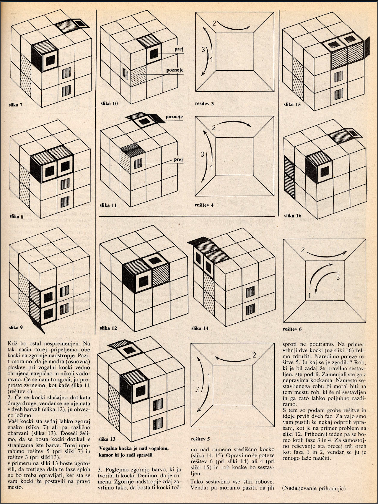

>This article is written by Rok Sosič and Polona Sosič. Rok Sosič is credited as the creator of the technique. I was provided this information by Joseph Briggs who received it in a private message from a user on speedsolving.com.

In the September, 1981 issue of Cubism for Fun, the technique is described and credited to Rene Schoof [9].

>Thanks to Georges Helm and Ron van Bruchem for this information.

According to Ron van Bruchem, the technique appears two months later in December 1981 in a book by Frans Schiereck called De Hongaarse Kubus Voor Doordraaiers [10, 11]. 

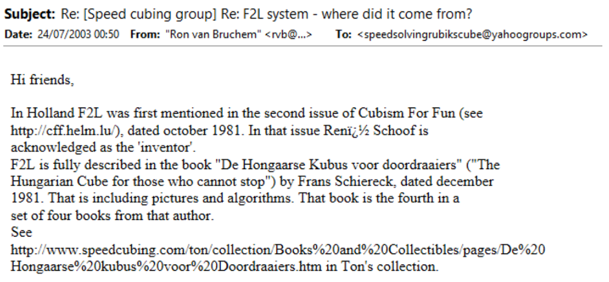

### Jessica Fridrich's Story

For several years in the online community, it was believed that the totality of CFOP had been created by Jessica Fridrich. However, some in the community were aware of the 1981 Cubism for Fun newsletter and the appearance of the F2L pair technique in the mentioned books. In July, 2003, Ryan Heise posed the question to the community as to the origin of the F2L pair technique [12]. Jessica Fridrich responded by saying that she wasn't sure of the origin and that she learned of the technique from friends in college [13]. They had been using the technique, although in a basic form. Fridrich found solutions for additional cases to speed up solving the first two layers.

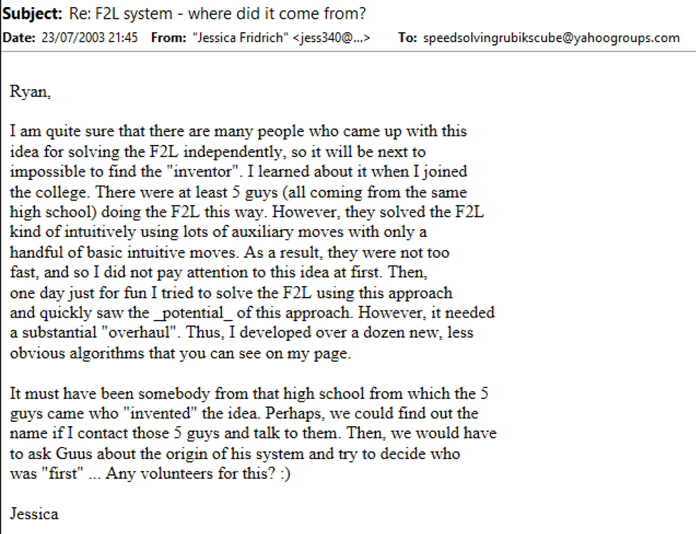

Before developing her website, Fridrich described the method on the Cube Lovers mailing list [14].

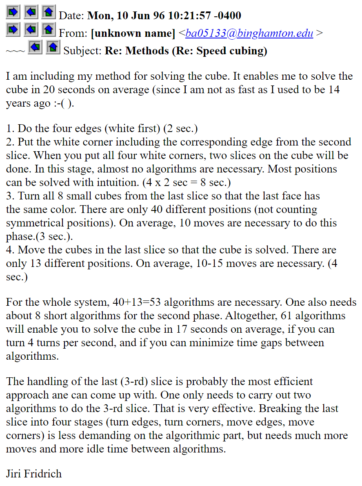

Fridrich developed the website for the method in January, 1997 [15].

## OLL and PLL

### Origin

OLL then PLL was independently developed starting in 1981 [10, 16]. By Hans Dockhorn and Anneke Treep and also by Jessica Fridrich and Mirek Goljan.

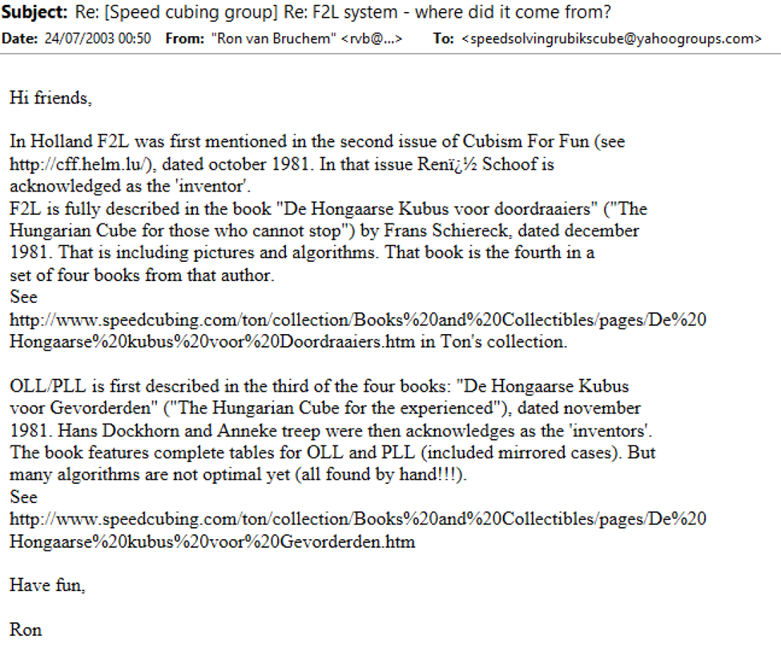
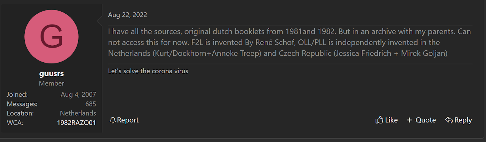

>The first message is from the Speed Solving Rubik's Cube Yahoo group. The second is from a personal conversation that I had with Guus Razoux Schultz.

Jessica Fridrich published the OLL and PLL algorithms in a 1982 issue of Mladý Svět [17, 15].

Jessica Fridrich states on her website "Most of the algorithms were developed by myself during the time period between the summer 1981 and the spring of 1983. However, other speed cubists, most noticeably Mirek Goljan, have also significantly contributed with important moves." [18]

Interestingly, the Conway, Benson, and Seal publications included all of the algorithms for PLL then OLL as the last layer method (not OLL then PLL) [2, 3]. 

**Solving the Hungarian Cube**

**Solving the Hungarian Cube in Less Than 100 Moves**

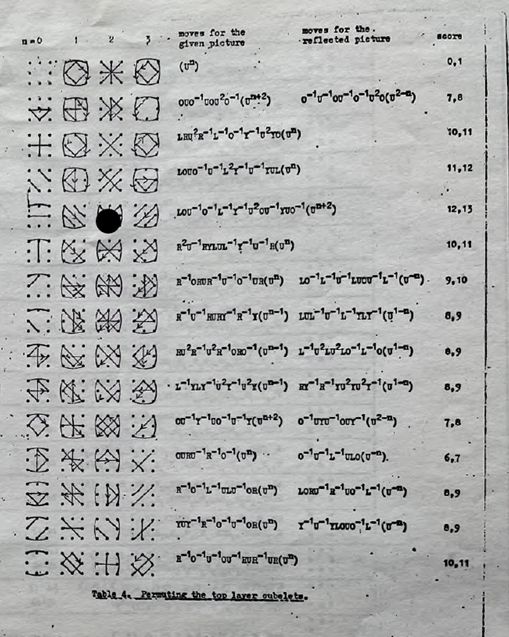

### OLL Numbering System

The OLL numbering system was initially created by Jessica Fridrich [19]. Fridrich had the cases numbered on her site. However, mirrors weren't included, as was common during those years.

The OLL numbers were expanded upon by the Japanese community to include mirror cases [20, 21, 22].

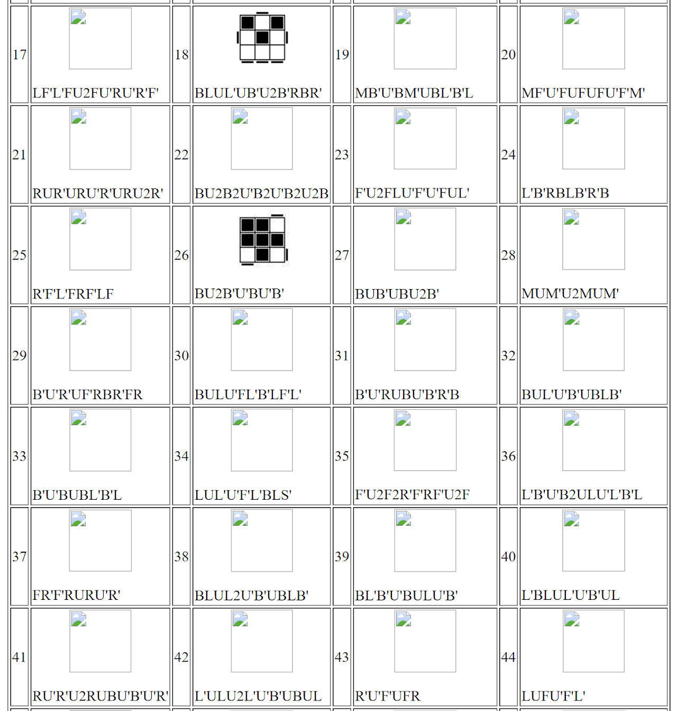

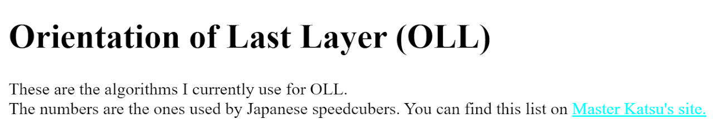

>This comes from the site of someone by the name of Naitsu. This site was linked to by Konishi Katsuyuki, which was linked to by Makisumi Shotaro who states that "the numbers are the ones used by Japanese speedcubers."

### PLL Letter Names

The PLL letter names were created by Mirek Goljan and appear on Fridrich's site [23]. As with OLL, mirrored cases weren't included. The system of adding a lower case a, b, c, or d after the uppercase letter was added later by the community.

## Techniques

### XCross and XXCross

XCross and XXCross were proposed by Chris Hardwick from 2003 - 2004 [24, 25]. 

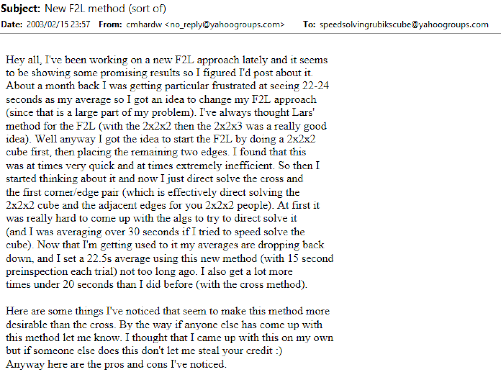

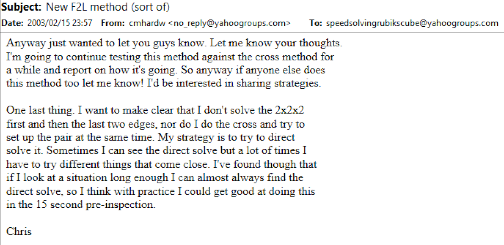

>These messages were posted to the Speed Solving Rubik's Cube group.

### Edge Control

The idea of edge control started appearing at the beginning of the online communities [26, 27].

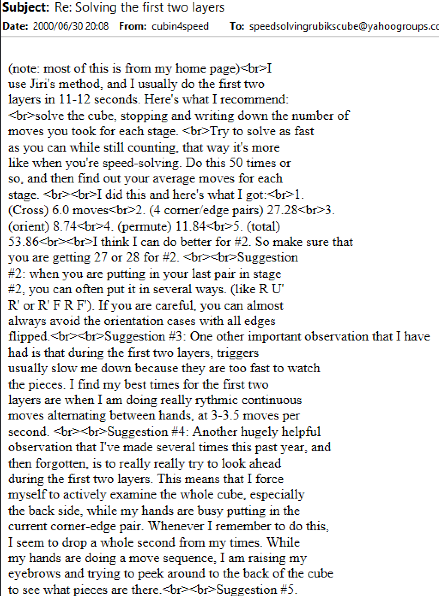

>The first message is from Dan Knights and the second is from Lars Vandenbergh. It is likely that early talks of ensuring that the LL edges are oriented is what led to the idea of ZBLS.

The earliest found mention of the term "edge control" is by Shotaro Makisumi starting in 2004 [28, 29]. Makisumi eventually created a page on his site to describe the technique.

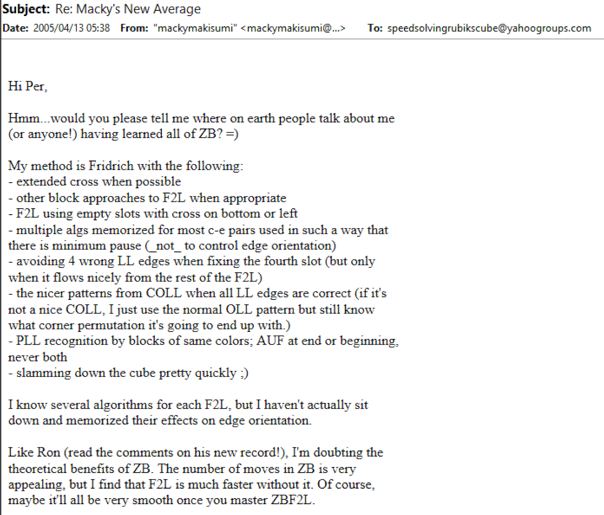

Chris Hardwick also had a page on speedcubing.com in 2005 about edge control [30]. 

### Pseudo Slotting

Olly Hayden discussed the technique and called it non-matching pairs in May, 2002 [31, 32]. This is the earliest known mention of the technique.

It is described in the paragraph starting with "As stated above". This actually isn't the first discussion by Olly Hayden. It is only the first one remaining in the archived messages. The Speed Solving Rubik's Cube Yahoo! group was originally part of Yahoo! Clubs. In 2001, Yahoo! purchased eGroups, another mailing list company. They merged to become Yahoo! Groups. This change also deleted a year and a half worth of messages. The group was started in June of 2000 and any messages after August 5, 2000 and before March 27, 2002 were deleted. On their website, Olly points out they first talked about non-matching pairs in message 144 of the Yahoo! group. This would have been one of the deleted messages. It seems that the community became aware of Olly Hayden's messages and website. There are multiple instances on the Yahoo! group of others sharing the website.

Jessica Fridrich briefly mentioned the technique on her site on August 26, 2002 [33].

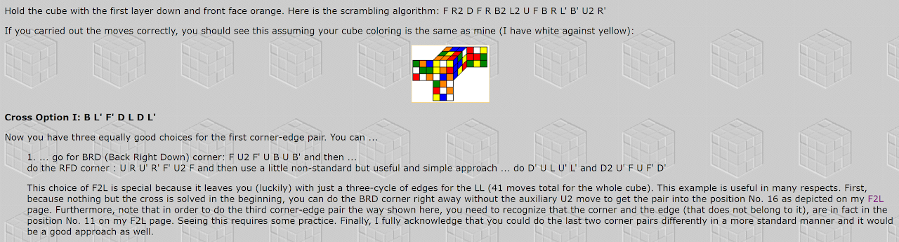

>Thanks to Filipe Teixeira for finding this on Fridrich's website.

That specific page was created after Olly Hayden's description and website [34, 35].

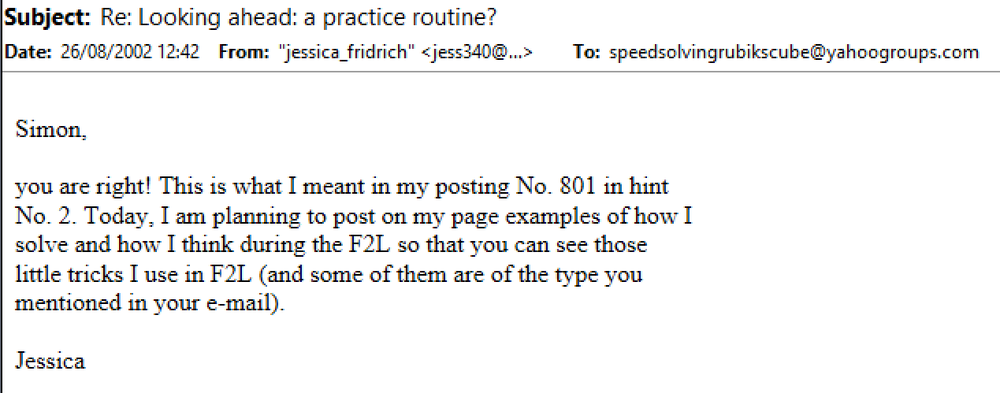

Pseudo slotting went through a few name changes over time. Olly Hayden called it non-matching pairs and that name is also used on Shotaro Makisumi's website [36]. It was also called "mis-matched pairs" or "slant pairing" by some in the community [37, 38]. 

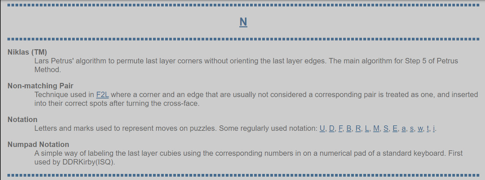

### Free Slotting

Free slotting is the solving of a corner and edge pair with either its correct bottom layer corner or with a U layer corner correctly oriented with the U layer sticker facing the bottom layer. This allows for ending the solve with normal OLL algorithms then either PLL or TTLL.

Free slotting was proposed by Ryan Hudgens in October, 2019 on the SpeedSolving forum [39].

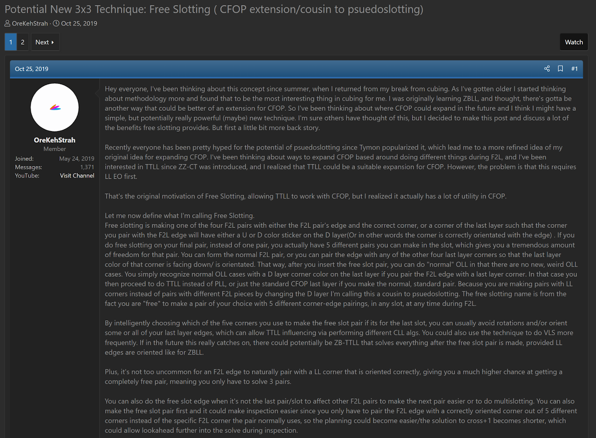

## References

[1] D. Taylor, in The Group of a Coloured Cube, New South Wales, Pure Mathematics, 1978. 

[2] J. H. Conway, D. Benson and D. Seal, in Solving the Hungarian Cube, Cambridge, UK, 1979, p. 15.

[3] J. H. Conway, D. Benson and D. Seal, in Solving the Hungarian Cube in Less Than 100 Moves, Cambridge, UK, 1979, p. 2.

[4] D. Singmaster, in Notes on Rubik’s 'Magic Cube', Hillside, NJ, Enslow Publishers, 1981, p. 32.

[5] D. Singmaster, in Notes on Rubik’s 'Magic Cube', Hillside, NJ, Enslow Publishers, 1981, p. 65.

[6] E. Berlekamp, J. H. Conway and R. Guy, in Winning Ways for Your Mathematical Plays Volume 2, New York, Academic Press, 1982, p. 767.

[7] J. Nourse, in The Simple Solution to Rubik's Cube, Toronto, Bantam, 1981, p. 41.

[8] R. Sosič and P. Sosič, "Article on Rubik’s Cube," Teleks, July 1981. 

[9] A. Treep and J. v. Rossum, Cubism For Fun, September 1981. 

[10] R. v. Bruchem, "Re: F2L system - where did it come from?," Yahoo! Groups - Speed Solving Rubik's Cube, 24 July 2003. [Online]. 

[11] F. Schiereck, De Hongaarse Kubus Voor Doordraaiers!, Mondria, 1981. 

[12] R. Heise, "F2L system - where did it come from?," Yahoo! Groups - Speed Solving Rubik's Cube, 23 July 2003. [Online]. 

[13] J. Fridrich, "Re: F2L system - where did it come from?," Yahoo! Groups - Speed Solving Rubik's Cube, 23 July 2003. [Online]. 

[14] J. Fridrich, Cube Lovers, 10 June 1996. [Online]. Available: http://www.math.rwth-aachen.de/homes/Martin.Schoenert/Cube-Lovers/[unknown_name]__Re__Methods_(Re__Speed_cubing).html.html.

[15] J. Fridrich, "20 years of speedcubing," [Online]. Available: http://www.ws.binghamton.edu/fridrich/history.html.

[16] G. R. Shultz, "Origins of CFOP," Personal Communication, 22 August 2022. [Online]. 

[17] J. Fridrich, Cube Lovers, 24 June 1996. [Online]. Available: http://www.math.rwth-aachen.de/~Martin.Schoenert/Cube-Lovers/%5bunknown_name%5d__Re__Thistlethwaites_algorithm_(and_others).html.

[18] J. Fridrich, "My system for solving Rubik's cube," [Online]. Available: http://www.ws.binghamton.edu/fridrich/system.html.

[19] J. Fridrich, "Orienting The Last Layer," [Online]. Available: http://www.ws.binghamton.edu/fridrich/Mike/orient.html.

[20] Naitsu, "３段目のキューブの色を合わせる," [Online]. Available: https://web.archive.org/web/20040810081051/http://naitsu.hp.infoseek.co.jp/orient.htm.

[21] K. Konishi, "ＯＬＬ～上面の色合わせ（向き合わせ）," [Online]. Available: https://web.archive.org/web/20040605045823fw_/http://www2.u-netsurf.ne.jp/~katsu-k/cubeoll.html.

[22] S. Makisumi, "Orientation of Last Layer (OLL)," [Online]. Available: https://web.archive.org/web/20040602231224/http://cubefreak.hp.infoseek.co.jp/OLL.html.

[23] J. Fridrich, "Permuting The Last Layer," [Online]. Available: http://www.ws.binghamton.edu/fridrich/Mike/permute.html.

[24] C. Hardwick, "New F2L method (sort of)," Yahoo! Groups - Speed Solving Rubik's Cube, 15 February 2003. [Online]. 

[25] C. Hardwick, "double extended cross," Yahoo! Groups - Speed Solving Rubik's Cube, 5 September 2004. [Online]. 

[26] D. Knights, "Re: Solving the first two layers," Yahoo! Groups - Speed Solving Rubik's Cube, 30 June 2000. [Online]. 

[27] L. Vandenbergh, "Some thoughts on learning the ZB system," Yahoo! Groups - Speed Solving Rubik's Cube, 27 October 2003. [Online]. 

[28] S. Makisumi, Yahoo! Groups - Speed Solving Rubik's Cube, 2 July 2004. [Online]. 

[29] S. Makisumi, "Re: Macky's New Average," Yahoo! Groups - Speed Solving Rubik's Cube, 13 April 2005. [Online]. 

[30] C. Hardwick, "The ZBF2L," [Online]. Available: https://web.archive.org/web/20050320040335/https://www.speedcubing.com/chris/zbf2l.html.

[31] O. Hayden, "Re: Tactics on the F2L???," Yahoo! Groups - Speed Solving Rubik's Cube, 5 May 2002. [Online]. 

[32] O. Hayden, "Non-matching pairs," [Online]. Available: https://web.archive.org/web/20021002082650/http://homepage.ntlworld.com/angela.hayden/cube/speed4.html.

[33] J. Fridrich, "First 2 Layers: Examples," [Online]. Available: http://www.ws.binghamton.edu/fridrich/examples.html.

[34] J. Fridrich, "Re: Looking ahead: a practice routine?," Yahoo! Groups - Speed Solving Rubik's Cube, 26 August 2002. [Online]. 

[35] J. Fridrich, "See how I solve the F2L," Yahoo! Groups - Speed Solving Rubik's Cube, 26 August 2002. [Online]. 

[36] S. Makisumi, "Cube Glossary," [Online]. Available: https://web.archive.org/web/20090131154731/http://cubefreak.net/other/glossary.html.

[37] D. Li, "Re: Simple to get to 1 min," Yahoo! Groups - Speed Solving Rubik's Cube, 30 August 2003. [Online]. 

[38] C. Hardwick, "Re: Advanced F2L," Yahoo! Groups - Speed Solving Rubik's Cube, 26 September 2005. [Online]. 

[39] R. Hudgens, "Potential New 3x3 Technique: Free Slotting ( CFOP extension/cousin to psuedoslotting)," SpeedSolving.com, 25 October 2019. [Online]. Available: https://www.speedsolving.com/threads/potential-new-3x3-technique-free-slotting-cfop-extension-cousin-to-psuedoslotting.75559/.