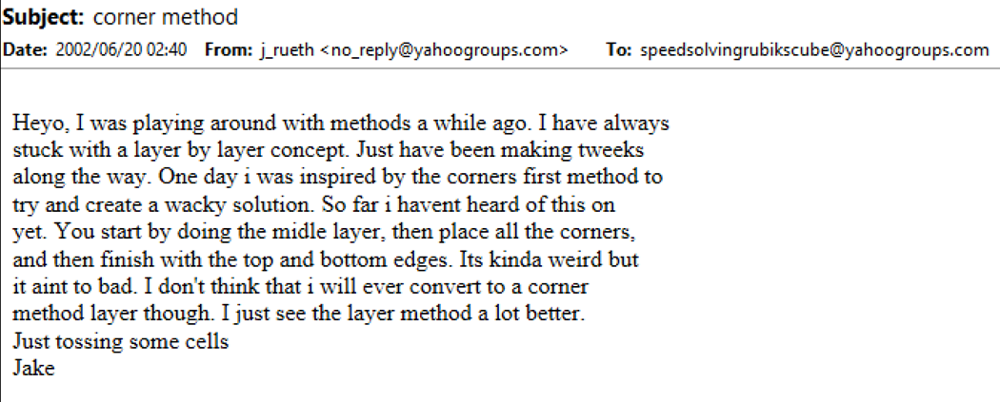
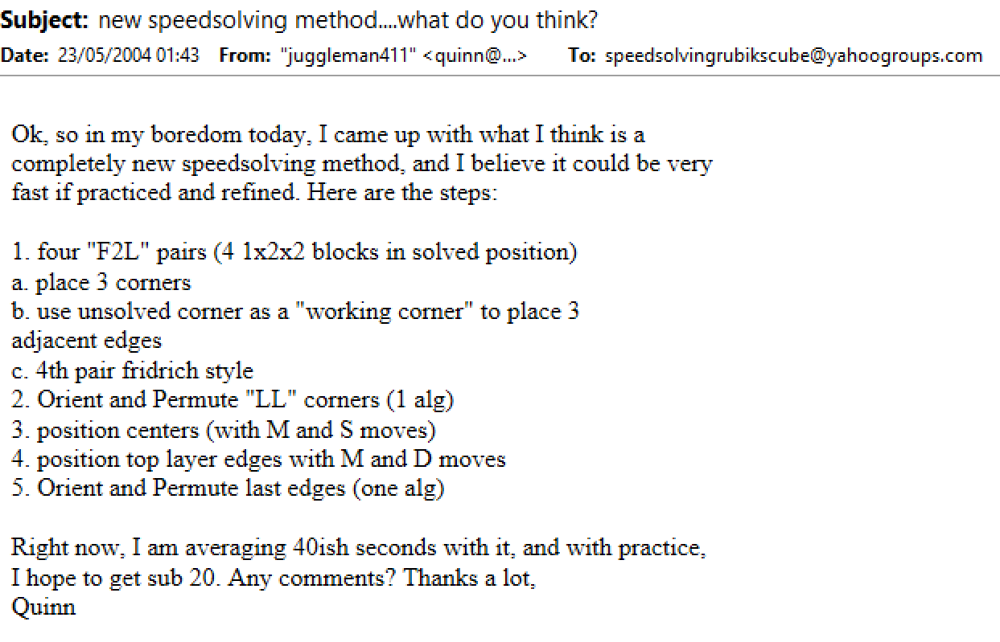
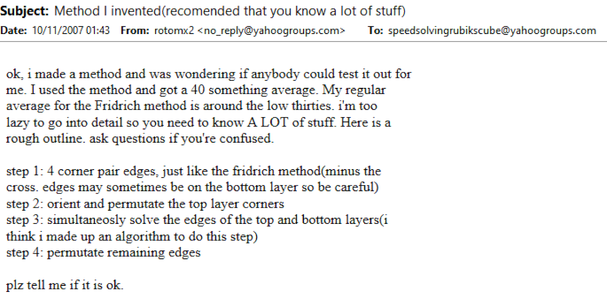
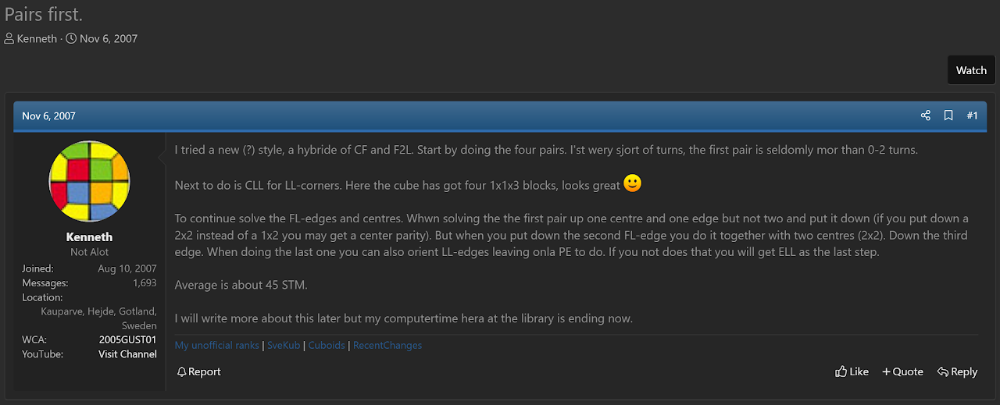

import Exhibit from "@site/src/components/Exhibit";
import YouTube from "@site/src/components/YouTube";
import ImageCollage from '@site/src/components/ImageCollage';

# Columns First

<Exhibit
stickering={{
    solved: "DFR DFL DBL DBR FR FL BL BR UFR UFL UBL UBR"}}
/>

## Description

**Proposer:** [Masayuki Akimoto](CubingContributors/MethodDevelopers.md#akimoto-masayuki), others

**Proposed:** ~1980

**Steps:**

1. Four Pairs: Solve the four corner and edge pairs of the first two layers.
2. Corners of the Last Layer (CLL): Solve the four corners of the last layer.
3. Edges: Solve the remaining edges.

[Click here for more step details on the SpeedSolving wiki](https://www.speedsolving.com/wiki/index.php/Columns_First_Methods)

## Origin

### Masayuki Akimoto

The earliest known use of the method is by Masayuki Akimoto in 1980 [^akimoto-2002] [^akimoto-2004]. This one follows a structure of solving all corners then adding the middle layer edges to form the columns shape.

### Others

Columns First has also been proposed by several others before becoming established and known as a general method [^rueth-2002] [^q-nd-1] [^q-nd-2] [^rotomx2-2007].

**2002**

**2004**

**2007**

### PCMS

The most well known Columns first proposal for several years was PCMS by Kenneth Gustavsson in 2007 [^gustavsson-2007-1] [^gustavsson-2007-2]. It follows the four corner and edge pairs structure seen in earlier proposals.

In 2011, Michael Gottlieb added a variant of PCMS to his website [^gottlieb-2011-1] [^gottlieb-2011-2].

> The post from the screenshot above states that multiple methods were added to the site. The PCMS variant was likely added at the same time as evidenced by there being no mention of the link to the Columns First page prior to the date of the post.

[^akimoto-2002]: M. Akimoto, "Original corner first method," rokumentai.akimoto3.com, [Online]. Available: https://web.archive.org/web/20040409235900/http://rokumentai.akimoto3.com/methode.htm.

[^akimoto-2004]: M. Akimoto, "Original corner first method," rokumentai.akimoto3.com, [Online]. Available: https://web.archive.org/web/20040705200720/http://rokumentai.akimoto3.com/step1-2.htm.

[^rueth-2002]: J. Rueth, "corner method," Yahoo! Groups - Speed Solving Rubik's Cube, 20 June 2002. [Online].

[^q-nd-1]: Q. "new speedsolving method...what do you think?," Yahoo! Groups - Speed Solving Rubik's Cube, 23 May 2004. [Online].

[^q-nd-2]: Q. "Re: new speedsolving method...what do you think?," Yahoo! Groups - Speed Solving Rubik's Cube, 23 May 2004. [Online].

[^rotomx2-2007]: rotomx2, "Method I invented(recomended that you know a lot of stuff)," Yahoo! Groups - Speed Solving Rubik's Cube, 11 October 2007. [Online].

[^gustavsson-2007-1]: K. Gustavsson, "Pairs first.," SpeedSolving.com, 6 November 2007. [Online]. Available: https://www.speedsolving.com/threads/pairs-first.1869/.

[^gustavsson-2007-2]: K. Gustavsson, "Columns first," Google Sites, 6 November 2007. [Online]. Available: https://web.archive.org/web/20110405232707/https://sites.google.com/site/kubbuth/columns-first.

[^gottlieb-2011-1]: M. Gottlieb, "Documented some methods on my website...," SpeedSolving.com, 19 March 2011. [Online]. Available: https://www.speedsolving.com/threads/documented-some-methods-on-my-website.28156/.

[^gottlieb-2011-2]: M. Gottlieb, "Columns First," mzrg.com, 19 March 2011. [Online]. Available: https://mzrg.com/rubik/methods/col3/.