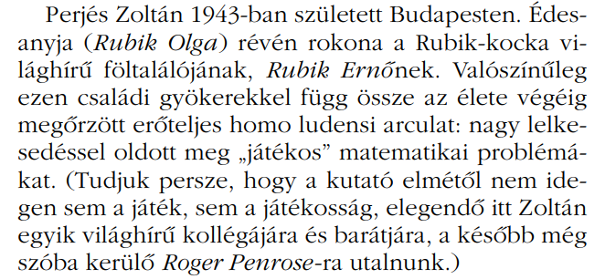

import AnimCube from "@site/src/components/AnimCube";

# Corners First

<AnimCube params="buttonbar=0&position=lluuu&scale=6&hint=10&hintborder=1&borderwidth=10&facelets=ydydydydywdwdwdwdwbdbdbdbdbgdgdgdgdgododododordrdrdrdr" width="400px" height="400px" />

## Description

**Proposer:** [Ernő Rubik](CubingContributors/MethodDevelopers.md#rubik-ernő), others

**Proposed:** ~1974

**Steps:**

1. Corners: Solve all corners.
2. Edges: Solve all edges.

[Click here for more step details on the SpeedSolving wiki](https://www.speedsolving.com/wiki/index.php/Corners_First)

## Origin

### Ernő Rubik

On page 40 of David Singmaster's *Notes on Rubik's 'Magic Cube'* [1], the steps of Erno Rubik's method are written as described by Zoltán Perjés, a relative of Rubik [2]. This makes Ernő Rubik the first to have created the corners first method and also corners first as the first method created to solve the cube.

Zoltán Perjés was a relative of Rubik.

In May, 2003, Dan Knights stated that in 1999 he observed Rubik solve the cube [3]. He outlined the steps that he saw. The steps are slightly different when comparing with Perjés' description. In Knights' description, three edges of the first layer are solved before the last layer corners.

### First Publication

The first known published Corners First method came in 1978 by Hanke Bremer in *Ein Paar Würfeldrehungen* [4].

>I contacted Georges Helm to ask the method steps in all of the books he owns from 1980 and earlier. This is a handwritten list of steps. "K" is for edges and "E" is for corners. The numbers on the left indicate the bottom, middle, and upper layer. "P" is for "position" and "O" is for "orient". Hanke Bremer's publication is the earliest of the books he owns that describes corners first.

### Minh Thai

Minh Thai used Corners First to win the Rubik's Cube World Championship on June 5, 1982 [5]. This is where he achieved the 22.95 seconds world record. His method was then published in The Winning Solution in 1982 [6].

### Others

Various Corners First methods were published in 1979.

- Singmaster, David: Notes on Rubik's 'Magic Cube' - 1979
  - Bottom layer corners, permute upper corners, orient upper layer corners, solve all edges.

- Claxton, Mike: Solution to the Magic Cube - 1979 
  - First layer corners, last layer corners, first layer edges, last layer edges position then orient, solve second layer edges.

- Beasley J.D.: A Solution to the Twisted Cubes - 1979
  - Corners, edges, then centers according to Singmaster in Notes on Rubik's 'Magic Cube'.

- Dauphin, Michel: Un Cube Pas Comme Les Autres - 1979
  - Similar to Bremer’s method according to Singmaster in *Notes on Rubik's 'Magic Cube'*.

>The steps for Claxton's method were provided to me by Georges Helm. The others can be found in Notes on Rubik's 'Magic Cube'.

## References

[1] D. Singmaster, in Notes on Rubik's 'Magic Cube', Hillside, NJ, Enslow Publishers, 1981, p. 40.

[2] P. Forgács, "fizikai szemle," January 2007. [Online]. Available: http://www.epa.oszk.hu/00300/00342/00200/pdf/FizSzem_EPA00342_2007_01.pdf.

[3] D. Knights, "Re: Mr. Rubik's solving system," Yahoo! Groups - Speed Solving Rubik's Cube, 18 May 2003. [Online]. 

[4] H. Bremer, Ein Paar Würfeldrehungen, Frankfurt, Germany, 1978. 

[5] D. Singmaster, Cubic Circular, 1982. [Online]. Available: https://www.jaapsch.net/puzzles/cubic3.htm.

[6] M. Thai, The Winning Solution, Wayne, PA: Banbury Books, 1982.