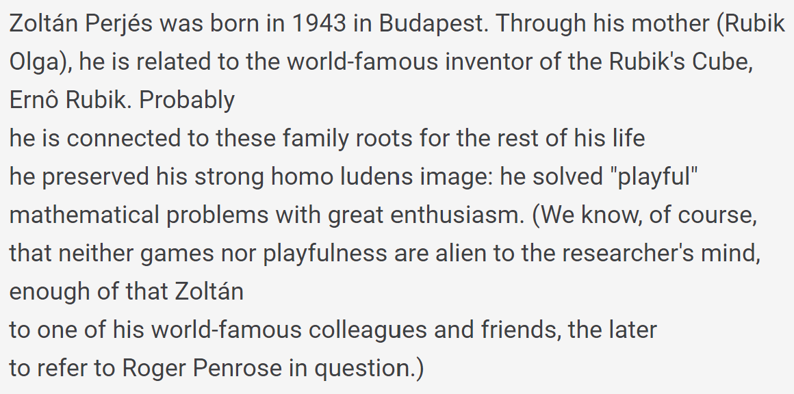
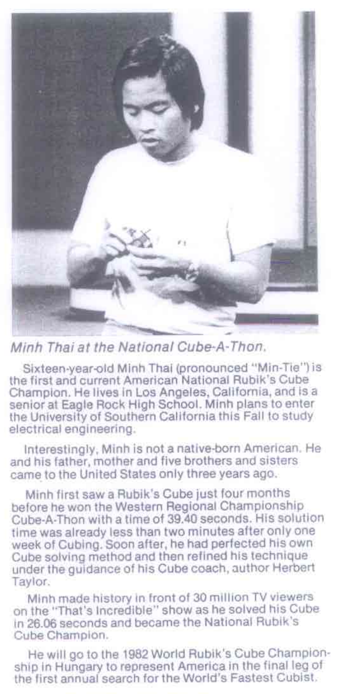

import Exhibit from "@site/src/components/Exhibit";
import YouTube from "@site/src/components/YouTube";
import ReactPlayer from 'react-player'
import ImageCollage from '@site/src/components/ImageCollage';

# Corners First

<Exhibit
stickering={{
    solved: "DFR DFL DBL DBR UFR UFL UBL UBR"}}
/>

## Description

**Proposer:** [Ernő Rubik](CubingContributors/MethodDevelopers.md#rubik-ernő), others

**Proposed:** ~1974

**Steps:**

1. Corners: Solve all corners.
2. Edges: Solve all edges.

[Click here for more step details on the SpeedSolving wiki](https://www.speedsolving.com/wiki/index.php/Corners_First)

## Origin

### Ernő Rubik

On page 40 of David Singmaster's _Notes on Rubik's 'Magic Cube'_ [^singmaster-1981] dated 1980, the steps of Erno Rubik's method are written as described by Zoltán Perjés, a relative of Rubik [^forgacs-2007]. This makes Ernő Rubik the first to have created the corners first method and also corners first as the first method created to solve the cube. It is notable that the steps are similar to those used by Minh Thai to achieve the first world record recognized by the World Cube Association.

 
English translation:

Rubik’s method as described by Zoltán Perjés:

1. Solve the bottom layer corners.
2. Permute then orient the upper layer corners.
3. Solve three bottom layer edges, solve three upper layer edges, then solve the final two bottom and upper layer edges.
4. Solve the middle layer edges.

In May, 2003, Dan Knights stated that in 1999 he observed Rubik solve the cube [^knights-nd]. He outlined the steps that he saw. The steps are slightly different when comparing with Perjés' description. In Knights' description, three edges of the first layer are solved before the last layer corners.

Rubik’s method as described by Dan Knights:

1. Solve the bottom layer corners then solve three edges of the bottom layer.
2. Solve the upper layer corners.
3. Solve three upper layer edges then solve the final two bottom and upper layer edges.
4. Permute then orient the middle layer edges.

### First Publication

The first known published Corners First method came in 1978 by Hanke Bremer in _Ein Paar Würfeldrehungen_ [^bremer-1978].

> I contacted Georges Helm to ask the method steps in all of the books he owns from 1980 and earlier. This is a handwritten list of steps. "K" is for edges and "E" is for corners. The numbers on the left indicate the bottom, middle, and upper layer. "P" is for "position" and "O" is for "orient". Hanke Bremer's publication is the earliest of the books he owns that describes corners first.

### Minh Thai

Minh Thai used Corners First to win the Rubik's Cube World Championship on June 5, 1982 [^singmaster-1982]. This is where he achieved the 22.95 seconds world record. It is often thought that Minh Thai’s book, _The Winning Solution_, is titled so because of his win at the 1982 championship. However, the book’s title comes from his wins at earlier competitions [^thai-1982]. Prior to the 1982 championship, Minh Thai won the Rubik’s Cube-A-Thon held on November 13 1981, becoming the United States National Champion [^parks-1982]. The book was published in April 1982, two months before the 1982 championship.

The steps of Minh Thai’s method, as described in _The Winning Solution_, are as follows [6]:

1. Solve one layer of corners.
2. Permute the opposite layer corners then orient the opposite layer corners.
3. Solve three edges of one side, three edges of the opposite side, then simultaneously solve the final two opposite side edges.
4. Orient the final middle layer edges then permute the edges.

<YouTube embedId="zVkZEQeUk-g" />

### Others

Various Corners First methods were published in 1979.

- Singmaster, David: Notes on Rubik's 'Magic Cube' - 1979

  - Bottom layer corners, permute upper corners, orient upper layer corners, solve all edges.

- Claxton, Mike: Solution to the Magic Cube - 1979

  - First layer corners, last layer corners, first layer edges, last layer edges position then orient, solve second layer edges.

- Beasley J.D.: A Solution to the Twisted Cubes - 1979

  - Corners, edges, then centers according to Singmaster in Notes on Rubik's 'Magic Cube'.

- Dauphin, Michel: Un Cube Pas Comme Les Autres - 1979
  - Similar to Bremer’s method according to Singmaster in _Notes on Rubik's 'Magic Cube'_.

The steps for Claxton's method were provided to CubingHistory.com by Georges Helm. The others can be found in Notes on Rubik's 'Magic Cube'.

[^singmaster-1981]: D. Singmaster, in Notes on Rubik's 'Magic Cube', Hillside, NJ, Enslow Publishers, 1981, p. 40.

[^forgacs-2007]: P. Forgács, "fizikai szemle," January 2007. [Online]. Available: http://www.epa.oszk.hu/00300/00342/00200/pdf/FizSzem_EPA00342_2007_01.pdf.

[^knights-nd]: D. Knights, "Re: Mr. Rubik's solving system," Yahoo! Groups - Speed Solving Rubik's Cube, 18 May 2003. [Online].

[^bremer-1978]: H. Bremer, Ein Paar Würfeldrehungen, Frankfurt, Germany, 1978.

[^singmaster-1982]: D. Singmaster, Cubic Circular, 1982. [Online]. Available: https://www.jaapsch.net/puzzles/cubic3.htm.

[^thai-1982]: M. Thai, The Winning Solution, Wayne, PA: Banbury Books, 1982.

[^parks-1982]: T. Parks, "AT THE U.S. NATIONAL CHAMPIONSHIPS," Rubik's Cube-A-Thon, vol. 1, no. https://www.speedcubing.com/ton/Archive/Rubik's%20Cube%20News%20Letter%20Vol%201%20No1.pdf, p. 1, 1982.