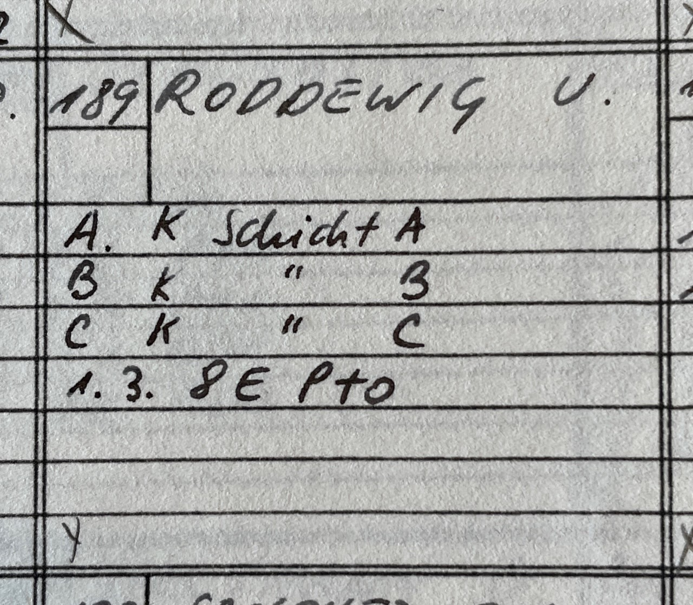

# Edges First

## Description

**Proposer:** Various

**Proposed:** ~1979

**Steps:**

1. Solve all edges.
2. Solve all corners.

[Click here for more step details on the SpeedSolving wiki](https://www.speedsolving.com/wiki/index.php/Edges_First)

## Origin

### First Publication

The first known publication of an Edges First method is from June 1979. The method appeared in Ulrich Roddewig's *Solution Guide for the Hungarian Magic Cube*.

