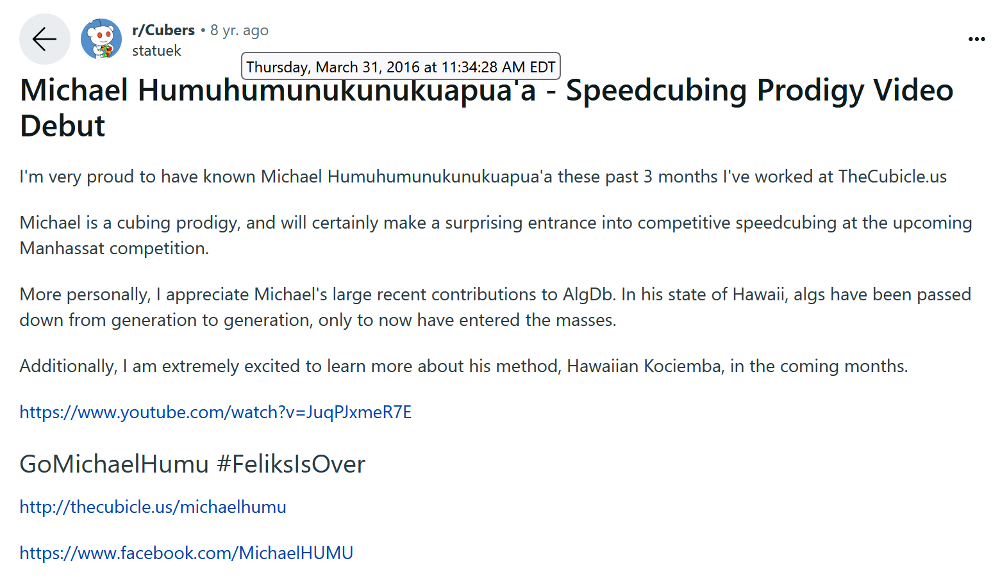
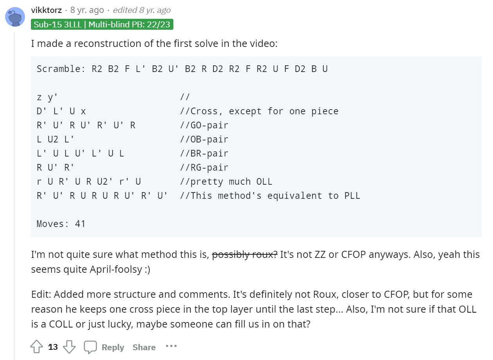
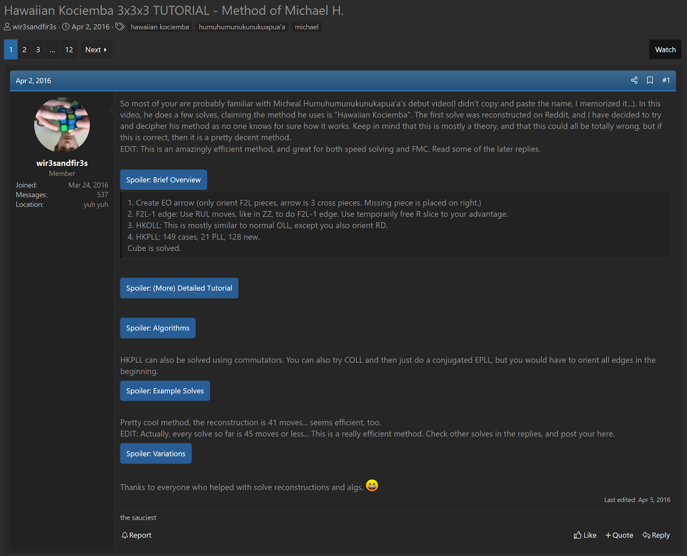
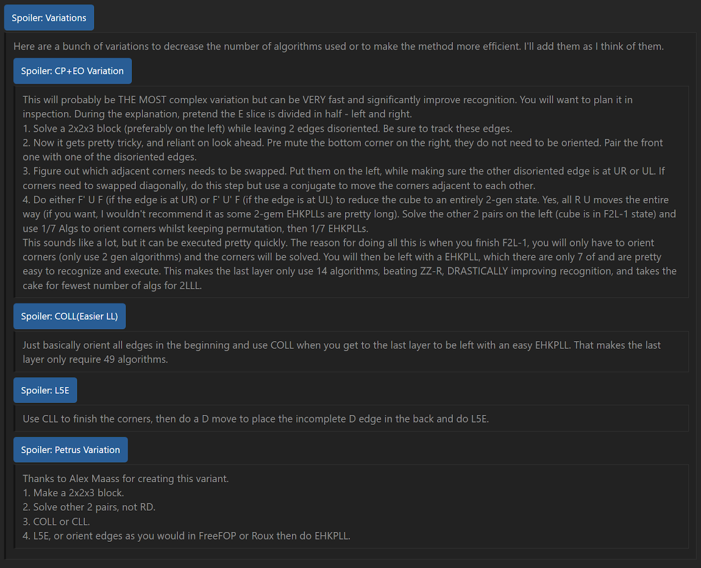
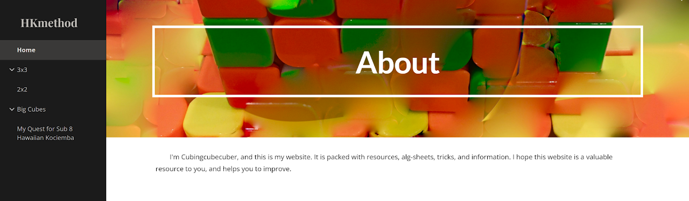
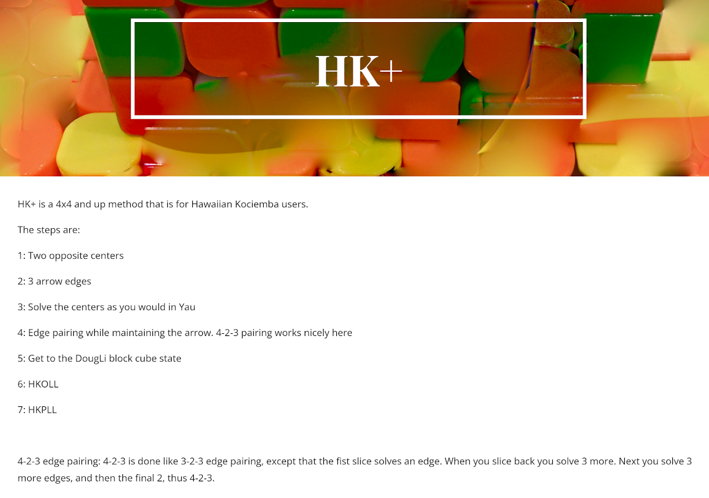

# Hawaiian Kociemba

## Description

**Proposer:** Rowe Hessler, Brayden Mossey

**Proposed:** 2016

**Steps:**

1. EOArrow: Solve the bottom layer cross minus one edge while orienting the edges of the first two layers.
2. Complete the first two layers ignoring the missing cross edge.
3. HKOLL: Orient the last layer and the empty edge location of the bottom layer.
4. HKPLL: Permute the last layer and the missing cross edge.

[Click here for more step details on the SpeedSolving wiki](https://www.speedsolving.com/wiki/index.php?title=Hawaiian_Kociemba)

## Origin

On April 1, 2016 The Cubicle posted a video titled *Michael Humuhumunukunukuapua'a's International Debut*. This video featured several solves with solutions that the community couldn't match to any known method.

https://www.youtube.com/watch?v=JuqPJxmeR7E

Stachu Korick shared the video and a bit more on the mystery story on Reddit.

https://www.reddit.com/r/Cubers/comments/4cqj3p/michael_humuhumunukunukuapuaa_speedcubing_prodigy/

In the Reddit thread, user vikktorz provided a reconstruction of a solve from the video.

https://www.reddit.com/r/Cubers/comments/4cqj3p/michael_humuhumunukunukuapuaa_speedcubing_prodigy/

On April 23, 2016 The Cubicle posted a video explaining the April Fool's joke. The video also described the solves. Rowe Hessler was the solver in the video and he performed CFOP solves with random alterations to the steps in the later part of the solves.

https://www.youtube.com/watch?v=1MniU99_hw4

## Interpretation and Step Creation

Brayden Mossey (user wir3sandfir3s on speedsolving.com) started a discussion with their interpretation of the method in the video. Those steps are now solidified as Hawaiian Kociemba. The interpretation by Brayden Mossey was based only on the first solve in the video where Rowe left out a cross edge before getting to PLL. The remaining two solves in the original video have no resemblance to the first solve interpretation that became Hawaiian Kociemba.

https://www.speedsolving.com/threads/hawaiian-kociemba-3x3x3-tutorial-method-of-michael-h.60492/

## Variants

Multiple variants were proposed in the first speedsolving.com thread and on the Hawaiian Kociemba website. The Hawaiian Kociemba website was created by Cubingcubecuber who produced some community interest in the method after starting his Quest For Sub 10 Hawaiian Kociemba thread on speedsolving.com

https://www.speedsolving.com/threads/hawaiian-kociemba-3x3x3-tutorial-method-of-michael-h.60492/
https://sites.google.com/view/hkmethod/home?authuser=0

In 2020, Cubincubecuber proposed a version of Hawaiian Kociemba for big cubes, named HK+

https://sites.google.com/view/hkmethod/big-cubes/hk?authuser=0