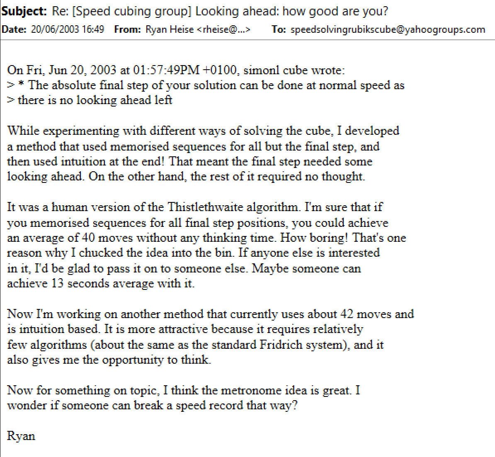
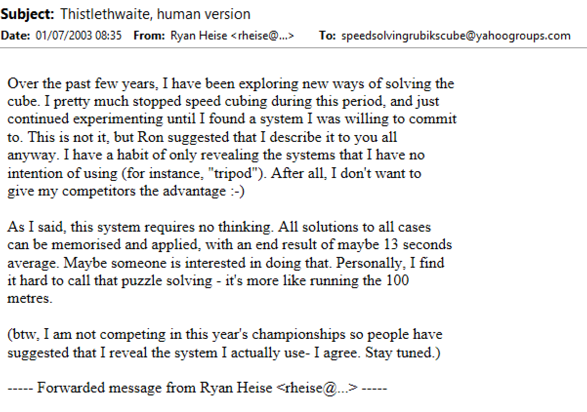
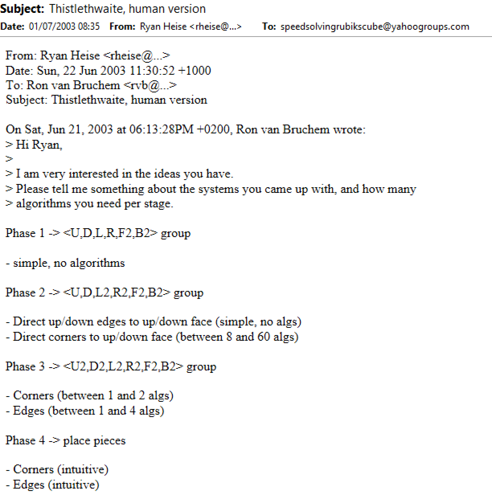
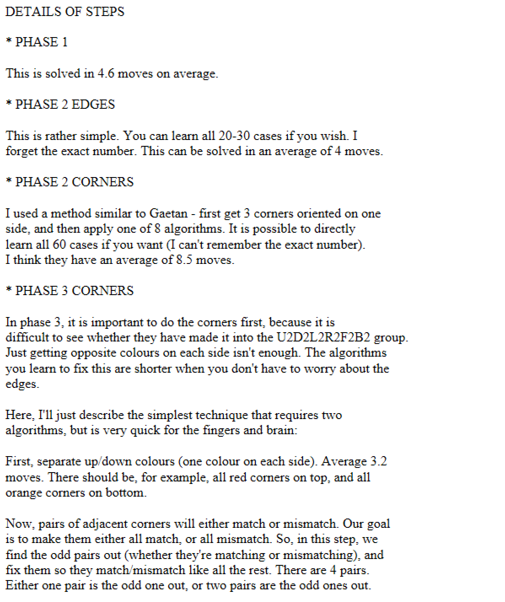
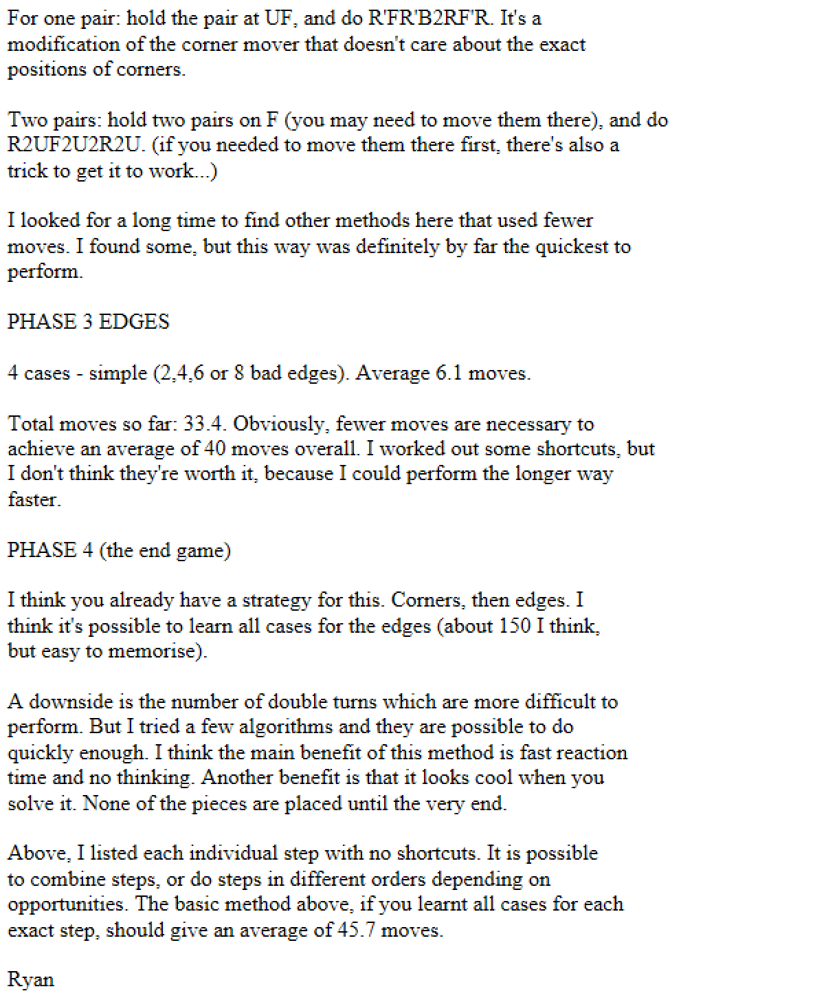
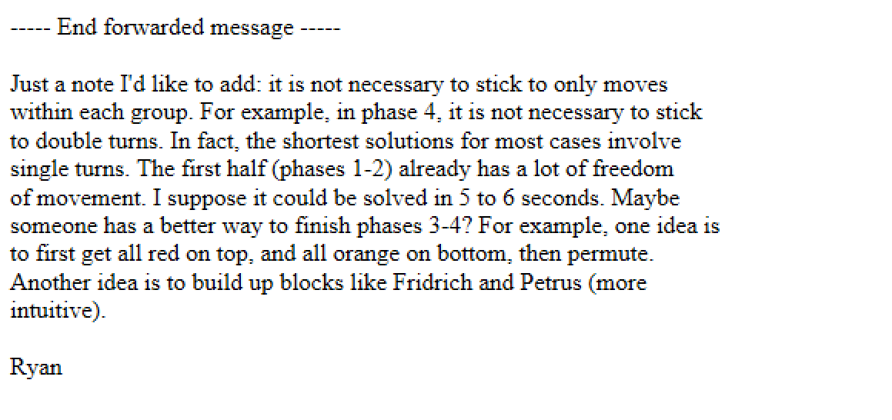
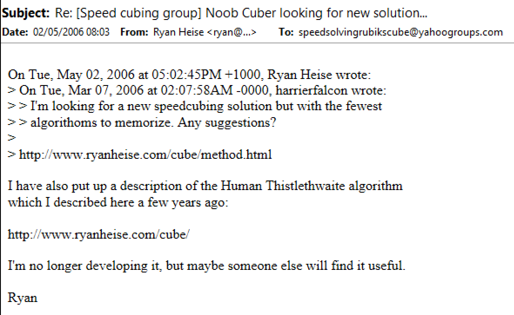

import TwistyPlayer from "@site/src/components/TwistyPlayer";
import YouTube from "@site/src/components/YouTube";
import ImageCollage from '@site/src/components/ImageCollage';

# Human Thistlethwaite

<TwistyPlayer
  alg="x2 D2 U2 L2 B2 L2"
 controlPanel="none"
/>

## Description

**Proposer:** [Ryan Heise](CubingContributors/MethodDevelopers.md#heise-ryan)

**Proposed:** 2002

**Steps:**

1. Reduce the cube to the move group \<U, D, L, R, F2, B2>. This means to orient all edges along the z axis.
2. Reduce to the \<U, D, L2, R2, F2, B2> move group. U/D layer edges are moved to U/D and all corners are oriented to U/D.
3. Reduce to the \<U2, D2, L2, R2, F2, B2> move group. The corners are permuted to have opposite stickers on all sides and all edges are moved to their native inner layers.
4. Permute all pieces using the \<U2, D2, L2, R2, F2, B2> move group.

[Click here for more step details on the SpeedSolving wiki](https://www.speedsolving.com/wiki/index.php/Human_Thistlethwaite_Algorithm)

## Introduction

This page describes a method developed by Ryan Heise, that is an adaption of the Thistlethwaite algorithm for human use. There is a very similar method called [3-Color](3x3/Methods/3Color.md). For now, the two methods are described separately due to the different intents. More specifically, Human Thistlethwaite is best described as an easy to use version of the Thistlethwaite computer algorithm and 3-Color is intended to be a primary method with which to solve.

## Origin

### Initial Description

The first mention of the method was in June, 2003. Ryan Heise stated that he had once developed a human adaption of the Thistlethwaite algorithm [^heise-2003-1].

A couple of weeks later, in July, 2003, Heise described the steps and process [^heise-2003-2].

### Website Addition

In late April or early May, 2006, Heise added the method to his website [^heise-2006] [^heise-nd]. The website states that the method was created in December of 2002.

[^heise-2003-1]: R. Heise, "Re: [Speed cubing group] Looking ahead: how good are you?," Yahoo! Groups - Speed Solving Rubik's Cube, 20 June 2003. [Online].
[^heise-2003-2]: R. Heise, "Thistlethwaite, human version," Yahoo! Groups - Speed Solving Rubik's Cube, 1 July 2003. [Online].
[^heise-2006]: R. Heise, "Re: [Speed cubing group] Noob Cuber looking for new solution…," Yahoo! Groups - Speed Solving Rubik's Cube, 2 May 2006. [Online].
[^heise-nd]: R. Heise, "Human Thistlethwaite Algorithm," ryanheise.com, [Online]. Available: https://web.archive.org/web/20060703235037/http://www.ryanheise.com/cube/human_thistlethwaite_algorithm.html.