import AnimCube from "@site/src/components/AnimCube";

# L2L

<AnimCube params="config=../../ExhibitConfig.txt&facelets=ddddyddddwwwwwwwwwdbbdbbddbdggdggdggdddooooooddrdrrdrr" width="400px" height="400px" />

## Description

**Proposer:** [Duncan Dicks](CubingContributors/MethodDevelopers.md#dicks-duncan)

**Proposed:** 2004

**Steps:**

1. Solve the cross and one bottom layer corner.
2. Add the three corner edge pairs in the empty slots.
3. Solve the final middle layer edge while orienting all last layer edges and one last layer corner.
4. Orient the last layer.
5. Permute the last layer.

>L2L contains several variants. Typically the method performs simultaneous state changes and solving of the middle layer and upper layer.

[Click here for more step details on the SpeedSolving wiki](https://www.speedsolving.com/wiki/index.php/L2L4)

## Origin

### Initial Ideas

In December, 2003, Duncan Dicks started discussing ideas for a new method [1]. It started with some last layer ideas, each manipulating multiple piece types at once.

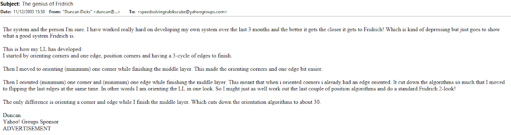

In February, 2004, he mentioned the idea of getting to the F2L minus second layer edge state [2].

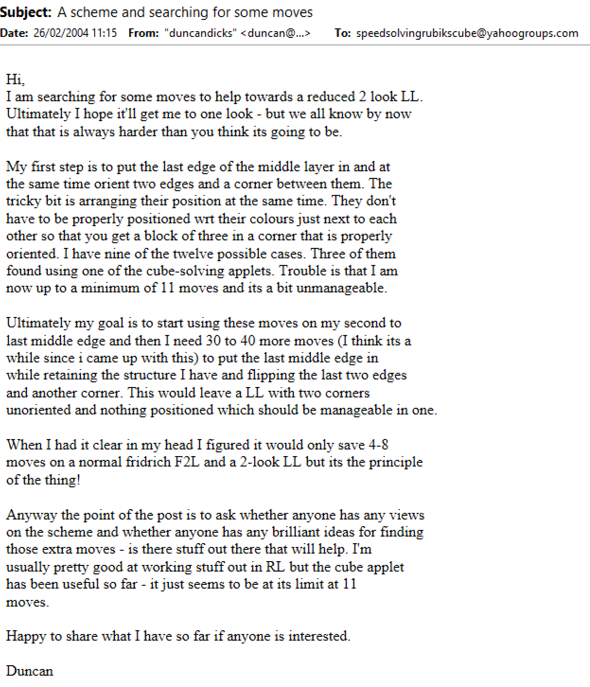

### L2L Proposal

In May, 2004, L2L was proposed [3].

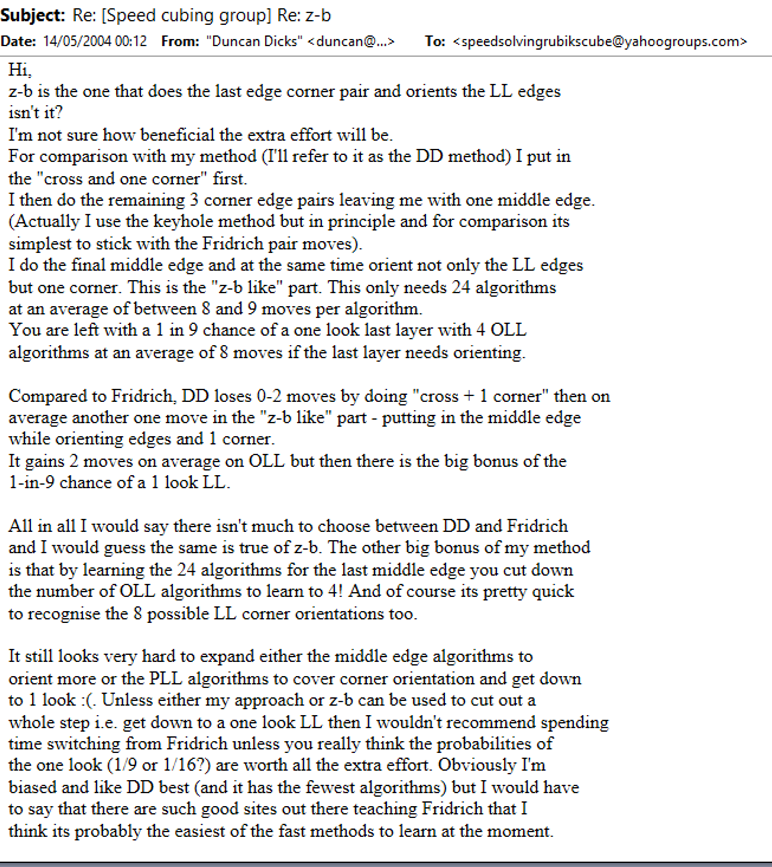

### Variants

In June, 2004, several variants were added [4].

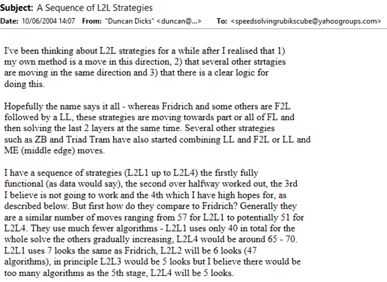
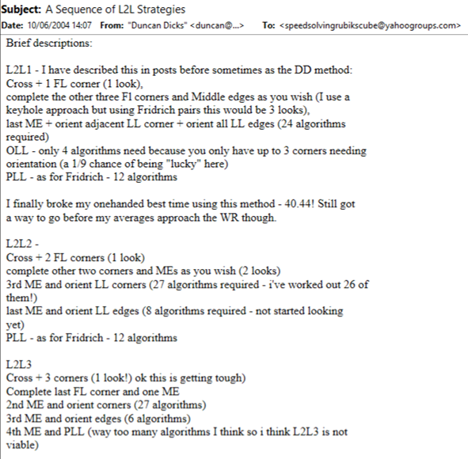
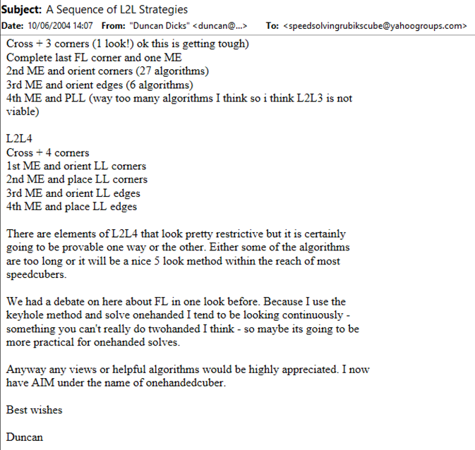

### Website

A website was created for L2L in September, 2004 [5, 6].

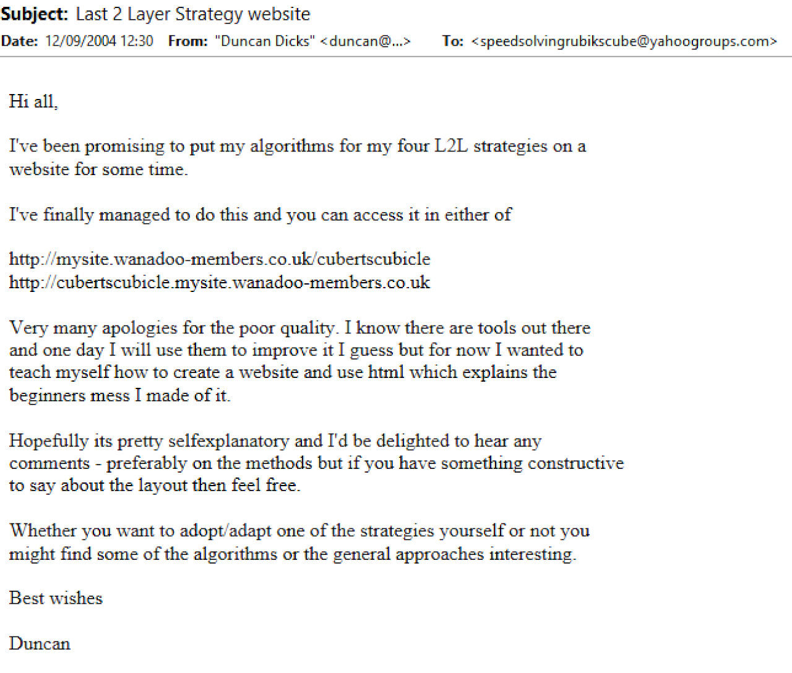
https://web.archive.org/web/20080308133423/cubertscubicle.mysite.wanadoo-members.co.uk/

## Community Interest and Development

### Stachu Korick

Several people in the community have expressed interest in the method. Enough that additional variants have been developed.

Stachu Korick began taking an interest in L2L development possibly in October, 2010 [7, 8].

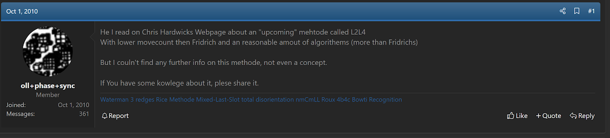
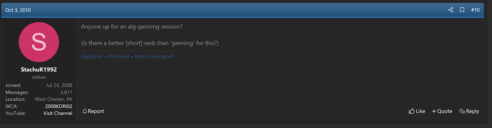
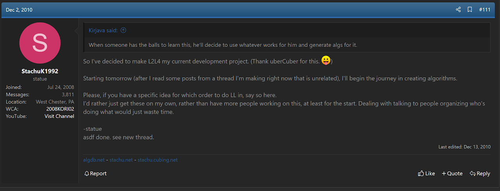
https://www.speedsolving.com/threads/l2l4-the-lost-methode-help-find-it.24508/

In December, 2010, Korick created a thread on speedsolving.com about development efforts [9, 10].

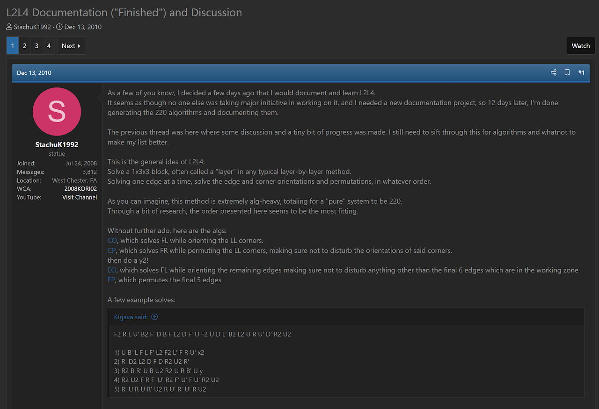

https://web.archive.org/web/20101217011022/https://dl.dropbox.com/u/4101778/L2L4%20alpha/CO.txt
https://web.archive.org/web/20101217061515/https://dl.dropbox.com/u/4101778/L2L4%20alpha/CP.txt
https://web.archive.org/web/20101217060921/https://dl.dropbox.com/u/4101778/L2L4%20alpha/EO.txt
https://web.archive.org/web/20101217061522/https://dl.dropbox.com/u/4101778/L2L4%20alpha/EP.txt

In 2011, Stachu Korick completed development on a new variant called L2Lk [11].

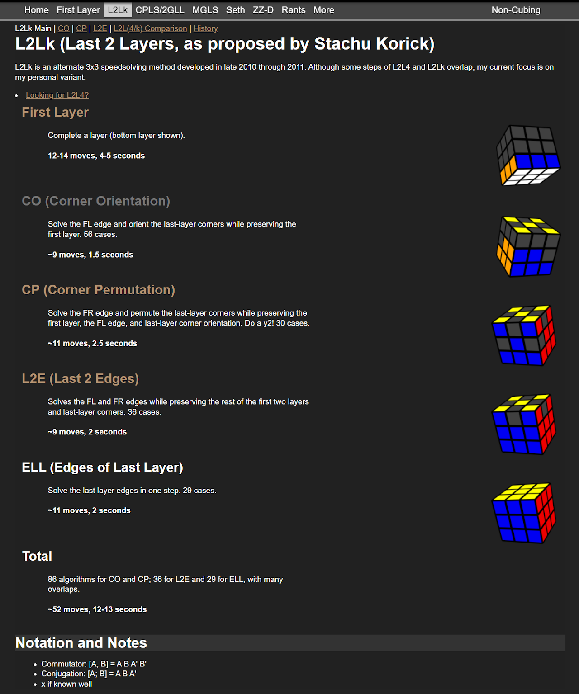

### Joseph Tudor

As part of the Method Development Competition held in August, 2020, Joseph Tudor developed an L2L variant named L2L5 [12]. The steps of this variant are:

1. Solve the bottom layer.
2. Solve three edges in the E layer
3. Solve the corners of the last layer.
4. Solve the last five edges.

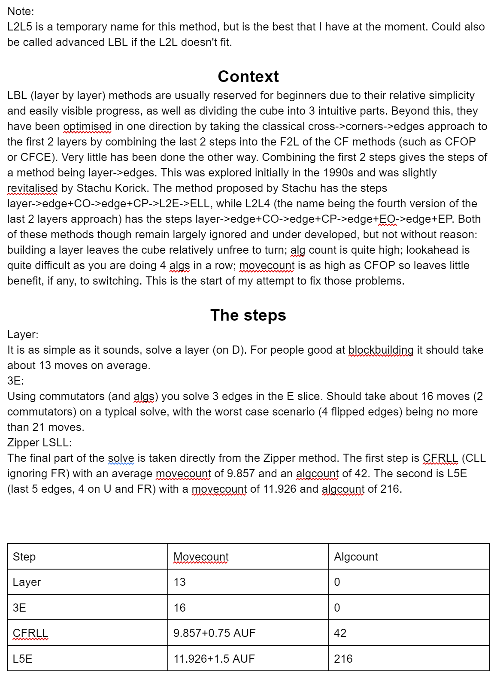

## References

[1]	D. Dicks, "The genius of Fridrich," Yahoo! Groups - Speed Solving Rubik's Cube, 11 December 2003. [Online].

[2]	D. Dicks, "A scheme and searching for some moves," Yahoo! Groups - Speed Solving Rubik's Cube, 26 February 2004. [Online].

[3]	D. Dicks, "Re: [Speed cubing grou] Re:z-b," Yahoo! Groups - Speed Solving Rubik's Cube, 14 May 2004. [Online].

[4]	D. Dicks, "A Sequence of L2L Strategies," Yahoo! Groups - Speed Solving Rubik's Cube, 10 June 2004. [Online].

[5]	D. Dicks, "Last 2 Layer Strategy website," Yahoo! Groups - Speed Solving Rubik's Cube, 12 September 2004. [Online].

[6]	D. Dicks, "L2L Strategies," Cubert’s Cubicle, 12 September 2004. [Online]. Available: https://web.archive.org/web/20080308133423/cubertscubicle.mysite.wanadoo-members.co.uk/.

[7]	S. Korick, "L2L4 - The Lost Methode ? Help Find it!," SpeedSolving.com, 2 October 2010. [Online]. Available: https://www.speedsolving.com/threads/l2l4-the-lost-methode-help-find-it.24508/post-463780.

[8]	S. Korick, "L2L4 - The Lost Methode ? Help Find it!," SpeedSolving.com, 1 December 2010. [Online]. Available: https://www.speedsolving.com/threads/l2l4-the-lost-methode-help-find-it.24508/post-494669.

[9]	S. Korick, "L2L4 Documentation ("Finished") and Discussion," SpeedSolving.com, 13 December 2010. [Online]. Available: https://www.speedsolving.com/threads/l2l4-documentation-finished-and-discussion.26099/.

[10]	S. Korick, "L2L4 Documentation ("Finished") and Discussion," SpeedSolving.com, 13 December 2010. [Online]. Available:
https://web.archive.org/web/20101217011022/https://dl.dropbox.com/u/4101778/L2L4%20alpha/CO.txt
https://web.archive.org/web/20101217061515/https://dl.dropbox.com/u/4101778/L2L4%20alpha/CP.txt
https://web.archive.org/web/20101217060921/https://dl.dropbox.com/u/4101778/L2L4%20alpha/EO.txt
https://web.archive.org/web/20101217061522/https://dl.dropbox.com/u/4101778/L2L4%20alpha/EP.txt

[11]	S. Korick, "L2Lk (Last 2 Layers, as proposed by Stachu Korick)," stachu.cubing.net, 2011. [Online]. Available: https://web.archive.org/web/20160825153229/http://stachu.cubing.net/l2lk/.

[12]	J. Tudor, "L2L5," Google Docs, August 2020. [Online]. Available: https://docs.google.com/document/d/1rGoKnkEjS2Tfs3JJ2t1zcU7F6b7bati8te5oGhqJuGY/edit.