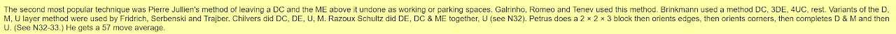
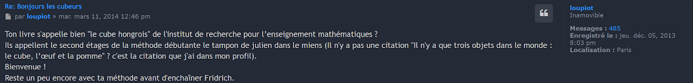
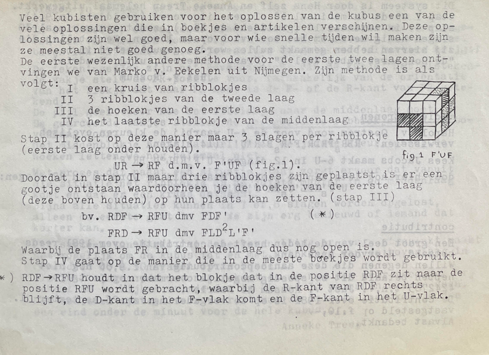
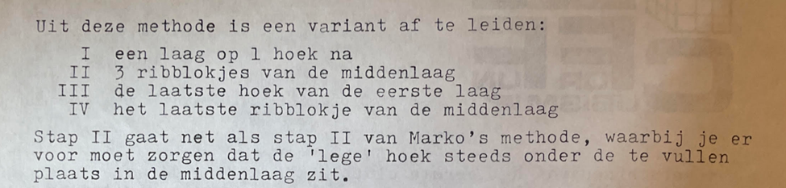

# Layer By Layer

## Description

**Proposer:** [Donald Taylor](CubingContributors/MethodDevelopers.md#taylor-donald), others

**Proposed:** 1978

**Steps:**

1. Solve the four edges of the bottom layer (cross).
2. Solve the four corners of the bottom layer.
3. Solve the four edges of the middle layer.
4. Solve the last layer, typically executed in four sub-steps.

[Click here for more step details on the SpeedSolving wiki](https://www.speedsolving.com/wiki/index.php/Layer_by_layer)

## Origin

### First Known Publication

The first known publication of the Layer By Layer method is in 1978 by Donald Taylor in *The Group of a Coloured Cube* [1].

>I contacted Georges Helm to ask the method steps in all of the books he owns from 1980 and earlier. This is a handwritten list of steps. "K" is for edges and "E" is for corners. The numbers on the left indicate the bottom, middle, and upper layer. "P" is for "position" and "O" is for "orient". Donald Taylor's publication is the earliest of the books he owns that describes Layer By Layer.

>The steps are: Edges of first layer, corners of the first layer, edges of the middle layer, permute the last layer corners, permute the last layer edges, orient the last layer corners, orient the last layer edges. These same steps are also described in *Notes on Rubik's 'Magic Cube'*.

### David Singmaster

One of the most well known examples of the Layer By Layer method is the one described in September, 1979 by David Singmaster in *Notes on Rubik's 'Magic Cube'* [2]. Originally, Singmaster had been using a Corners First method [3]. Then, upon learning that some had been using a Layer By Layer Method, Singmaster designed a Layer By Layer method of his own with a different last layer solving variant.

Singmaster stated: "I have found that different people have quite different strategies for restoring the cube to START. Several people get all the edges in place first, then apply P4's or other combinations of commutators to get the corners in place. Many people get the whole bottom layer correct, then the middle layer, then the top layer."

This appears in a section dated February 1979, before Singmaster changed to a Layer By Layer method. It seems that David Singmaster developed his Layer By Layer method based on the other Layer By Layer methods that he had seen others using.

Additionally, Singmaster was featured in an interview on twistypuzzles.com where he stated "The next major insight was the use of double level commutators. I recall Peter McMullen telling me about the Cambridge group using moves that only affected one or two U pieces. At first this seemed silly, but then commuting this with U gives easy useful processes. I realised that the square and the cube of the commutator [F,R] gave easy moves that affected just one corner in the L face and this allowed me to produce easy processes for moving and twisting corners. From this, I built up the method given in my Notes, initially in Oct 1979, then developed in detail and made into a separate handout in Aug 1980." [4, 5]

The steps of Singmaster's Layer By Layer variant, as written by Singmaster:

1. Put all bottom edges correctly in place.
2. Put all bottom corners correctly in place.
3. Put middle slice edges correctly in place.
4. Flip top edges so all U faces are up.
5. Make top orientation correct.
6. Put top edges correctly in place.
7. Put top corners in their right positions.
8. Twist top corners into their correct orientations.

### Other Publications

Other Layer By Layer methods were published in 1979.

- Gaskin, John: Cubist Rescue Service -Emergency Kit – 1979 (unknown month)
  - Steps: First layer edges, first layer corners, second layer edges, orient then permute last layer edges, permute then orient last layer corners.
- Sweenen, John: The Hungarian Magic Cube - A Solution – 1979 (unknown month)
  - First layer edges, first layer corners, three second layer edges, permute then orient last layer corners, final second layer edge, permute then orient last layer edges.
- Nelson, Roy: The Hungarian Cube - Nov-79
  - First layer, second layer, orient last layer corners, permute last layer corners, orient last layer edges, permute last layer edges.

## Keyhole

Keyhole appears in March 1981 in Pierre Julien's *Le Cube Hongrois* [6, 7]. This publication is also mentioned in the blibliography of *Notes on Rubik's 'Magic Cube'* [8].

An early version of Keyhole also appeared in the September, 1981 issue of Cubism for Fun and is credited to Marko van Eekelen [9].

Marko Eekelen published a 1981 book titled *Het Geheim Van De Wonderbaarlijke Kubus* (English: How to Solve the Cube Puzzle) [10]. The method follows the below steps:

1. Edges of the first layer.
2. Three edges of the second layer.
3. All corners of the first layer. This uses the empty edge slot of the second layer as the keyhole.
4. Last edge of the second layer.
5. Last layer typical of other Layer By Layer methods at the time.

The September 1981 issue of Cubism For Fun provides an upgrade to Eekelen's method [9].

This version is more like the current basic keyhole methods:

1. Layer minus one corner.
2. Three edges of the second layer.
3. Last corner of the first layer.
4. Last edge of the second layer.
5. Last layer.

References

1. D. Taylor, in The Group of a Coloured Cube, New South Wales, Pure Mathematics, 1978. 
2. D. Singmaster, in Notes on Rubik’s 'Magic Cube', Hillside, NJ, Enslow Publishers, 1981, p. 24.
3. D. Singmaster, in Notes on Rubik’s 'Magic Cube', Hillside, NJ, Enslow Publishers, 1981, p. 16.
4. W. Johnson, "INTERVIEW WITH DAVID SINGMASTER," TwistyPuzzles, 6 January 2002. [Online]. Available: https://twistypuzzles.com/articles/spotlight-singmaster/.
5. W. Johnson, "3x3x2, 2x2x3 cuboid article now on Twisty," TwistyPuzzles, 6 January 2002. [Online]. Available: https://twistypuzzles.com/forum/viewtopic.php?p=1514.
6. D. Singmaster, "Cubic Circular," Jaap's Puzzle Page, 1982. [Online]. Available: https://www.jaapsch.net/puzzles/cubic3.htm#p4.
7. Keima, "Bonjours les cubeurs," FrancoCube, 11 March 2014. [Online]. Available: https://forum.francocube.com/viewtopic.php?t=11468.
8. D. Singmaster, in Notes on Rubik’s 'Magic Cube', Hillside, NJ, Enslow Publishers, 1981, p. 61.
9. A. Treep and J. v. Rossum, Cubism For Fun, September 1981. 
10. M. v. Eekelen and M. Vincent, Het Geheim Van De Wonderbaarlijke Kubus, 1981.