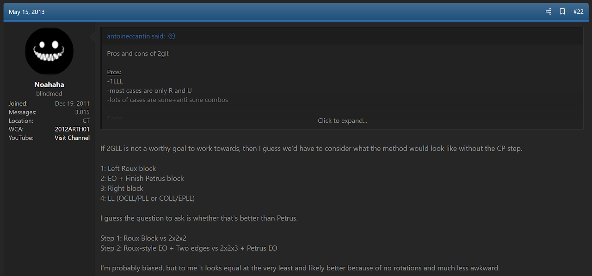
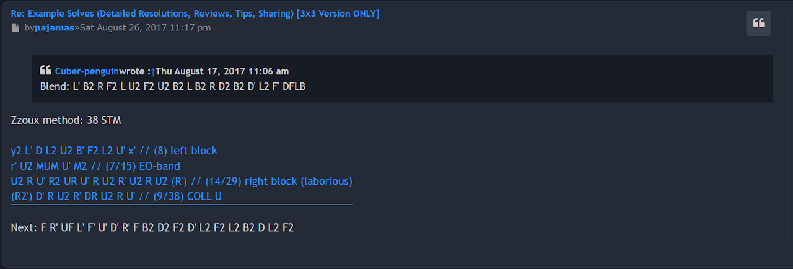
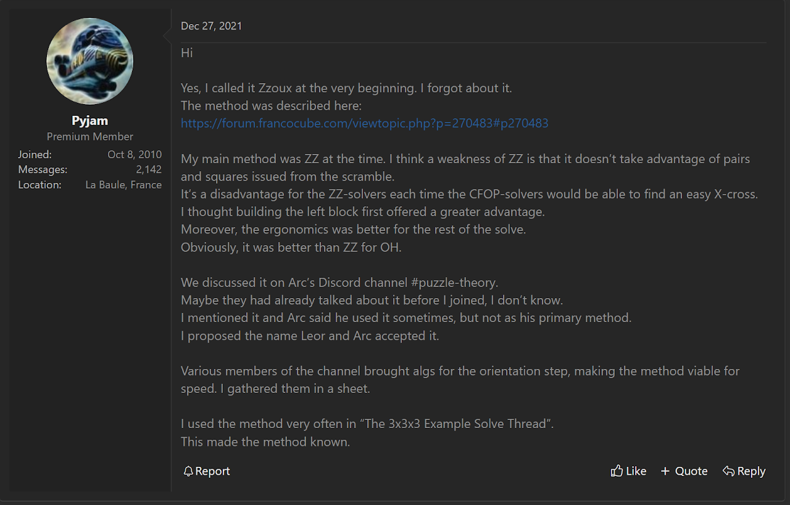
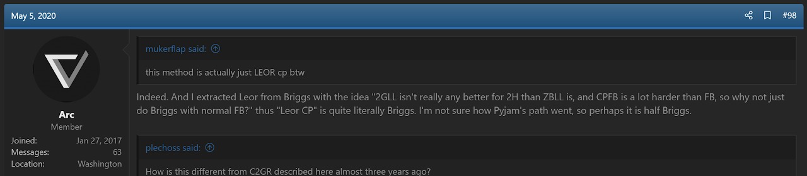

import Exhibit from "@site/src/components/Exhibit";
import YouTube from "@site/src/components/YouTube";
import ReactPlayer from 'react-player'
import ImageCollage from '@site/src/components/ImageCollage';

# LEOR

<Exhibit
stickering={{
    solved: "L R FL DFL DL DBL BL",
    orientedWithoutPermutation: "UL UF UR UB DF DB FR DR BR"
  }}
/>

## Description

**Proposer:** [Noa Arthurs](CubingContributors/MethodDevelopers.md#arthurs-noa), [Arc](CubingContributors/MethodDevelopers.md#arc), [Pyjam](CubingContributors/MethodDevelopers.md#pyjam)

**Proposed:** 2013

**Steps:**

1. Build a 1x2x3 on the left.
2. Solve the DF and DB edges and centers while orienting all remaining edges.
3. Complete the first two layers.
4. Solve the last layer.

[Click here for more step details on the SpeedSolving wiki](https://www.speedsolving.com/wiki/index.php/LEOR)

## Origin

### Noa Arthurs

In May, 2013, Noa Arthurs proposed Noah's CP Block 2.0 [^1]. That method includes a first step that builds a 1x2x3 block on the left while permuting all corners. Then all edges are oriented while placing the DF and DB edges. One day after this proposal, Arthurs suggested a variant of the method where the early corner permutation aspect is removed [^2]. This created the steps that are included in what is now called LEOR. However, this method suggestion went unnoticed.

### Pyjam and Arc

It wasn't until August, 2017 that the method idea resurfaced. Community member Pyjam began posting example solves, with the first one posted on August 26, 2017 on the French forum francocube.com [^3]. Pyjam called the method "Zzoux".

A few days after the initial example solve, Pyjam described the steps of the method as it was being developed [^4].

Pyjam arrived at the idea of the method based on the thought that the first step of the ZZ method makes it difficult to preserve any pre-made corner and edge pairs or other blocks [^5]. Pyjam's idea was to have a 1x2x3 blockbuilding start to take advantage of any pre-made or easy to make blocks. This can be seen as the left block of the original ZZ EOLine proposal, but without the EOLine step. The idea is to then solve EOLine after the 1x2x3 block.

After starting development of the method and posting several example solves, Pyjam discovered that another community member by the name of Arc had also been developing the method. Pyjam and Arc began discussing the method on Discord. Pyjam suggested the new name "LEOR".

> This is from a private conversation between Pyjam and I.

In May, 2020, Arc stated that they derived LEOR from the method named Briggs [^6]. Interestingly, Briggs, which has since been combined with several other methods to create a method named CEOR, follows almost exactly the steps of Noah's CP Block 2.0. This means that Arc followed the same thought process as Arthurs in reaching the idea.

> Noah's CP Block 2.0, Briggs, and other similar early corner permutation methods were later combined into a single method named CEOR. LEOR was derived by two people from the steps of CEOR, but the name CEOR was derived from the LEOR name. The steps of CEOR existed first, but went by several names. The LEOR method was proposed later than the steps of CEOR, but was the first to have a singular name.

[^1]: N. Arthurs, "Noah's CP Block Method 2.0," SpeedSolving.com, May 2013. [Online]. Available: https://www.speedsolving.com/threads/noahs-cp-block-method-2-0.41986/.

[^2]: N. Arthurs, "Noah's CP Block Method 2.0," SpeedSolving.com, May 2013. [Online]. Available: https://www.speedsolving.com/threads/noahs-cp-block-method-2-0.41986/post-853211.

[^3]: Pyjam, "Exemples de solves (résolutions détaillées, critiques, conseils, partage) [Version 3x3 UNIQUEMENT]," FrancoCube, 26 August 2017. [Online]. Available: https://forum.francocube.com/viewtopic.php?f=20&p=270364#p270364.

[^4]: Pyjam, "Les méthodes principales du 3x3x3 et leurs variantes," FrancoCube, 29 August 2017. [Online]. Available: https://forum.francocube.com/viewtopic.php?p=270483#p270483.

[^5]: Pyjam, "LEOR Origin," SpeedSolving.com, 27 December 2021. [Online].

[^6]: Arc, "Roux-breaker? The YruRU method," SpeedSolving.com, 4 May 2020. [Online]. Available: https://www.speedsolving.com/threads/roux-breaker-the-yruru-method.77201/page-5#post-1367918.