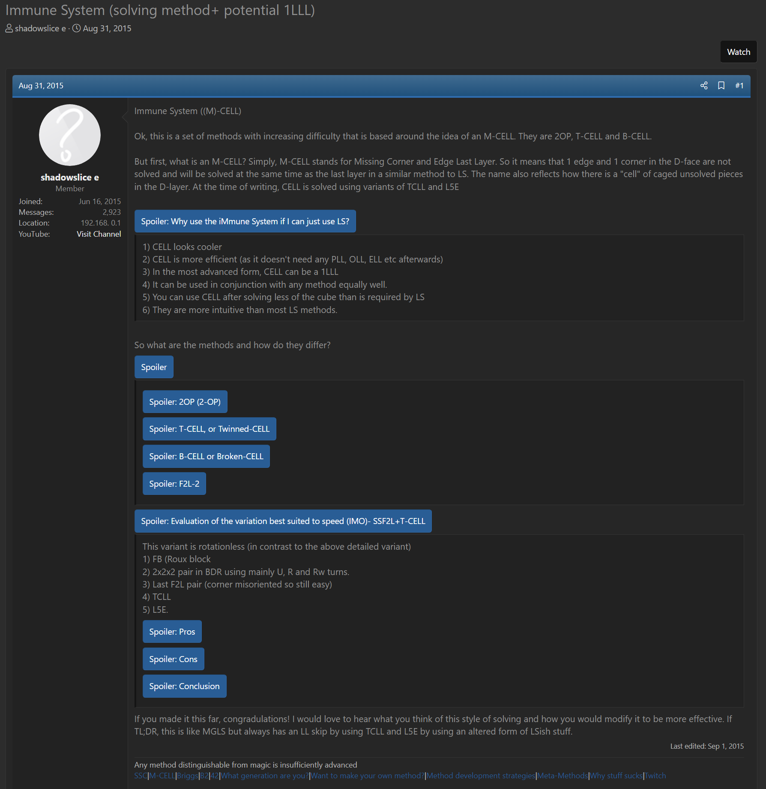

import Exhibit from "@site/src/components/Exhibit";
import YouTube from "@site/src/components/YouTube";
import ImageCollage from '@site/src/components/ImageCollage';

# M-CELL

<Exhibit
stickering={{
    solved: "U D F B L R FL DFL DL DBL BL DB BR DR DBR FR"}}
/>

## Description

**Proposer:** [Joseph Briggs](CubingContributors/MethodDevelopers.md#briggs-joseph-shadowslice)

**Proposed:** 2015

**Steps:**

1. Build a 1x2x3 block on the left side.
2. Build a 2x2x2 block at dbr and add the FR edge and DFR corner twisted in any orientation.
3. Recognize all remaining pieces and execute L5C and L5E in either order.

[Click here for more step details on the SpeedSolving wiki](https://www.speedsolving.com/wiki/index.php/M-CELL)

## Origin

### Development

The origin of the method may be traced to another method proposal by Joseph Briggs [^briggs-2015-1]. A little over a week before proposing M-CELL, Briggs posted a similar method idea. The idea was to reach the F2L-1 state by building a 1x2x3 block, adding a 2x2x2 block, then adding a final edge. The finish was to orient all edges then use Winter Variation and PLL.

### Proposal

The previous idea was refined into a more unique method. M-CELL was proposed on August 21, 2015 [^briggs-2015-2].

[^briggs-2015-1]: J. Briggs, "The New Method / Substep / Concept Idea Thread," SpeedSolving.com, 21 August 2015. [Online]. Available: https://www.speedsolving.com/threads/the-new-method-substep-concept-idea-thread.40975/post-1111041.

[^briggs-2015-2]: J. Briggs, "Immune System (solving method+ potential 1LLL)," SpeedSolving.com, 31 August 2015. [Online]. Available: https://www.speedsolving.com/threads/immune-system-solving-method-potential-1lll.54872/.