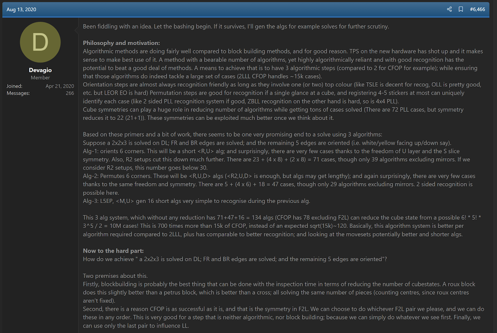
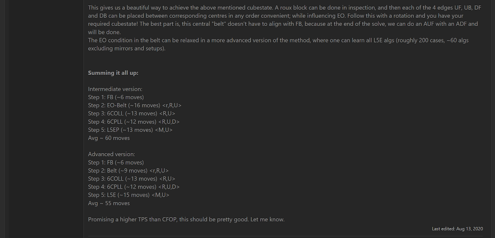
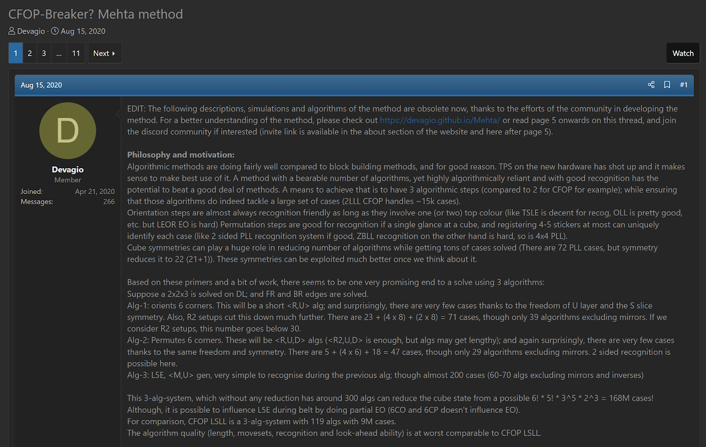
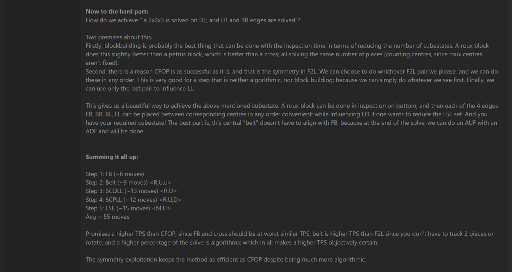
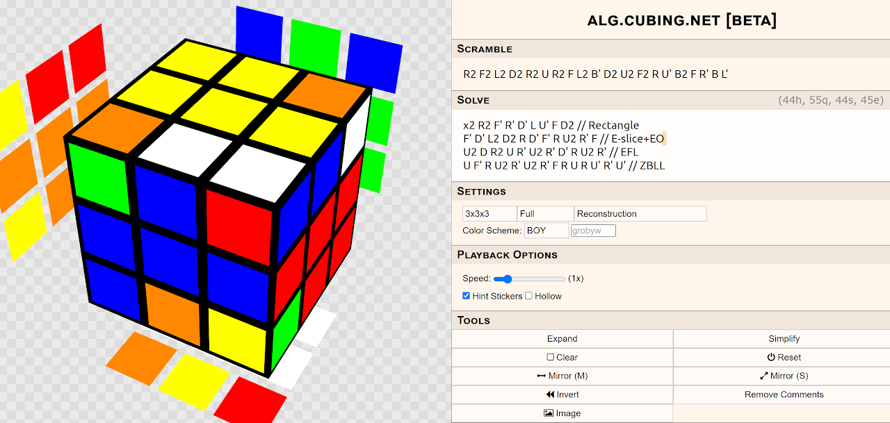

import Exhibit from "@site/src/components/Exhibit";
import YouTube from "@site/src/components/YouTube";
import ImageCollage from '@site/src/components/ImageCollage';

# Mehta

<Exhibit
stickering={{
    solved: "U D F B L R DF DL DB DFL DBL FR FL BL BR",
    orientedWithoutPermutation: "UL UF UR UB DR"
  }}
/>

## Description

**Proposer:** [Yash Mehta](CubingContributors/MethodDevelopers.md#mehta-yash)

**Proposed:** 2020

**Steps:**

1. Build a 1x2x3 block on the bottom layer at lD.
2. Solve three edges within the E layer.
3. Solve the final E layer edge while orienting all remaining edges.
4. Solve the 1x1x3 block at DR.
5. Solve the last layer.

> The Mehta method contains several variants. The variant highlighted on this page is the primary variant called TDR.

[Mehta Website](https://devagio.github.io/Mehta/)

[Click here for more step details on the SpeedSolving wiki](https://www.speedsolving.com/wiki/index.php/Mehta)

## Origin

### Development

In August, 2020 Yash Mehta proposed the idea of the method, checking interest in the idea and welcoming suggestions [^1].

### Proposal

A couple of days later, Mehta created a dedicated thread for the method on speedsolving.com [^2].

## Other

In December, 2017, Lukas Zerghi had proposed the same method idea on the French forum FrancoCube [^3]. The steps follow those of the TDR variant exactly, except with the starting 1x2x3 block on the bottom in the back at bD instead of on the left at lD. It is unknown whether the algorithms for all steps had been generated. Algorithms were generated for the Mehta method, so the method is attributed to Mehta and those who assisted with its development.

[^1]: Y. Mehta, "The New Method / Substep / Concept Idea Thread," SpeedSolving.com, 13 August 2020. [Online]. Available: https://www.speedsolving.com/threads/the-new-method-substep-concept-idea-thread.40975/post-1387722.

[^2]: Y. Mehta, "CFOP-Breaker? Mehta method," SpeedSolving.com, 15 August 2020. [Online]. Available: https://www.speedsolving.com/threads/cfop-breaker-mehta-method.78352/.

[^3]: L. Zerghi, "Nouvelle méthode de speed ?," FrancoCube, 5 December 2017. [Online]. Available: https://forum.francocube.com/viewtopic.php?f=20&t=14632.