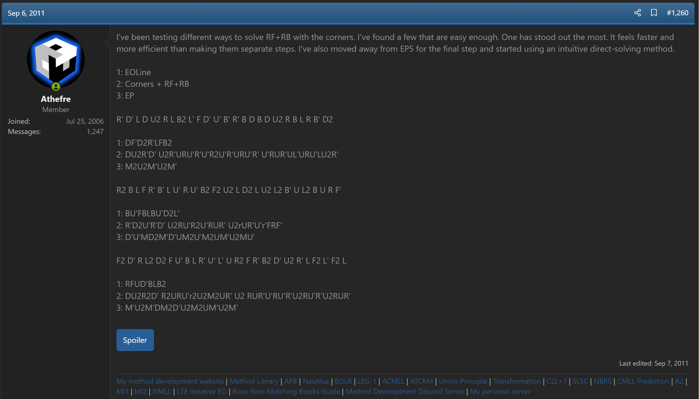
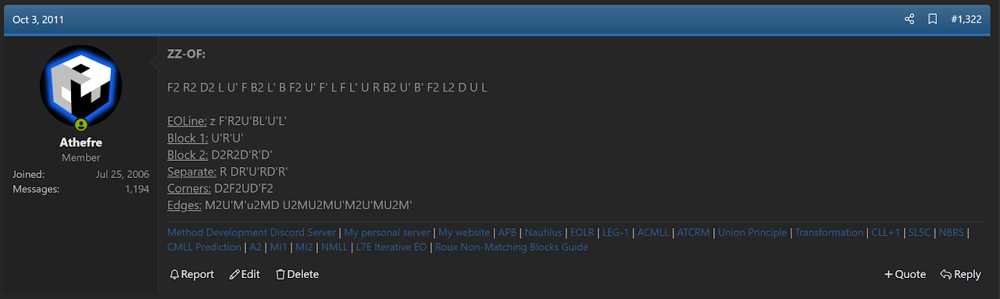

import AnimCube from "@site/src/components/AnimCube";

# MI2

<AnimCube params="buttonbar=0&position=lluuu&scale=6&hint=10&hintborder=1&borderwidth=10&facelets=wydwylywdwwyywydlddbddbddlddlddgddgddddooodddddddrdddd" width="400px" height="400px" />

## Description

**Proposer:** [Michael James Straughan](CubingContributors/MethodDevelopers.md#straughan-michael-james-athefre)

**Proposed:** 2010

**Steps:**

1. Orient all edges while solving a line of edges at FL and BL. This step is called EOLine.
2. Build a 1x2x3 block of oriented pieces on both the bottom and upper layer.
3. Orient the remaining corners while placing the FR and BR edges.
4. Permute all corners and edges.

[MI2 Website](https://sites.google.com/site/athefre/mi2)

[Click here for more step details on the SpeedSolving wiki](https://www.speedsolving.com/wiki/index.php/MI2)

## Origin

### Development

In late 2009, Michael James Straughan began experimenting with combining the EOLine step of ZZ with Corners First. The result was a method that solved all corners after EOLine, then the permutation of all remaining edges [1, 2].

MI2 was placed on Straughan's first website. This website wasn't preserved well on archive.org and only the main page remains archived [3].

In October, 2011 Straughan discovered the oriented blockbuilding concept and incorporated it into MI2 [4]. This set the steps of the method to what they are now.

## References

1. M. J. Straughan, "ZZ and ZB Discussion," SpeedSolving.com, 4 May 2010. [Online]. Available: https://www.speedsolving.com/threads/zz-and-zb-discussion.20834/post-374352.
2. M. J. Straughan, "Random Cubing Discussion," SpeedSolving.com, 6 September 2011. [Online]. Available: https://www.speedsolving.com/threads/random-cubing-discussion.22862/post-638800.
3. M. J. Straughan, 110mb.com, March 2010. [Online]. Available: https://web.archive.org/web/20110224050936/http://athefre.110mb.com/.
4. M. J. Straughan, "Random Cubing Discussion," SpeedSolving.com, 3 October 2011. [Online]. Available: https://www.speedsolving.com/threads/random-cubing-discussion.22862/post-650817.