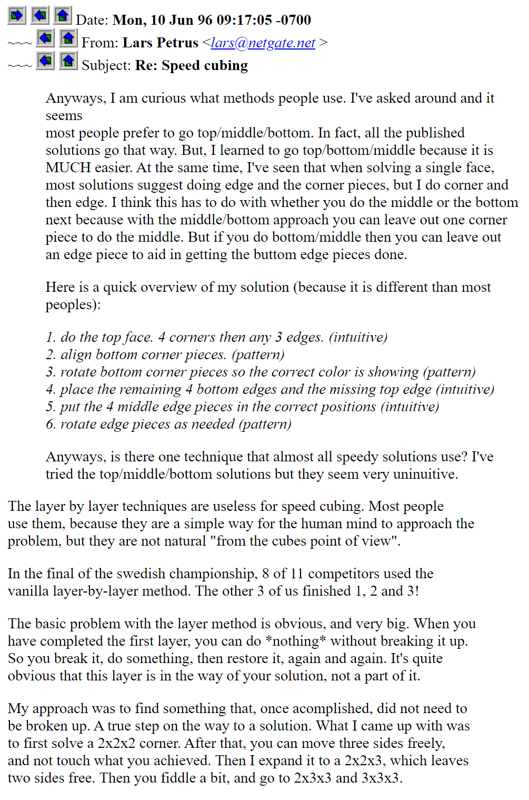
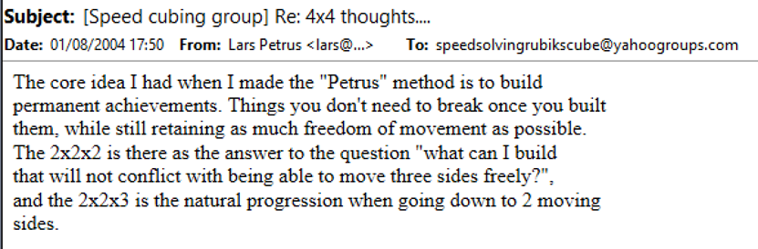
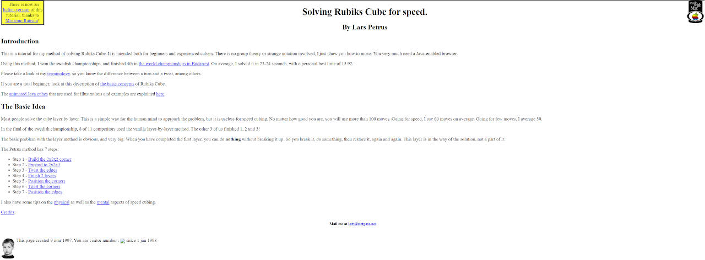
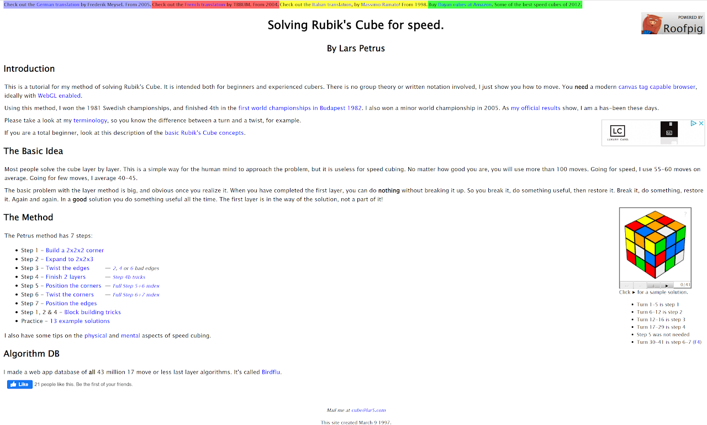
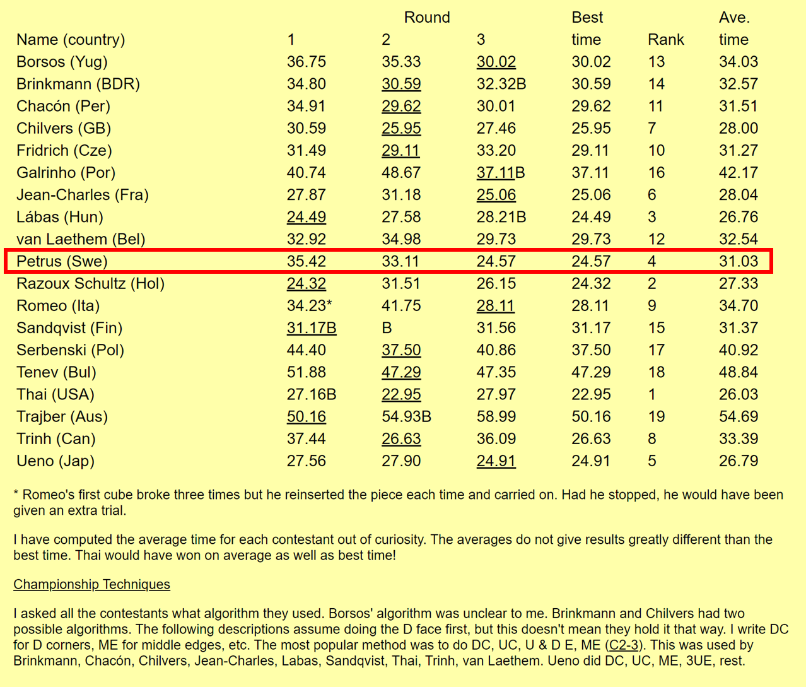
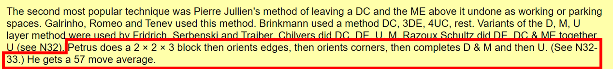
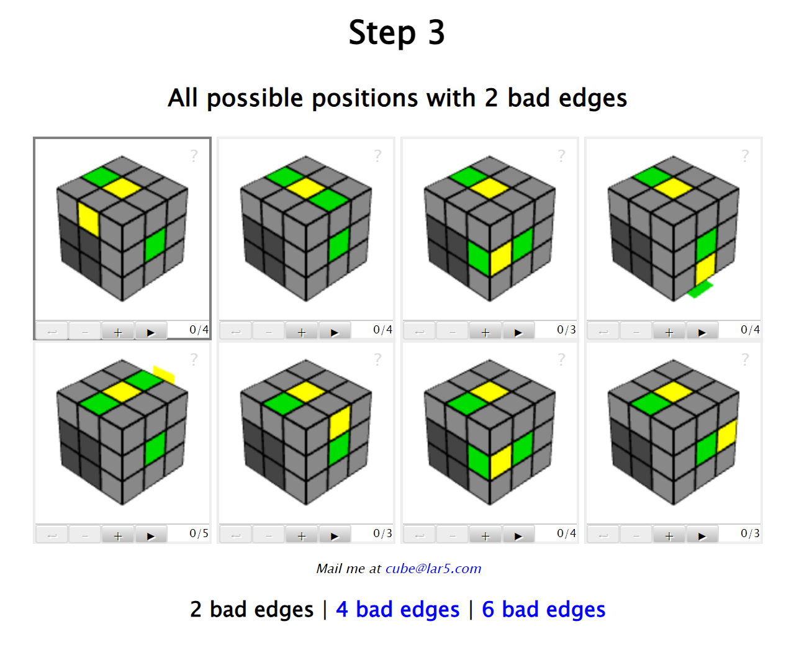
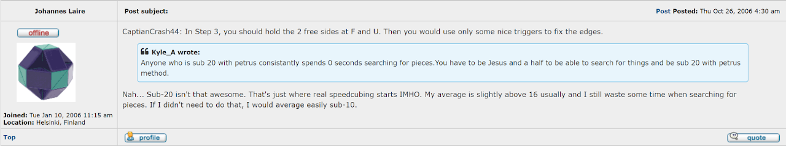
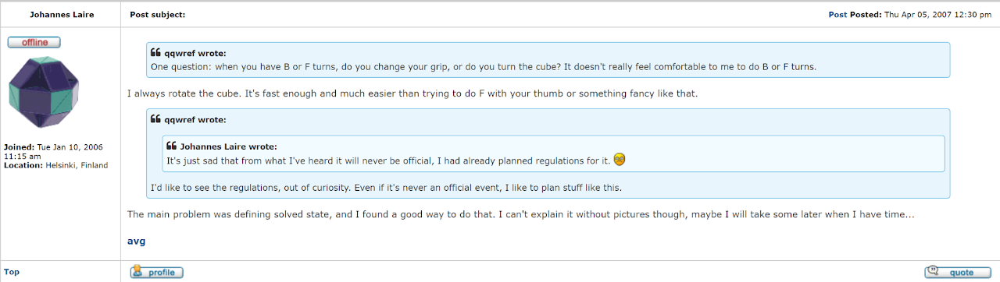

# Petrus

## Description

**Proposer:** [Lars Petrus](CubingContributors/MethodDevelopers.md#petrus-lars)

**Proposed:** 1981

**Steps:**

1. Build a 2x2x2 block.
2. Extend the 2x2x2 block to a 2x2x3 block.
3. Orient all remaining unsolved edges.
4. Complete the first two layers.
5. Solve the last layer.

[Petrus Website](https://lar5.com/cube/index.html)

[Click here for more step details on the SpeedSolving wiki](https://www.speedsolving.com/wiki/index.php/Petrus_Method)

## Origin

### Development

In 1996, Lars Petrus described the thought process behind the method [1]. The idea was to continually build blocks that don't need to be temporarily destroyed while solving the cube. The goal is to build and maintain freedom of movement.

A few years after the Speed Solving Rubik's Cube Yahoo group had been established, Petrus again described the thought process [2].

### Website

In March, 1997, Petrus developed a website for the method [3].

Petrus later moved the website to a custom domain [4, 5].

## World Rubik's Cube Championship 1982

Lars Petrus used the method in the World Rubik's Cube Championship 1982 [6]. The final solve time was 24.57, ranking Petrus in fourth place.

> This comes from the Cubic Circular where David Singmaster described the results and the methods that the competitors used.

>The description of Petrus' method is slightly different from how we know it today. Instead of only orienting the edges after the 2x2x3 block, it says that, after the 2x2x3 block, Petrus orients the edges then orients the corners before completing F2L and LL. Either the Petrus method was slightly different at the time or there was a misunderstanding or mistake when Singmaster recorded the steps.

## Edge Orientation Rotation

The method as taught by Petrus doesn't include a rotation for edge orientation [7].

It seems that having the 2x2x3 block at db during the edge orientation process is a creation of the online community. The earliest known mention of rotating the cube to orient the edges comes from Johannes Laire in October 2006 [8, 9].

Soon after the messages from Laire, others in the community were stating that they keep the 2x2x3 block at db during the edge orientation process [10].

## Morwen Thistlethwaite's 2x2x3 Method

In 1979 in David Singmaster's *Notes on Rubik's 'Magic Cube'*, Singmaster describes a method from Morwen Thistlethwaite [11]. It is stated that Thistlethwaite "involves first doing a 2x2x3 block...he then correctly orients all the remaining edges...then positions [the first two layer edges] and then puts [the first two layer corners] correctly in place. He then does the [U layer edges] and [U layer corners]..."

## References

1. L. Petrus, "Re: Speed cubing," Cube Lovers, 10 June 1996. [Online]. Available: http://www.math.rwth-aachen.de/~Martin.Schoenert/Cube-Lovers/Lars_Petrus__Re__Speed_cubing.html.
2. L. Petrus, "[Speed cubing group] Re: 4x4 thoughts....," Yahoo! Groups - Speed Solving Rubik's Cube, 1 August 2004. [Online]. 
3. L. Petrus, Lars Petrus, March 1997. [Online]. Available: https://web.archive.org/web/19981201224552/http://u1.netgate.net/~mette/lars/cubedude/.
4. L. Petrus, "[Speed Solving Rubik's Cube] Re: beginner needs some advice," Yahoo! Groups - Speed Solving Rubik's Cube, 5 April 2002. [Online]. 
5. L. Petrus, Petrus Method, 2002. [Online]. Available: https://lar5.com/cube/index.html.
6. D. Singmaster, Cubic Circular, 1982. [Online]. Available: https://www.jaapsch.net/puzzles/cubic3.htm.
7. L. Petrus, "Step 3," Lars Petrus, [Online]. Available: https://lar5.com/cube/fas3_2.html.
8. J. Laire, "Petrus method, and getting it fast," TwistyPuzzles.com, 26 October 2006. [Online]. Available: https://twistypuzzles.com/forum/viewtopic.php?p=40293#p40293.
9. J. Laire, "Some videos," TwistyPuzzles.com, 5 April 2007. [Online]. Available: https://twistypuzzles.com/forum/viewtopic.php?p=54631#p54631.
10. Various, "Petrus Method," TwistyPuzzles.com, 2007. [Online]. Available: https://twistypuzzles.com/forum/viewtopic.php?p=67431p67431.[11] 	D. Singmaster, in Notes on Rubik’s 'Magic Cube', Hillside, NJ, Enslow Publishers, 1981, p. 32.