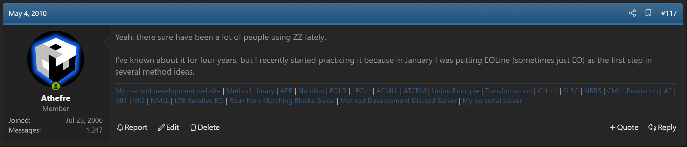

import TwistyPlayer from "@site/src/components/TwistyPlayer";

# Polaris

<TwistyPlayer
alg="x2 R2 D R2 D R2 D U' R2 U' R2 U'"
experimentalStickeringMaskOrbits="EDGES:----?--??-?-,CORNERS:--II-II-,CENTERS:------"
controlPanel="none"
/>

## Description

**Proposer:** [Michael James Straughan](CubingContributors/MethodDevelopers.md#straughan-michael-james-athefre)

**Proposed:** 2010

**Steps:**

1. Orient all edges while solving a line of edges at FL and BL.
2. Build a 1x2x3 block of oriented pieces on both the bottom and upper layer.
3. Orient the remaining corners while moving the remaining two U/D edges to U/D.
4. Permute all corners and edges.

[Polaris Website](https://sites.google.com/site/athefre/3x3-methods/polaris)

[Click here for more step details on the SpeedSolving wiki](https://www.speedsolving.com/wiki/index.php/Polaris)

## Development

In late 2009, Michael James Straughan began experimenting with combining the EOLine step of ZZ with Corners First. The result was a method that solved all corners after EOLine, then the permutation of all remaining edges [^straughan-2010-1] [^straughan-2011-1].

Polaris was placed on Straughan's first website under the placeholder name MI2, which was short for Major Idea 2. This website wasn't preserved well on archive.org and only the main page remains archived [^straughan-2010-2].

In October 2011, Straughan changed the initial steps to an oriented blockbuilding concept [^straughan-2011-2]. This set the steps of the method to what they are now.

## Name Update

In August 2025, Straughan gave the method a proper name of Polaris [^straughan-2025]. This name was chosen to match the "Polar" concept that Straughan developed in steps such as Polar LSLL, Polar ZBLL recognition, and NMLL.

[^straughan-2010-1]: M. J. Straughan, "ZZ and ZB Discussion," SpeedSolving.com, 4 May 2010. [Online]. Available: https://www.speedsolving.com/threads/zz-and-zb-discussion.20834/post-374352.

[^straughan-2011-1]: M. J. Straughan, "Random Cubing Discussion," SpeedSolving.com, 6 September 2011. [Online]. Available: https://www.speedsolving.com/threads/random-cubing-discussion.22862/post-638800.

[^straughan-2010-2]: M. J. Straughan, 110mb.com, March 2010. [Online]. Available: https://web.archive.org/web/20110224050936/http://athefre.110mb.com/.

[^straughan-2011-2]: M. J. Straughan, "Random Cubing Discussion," SpeedSolving.com, 3 October 2011. [Online]. Available: https://www.speedsolving.com/threads/random-cubing-discussion.22862/post-650817.

[^straughan-2025]: M. J. Straughan, Discord, 10 August 2025. [Online]. Available: https://discord.com/channels/885722463521103892/885730030431391815/1404178016111689912.