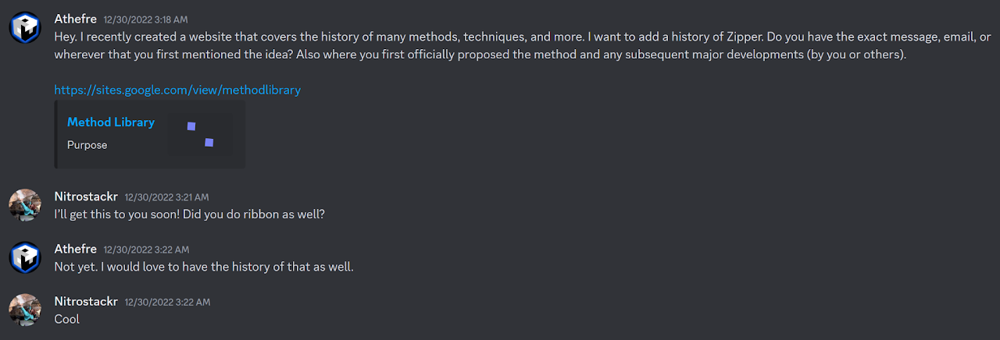

import AnimCube from "@site/src/components/AnimCube";

# Ribbon

<AnimCube params="buttonbar=0&position=lluuu&scale=6&hint=10&hintborder=1&borderwidth=10&facelets=ddddydddddwdwwwdwdddddbbdddddddggdgdddddoododddddrrddd" width="400px" height="400px" />

## Description

**Proposer:** [Justin Taylor](CubingContributors/MethodDevelopers.md#taylor-justin)

**Proposed:** 2017

**Steps:**

1. Solve the cross and any edge in the E layer.
2. Solve the three empty F2L slots.
3. Orient the last layer and the corner currently in the unsolved corner slot.
4. Permute all remaining pieces.

[Click here for more step details on the SpeedSolving wiki](https://www.speedsolving.com/wiki/index.php?title=Ribbon_Method)

## Origin

Waiting on information:

