import AnimCube from "@site/src/components/AnimCube";

# Roux

<AnimCube params="buttonbar=0&position=lluuu&scale=6&hint=10&hintborder=1&borderwidth=10&facelets=ydydydydywwwdwdwwwbbbdbdbbbgggdgdgggodooooooorrrdrrrrr" width="400px" height="400px" />

## Description

**Proposer:** [Gilles Roux](CubingContributors/MethodDevelopers.md#roux-gilles)

**Proposed:** 2003

**Steps:**

1. Build a 1x2x3 block on the left side.
2. Build a 1x2x3 block on the right side.
3. Solve the upper layer corners.
4. Solve the last six edges.

[Roux Website](http://grrroux.free.fr/method/Intro.html)

[Click here for more step details on the SpeedSolving wiki](https://www.speedsolving.com/wiki/index.php/Roux_method)

## Development and Proposal

### Origin

When Gilles Roux started cubing again in 2001, he had been using a method that solved the edges of the last layer as the final step [1]. Roux used algorithms consisting of M and U moves, which Roux found appealing due to the intuitive nature.

Eventually Roux switched to the Petrus method, again often having the opportunity to use edge permutation algorithms consisting of M and U moves. More specifically, Roux had been using the Petrus method along with OCLL and PLL as the last layer method. This is a combination that was called “Petrich” at the time. The Petrus method traditionally has a three step system of permuting the corners, then orienting the corners, then permuting the edges. CFOP, or Fridrich as the method was commonly called in the early 2000s, orients all pieces of the last layer then permutes all pieces. The edge permutation algorithms that Roux used consisted of M and U moves. Roux started thinking that he wanted a method that was mostly intuitive, but allowed for the opportunity to end with M and U moves.

Roux had realized that the process of building the first two layers in CFOP had some important strengths. So Roux started considering how the strengths of F2L could be combined with the desired finish of M and U moves. This naturally led to the idea of leaving out the middle slice of the F2L during the building process then solving the upper layer corners. The rest of the cube can then be solved using just M and U turns.

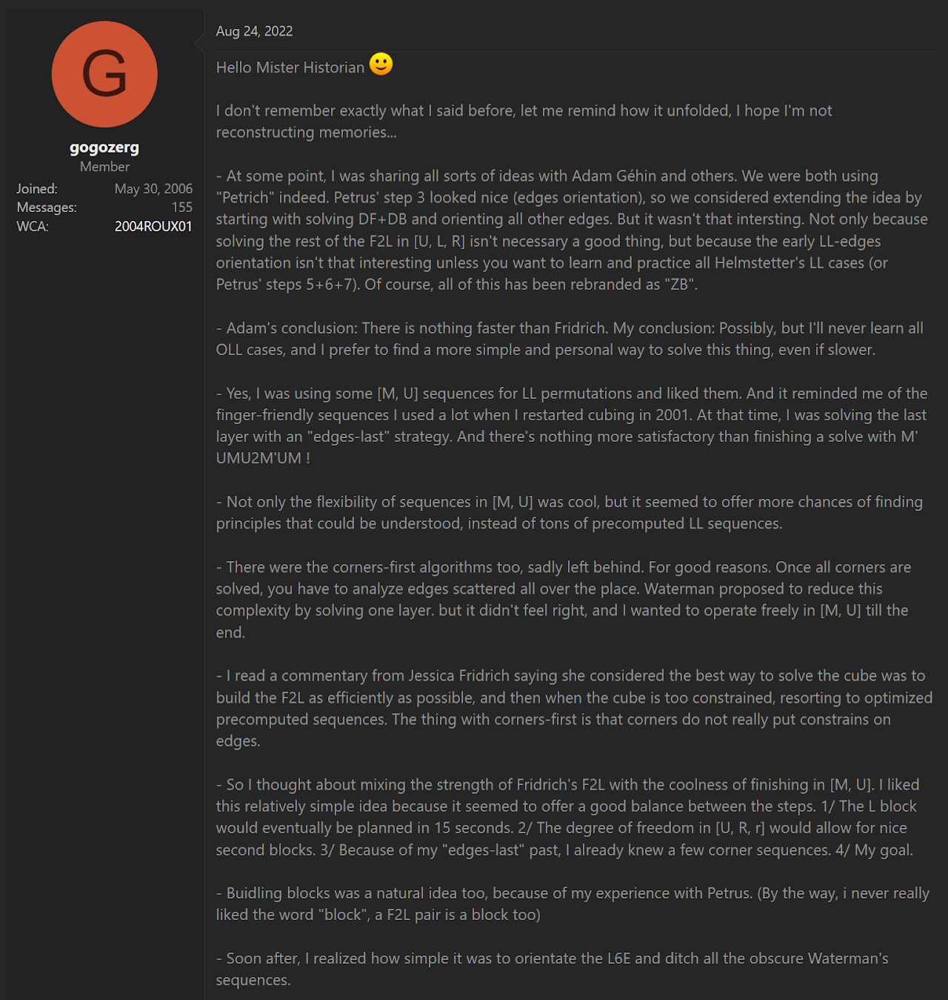

>This is from a private conversation between Roux and I.

### Proposal

In August, 2003, Roux proposed the method to the community [2, 3].

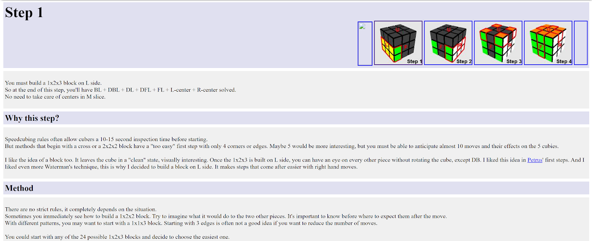

### Last Six Edges Evolution

Originally a couple of LSE methods were provided [4]. Roux eventually realized that his LSE strategy was the best and updated the site to only have his strategy [5].

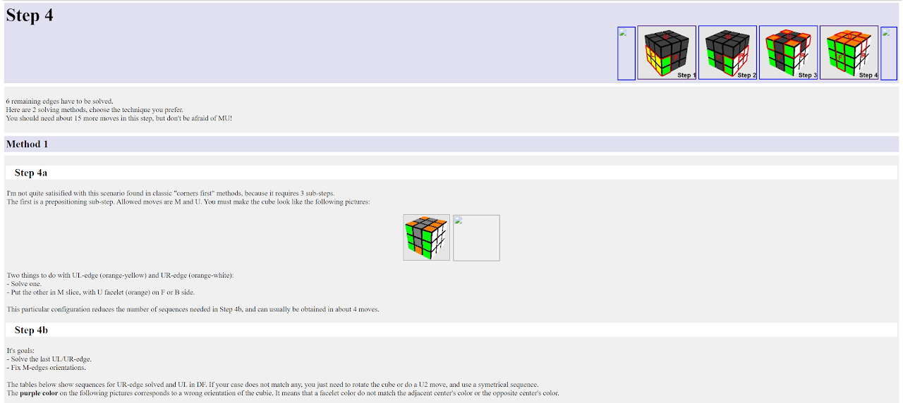
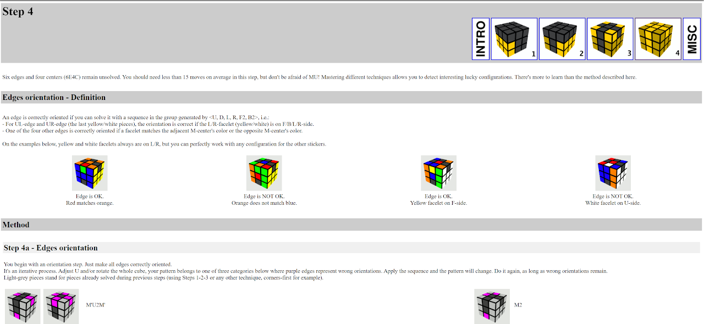

### CMLL Acronym

The acronym CMLL was proposed by Roux on the official website [6]. However, it was later removed [7].

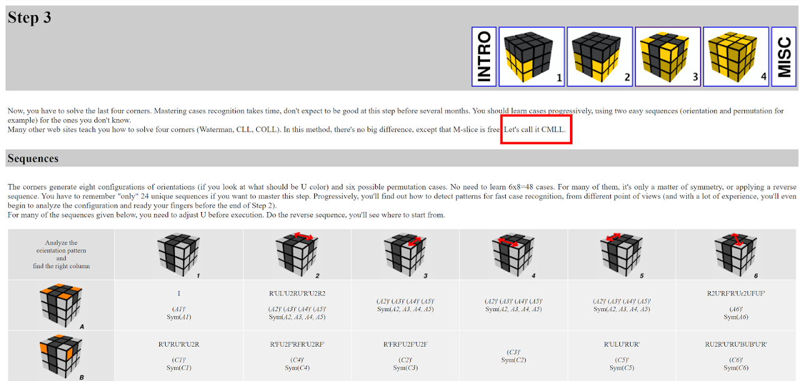

### Gilles Roux's Speed Progression

An interesting fact is that Gilles Roux was once second in the world unofficially using his method. In the early days of the online community, an unofficial leaderboard on speedcubing.com had a high level of popularity [8].

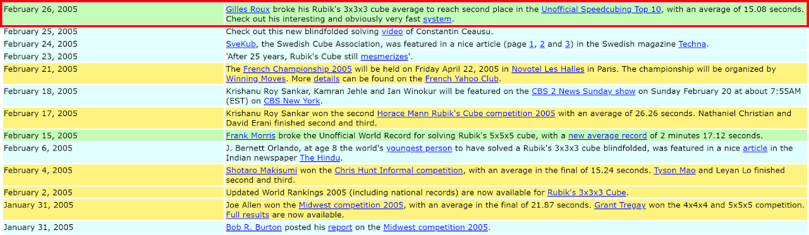

## Advancements and Techniques

### Misoriented Centers

The misoriented centers technique first appeared on Roux's site in 2004 [9].

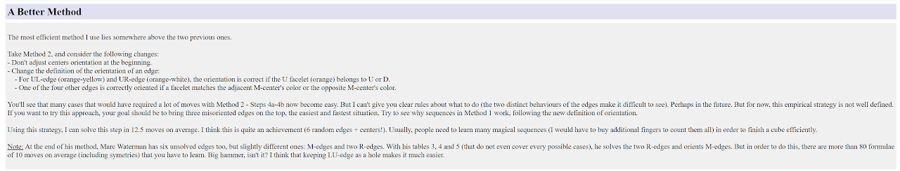

### Non-Matching Blocks and NMCMLL

#### First Recognition Method

Non-matching blocks and a recognition method for CMLL when the technique is used was first discussed publicly by Roux in December, 2004 [10]. Roux created part of the table of cases [11]. In October, 2006, Michael James Straughan completed the table [12, 13].

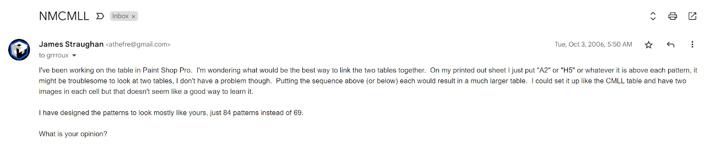
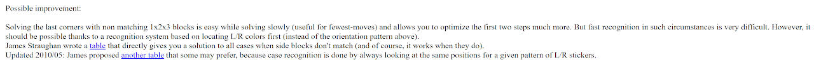

The steps of this recognition method are:

1. Find the orientation of the left and right side stickers.
2. Find the stickers that should be on the upper layer.

#### Second Recognition Method

In April, 2010, Straughan developed a new recognition method [14, 15]. This recognition method fixed the problem of the previous one, which was that finding the upper layer stickers is difficult when the non-matching block is one from a 90 degree turn away. Instead of searching for the upper layer stickers, four pre-determined positions are checked for a pattern.

#### Third Recognition Method

Another recognition method for NMCMLL was devised by Straughan and developed into a table of algorithms and guide by Tim Mosher in December, 2021 [16, 17]. This recognition method is a refinement of the previous system. Instead of checking four pre-determined positions for a pattern, only two positions need to be checked.

### Step 4c Recognition Methods

#### FUBU

The first 4c recognition method (FUBU) was developed by Straughan in April, 2010 [18, 19, 20]. While permuting the UL and UR edges, the stickers that will go to FU and BU after aligning the U layer are checked. Their relationship determines the 4c case. After the idea was sent to the community, Michał Ciebiada created a video describing the technique [21].

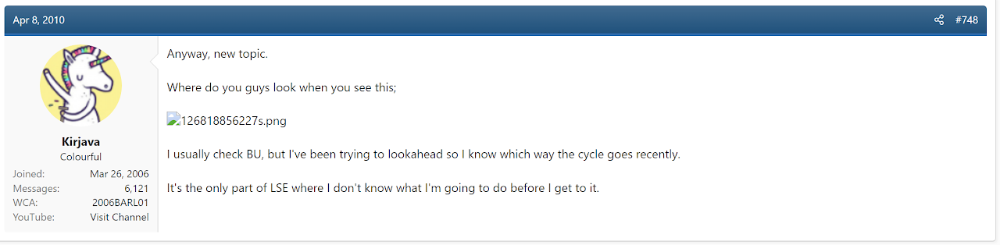
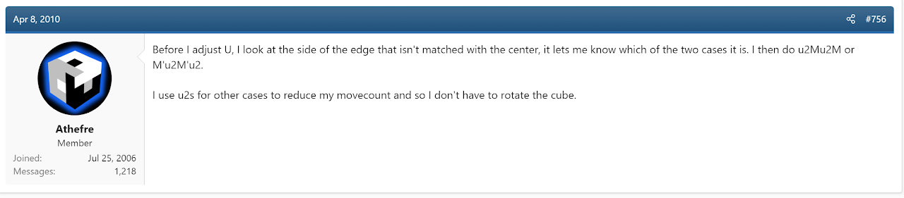

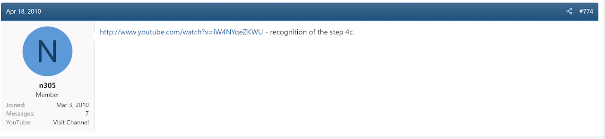

#### BU

Around the same time that FUBU was completely developed and presented in video form, others were using a recognition method that came to be called BU [18, 22]. While permuting the UL and UR edges, the sticker that should go to BU when the corners are aligned is checked against the centers. Various people had been using this around the same time that FUBU was described. The recognition became more well known with Alex Lau's use of it [23].

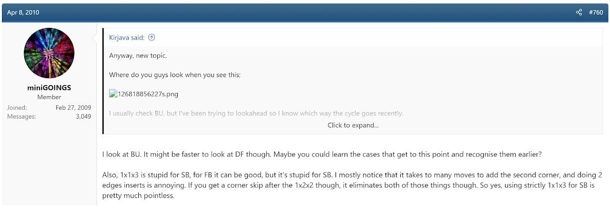
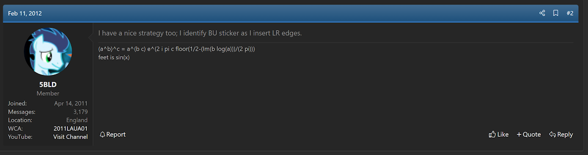

#### DFDB

In 2012, Straughan proposed a new 4c recognition method with a focus on providing easier look ahead [24]. A pair of stickers from the upper or bottom layer are tracked. This, combined with a center comparison, provides the information necessary to determine all 4c cases. After the proposal and development, the community named the system "DFDB" and added on a way to improve recognition for 4c 3-cycle cases that start with an M2 move.

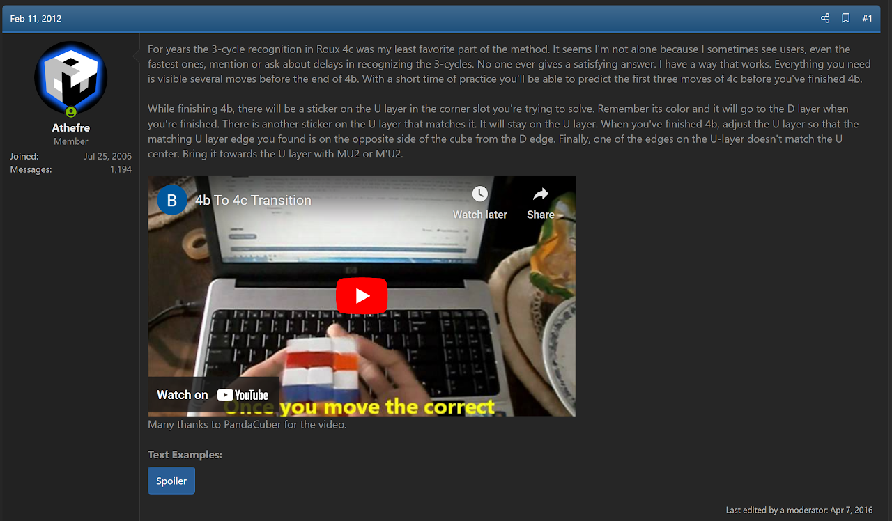

### CMLLEO

The idea of orienting the last six edges during CMLL had been discussed many times since the Roux method's inception. However, Thom Barlow was the first to heavily explore CMLLEO, starting around 2010. Originally, Barlow called the algorithm set KCLL [25], but later decided that it should be called CMLLEO [26].

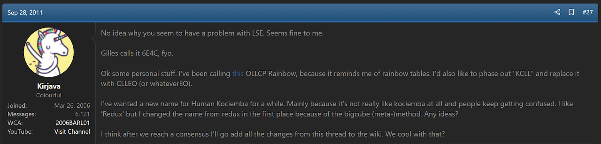

### Table Abuse

The community had long doubted the viability of the Roux method for use in one-handed solving due to the abundance of slice turns. Around 2010, Barlow discovered a one-handed slice turning technique that could be considered technically legal for competition use [27, 28]. The edge of the cube is rested on the table while the user turns the inner slice. This technique came to be known as "table abuse".

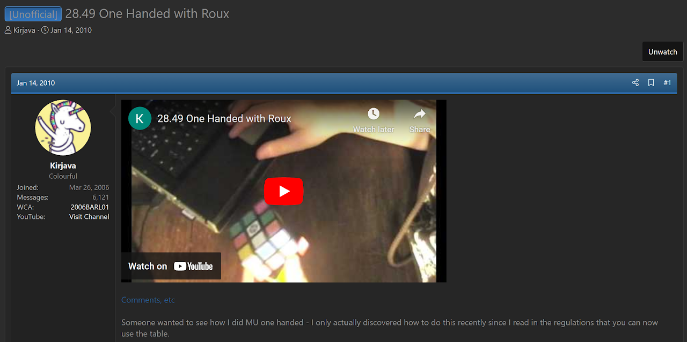

### EOLR

#### First Proposal and Development

EOLR was first proposed and developed by Straughan in August, 2012 [29]. EOLR is now split into two types. EOLR orients all edges and places the UL and UR edges on the bottom layer. EOLRb orients all edges and directly solves the UL and UR edges. Straughan's initial proposal was for both types. All of EOLR was developed, including all possible edge orientation angles. Straughan's version of EOLR sets up to the final arrow EO state [30]. This allows the user to determine if the UL and UR edges do need to be placed on the bottom layer or if there is the opportunity to directly solve the two edges. Half of EOLRb was developed, with the expressed plan being to complete the other half [30].

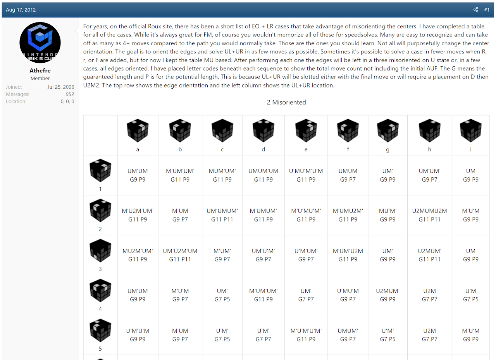
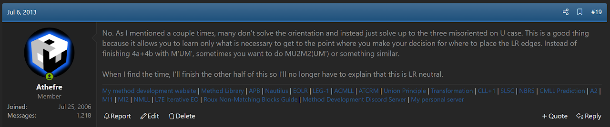

#### Second Proposal and Development

The edge orientation plus placement of the LR edges on the bottom layer version of EOLR was re-proposed and re-developed by Iuri Grangeiro with some assistance from Kian Mansour in August 2016 [31, 32]. Kian Mansour's use of EOLR helped popularize the technique. This is where the name EOLR originated.

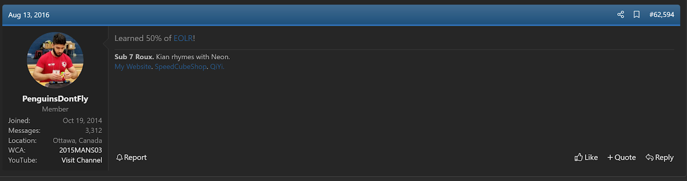
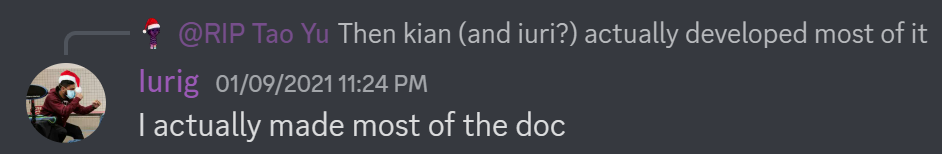

### Pinkie Pie

The first known suggestion of the idea behind Pinkie Pie is by Rob Stuart in October, 2011 [33]. In 2012, Alexander Lau suggested the same idea and gave it the name Pinkie Pie [34].

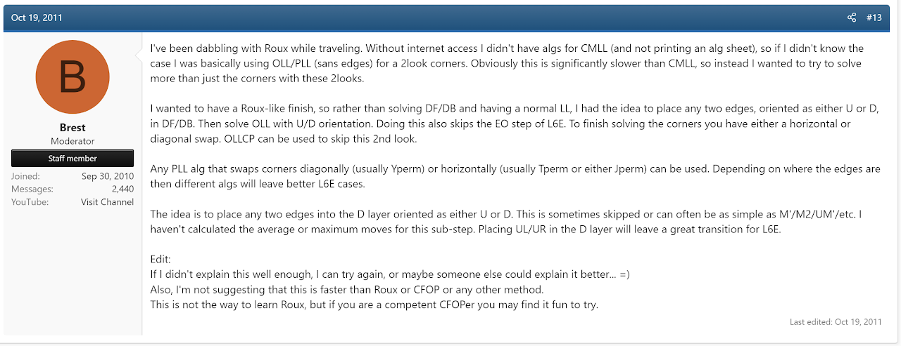
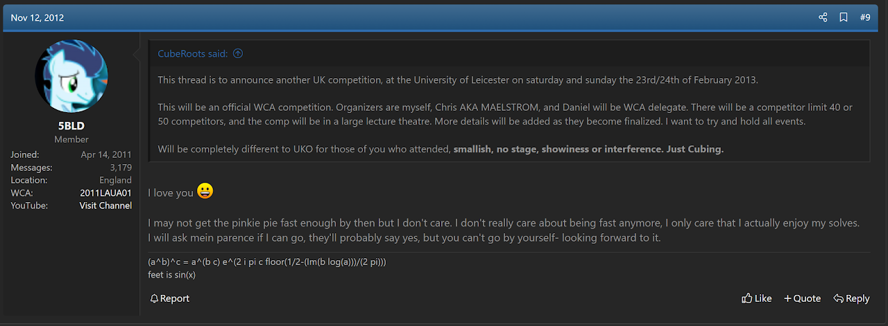

### ACMLL

ACMLL was proposed by Straughan in April, 2020 then developed and presented in January, 2021 [35, 36, 37]. The concept is to solve the two 1x2x3 blocks in pseudo configurations then correct the blocks during the CMLL algorithm.

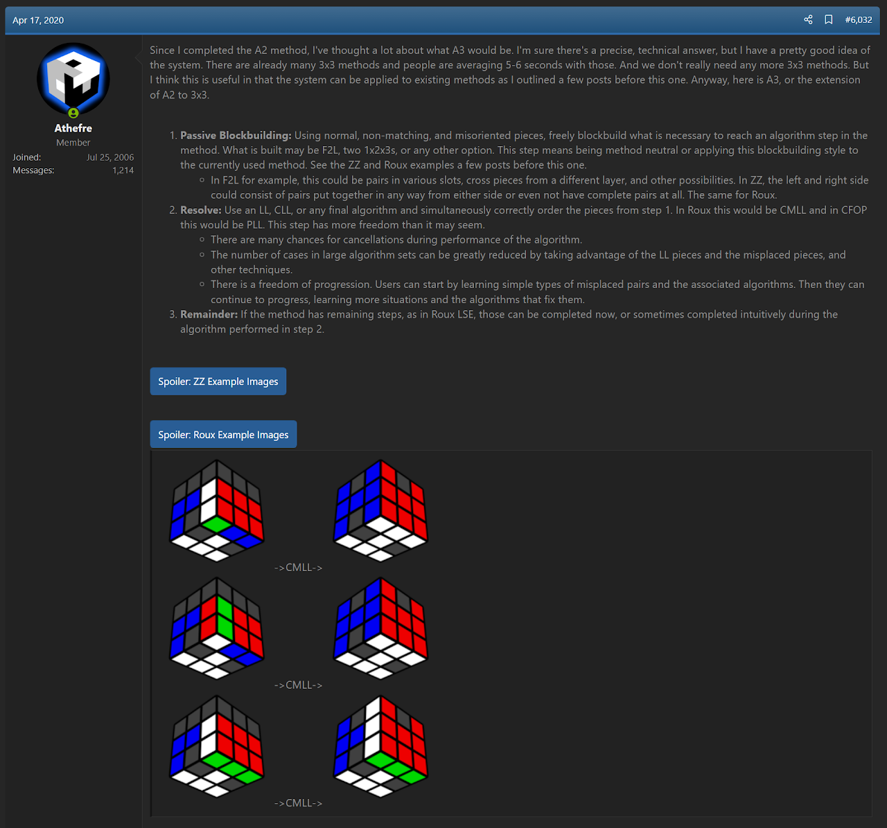
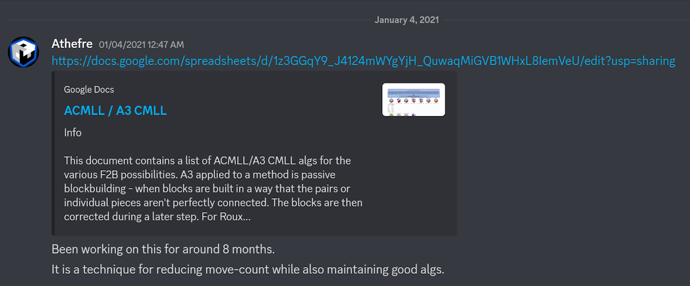
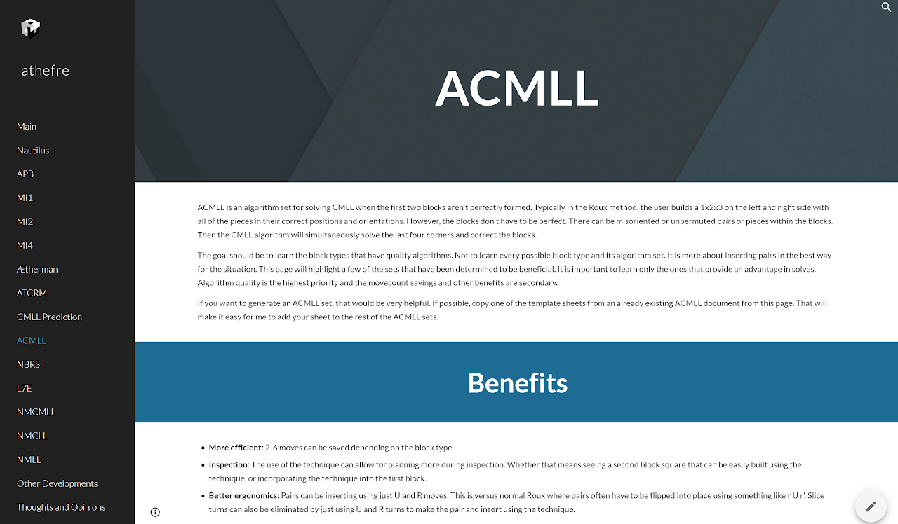

### CMLL Prediction

#### NMCMLL Recognition

In November, 2020, Zhouheng Sun suggested the idea that NMCMLL recognition may be well suited for predicting the CMLL case [38]. The thought process is that because NMCMLL recognition has an easier second step when compared to U sticker first recognition, the more difficult first step of NMCMLL recognition can be recognized early during the final moves of the second block.

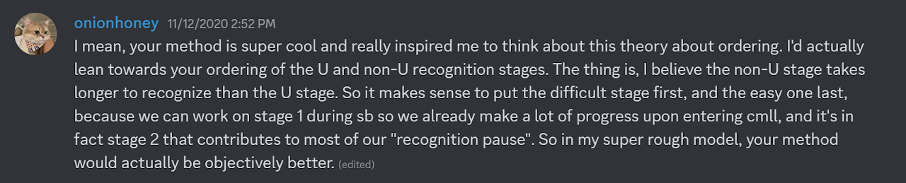

#### ATCRM

With ATCRM having a second step involving checking just two stickers [39], compared to NMCMLL's four, Sun's thought process may apply even more.

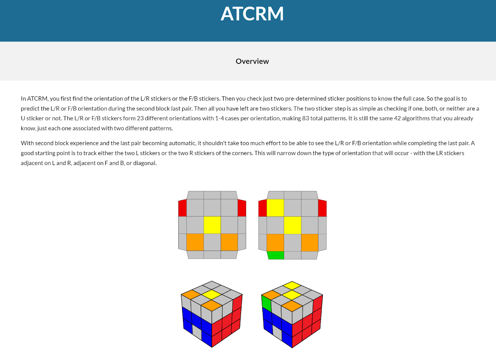

#### Corner Orientation Prediction

In July, 2022, Straughan developed a corner orientation prediction system [40, 41, 42]. The stickers of the corners are tracked during the final pair of the second block. Recognizing the upper layer sticker orientation while solving the last pair helps to know the final orientation of the corners.

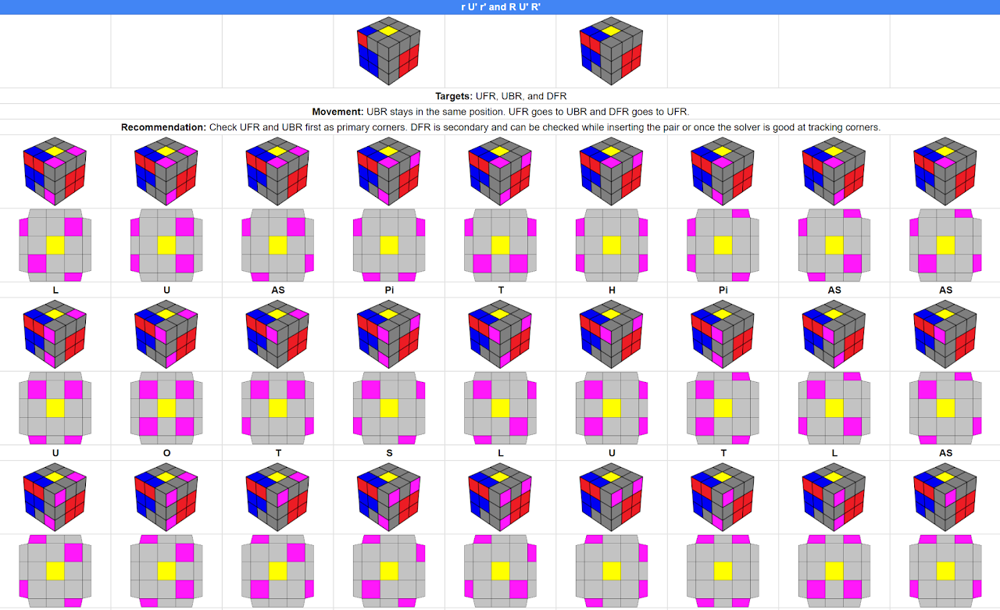
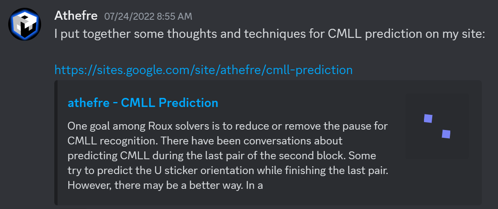

## References

[1] M. J. Straughan and G. Roux, "Origin of the Roux method," Personal communication, 24 August 2022. [Online]. 

[2] G. Roux, "Another method," Yahoo! Groups - Speed Solving Rubik's Cube, 12 August 2003. [Online]. 

[3] G. Roux, Roux Method Website, [Online]. Available: https://web.archive.org/web/20040227193924/http://grrroux.free.fr/method/Step_1.html.

[4] G. Roux, "Step 4," Roux Method Website, 2004. [Online]. Available: https://web.archive.org/web/20040227193509/http://grrroux.free.fr/method/Step_4.html.

[5] G. Roux, "Step 4," Roux Method Website, 2005. [Online]. Available: https://web.archive.org/web/20051218084054/http://grrroux.free.fr:80/method/Step_4.html.

[6] G. Roux, "Step 3," Roux Method Website, 2005. [Online]. Available: https://web.archive.org/web/20051218084003/http://grrroux.free.fr/method/Step_3.html.

[7] G. Roux, "Step 3," Roux Method Website, 2009. [Online]. Available: https://web.archive.org/web/20090123084804/http://grrroux.free.fr/method/Step_3.html.

[8] R. v. Bruchem, "SpeedCubing.com News archive 2005," SpeedCubing.com, 2 August 2005. [Online]. Available: https://speedcubing.com/news_archive_2005.html.

[9] G. Roux, "Step 4," Roux Method Website, 2004. [Online]. Available: https://web.archive.org/web/20040906064311/http://grrroux.free.fr:80/method/Step_4.html.

[10] G. Roux, ""LL" corners," Yahoo! Groups - Speed Solving Rubik's Cube, 6 December 2004. [Online]. 

[11] G. Roux, "Step 3," Roux Method Website, 2004. [Online]. Available: https://web.archive.org/web/20041214140729/http://grrroux.free.fr:80/method/Step_3.html.

[12] M. J. Straughan, "NMCMLL," Personal communication, 3 October 2006. [Online]. 

[13] G. Roux, "Step 3," Roux Method Website, 2006. [Online]. Available: http://grrroux.free.fr/method/Step_3.html.

[14] M. J. Straughan, "I found a new way to recognize NMCMLL," Personal communication, 26 April 2010. [Online]. 

[15] G. Roux, "Step 3," Roux Method Website, 2011. [Online]. Available: https://web.archive.org/web/20111204185452/http://grrroux.free.fr/method/Step_3.html.

[16] JMark, Discord, 19 December 2021. [Online]. Available: https://discord.com/channels/913104731814105088/913129515541233734/922200195092066355.

[17] M. J. Straughan, "ATCRM," Michael James Straughan's Website, 2021. [Online]. Available: https://sites.google.com/site/athefre/atcrm?authuser=0.

[18] T. Barlow, "Waffle's Roux Tutorial," SpeedSolving.com, 7 April 2010. [Online]. Available: https://www.speedsolving.com/threads/waffles-roux-tutorial.11506/post-357273.

[19] M. J. Straughan, "Waffle's Roux Tutorial," SpeedSolving.com, 7 April 2010. [Online]. Available: https://www.speedsolving.com/threads/waffles-roux-tutorial.11506/post-357312.

[20] M. J. Straughan, "Waffle's Roux Tutorial," SpeedSolving.com, 8 April 2010. [Online]. Available: https://www.speedsolving.com/threads/waffles-roux-tutorial.11506/post-357479.

[21] M. Ciebiada, "Waffle's Roux Tutorial," SpeedSolving.com, 18 April 2010. [Online]. Available: https://www.speedsolving.com/threads/waffles-roux-tutorial.11506/page-39#post-364254.

[22] miniGOINGS, "Waffle's Roux Tutorial," SpeedSolving.com, 8 April 2010. [Online]. Available: https://www.speedsolving.com/threads/waffles-roux-tutorial.11506/post-357896.

[23] A. Lau, "Roux 4b to 4c Transition," SpeedSolving.com, 11 February 2012. [Online]. Available: https://www.speedsolving.com/threads/roux-4b-to-4c-transition.35350/post-711618.

[24] M. J. Straughan, "Roux 4b to 4c Transition," SpeedSolving.com, 11 February 2012. [Online]. Available: https://www.speedsolving.com/threads/roux-4b-to-4c-transition.35350/.

[25] T. Barlow, "KCLL," SpeedSolving.com, 16 May 2010. [Online]. Available: https://www.speedsolving.com/threads/kcll.21210/#post-381107.

[26] T. Barlow, "Proposition - Let's fix some cubing terms!," SpeedSolving.com, 27 September 2011. [Online]. Available: https://www.speedsolving.com/threads/proposition-lets-fix-some-cubing-terms.32617/post-648278.

[27] T. Barlow, "28.49 One Handed with Roux," SpeedSolving.com, 14 January 2010. [Online]. Available: https://www.speedsolving.com/threads/28-49-one-handed-with-roux.18549/.

[28] T. Barlow, "OH Table Use," SpeedSolving.com, 11 May 2010. [Online]. Available: https://www.speedsolving.com/threads/oh-table-use.21118/.

[29] M. J. Straughan, "Roux Misoriented Centers Table," SpeedSolving.com, 17 August 2012. [Online]. Available: https://web.archive.org/web/20200924235711/https://www.speedsolving.com/threads/roux-misoriented-centers-table.38176/.

[30] M. J. Straughan, "Roux Misoriented Centers Table," SpeedSolving.com, 5 July 2013. [Online]. Available: https://www.speedsolving.com/threads/roux-misoriented-centers-table.38176/post-873153.

[31] K. Mansour, "Accomplishment Thread," SpeedSolving.com, 13 August 2016. [Online]. Available: https://www.speedsolving.com/threads/accomplishment-thread.1688/post-1189069.

[32] I. Grangeiro, Discord, 9 January 2021. [Online]. Available: https://discord.com/channels/416929203607568404/416929203607568406/797470923153735710.

[33] R. Stuart, "Roux CFOP mix.," SpeedSolving.com, 19 October 2011. [Online]. Available: https://www.speedsolving.com/threads/roux-cfop-mix.33018/post-657165.

[34] A. Lau, "University of Leicester Open 2013," SpeedSolving.com, 12 November 2012. [Online]. Available: https://www.speedsolving.com/threads/university-of-leicester-open-2013.39237/post-798616.

[35] M. J. Straughan, "The New Method / Substep / Concept Idea Thread," SpeedSolving.com, 17 April 2020. [Online]. Available: https://www.speedsolving.com/threads/the-new-method-substep-concept-idea-thread.40975/post-1363270.

[36] M. J. Straughan, Discord, 3 January 2021. [Online]. Available: https://discord.com/channels/416929203607568404/416933073893195779/795317325355155497.

[37] M. J. Straughan, "ACMLL: A new algorithm set for Roux," SpeedSolving.com, 18 March 2021. [Online]. Available: https://www.speedsolving.com/threads/acmll-a-new-algorithm-set-for-roux.79962/.

[38] Z. Sun, Discord, 12 November 2020. [Online]. Available: https://discord.com/channels/416929203607568404/416932528059056140/776534845492559922.

[39] M. J. Straughan, "CMLL Prediction," Michael James Straughan's Development Website, [Online]. Available: https://sites.google.com/site/athefre/roux/cmll-prediction?authuser=0.

[40] M. J. Straughan, "CMLL Prediction," Michael James Straughan's Development Website, [Online]. Available: https://sites.google.com/site/athefre/roux/cmll-prediction#h.2q1ipwkbr8j8.

[41] M. J. Straughan, "CMLL Orientation Prediction," Google Sheets, July 2022. [Online]. Available: https://docs.google.com/spreadsheets/d/146FzKPkKbtBILeU4jSt5sFPYXj8U5ovNDzT8iGR3yK4/edit#gid=0.

[42] M. J. Straughan, Discord, 24 July 2022. [Online]. Available: https://discord.com/channels/416929203607568404/416929203607568406/1000747989733752852.