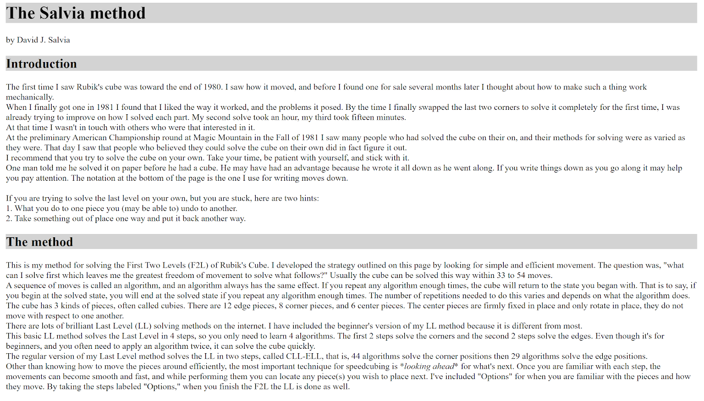
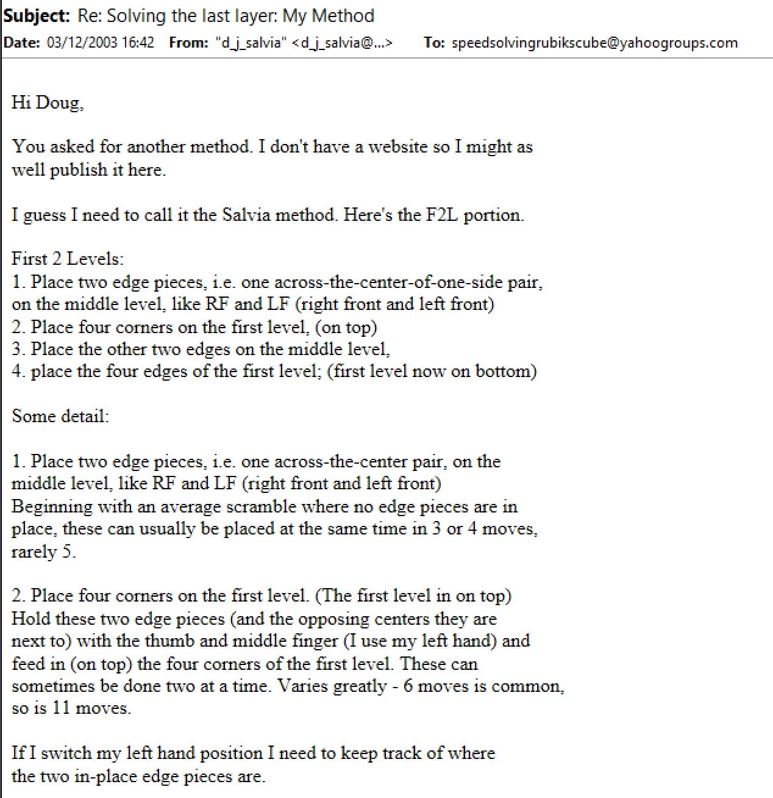
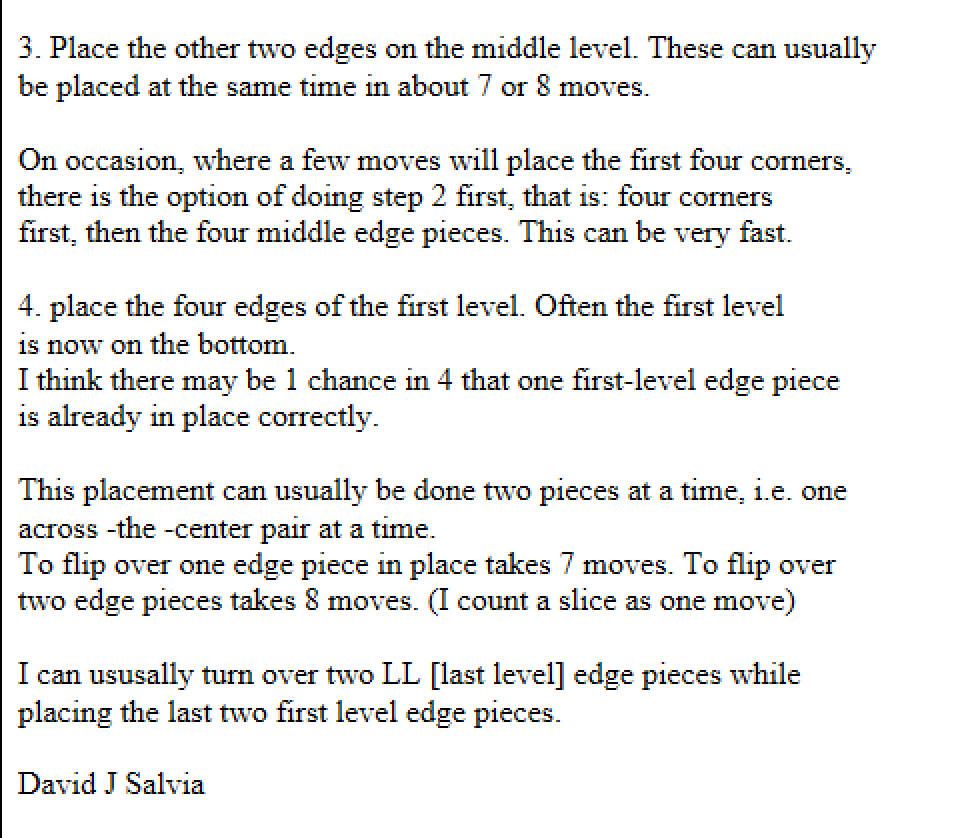

# Salvia

## Description

**Proposer:** [David Salvia](CubingContributors/MethodDevelopers.md#salvia-david)

**Proposed:** ~1981

**Steps:**

1. Solve the two edges at FL and FR.
2. Solve the bottom layer corners.
3. Add the BL and BR edges.
4. Solve the bottom layer edges.
5. Solve the corners of the last layer.
6. Solve the edges of the last layer.

[Salvia Website](http://www.speedcubing.com/DavidJSalvia.html)

[Click here for more step details on the SpeedSolving wiki](https://www.speedsolving.com/wiki/index.php/Salvia_Method)

## Origin

### Development

On the webpage for the Salvia method, Salvia states that he first got a cube in 1981. It is possible that the method was developed in that same year.

http://www.speedcubing.com/DavidJSalvia.html

Salvia first described the method in December, 2003. This description led to the method getting its own dedicated page on speedcubing.com

