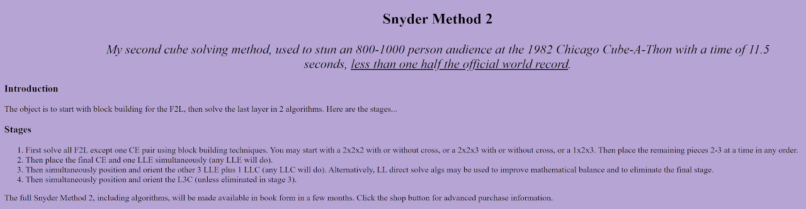

import AnimCube from "@site/src/components/AnimCube";

# Snyder Method 2

<AnimCube params="config=../../ExhibitConfig.txt&facelets=dldlyllldwwwwwwwwwdbblbbdbbdgglgglggdlloooooodrrlrrdrr" width="400px" height="400px" />

## Description

**Proposer:** [Anthony Snyder](CubingContributors/MethodDevelopers.md#snyder-anthony)

**Proposed:** ~1982

**Steps:**

1. Solve F2L-1.
2. Solve the final F2L pair and solve at least one last layer edge.
3. Solve the remaining last layer edges and at least one last layer corner.
4. Solve the last three corners.

[Snyder Method 2 Website](http://www.snydermind.com/cube/snydermethod2.html)

[Click here for more step details on the SpeedSolving wiki](https://www.speedsolving.com/wiki/index.php/Snyder_Method)

## Origin

The first known instance of Anthony Snyder discussing Snyder Method 2 with the community occurred in September, 2000. Snyder described the steps via email to Ron van Bruchem who subsequently posted the steps to the Speed Solving Rubik's Cube Yahoo group [1].

Around 2011, Snyder placed the method on a website [2].

## References

[1] R. v. Bruchem, "Tony Snyder's System (36 moves!) [Yahoo! Clubs: Speed Solving Rubik's Cube]," Yahoo! Groups - Speed Solving Rubik's Cube, 19 September 2000. [Online]. 

[2] A. Snyder, "Snyder Method 2," Anthony Snyder's Website, 2011. [Online]. Available: http://www.snydermind.com/cube/snydermethod2.html.