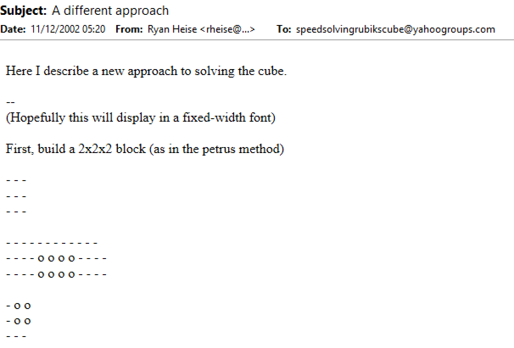
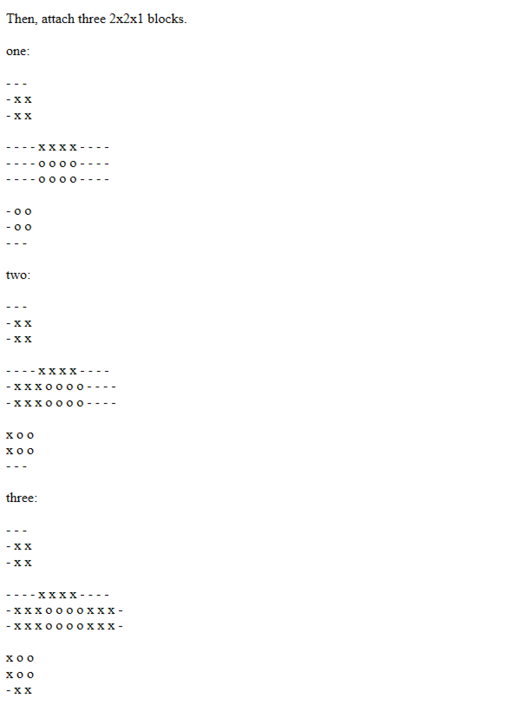
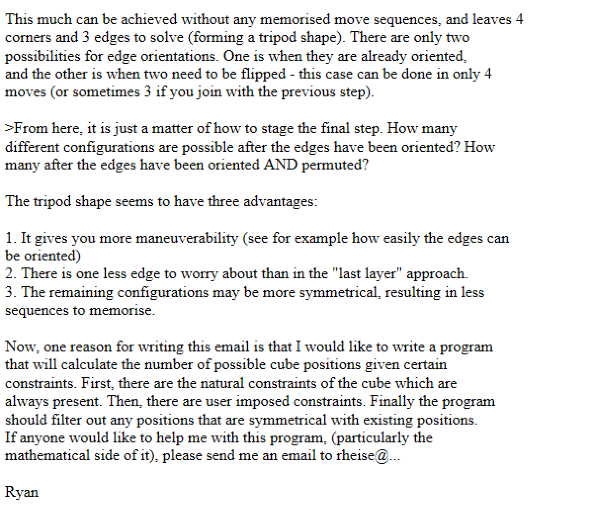
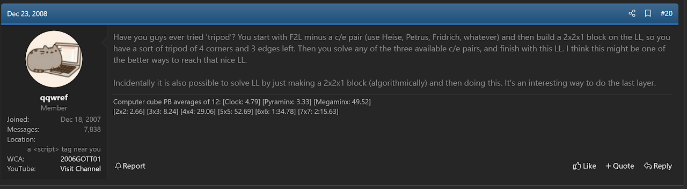
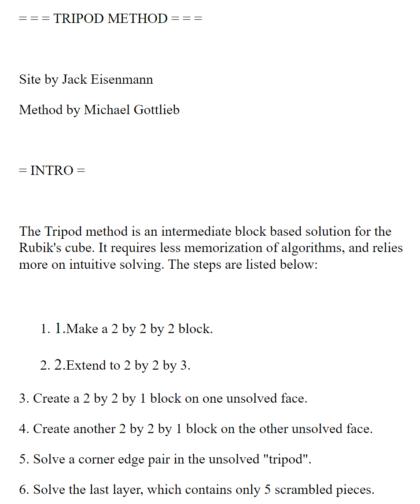
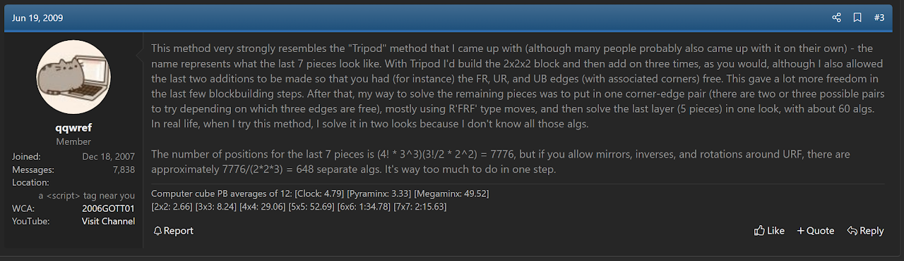

import Exhibit from "@site/src/components/Exhibit";
import YouTube from "@site/src/components/YouTube";
import ImageCollage from '@site/src/components/ImageCollage';

# Tripod

<Exhibit
stickering={{
    solved: "U D F B L R DF DL DB DR DFL DBL DBR FL BL BR UL UB UBL"}}
/>

## Description

**Proposer:** [Ryan Heise](CubingContributors/MethodDevelopers.md#heise-ryan), [Michael Gottlieb](CubingContributors/MethodDevelopers.md#gottlieb-michael)

**Proposed:** 2002

**Steps:**

1. Build a 2x2x2 block.
2. Add three 1x2x2 blocks on the three free layers on the outside of the 2x2x2 block.
3. Solve the remaining four corners and three edges.

[Click here for more step details on the SpeedSolving wiki](https://www.speedsolving.com/wiki/index.php/Tripod_Method)

## Origin

### Ryan Heise

Tripod has been a relatively commonly proposed method idea. However, the first known suggestion of the complete structure of the Tripod method comes from Ryan Heise. In December, 2022, Heise posted a message to the Speed Solving Rubik's Cube Yahoo group describing the method and describing it as having a "tripod" shape [^heise-2002].

### Michael Gottlieb

In 2008, Michael Gottlib suggested the method idea [^gottlieb-2008]. Interestingly, Gottlieb also used the word "tripod" to describe the method. Following the initial promotion of the idea, Gottlieb placed the method on a website [^gottlieb-2011].

A website had also been created before by Jack Eisenmann [^eisenmann-2009-1] [^eisenmann-2009-2].

It may be questioned whether Gottlieb had been inspired by Heise's post of the idea. However, Gottlieb once stated "This method very strongly resembles the "Tripod" method that I came up with" in reply to someone who had proposed the idea of a form of the method [^gottlieb-2009].

### Mirek Goljan

On Jessica Fridrich's website there exists a set of algorithms for solving the last layer when a 1x2x2 block is built [^fridrich-goljan-nd]. This includes cases when the edges are in any orientation. These algorithms are attributed to Mirek Goljan [^fridrich-nd]. It is unknown whether Goljan developed this for a method resembling Tripod or if the algorithms were generated for use in case a CFOP user noticed a pre-built 1x2x2 block when arriving at the last layer.

## Extra

In November, 2007, Jack Eisenmann proposed a method called Fridrus [^eisenmann-2007]. In this method, a 2x2x3 block is built vertically at bl. Then the DF and DR edges are solved and the three corner and edge pairs of the first two layers are placed. This leaves a last layer with a 1x2x2 block and can be solved in a single step.

[^heise-2002]: R. Heise, Yahoo! Groups - Speed Solving Rubik's Cube, 11 December 2002. [Online].

[^gottlieb-2008]: M. Gottlieb, "Supercritical Method," SpeedSolving.com, 23 December 2008. [Online]. Available: https://www.speedsolving.com/threads/supercritical-method.8065/post-114169.

[^gottlieb-2011]: M. Gottlieb, "Tripod," Michael Gottlieb's Website, 2011. [Online]. Available: https://mzrg.com/rubik/methods/tripod/.

[^eisenmann-2009-1]: J. Eisenmann, "Tripod Method," SpeedSolving.com, 14 February 2009. [Online]. Available: https://www.speedsolving.com/threads/tripod-method.9545/.

[^eisenmann-2009-2]: J. Eisenmann, "TRIPOD METHOD," 14 February 2009. [Online]. Available: https://web.archive.org/web/20100616003611/http://web.mac.com/teisenmann/Tripod/main.html.

[^gottlieb-2009]: M. Gottlieb, "Petrus Variation- does it have any potential?," SpeedSolving.com, 18 June 2009. [Online]. Available: https://www.speedsolving.com/threads/petrus-variation-does-it-have-any-potential.12940/post-194502.

[^fridrich-goljan-nd]: J. Fridrich and M. Goljan, "One corner and two adjoining edges are correct," Jessica Fridrich's Website, [Online]. Available: http://www.ws.binghamton.edu/fridrich/L1/ece.htm.

[^fridrich-nd]: J. Fridrich, "My speed cubing page," Jessica Fridrich's Website, [Online]. Available: http://www.ws.binghamton.edu/fridrich/cube.html.

[^eisenmann-2007]: J. Eisenmann, "Fridrus Method," SpeedSolving.com, 21 November 2007. [Online]. Available: https://www.speedsolving.com/threads/fridrus-method.1990/.