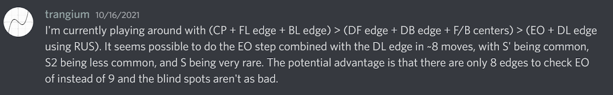
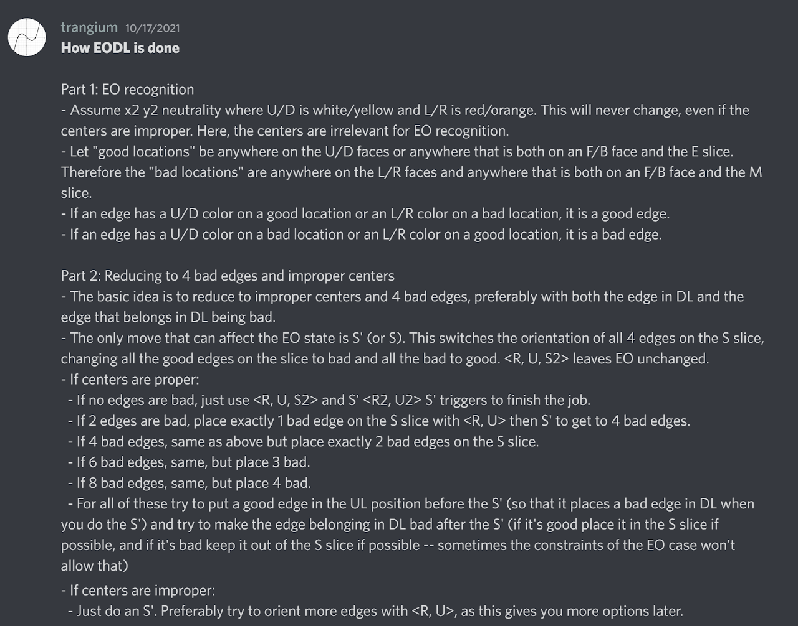
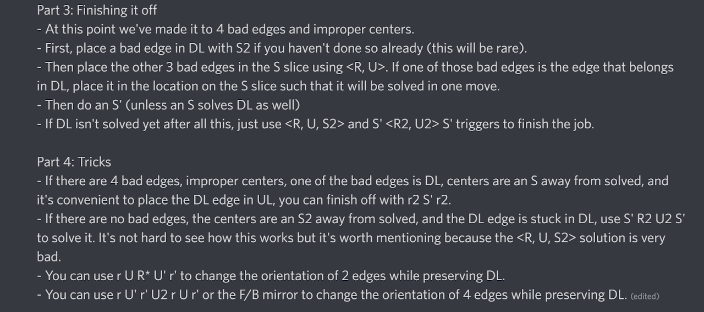
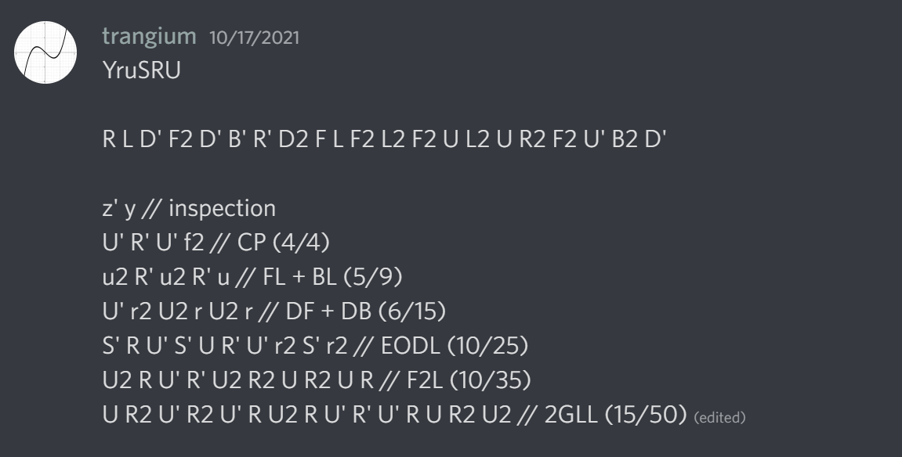
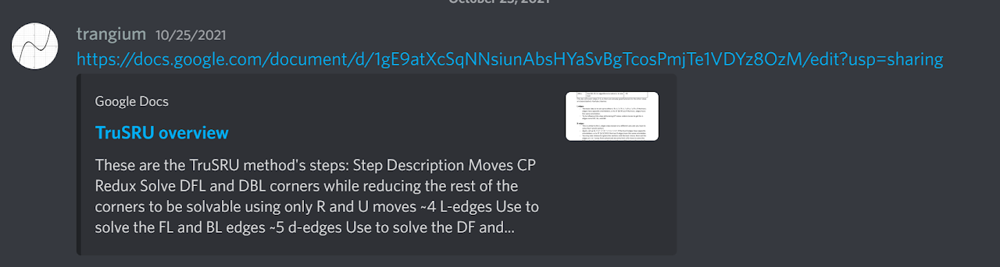
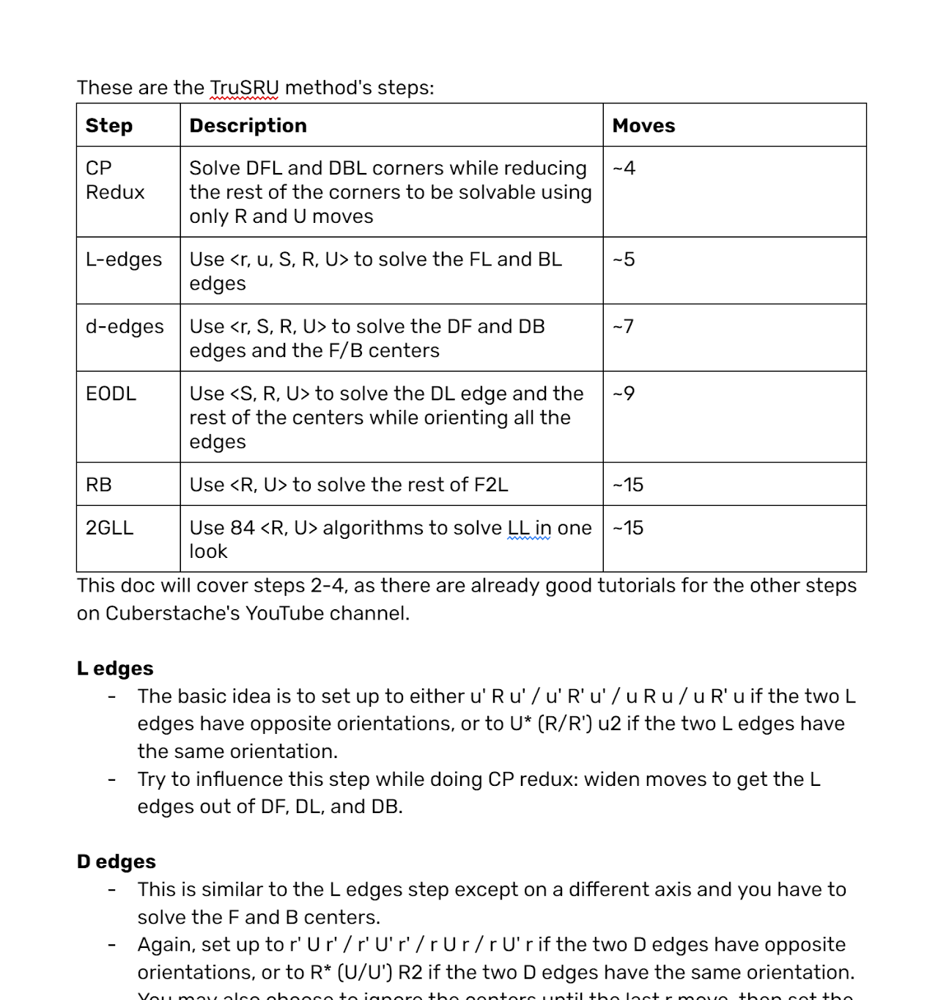

config=../../ExhibitConfig.txtimport AnimCube from "@site/src/components/AnimCube";

# TruSRU

<AnimCube params="buttonbar=0&position=lluuu&scale=6&hint=10&hintborder=1&borderwidth=10&facelets=ldldydldlwdwwwwldllbbdbbldlldldgglggldloooodoldldrdldl" width="400px" height="400px" />

## Description

**Proposer:** [Vincent Trang](CubingContributors/MethodDevelopers.md#trang-vincent-trangium)

**Proposed:** 2021

**Steps:**

1. Solve the DFL and DBL corners while permuting all remaining corners.
2. Solve the FL and BL edges.
3. Solve the DF and DB edges and the F and B centers.
4. Solve the DL edge while orienting all remaining edges and solving the S slice centers.
5. Complete the first two layers.
6. Solve the last layer using the 2GLL algorithm set.

[TruSRU Document](https://docs.google.com/document/d/1gE9atXcSqNNsiunAbsHYaSvBgTcosPmjTe1VDYz8OzM/edit)

## Origin

### Development

Vincent Trang first talked about the idea on October 16, 2021 [1, 2, 3].

### Proposal

Development was completed on October 25, 2021 [4, 5].

## References

[1] V. Trang, Discord, 16 October 2021. [Online]. Available: https://discord.com/channels/769483322278805504/809240454985941003/898708368577941585.

[2] V. Trang, Discord, 17 October 2021. [Online]. Available: https://discord.com/channels/769483322278805504/809240454985941003/899049772290306089.

[3] V. Trang, Discord, 17 October 2021. [Online]. Available: https://discord.com/channels/769483322278805504/769494669070958602/899040492086513714.

[4] V. Trang, Discord, 25 October 2021. [Online]. Available: https://discord.com/channels/769483322278805504/809240454985941003/901849654394765373.

[5] V. Trang, "TruSRU overview," Discord, 25 October 2021. [Online]. Available: https://docs.google.com/document/d/1gE9atXcSqNNsiunAbsHYaSvBgTcosPmjTe1VDYz8OzM/edit.