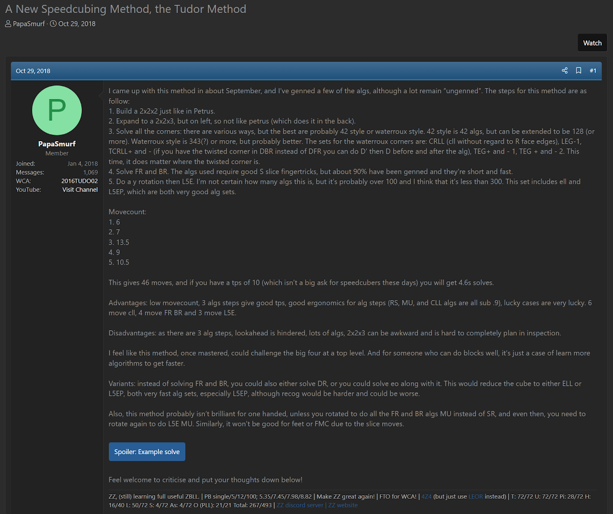
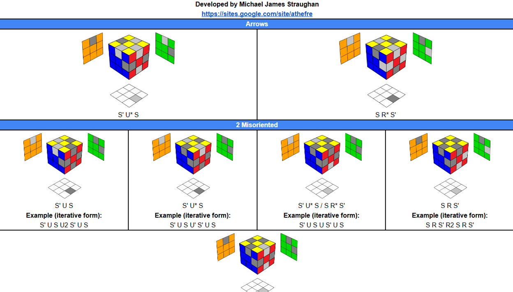
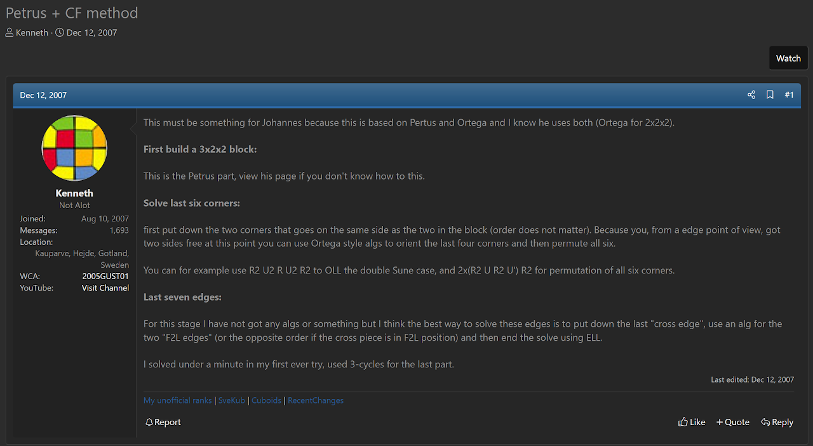

import Exhibit from "@site/src/components/Exhibit";
import YouTube from "@site/src/components/YouTube";
import ImageCollage from '@site/src/components/ImageCollage';

# Tudor

<Exhibit
stickering={{
    solved: "U D F B L R DF DL DB DFL DBL FL BL DFR DBR UFR UFL UBL UBR"}}
/>

## Description

**Proposer:** [Joseph Tudor](CubingContributors/MethodDevelopers.md#tudor-joseph)

**Proposed:** 2018

**Steps:**

1. Build a 2x2x3 block.
2. Solve the remaining six corners.
3. Solve the remaining edges.

[Click here for more step details on the SpeedSolving wiki](https://www.speedsolving.com/wiki/index.php?title=Tudor)

## Proposal

In October, 2018, Joseph Tudor presented the idea of the method [^tudor-2018]. An analysis was included and some algorithms were generated to demonstrate the concept.

## Development

The final step of solving the edges is where development has been focused. The first step of solving a 2x2x3 block is used in other methods and has been heavily explored, with many developed techniques. Various corner solving methods have been developed for use in other methods that are applicable to Tudor. These include solving the DR corners then solving the last layer corners using one algorithm, solving DBR then L5C, and others. The final step of Tudor, however, hasn’t received much development.

In November 2024, Michael James Straughan developed iterative edge orientation for the final step of the method [^straughan-2024]. It works similarly to the edge orientation step of the Roux method where edges are oriented in a few smaller intuitive steps.

## Other Proposals

The steps of the Tudor method have been proposed. The first known proposal is by Kenneth Gustavsson [^gustavsson-2007]. Another mention of the idea appeared in 2016 by Brayden Mossey [^mossey-2016]. Because the method had been proposed by others before Joseph Tudor, attribution is difficult in this case. The difference in Tudor's suggestion of the method lies in the analysis, effort, and promotion. Tudor independently had the idea, generated algorithms, and has promoted the idea the most. So it may be best known by the name Tudor.

[^tudor-2018]: J. Tudor, "A New Speedcubing Method, the Tudor Method," SpeedSolvng.com, 29 October 2018. [Online]. Available: https://www.speedsolving.com/threads/a-new-speedcubing-method-the-tudor-method.71463/.

[^straughan-2024]: M. J. Straughan, "Tudor Iterative EO," 4 November 2024. [Online]. Available: https://sites.google.com/site/athefre/steps-concepts/tudor-iterative-eo?authuser=0.

[^gustavsson-2007]: K. Gustavsson, "Petrus + CF method," SpeedSolving.com, 12 December 2007. [Online]. Available: https://www.speedsolving.com/threads/petrus-cf-method.2177/.

[^mossey-2016]: B. Mossey, "The New Method / Substep / Concept Idea Thread," SpeedSolving.com, 20 April 2016. [Online]. Available: https://www.speedsolving.com/threads/the-new-method-substep-concept-idea-thread.40975/post-1167804.