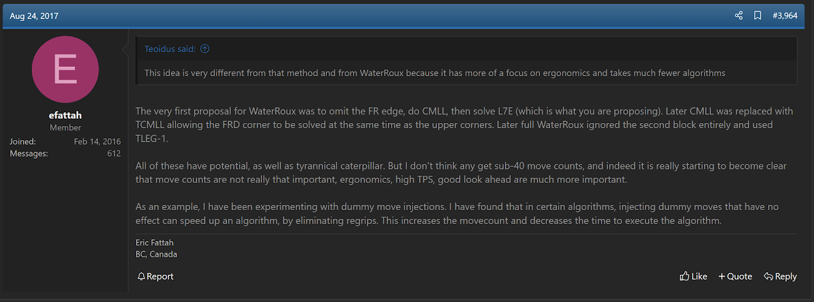
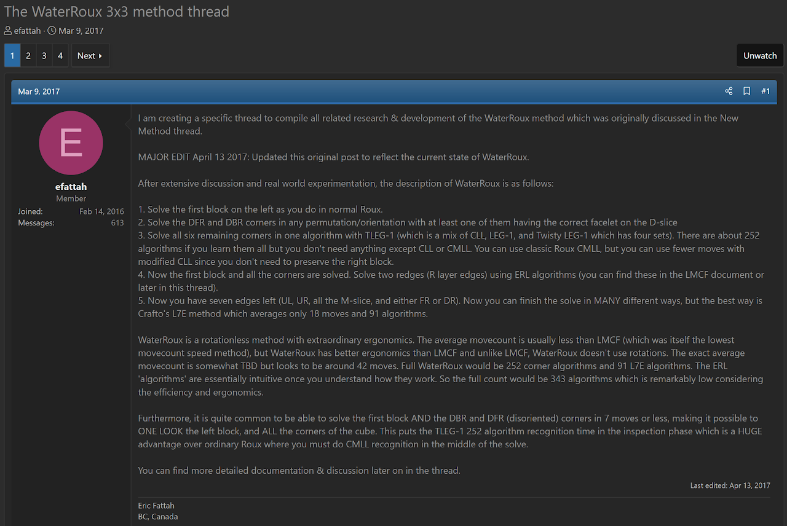

import AnimCube from "@site/src/components/AnimCube";

# WaterRoux

<AnimCube params="config=../../ExhibitConfig.txt&facelets=ydydydydywwwdwdwdwbbbdbdbdbgdgdgdgggodooooooordrdrdrdr" width="400px" height="400px" />

## Description

**Proposer:** [Eric Fattah](CubingContributors/MethodDevelopers.md#fattah-eric), [Max Garza](CubingContributors/MethodDevelopers.md#garza-max-neuro)

**Proposed:** 2017

**Steps:**

1. Build a 1x2x3 block on the left.
2. Solve the remaining corners, starting by placing the DR corners without regard to permutation or orientation.
3. Finish all corners using CLL, EG, TCLL, or any other appropriate algorithm set.
4. Solve two edges in the right side layer.
5. Solve the remaining seven edges.

[Click here for more step details on the SpeedSolving wiki](https://www.speedsolving.com/wiki/index.php/WaterRoux)

## Origin

### Development

In March, 2017, initial discussions for the method idea started between Eric Fattah and Max Garza. One of the original ideas was to solve a 1x2x2 block on the right side then solve the remaining five corners [1]. However, that was eventually abandoned in favor of a corners-based approach [2].

### Proposal

A few days after the original ideas had been discussed, Fattah posted the method proposal on speedsolving.com [3].

## References

[1] E. Fattah and M. Garza, "The New Method / Substep / Concept Idea Thread," SpeedSolving.com, March 2017. [Online]. Available: https://www.speedsolving.com/threads/the-new-method-substep-concept-idea-thread.40975/post-1222720.

[2] E. Fattah, "The New Method / Substep / Concept Idea Thread," SpeedSolving.com, 24 August 2017. [Online]. Available: https://www.speedsolving.com/threads/the-new-method-substep-concept-idea-thread.40975/page-199#post-1251599.

[3] E. Fattah, "The WaterRoux 3x3 method thread," SpeedSolving.com, 9 March 2017. [Online]. Available: https://www.speedsolving.com/threads/the-waterroux-3x3-method-thread.64140/.