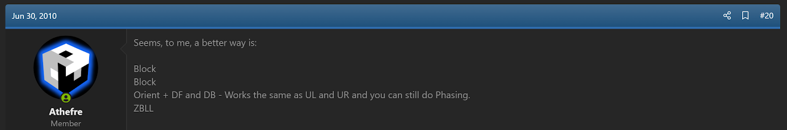
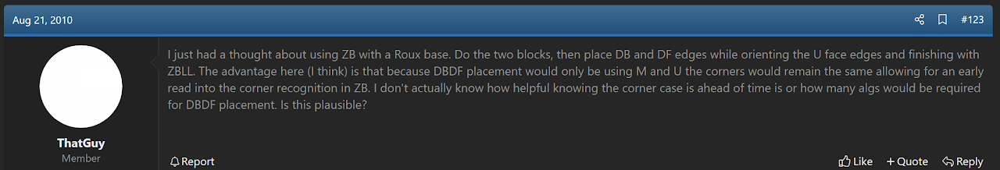
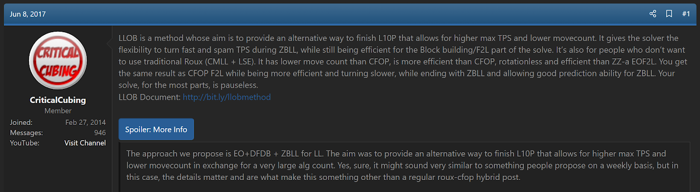
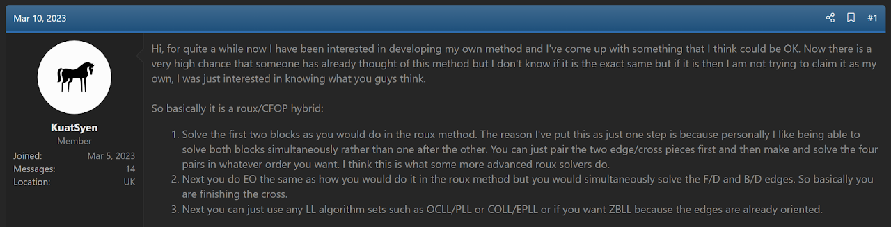

import AnimCube from "@site/src/components/AnimCube";

# ZBRoux

<AnimCube params="buttonbar=0&position=lluuu&scale=6&hint=10&hintborder=1&borderwidth=10&facelets=dldllldldwwwlllwwwdbbdlldbbdggdlldggdddoooooodrrdrrdrr" width="400px" height="400px" />

## Description

**Proposer:** Various

**Proposed:** Numerous

**Steps:**

1. Build a 1x2x3 block on the left.
2. Build a 1x2x3 block on the right..
3. Solve the DF and DB edges and M layer centers while orienting the last layer edges.
4. Solve the last layer.

[Click here for more step details on the SpeedSolving wiki](https://www.speedsolving.com/wiki/index.php?title=ZBRoux)

## Origin

ZBRoux is a method that continues to be proposed numerous times. The first known suggestion of the idea comes from Michael James Straughan in June, 2010 [1]. Various other proposals can be found in the online community [2, 3, 4].

## References

[1] M. J. Straughan, "Does this (sub) method have a name?," SpeedSolving.com, 30 June 2010. [Online]. Available: https://www.speedsolving.com/threads/does-this-sub-method-have-a-name.22232/#post-407245.

[2] S. Gu, "Random Cubing Discussion," SpeedSolving.com, 20 August 2010. [Online]. Available: https://www.speedsolving.com/threads/random-cubing-discussion.22862/page-7#post-438312.

[3] CriticalCubing, "Last Layer Optimized Blockbuilding [LLOB Method]," SpeedSolving.com, 8 June 2017. [Online]. Available: https://www.speedsolving.com/threads/last-layer-optimized-blockbuilding-llob-method.65223/.

[4] KuatSyen, "Speedcubing Method Idea," SpeedSolving.com, 10 March 2023. [Online]. Available: https://www.speedsolving.com/threads/speedcubing-method-idea.89355/.