# ZZ

## Description

**Proposer:** [Zbigniew Zborowski](CubingContributors/MethodDevelopers.md#zborowski-zbigniew)

**Proposed:** 2006

**Steps:**

1. Solve the four bottom layer edges while orienting all other edges. This is commonly called EOCross.
2. Solve the four corner and edge pairs of the first two layers.
3. Solve the last layer.

[ZZ Website](https://www.zzmethod.com/)

[Click here for more step details on the SpeedSolving wiki](https://www.speedsolving.com/wiki/index.php/ZZ_method)

## Origin

### EOCross and EOLine

Around 2003, or even earlier, Gilles Roux and Adam Géhin began experimenting with solving the DF and DB edges while orienting all other edges (commonly called EOLine). The steps afterward were to complete the first two layers then solve the last layer. Eventually, Géhin placed a video on his website of himself using the method.

>This is from a private conversation between Roux and I.

In January, 2003 Ryan Heise came across the video. Heise noticed that Géhin used only L, U, and R turns to solve the first two layers. Not knowing that it was the exact method already being used in the video, Heise proposed it as a new method. In a message to the Speed Solving Rubik's Cube Yahoo group, Heise suggested both EOLine and EOCross.

The link to the video by Géhin no longer works. However, Roux himself confirmed the contents of the video.[1][1]

In June, 2004, Ron van Bruchem began submitting to the Speed Solving Rubik's Cube Yahoo group method ideas that started with EOLine.

Bruchem credited Heise for the edge orientation idea.

Eventually, Bruchem began experimenting with solving the first two layers after EOLine and EOCross.

>This message is from July, 2005, which is before the creation of the ZZ website.

At the European Rubik's Games Championship 2004 (August 7-8, 2004)[2][2], Zbigniew Zborowski observed Bruchem demonstrating the methods involving EOLine and or EOCross.[3][3]

### Website

Zborowski thought the concept demonstrated by Bruchem was the future of speedcubing, so Zborowski created a website describing the steps of EOLine, first two layers, then last layer and named the method ZZ. Searching the website for "2006" indicates that the website was published in December, 2006.

Before publishing the website, Zborowski had been discussing the method within the Polish community. The speedcubing.com.pl website in particular included some of these discussions.[4][4] However, speedcubing.com.pl wasn't well preserved on archive.org, so reading all discussions isn't possible.

**Polish Version**
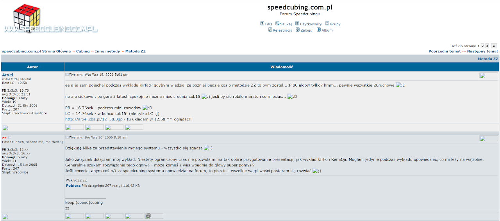
**English Translation**
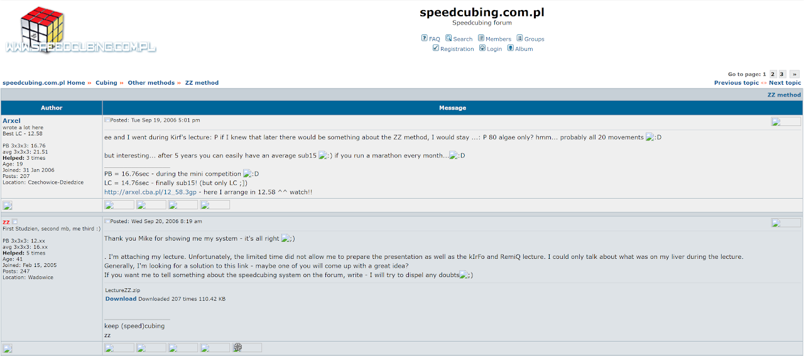

## Variants

### ZZ-A (α)

The modern classification of ZZ-A is that it is when the first two layers are solved without any intentional influencing of the last layer. So the steps would be EOCross or EOLine > F2L > ZBLL / OCLL+PLL / COLL+EPLL / Any last layer method. Zborowski's original description of ZZ-A focuses on ZBLL as the last layer method.[5][5]

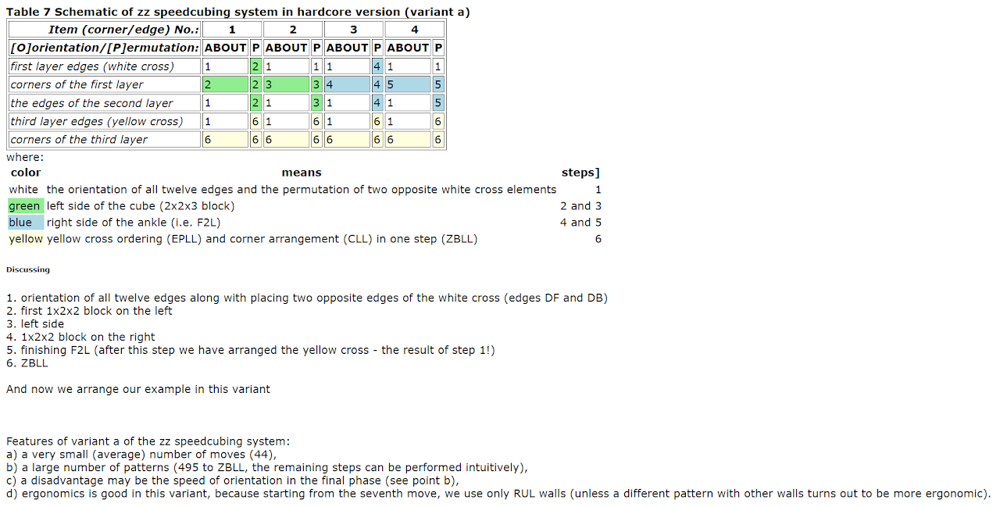

### ZZ-B (β)

ZZ-B covers any partial last layer influencing during the first two layers. Phasing then ZZLL (Zborowski's original version of ZZ-B) and ZZ-R are examples of ZZ-B.[6][6]

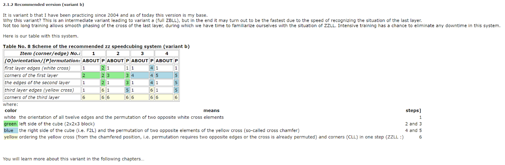

### ZZ-C (γ)

ZZ-C includes sub-variants which completely orient all corners before getting to the last layer. Winter Variation and OLS are a couple of examples. The original version of ZZ-C as proposed by Mitchell Stern was to orient all last layer corners while solving the final F2L pair.[7][7]

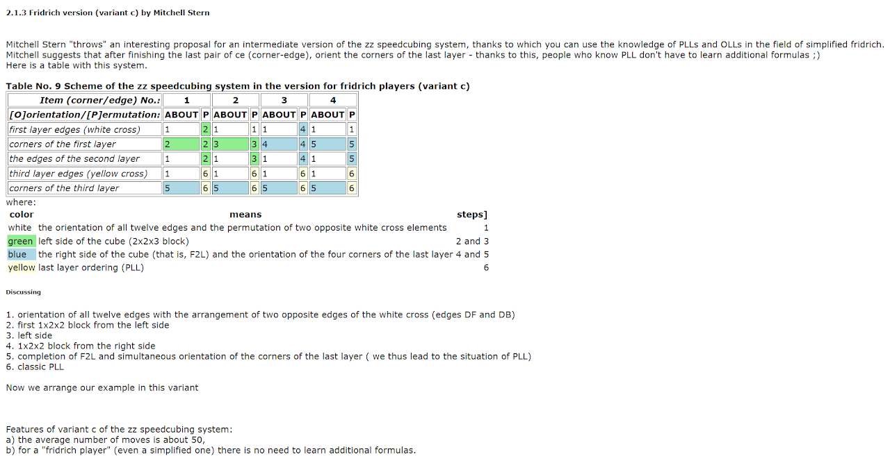

### ZZ-D (δ)

ZZ-D is any variant that permutes all corners before getting to the last layer. The original version of ZZ-D was to permute all corners while solving the final pair on the left side of the first two layers then complete the right side of the first two layers and end the solve with 2GLL. Zborowski's website included a couple of other corner permutation variants, E and F. The E variant permutes all corners while solving the final F2L pair. The ZZ-F variant, as proposed by Grzegorz Łuczyna, has the steps of EOLine > 1x2x2 on the left and 1x2x2 on the right > permute all corners while solving the last pair of the left side > last pair and last layer.[8][8] Zbigniew Zborowski included the idea of early corner permutation on the website, but stated that he hasn't yet found a way to do it. The E and F variants have since been grouped under the ZZ-D variant to have a single variant focused on corner permutation with several sub-variants.

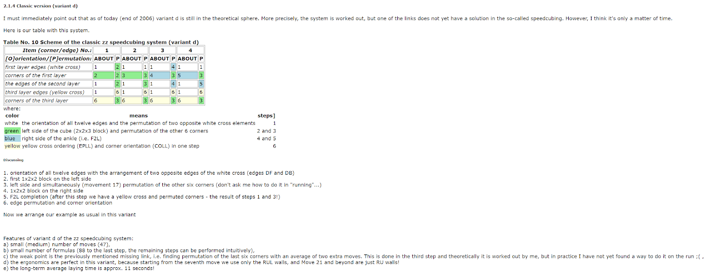

In January, 2012, Kim Orbit developed a recognition method for ZZ-D and the algorithms in 2012.[9][9]

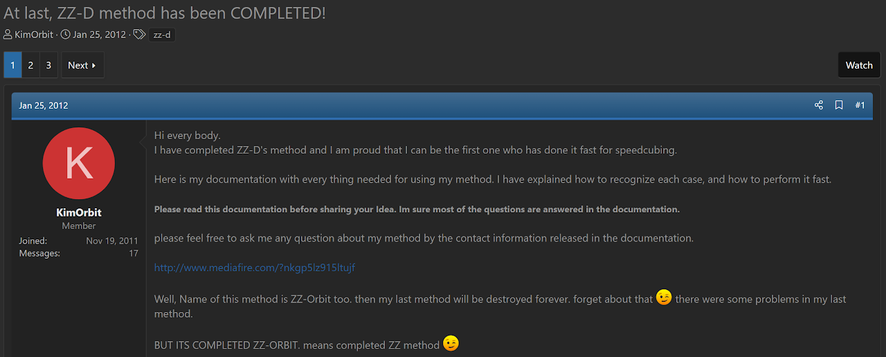

In 2018, Joseph Tudor developed a new variant of ZZ related to the ZZ-D variant.[10][10] The DBL corner is solved along with EOLine. Corner permutation is then solved while ensuring that the left side block pieces are within the U ald L layers, then the left side block is built first to preserve the corner permutation state. The remainder of the solve can be solved using just turns of the upper and right side layers.

In 2020, Dylan Nyein decided to develop the complete version for any last pair corner and edge situation.[11][11] Nyein and Tudor together completed the development.[12][12] [13][13]

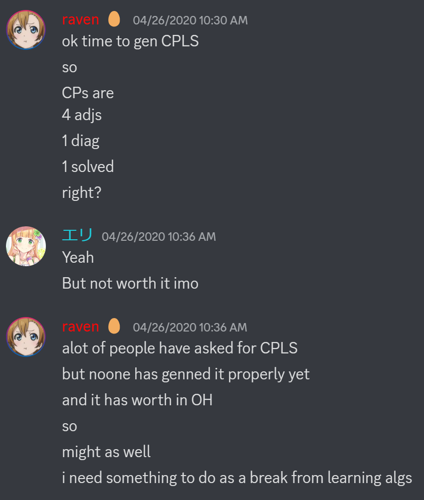
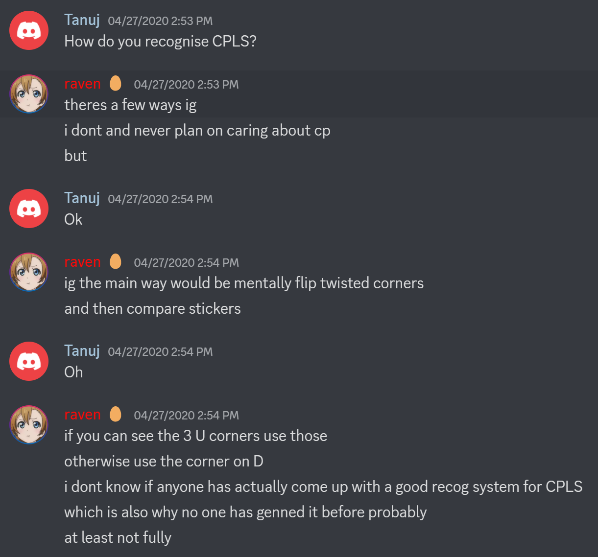
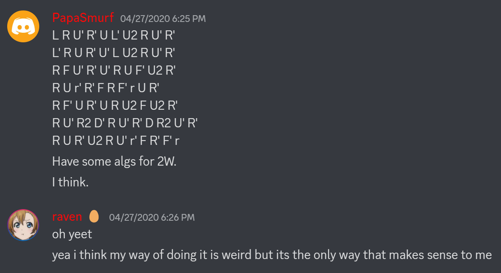
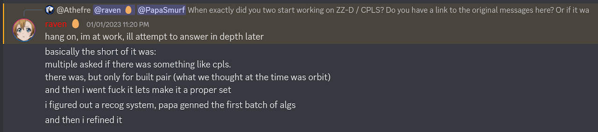

## ZZ-CT

On March 31, 2016, Chris Tran posted a ZZ variant called HW to speedsolving.com.[14][14] This variant solved the final last slot corner while orienting the last layer corners. Then everything is solved in a single step.

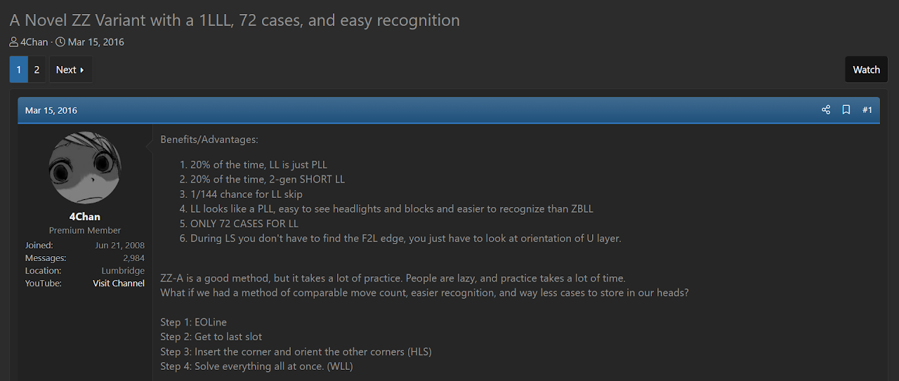

In May, 2014, speedsolving.com user elrog had proposed a method called Navi.[15</sup][15] One of the steps of this method permutes the last layer and the DFR corner. In March, 2016, Tran took notice of this step after the thread had received replies, moving the thread to the top of the visible threads. Tran stated that the step solves every issue with the HW variant that Tran had recently proposed.[16</sup][16]

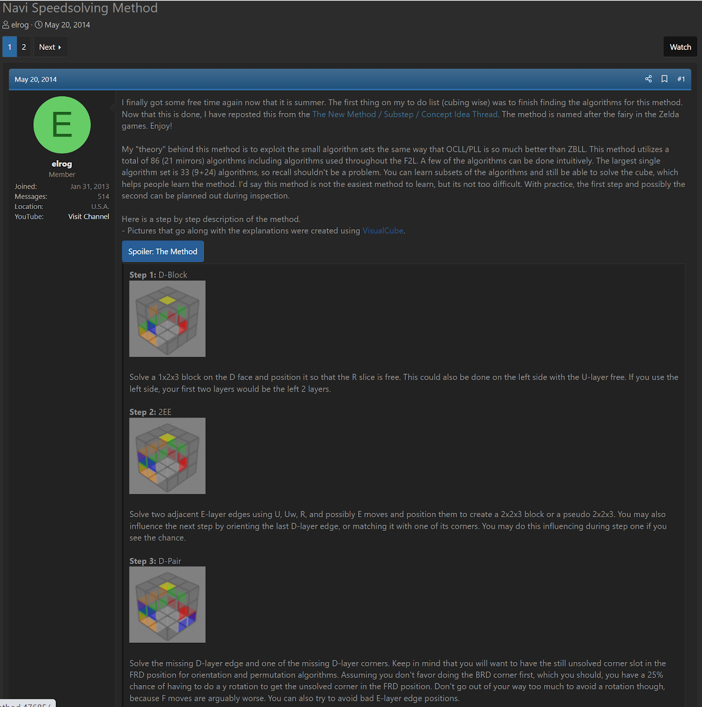
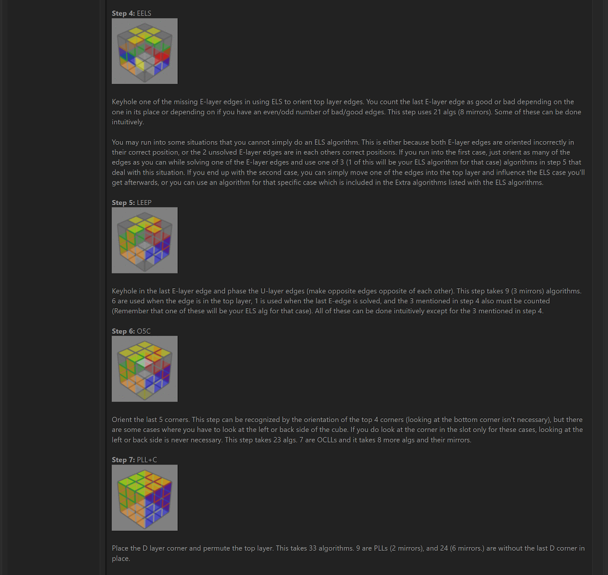
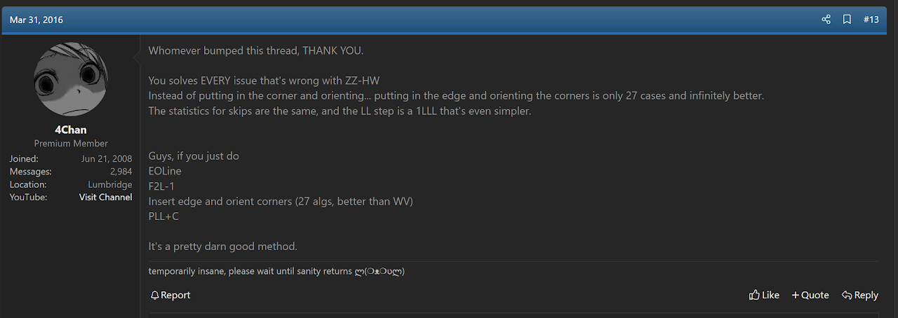

In May, 2016, Tran incorporated elrog's step from the Navi method into a ZZ variant called CT.[17][17] The step came to be named TTLL, after Tran and Blake Thompson. The step was now part of Trans ZZ variant proposal and Thompson generated most of the algorithms.

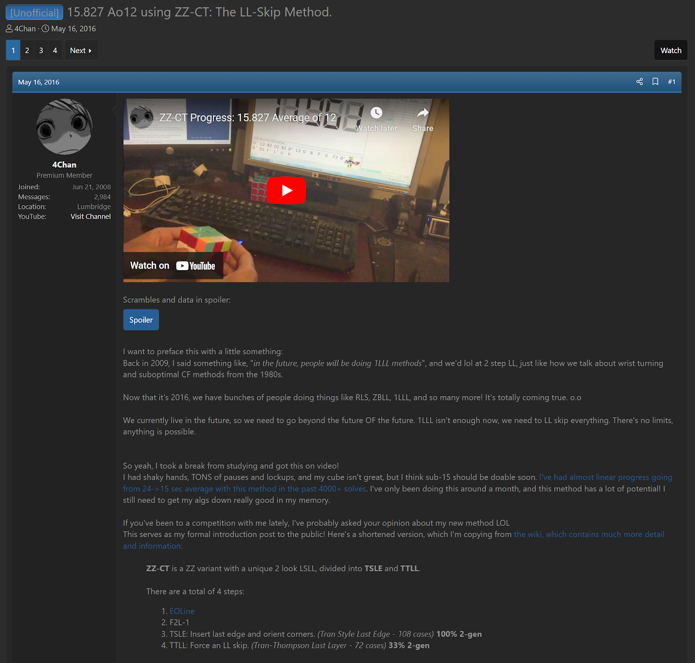

### Credit

Others have provided some information on the variants of ZZ.

Joseph Tudor: Provided many details on the modern variant classification system.

Dylan Nyein: Provided information on the ZZ-D variant.

<!-- References -->

[1]: https://www.speedsolving.com/threads/the-new-method-substep-concept-idea-thread.40975/post-1368143
[2]: https://www.worldcubeassociation.org/competitions/Euro2004/results/by_person
[3]: https://web.archive.org/web/20070428175325/http://www.speedcubing.com.pl/nooks_zz.htm#zzspeed
[4]: https://web.archive.org/web/20080731021124/http://forum.speedcubing.com.pl/viewtopic.php?t=491
[5]: https://web.archive.org/web/20090302093157/http://speedcubing.com.pl/nooks_zz.htm#zzspeed_warianty_a
[6]: https://web.archive.org/web/20090302093157/http://speedcubing.com.pl/nooks_zz.htm#zzspeed_warianty_b
[7]: https://web.archive.org/web/20090302093157/http://speedcubing.com.pl/nooks_zz.htm#zzspeed_warianty_c
[8]: https://web.archive.org/web/20090302093157/http://speedcubing.com.pl/nooks_zz.htm#zzspeed_warianty_d
[9]: https://www.speedsolving.com/threads/at-last-zz-d-method-has-been-completed.34994/#post-705181
[10]: https://discord.com/channels/455707295205294081/462589831051214858/467419861266464780
[11]: https://discord.com/channels/455707295205294081/455708462870167556/703780071319666718
[12]: https://discord.com/channels/455707295205294081/455708462870167556/704262054554632264
[13]: https://discord.com/channels/455707295205294081/455708462870167556/1059113938861695017
[14]: https://www.speedsolving.com/threads/a-novel-zz-variant-with-a-1lll-72-cases-and-easy-recognition.60281/
[15]: https://www.speedsolving.com/threads/navi-speedsolving-method.47685/
[16]: https://www.speedsolving.com/threads/navi-speedsolving-method.47685/post-1163282
[17]: https://www.speedsolving.com/threads/15-827-ao12-using-zz-ct-the-ll-skip-method.60972/